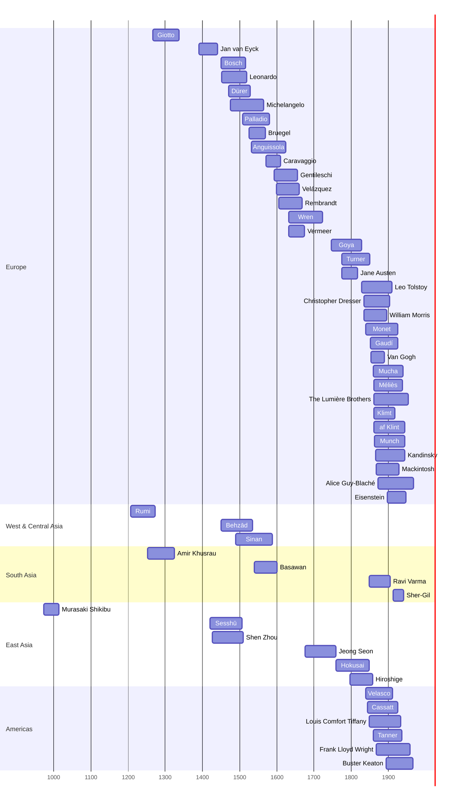

# Art-Talk Timeline

53 artists from 973 to 1968, with 299 artworks. Artists are ordered by birth year; each name links to a full profile with images of their key works.

Regions: Europe (34) · West & Central Asia (3) · South Asia (4) · East Asia (6) · Americas (6)

Disciplines: Painting (33) · Sculpture (1) · Architecture (7) · Design (5) · Film (5) · Literature (5)

An interactive version of this timeline is in [`index.html`](index.html).

## Lifespans at a glance

## Born in the 900s

| Lifespan | Artist | Where | Movement | Signature work |
|---|---|---|---|---|
| c. 973–c. 1014 | [Murasaki Shikibu](artists/murasaki-shikibu.md) | Japan | Heian court literature | *The Tale of Genji — Hakubyō scroll fragment (II)* (c. 1005–1010) |

## Born in the 1200s

| Lifespan | Artist | Where | Movement | Signature work |
|---|---|---|---|---|
| 1207–1273 | [Jalal al-Din Rumi](artists/rumi.md) | Khwarazmian Empire (later Seljuk Sultanate of Rum, now Turkey) | Sufi poetry | *Masnavi-ye Ma'navi (opening)* (c. 1258–1273) |
| 1253–1325 | [Amir Khusrau](artists/amir-khusrau.md) | Delhi Sultanate (India) | Indo-Persian literature, Sufi poetry | *Majnun o Layla* (c. 1299) |
| c. 1267–1337 | [Giotto di Bondone](artists/giotto.md) | Italy | Proto-Renaissance | *The Kiss of Judas* (c. 1304–1306) |

## Born in the 1300s

| Lifespan | Artist | Where | Movement | Signature work |
|---|---|---|---|---|
| c. 1390–1441 | [Jan van Eyck](artists/van-eyck.md) | Flanders (Burgundian Netherlands) | Early Netherlandish painting | *The Arnolfini Portrait* (1434) |

## Born in the 1400s

| Lifespan | Artist | Where | Movement | Signature work |
|---|---|---|---|---|
| 1420–1506 | [Sesshū Tōyō](artists/sesshu.md) | Japan | Muromachi ink painting (suibokuga), Zen art | *Haboku Landscape (Splashed-Ink Landscape)* (1495) |
| 1427–1509 | [Shen Zhou](artists/shen-zhou.md) | China (Ming dynasty) | Wu School, Literati painting | *Lofty Mount Lu* (1467) |
| c. 1450–1516 | [Hieronymus Bosch](artists/bosch.md) | Duchy of Brabant (Netherlands) | Early Netherlandish painting | *The Garden of Earthly Delights* (c. 1490–1510) |
| c. 1450–c. 1535 | [Kamāl ud-Dīn Behzād](artists/behzad.md) | Persia (Timurid Herat and Safavid Tabriz) | Persian miniature, Herat school | *The Seduction of Yusuf* (1488) |
| 1452–1519 | [Leonardo da Vinci](artists/leonardo-da-vinci.md) | Italy | High Renaissance | *Mona Lisa* (c. 1503–1519) |
| 1471–1528 | [Albrecht Dürer](artists/durer.md) | Holy Roman Empire (Germany) | Northern Renaissance | *Self-Portrait at the Age of Twenty-Eight* (1500) |
| 1475–1564 | [Michelangelo Buonarroti](artists/michelangelo.md) | Italy | High Renaissance, Mannerism | *The Creation of Adam (Sistine Chapel ceiling)* (c. 1508–1512) |
| c. 1489–1588 | [Mimar Sinan](artists/mimar-sinan.md) | Ottoman Empire | Classical Ottoman architecture | *Selimiye Mosque* (1568–1574) |

## Born in the 1500s

| Lifespan | Artist | Where | Movement | Signature work |
|---|---|---|---|---|
| 1508–1580 | [Andrea Palladio](artists/andrea-palladio.md) | Republic of Venice (Italy) | Renaissance classicism, Palladianism | *Villa Rotonda* (1567–1592) |
| c. 1525–1569 | [Pieter Bruegel the Elder](artists/bruegel.md) | Duchy of Brabant (Netherlands) | Northern Renaissance | *The Hunters in the Snow* (1565) |
| c. 1532–1625 | [Sofonisba Anguissola](artists/sofonisba-anguissola.md) | Italy | Late Renaissance | *The Chess Game (Portrait of the Artist's Sisters Playing Chess)* (1555) |
| active c. 1560–1600 | [Basawan](artists/basawan.md) | Mughal India | Mughal painting | *Akbar's Adventure with the Elephant Hawai, from the Akbarnama* (c. 1590–1595) |
| 1571–1610 | [Caravaggio](artists/caravaggio.md) | Italy | Baroque | *The Calling of Saint Matthew* (1599–1600) |
| 1593–c. 1656 | [Artemisia Gentileschi](artists/artemisia-gentileschi.md) | Italy | Baroque, Caravaggisti | *Judith Slaying Holofernes* (c. 1620) |
| 1599–1660 | [Diego Velázquez](artists/velazquez.md) | Spain | Baroque, Spanish Golden Age | *Las Meninas* (1656) |

## Born in the 1600s

| Lifespan | Artist | Where | Movement | Signature work |
|---|---|---|---|---|
| 1606–1669 | [Rembrandt van Rijn](artists/rembrandt.md) | Dutch Republic | Dutch Golden Age, Baroque | *The Night Watch (Militia Company of District II under Captain Frans Banninck Cocq)* (1642) |
| 1632–1723 | [Christopher Wren](artists/christopher-wren.md) | England | English Baroque | *St Paul's Cathedral* (1675–1710) |
| 1632–1675 | [Johannes Vermeer](artists/vermeer.md) | Dutch Republic | Dutch Golden Age | *Girl with a Pearl Earring* (c. 1665) |
| 1676–1759 | [Jeong Seon](artists/jeong-seon.md) | Korea (Joseon dynasty) | True-view landscape painting (jingyeong sansuhwa) | *Clearing after Rain on Mount Inwang (Inwang jesaekdo)* (1751) |

## Born in the 1700s

| Lifespan | Artist | Where | Movement | Signature work |
|---|---|---|---|---|
| 1746–1828 | [Francisco Goya](artists/goya.md) | Spain | Romanticism | *The Third of May 1808* (1814) |
| 1760–1849 | [Katsushika Hokusai](artists/hokusai.md) | Japan | Ukiyo-e | *The Great Wave off Kanagawa* (c. 1831) |
| 1775–1851 | [J. M. W. Turner](artists/turner.md) | United Kingdom | Romanticism | *The Fighting Temeraire* (1839) |
| 1775–1817 | [Jane Austen](artists/jane-austen.md) | England | Regency literature | *Pride and Prejudice* (1813) |
| 1797–1858 | [Utagawa Hiroshige](artists/hiroshige.md) | Japan | Ukiyo-e | *Sudden Shower over Shin-Ōhashi Bridge and Atake (One Hundred Famous Views of Edo, No. 58)* (1857) |

## Born in the 1800s

| Lifespan | Artist | Where | Movement | Signature work |
|---|---|---|---|---|
| 1828–1910 | [Leo Tolstoy](artists/leo-tolstoy.md) | Russian Empire | Realism | *War and Peace* (1869) |
| 1834–1904 | [Christopher Dresser](artists/christopher-dresser.md) | England | Aesthetic Movement, Anglo-Japanese design | *Electroplated teapot* (1879) |
| 1834–1896 | [William Morris](artists/william-morris.md) | England | Arts and Crafts movement, Pre-Raphaelite circle | *Strawberry Thief* (1883) |
| 1840–1926 | [Claude Monet](artists/monet.md) | France | Impressionism | *Impression, Sunrise* (1872) |
| 1840–1912 | [José María Velasco](artists/velasco.md) | Mexico | Landscape painting, Academic realism | *The Valley of Mexico from the Santa Isabel Mountain Range* (1875) |
| 1844–1926 | [Mary Cassatt](artists/mary-cassatt.md) | United States (worked in France) | Impressionism | *The Child's Bath* (1893) |
| 1848–1933 | [Louis Comfort Tiffany](artists/louis-comfort-tiffany.md) | United States | Art Nouveau, Aesthetic Movement | *Dragonfly table lamp* (c. 1900) |
| 1848–1906 | [Raja Ravi Varma](artists/raja-ravi-varma.md) | India (Travancore) | Academic realism, Indian modern painting | *Shakuntala* (1898) |
| 1852–1926 | [Antoni Gaudí](artists/antoni-gaudi.md) | Spain | Catalan Modernisme, Art Nouveau | *Sagrada Família* (1882–present) |
| 1853–1890 | [Vincent van Gogh](artists/van-gogh.md) | Netherlands (worked in France) | Post-Impressionism | *The Starry Night* (1889) |
| 1859–1937 | [Henry Ossawa Tanner](artists/henry-ossawa-tanner.md) | United States (worked in France) | Realism, Symbolism | *The Banjo Lesson* (1893) |
| 1860–1939 | [Alphonse Mucha](artists/alphonse-mucha.md) | Austria-Hungary (Moravia, now Czech Republic) | Art Nouveau | *Gismonda* (1894) |
| 1861–1938 | [Georges Méliès](artists/georges-melies.md) | France | Early cinema, Trick film | *A Trip to the Moon* (1902) |
| 1862–1954 | [Auguste and Louis Lumière](artists/lumiere-brothers.md) | France | Early cinema, Actuality film | *The Arrival of a Train at La Ciotat* (1896) |
| 1862–1918 | [Gustav Klimt](artists/klimt.md) | Austria | Vienna Secession, Symbolism, Art Nouveau | *The Kiss* (1907–1908) |
| 1862–1944 | [Hilma af Klint](artists/hilma-af-klint.md) | Sweden | Abstract art, Spiritualism | *The Ten Largest, No. 7, Adulthood (Group IV)* (1907) |
| 1863–1944 | [Edvard Munch](artists/munch.md) | Norway | Symbolism, Expressionism | *The Scream* (1893) |
| 1866–1944 | [Wassily Kandinsky](artists/kandinsky.md) | Russia, Germany and France | Der Blaue Reiter, Abstract art, Bauhaus | *Composition VII* (1913) |
| 1867–1959 | [Frank Lloyd Wright](artists/frank-lloyd-wright.md) | United States | Prairie School, Organic architecture, Usonian | *Fallingwater* (1936–1939) |
| 1868–1928 | [Charles Rennie Mackintosh](artists/charles-rennie-mackintosh.md) | Scotland | Glasgow Style, Art Nouveau | *Glasgow School of Art* (1897–1909) |
| 1873–1968 | [Alice Guy-Blaché](artists/alice-guy-blache.md) | France (later United States) | Early cinema | *La Fée aux choux (The Cabbage-Patch Fairy)* (1896) |
| 1895–1966 | [Buster Keaton](artists/buster-keaton.md) | United States | Silent film comedy | *The General* (1926) |
| 1898–1948 | [Sergei Eisenstein](artists/sergei-eisenstein.md) | Soviet Union (born in Latvia) | Soviet montage theory | *Battleship Potemkin* (1925) |

## Born in the 1900s

| Lifespan | Artist | Where | Movement | Signature work |
|---|---|---|---|---|
| 1913–1941 | [Amrita Sher-Gil](artists/amrita-sher-gil.md) | India (born in Hungary) | Indian modernism | *Three Girls (Group of Young Girls)* (1935) |
