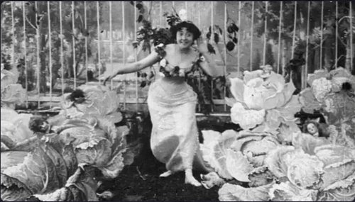
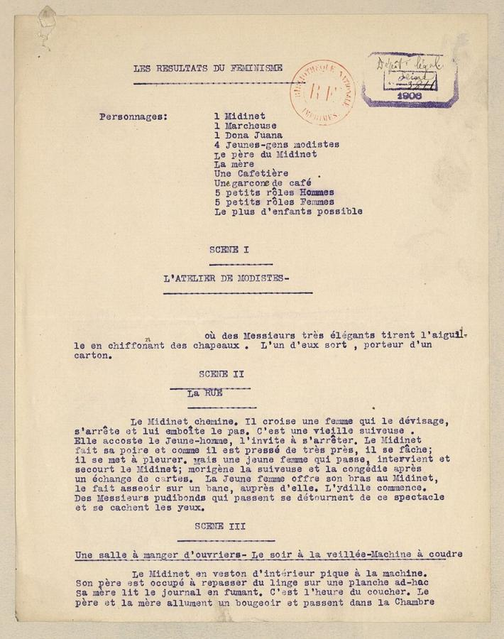
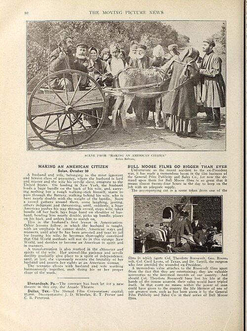
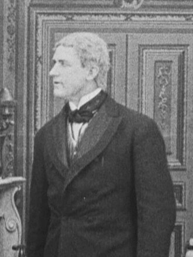
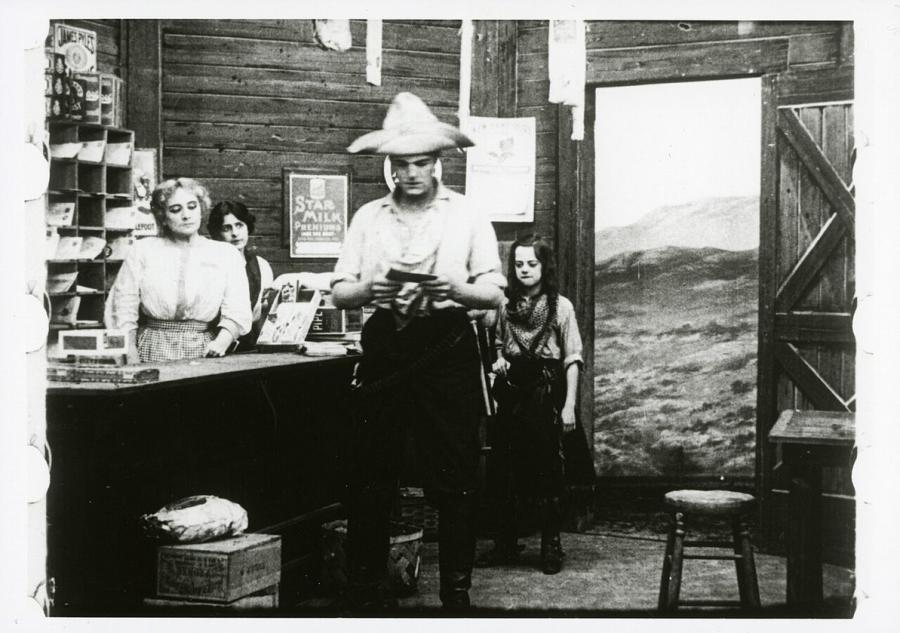

# Alice Guy-Blaché (1873–1968)

> One of cinema's first narrative filmmakers and the first woman to run her own film studio, whose hundreds of films were erased from film history for most of the twentieth century.

## Overview

Alice Guy-Blaché began directing films in 1896, within months of the medium's public birth, while
working as a secretary at the Gaumont Film Company in Paris, and went on to direct or supervise
hundreds of films across three decades in France and the United States. She is widely credited as
one of the very first directors, anywhere, to make a staged narrative fiction film rather than a
documentary fragment of everyday life, and she later became the first woman to found and run her own
film studio. For much of the twentieth century her work was misattributed to male colleagues and
successors; only from the 1970s did film historians restore her place in the medium's founding
generation.

## Life

Guy was born in Saint-Mandé, France, in 1873, and in 1894 took a job as a secretary to Léon Gaumont,
a manufacturer of photographic equipment moving into motion pictures. After watching an early
demonstration film, she asked Gaumont for permission to direct a short fictional scene of her own in
her spare time, on the condition it never interfered with her office duties; the result, *La Fée aux
choux*, launched a directing career that ran alongside her secretarial work for years. She rose to
become Gaumont's head of production, directing and supervising output across genres while
experimenting with hand-tinted colour and an early synchronised-sound process called Phonoscènes. In
1907 she married Gaumont cameraman Herbert Blaché and moved with him to the United States, where in
1910 they founded the Solax Company in Fort Lee, New Jersey, then a centre of American film
production; Guy served as artistic director and later president, one of the very few women to head a
film studio at any point in the medium's first half-century. Financial strain, the industry's move
to Hollywood, and the couple's 1922 divorce ended Solax; Guy returned to France, largely unable to
resume directing, and spent her later decades trying, mostly unsuccessfully, to have her contribution
to early cinema properly recognised. She died in New Jersey in 1968.

## Style & Technique

Guy worked across nearly every genre and technique available in early cinema, comedy, melodrama,
religious epic, social drama, westerns, and used cinema's earliest years as an open laboratory
rather than settling into one register. *Les Résultats du féminisme* shows her taste for social
satire built on a simple structural device, here a wholesale reversal of gender roles; other films
used hand-tinted colour, synchronised phonograph recordings, and, at Solax, unusually direct
engagement with contemporary social issues such as immigration and domestic violence, subjects most
of her contemporaries avoided in short comic or sentimental films.

## Legacy

For decades after her retirement, many of Guy's Gaumont-era films were catalogued under the names of
male colleagues and successors, and film histories routinely omitted her from the medium's founding
generation entirely. Feminist and archival film scholarship from the 1970s onward, drawing on her own
memoir and on studio records, gradually restored her authorship and her reputation, and she is now
widely recognised as one of the first narrative filmmakers in cinema history and the first woman to
run a film studio. Many of her hundreds of films remain lost, and rediscovery of surviving prints
continues.

## Key Works

<!-- works:start -->

### 1. La Fée aux choux (The Cabbage-Patch Fairy) (1896)

*Silent film, black-and-white, 35mm, about 1 minute · Gaumont Film Company, Paris, France*

Made when Guy was a 23-year-old secretary at the Gaumont Film Company, after she asked her employer's permission to try directing a short scene in her own time, this staged fable of a fairy pulling babies from a cabbage patch is widely regarded as one of the very first narrative fiction films, among the earliest instances anywhere of a story told on film rather than a recorded fragment of real life.

Image: [Wikimedia Commons](https://commons.wikimedia.org/wiki/File:La_F%C3%A9e_aux_choux.png) · Alice Guy · Public domain

### 2. Les Résultats du féminisme (The Consequences of Feminism) (1906)

*Silent film, black-and-white, 35mm, about 7 minutes · Gaumont Film Company, Paris, France*

A comic satire imagining a France with gender roles reversed: men sew, mind babies and are harassed on the street, while women lounge in cafés and hold public power. By the end the men revolt and reclaim their old position, but the film's real effect was to make contemporary gender norms look as arbitrary and absurd from either direction.

Image: [Wikimedia Commons](https://commons.wikimedia.org/wiki/File:Les_R%C3%A9sultats_du_f%C3%A9minisme_-_sc%C3%A9nario_-_btv1b53002310f_(1_of_3).jpg) · Public domain

### 3. Making an American Citizen (1912)

*Silent film, black-and-white, 35mm, about 12 minutes · Solax Company, Fort Lee, New Jersey, United States*

A Russian immigrant who mistreats his wife as a beast of burden is gradually reformed by American law and custom until he treats her as an equal, a social-issue drama typical of the films Guy directed as head of her own American studio, tackling immigration and gender politics well outside the era's usual comic or melodramatic conventions.

Image: [Wikimedia Commons](https://commons.wikimedia.org/wiki/File:Still_from_Making_American_Citizen(1912).jpg) · "The Moving Picture News," October 19, 1912 (Image by Solax Release) · Public domain

### 4. Falling Leaves (1912)

*Silent film, black-and-white, 35mm, about 13 minutes · Solax Company, Fort Lee, New Jersey, United States*

A young girl, overhearing that her tuberculosis-stricken older sister will die "when the last leaf falls," secretly ties the autumn leaves back onto a tree branch by branch to keep her sister alive, a sentimental drama built on a single sustained visual idea that anticipates the same premise later used in O. Henry's story "The Last Leaf."

Image: [Wikimedia Commons](https://commons.wikimedia.org/wiki/File:Darwin_Karr_(Falling_Leaves).jpg) · Alice Guy-Blaché · Public domain

### 5. Two Little Strangers (1912)

*Silent film, black-and-white, 35mm, about 12 minutes · Solax Company, Fort Lee, New Jersey, United States*

One of hundreds of one- and two-reel dramas and comedies Guy directed or supervised at Solax, the company she ran as artistic director, most now lost, surviving today largely through stills and studio records like this frame preserved in the EYE Filmmuseum's collection.

Image: [Wikimedia Commons](https://commons.wikimedia.org/wiki/File:Still_from_Alice_Guy-Blach%C3%A9_-_film_Two_little_strangers_-_1912_-_Solax_-_EYE_FOT414158.jpg) · Alice Guy-Blaché · Public domain

<!-- works:end -->
## Sources

- [Alice Guy-Blaché (Wikipedia)](https://en.wikipedia.org/wiki/Alice_Guy-Blach%C3%A9)
- [La Fée aux choux (Wikipedia)](https://en.wikipedia.org/wiki/La_F%C3%A9e_aux_choux)
- [The Consequences of Feminism (Wikipedia)](https://en.wikipedia.org/wiki/The_Consequences_of_Feminism)
