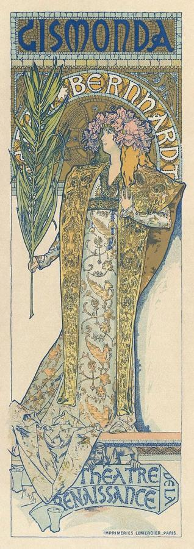
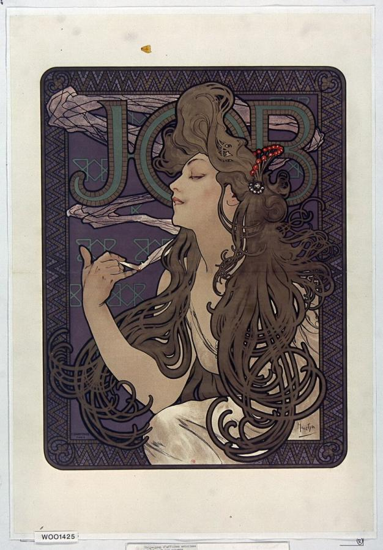
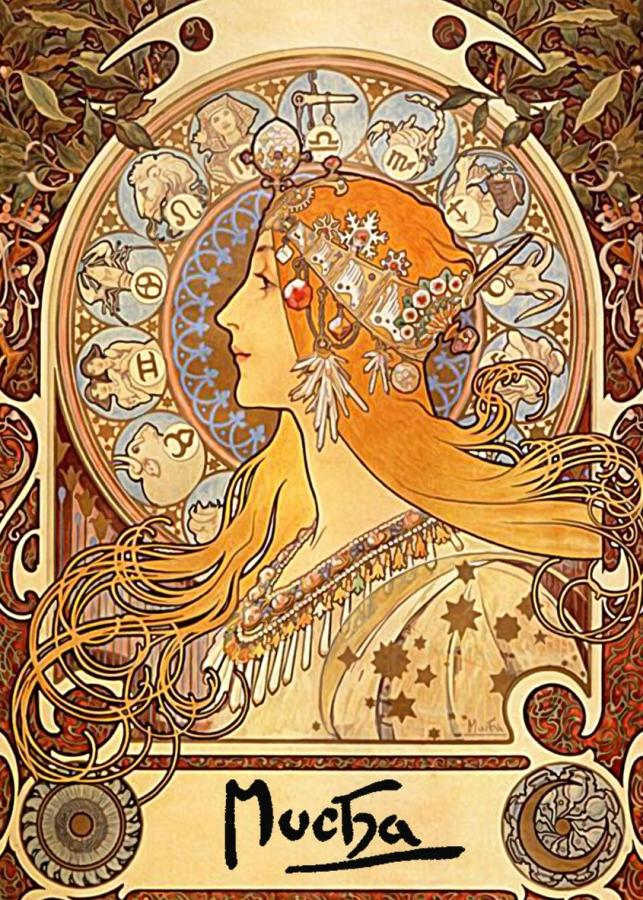
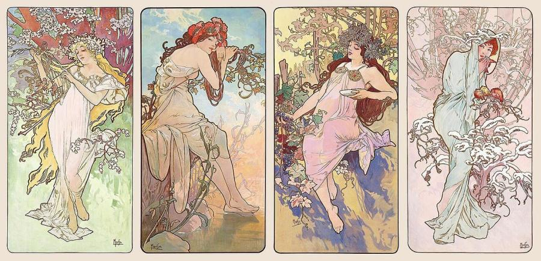
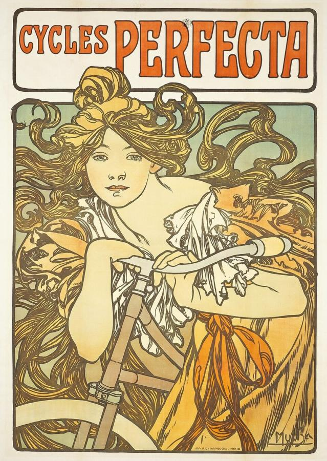

# Alphonse Mucha (1860–1939)

> The Moravian-born designer whose decorative posters for Sarah Bernhardt and countless commercial clients defined the visual style of Art Nouveau.

## Overview

Alphonse Mucha became, almost overnight, the defining graphic designer of the Art Nouveau era after
a chance commission to design a poster for Sarah Bernhardt in 1894. His formula, elongated figures
of women set within intricate, jewel-like ornamental frames, was reproduced across theatre posters,
cigarette papers, bicycles and calendars, making his decorative style one of the most widely seen
visual languages of the 1890s and 1900s. He resisted the "Art Nouveau" label himself, seeing his true
purpose in a vast, largely separate project celebrating the history of the Slavic peoples.

## Life

Mucha was born in 1860 in Ivančice, in Moravia, then part of Austria-Hungary, and worked as a
theatrical scene painter before moving to Paris in 1887 to study and work as an illustrator. His
career changed direction in December 1894, when a Paris printing house needed a poster for Sarah
Bernhardt's play *Gismonda* at short notice over the holiday season and turned to Mucha as the only
designer available; its success led Bernhardt to sign him to a six-year contract producing posters,
sets and costumes for her theatre. Through the following decade he designed a steady stream of
commercial advertising and decorative panels, and in 1902 published *Documents décoratifs*, a
pattern book of his ornamental style aimed at other designers and craftsmen, spreading his influence
across European decorative art. From around 1910 he devoted much of his remaining career to *The Slav
Epic*, a cycle of twenty monumental canvases on Slavic history that he considered his true life's
work, donating it to the city of Prague. Shortly after Nazi Germany occupied Czechoslovakia in 1939,
Mucha, a prominent Czech nationalist, was arrested and interrogated by the Gestapo; he died months
later, reportedly of complications following his detention.

## Style & Technique

Mucha's mature style placed decorative female figures, often personifying a season, a flower or a
product, at the centre of tall, narrow compositions framed by intricate ornamental haloes and
borders drawing on Byzantine mosaic and Rococo decoration, rendered in muted, harmonious colour
lithography. Because his work was produced as inexpensive printed posters and panels rather than
one-off paintings, it reached a far wider public than gallery art of the period, effectively carrying
fine decorative design into shops, cafés and middle-class living rooms across Europe.

## Legacy

Mucha's decorative vocabulary became so closely associated with the period that "Mucha style" is
often used interchangeably with "Art Nouveau" itself, and his posters remain among the most
reproduced graphic designs from the era. His influence resurfaced directly in the psychedelic
concert-poster art of the 1960s, whose designers frequently borrowed his flowing hair and ornamental
frames. In the Czech Republic he is remembered above all as a national artistic figure through *The
Slav Epic*, now on permanent public display in Prague.

## Key Works

<!-- works:start -->

### 1. Gismonda (1894)

*Colour lithograph poster · Paris, France*

A rush job taken on over the Christmas holidays when no other designer was available, this poster for Sarah Bernhardt's play made Mucha famous overnight. Its unusually tall, narrow format and muted, mosaic-like decoration were so unlike conventional theatre advertising that Bernhardt signed him to a six-year contract designing posters, sets and costumes for her productions.

Image: [Wikimedia Commons](https://commons.wikimedia.org/wiki/File:Alphonse_Mucha_-_Poster_for_Victorien_Sardou%27s_Gismonda_starring_Sarah_Bernhardt.jpg) · Alphonse Mucha / Adam Cuerden · Public domain

### 2. Job (cigarette papers) (1896)

*Colour lithograph poster · Paris, France*

An advertisement for a brand of cigarette rolling papers, its central figure's hair spiralling out to fill the entire circular frame in smoke-like tendrils. It became one of the most widely reproduced commercial posters of the era, spreading the "Mucha style" of decorative female figures far beyond theatre advertising into everyday consumer branding.

Image: [Wikimedia Commons](https://commons.wikimedia.org/wiki/File:Alphonse_Mucha_-_Advertisment_for_Job_cigarettes,_1896.jpg) · Alphonse Mucha · Public domain

### 3. Zodiac (1896)

*Colour lithograph · Paris, France*

Originally a calendar design for a printing house, later reissued on its own as a decorative panel, showing a woman in profile crowned by a jewelled halo bearing the twelve zodiac signs. Its ornamental frame, rather than the figure itself, became the design's most imitated element, reproduced on countless later calendars, biscuit tins and packaging.

Image: [Wikimedia Commons](https://commons.wikimedia.org/wiki/File:Alphonse_Mucha_-_Zodiac.jpg) · Alphonse Mucha · Public domain

### 4. The Seasons (1896)

*Colour lithograph, four-panel decorative series · Paris, France*

A set of four decorative panels personifying Spring, Summer, Autumn and Winter as women set against stylised landscapes, sold as affordable prints for middle-class homes rather than as advertising. Series like this made Mucha's decorative style available well beyond the theatre-poster market that had launched him.

Image: [Wikimedia Commons](https://commons.wikimedia.org/wiki/File:Alfons_Mucha_-_The_Seasons_(series),_1896.jpg) · Alphonse Mucha · Public domain

### 5. Cycles Perfecta (1902)

*Colour lithograph poster · Paris, France*

An advertisement for a French bicycle brand, its rider's windswept hair turned into the same decorative, flowing arabesques Mucha had developed for theatre posters years earlier, showing how thoroughly his ornamental vocabulary had by then become the default look of French commercial advertising.

Image: [Wikimedia Commons](https://commons.wikimedia.org/wiki/File:Alfons_Mucha_-_1902_-_Cycles_Perfecta.jpg) · Alphonse Mucha · Public domain

<!-- works:end -->
## Sources

- [Alphonse Mucha (Wikipedia)](https://en.wikipedia.org/wiki/Alphonse_Mucha)
- [The Slav Epic (Wikipedia)](https://en.wikipedia.org/wiki/The_Slav_Epic)
- [Documents Décoratifs (Wikipedia)](https://en.wikipedia.org/wiki/Documents_D%C3%A9coratifs)
