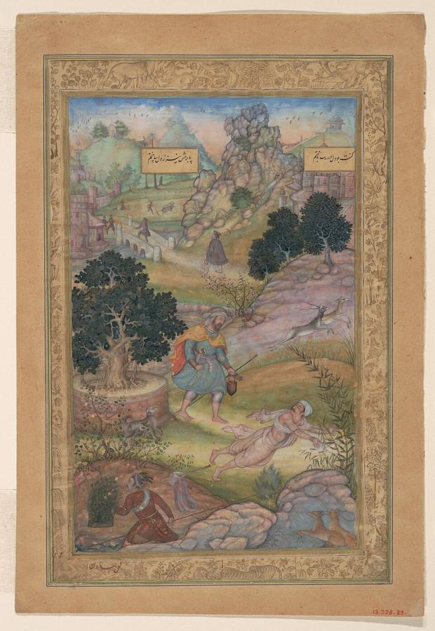
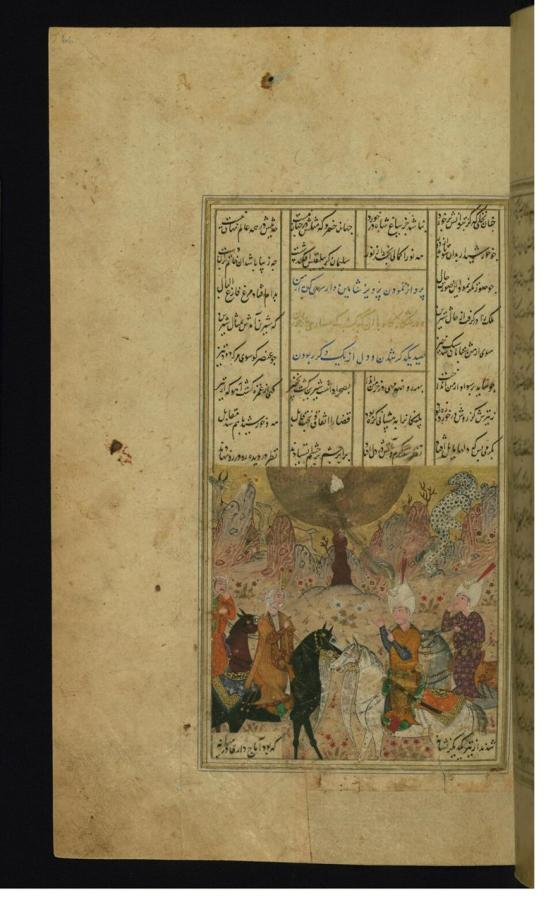
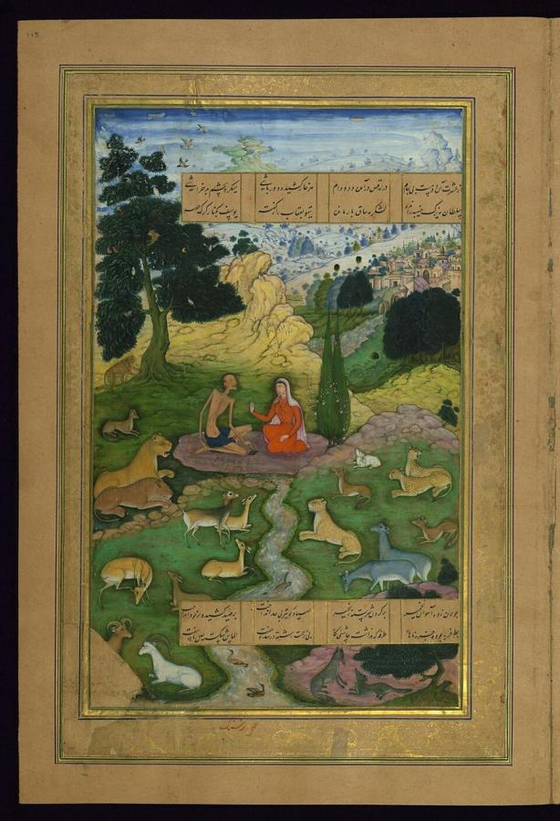
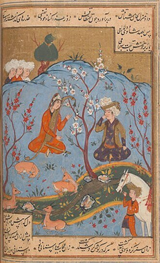
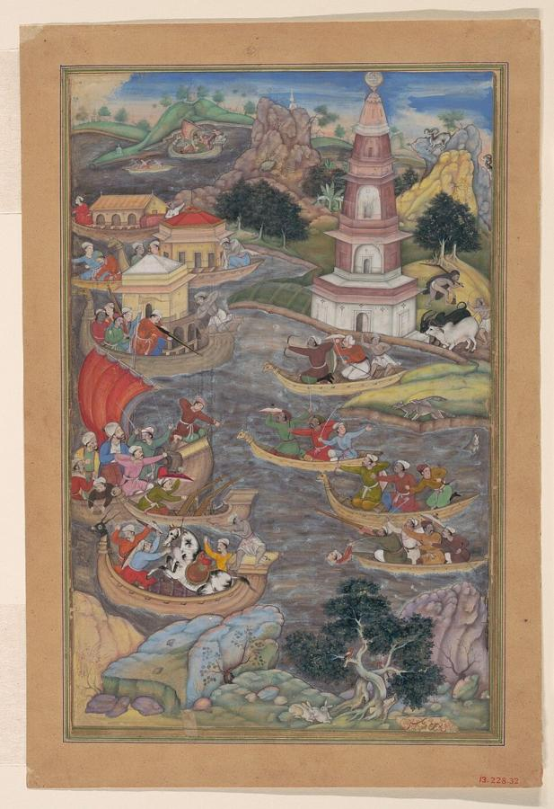

# Amir Khusrau (1253–1325)

> The court poet of Delhi whose Persian verse, and the musical tradition he is credited with founding, shaped Indo-Persian and South Asian culture for centuries.

## Overview

Amir Khusrau was the leading poet of the Delhi Sultanate, writing in Persian, the language of the
Indo-Islamic courts, while drawing constantly on the Indian environment around him. Best known
today for his Khamsa, five long narrative poems written in deliberate dialogue with the Persian
master Nizami Ganjavi, he was also a devoted disciple of the Sufi saint Nizamuddin Auliya and is
traditionally credited with founding qawwali, the devotional music still performed at Sufi shrines
across South Asia.

## Life

Khusrau was born in 1253 near Delhi to a Turkic father who had migrated from Central Asia and an
Indian mother, a mixed heritage he referred to proudly throughout his work. He served as a court
poet under a rapid succession of Delhi sultans across more than four decades of political upheaval,
surviving palace coups and dynastic changes that ended the careers, and sometimes the lives, of many
of his contemporaries. Alongside his court poetry he became a devoted follower of the Sufi mystic
Nizamuddin Auliya, and legend holds the two were so close that Khusrau died within months of his
spiritual master in 1325, asking to be buried near him; their shrines still stand together in Delhi
as one of the city's most visited Sufi sites.

## Style & Technique

Khusrau modelled his five major narrative poems directly on the Khamsa of the earlier Persian poet
Nizami Ganjavi, retelling the same romances and legends, Shirin and Khusrau, Layla and Majnun,
Alexander the Great, in his own voice, a common and respected form of literary tribute and rivalry in
the Persian tradition rather than mere imitation. He also wrote extensively in more personal, mystical
registers associated with his Sufi devotion, and popularised, if he did not strictly invent, literary
and musical forms blending Persian and Indian elements, including an early form of the ghazal
performance later systematised as qawwali. Later legend also credits him, without firm historical
evidence, with inventing instruments such as the sitar and tabla.

## Legacy

Khusrau is regarded as the founding figure of Indo-Persian literature, the body of Persian-language
poetry produced in the Indian subcontinent over the following centuries, and qawwali, the devotional
musical genre traced to him, remains a living performance tradition at Sufi shrines across India,
Pakistan and Bangladesh. His shrine beside that of Nizamuddin Auliya in Delhi continues to draw
pilgrims and qawwali performers, and his verses are still sung as much as read, a rare case of a
medieval court poet whose work survives as much in music as in manuscript.

## Key Works

<!-- works:start -->

### 1. Matla' al-Anwar (The Rising of Lights) (c. 1298)

*Illustrated manuscript, Persian narrative poem (masnavi) · Metropolitan Museum of Art, New York*

The first of the five long narrative poems making up Khusrau's Khamsa (Quintet), modelled on the Persian poet Nizami's own Khamsa but reworked with Khusrau's own didactic and mystical concerns. This folio illustrates one of its moral parables, a pilgrim humbled by an unexpected lesson in piety from a Hindu holy man.

Image: [Wikimedia Commons](https://commons.wikimedia.org/wiki/File:%22A_Muslim_Pilgrim_Learns_a_Lesson_in_Piety_from_a_Brahman%22,_Folio_from_a_Khamsa_(Quintet)_of_Amir_Khusrau_Dihlavi_MET_DP120804.jpg) · Basawan / Muhammad Husayn Kashmiri / Amir Khusrau · [CC0](http://creativecommons.org/publicdomain/zero/1.0/deed.en)

### 2. Shirin o Khusrau (c. 1298)

*Illustrated manuscript, Persian narrative poem (masnavi) · Walters Art Museum, Baltimore*

The second poem of the Khamsa, retelling the romance of the Sasanian king Khusrau and the Armenian princess Shirin already told by Nizami, a deliberate act of literary homage and rivalry that was common practice among Persian poets responding to an admired predecessor's Khamsa.

Image: [Wikimedia Commons](https://commons.wikimedia.org/wiki/File:Amir_Khusraw_Dihlavi_-_Khusraw_Meets_Shirin_While_Hunting_-_Walters_W62266A_-_Full_Page.jpg) · Amir Khusrau · Public domain

### 3. Majnun o Layla (c. 1299)

*Illustrated manuscript, Persian narrative poem (masnavi) · Walters Art Museum, Baltimore*

The third poem of the Khamsa, condensing the widely told Arabian legend of Layla and Majnun, lovers driven apart by their families until Majnun wanders the desert wilderness in grief-mad devotion, into Khusrau's own tightly constructed Persian verse.

Image: [Wikimedia Commons](https://commons.wikimedia.org/wiki/File:Amir_Khusraw_Dihlavi_-_Layl%C3%A1_Visits_Majnun_in_the_Wilderness_-_Walters_W624115A_-_Full_Page.jpg) · Amir Khusrau · Public domain

### 4. Hasht Bihisht (The Eight Paradises) (c. 1301)

*Illustrated manuscript, Persian narrative poem (masnavi) · Private collection*

The fourth poem of the Khamsa, following the Sasanian king Bahram Gur as he visits seven princesses, each housed in a differently coloured pavilion and each telling him a story, a structure adapted from Nizami's *Haft Paykar* and often illustrated as a cycle of jewel-toned courtly scenes.

Image: [Wikimedia Commons](https://commons.wikimedia.org/wiki/File:Bahram_Gur_and_Dilaram.jpg) · Amir Khusrau · Public domain

### 5. A'ina-yi Sikandari (The Alexandrine Mirror) (c. 1302)

*Illustrated manuscript, Persian narrative poem (masnavi) · Metropolitan Museum of Art, New York*

The fifth and final poem of the Khamsa, recasting the legendary exploits of Alexander the Great as a philosopher-king, drawing partly on the same Alexander Romance tradition behind Nizami's *Iskandarnama* while adding battles and wonders of Khusrau's own invention.

Image: [Wikimedia Commons](https://commons.wikimedia.org/wiki/File:%22Alexander_Fights_a_Sea_Battle%22,_Folio_from_a_Khamsa_(Quintet)_of_Amir_Khusrau_Dihlavi_MET_DP120807.jpg) · Amir Khusrau · [CC0](http://creativecommons.org/publicdomain/zero/1.0/deed.en)

<!-- works:end -->
## Sources

- [Amir Khusrau (Wikipedia)](https://en.wikipedia.org/wiki/Amir_Khusrau)
- [Khamsa of Amir Khusrau (Wikipedia)](https://en.wikipedia.org/wiki/Khamsa_of_Amir_Khusrau)
- [Qawwali (Wikipedia)](https://en.wikipedia.org/wiki/Qawwali)
