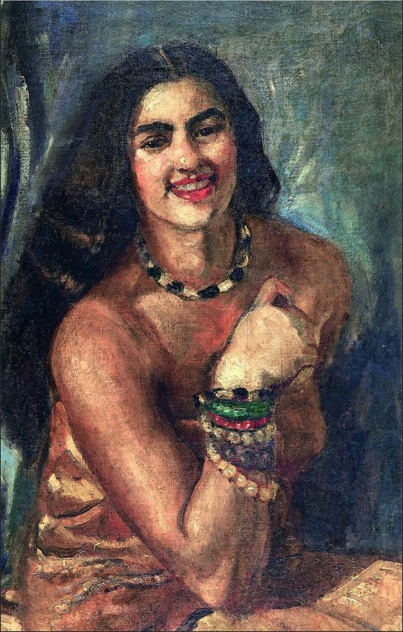
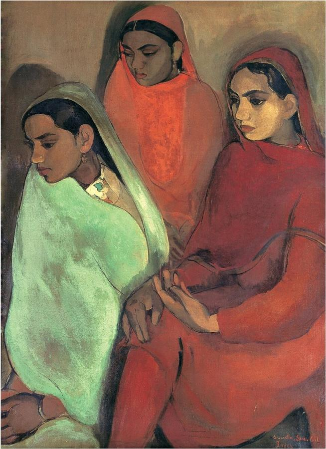
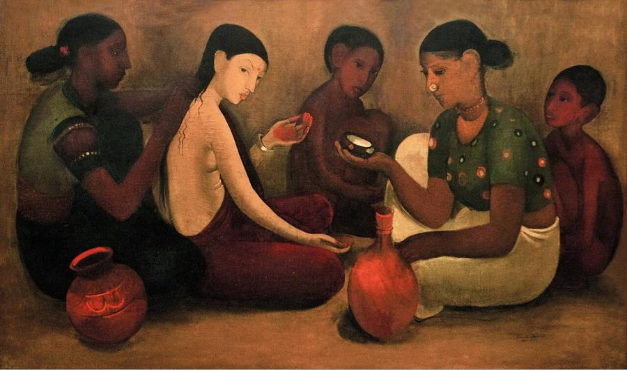
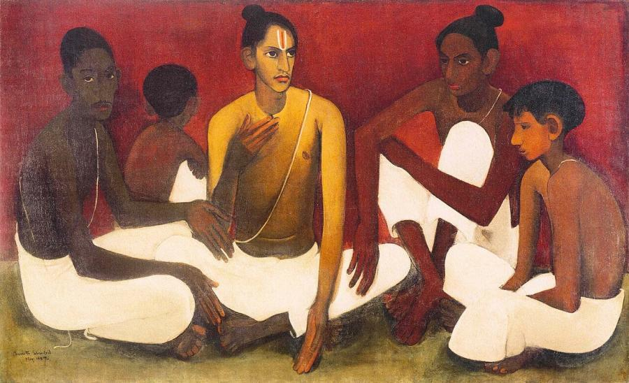
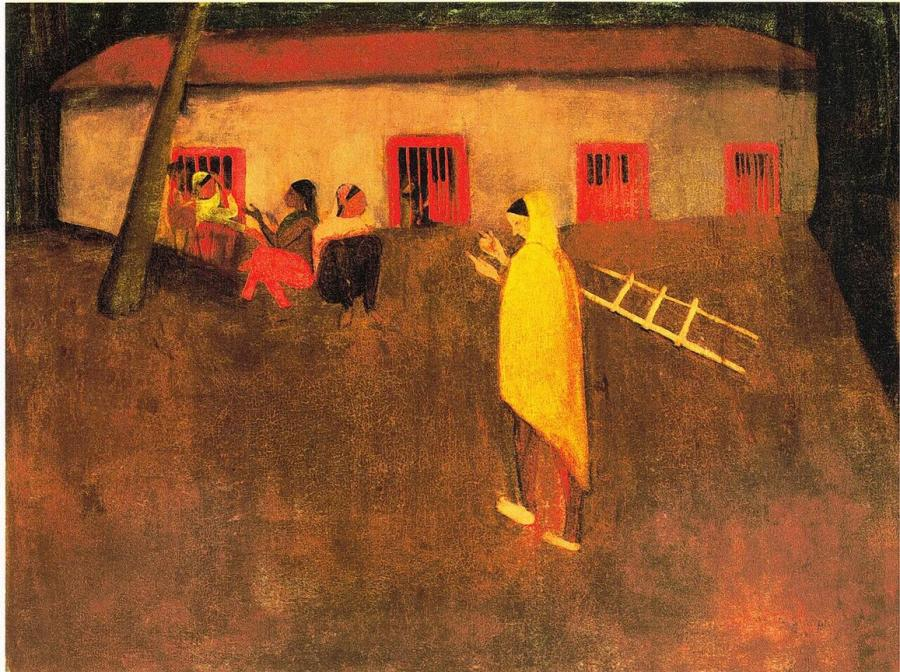
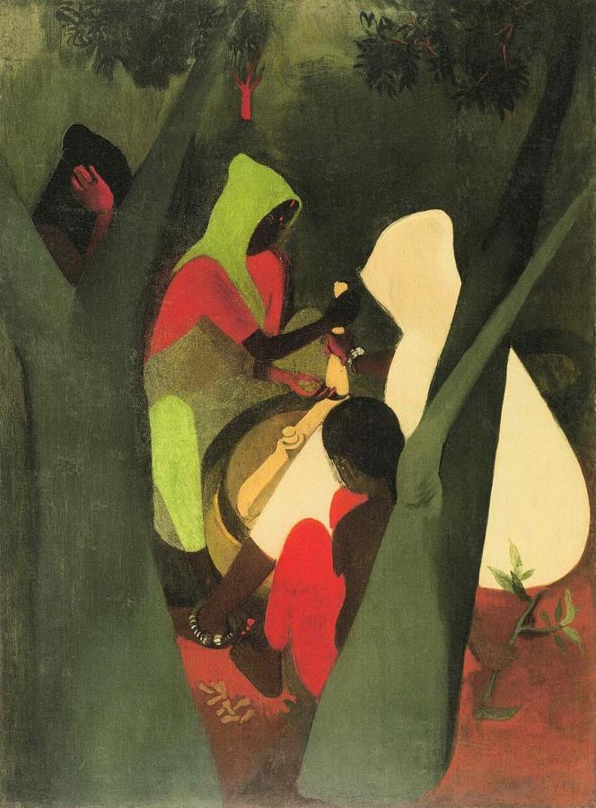

# Amrita Sher-Gil (1913–1941)

> Hungarian-Indian painter and pioneer of modern Indian art, who fused European modernism with Indian tradition in a career of barely a decade.

## Overview

Amrita Sher-Gil is often called India's first great modern woman artist. Trained in Paris, she returned
to India determined to paint the country and its people, especially the women whose lives she saw as
marked by silence and patience. She combined the lessons of Gauguin, Cézanne and the Post-Impressionists
with the ancient murals of Ajanta and the miniature painting of the Mughal and Rajput courts. She died at
just 28, but her small body of work had a lasting impact. The Government of India has declared her
paintings National Art Treasures.

## Life

Amrita Sher-Gil was born in Budapest on 30 January 1913. Her father, Umrao Singh Sher-Gil Majithia, was
a Sikh aristocrat and scholar of Sanskrit and Persian. Her mother, Marie Antoinette Gottesmann, was a
Hungarian-Jewish opera singer. The family moved to India in 1921 and settled in Shimla, where Amrita
began to paint as a child.

In 1929 she went to Paris to study at the Académie de la Grande Chaumière and then the École des
Beaux-Arts. She quickly won recognition. Her painting *Young Girls* (1932) led to her election in 1933
as an associate of the Grand Salon in Paris, its youngest member and the only Asian. Yet she felt drawn to India, writing that Europe belonged to Picasso, Matisse and Braque, while
India belonged only to her.

She returned to India in 1934. In 1937 she travelled through South India, where the Buddhist murals at
Ajanta and the frescoes of Kerala transformed her style. In 1938 she married her Hungarian cousin,
Victor Egan, a doctor. After a year in Hungary they settled at Saraya in Uttar Pradesh and moved to
Lahore in 1941. Days before the opening of her first major solo show there, she fell seriously ill.
She died on 5 December 1941, aged 28.

## Style & Technique

Sher-Gil's Paris work is European in manner, with confident self-portraits, portraits and nudes
influenced by Post-Impressionism. In India she simplified her forms into large, solid, monumental
figures and flat planes of rich, warm colour: ochres, reds, deep greens and browns. Her figures are
often still and introspective.

After 1937 she absorbed the flowing line and graceful groupings of the Ajanta murals, and later the
decorative patterns, flat perspective and small scale of Mughal and Pahari miniatures. She painted
the rural poor and women's domestic lives with dignity and empathy rather than exotic romanticism.

## Legacy

Sher-Gil became a symbol of modern Indian art and of the independent woman artist. Most of her work is
held by the National Gallery of Modern Art in New Delhi, and some hangs in the Lahore Museum. In 1976 the
Indian government declared her paintings National Art Treasures, which restricts their export. Her
work has set auction records, and her life has inspired novels, plays and films. Amrita Shergil Marg,
a road in New Delhi, is named after her.

## Key Works

<!-- works:start -->

### 1. Self-Portrait (Self-Portrait 7) (1930)

*Oil on canvas · National Gallery of Modern Art, New Delhi*

Painted in Paris when she was 17, one of some 19 self-portraits she made in Europe. She leans toward the viewer, hair loose and shoulders bare, confident and playful. The painting shows how quickly she absorbed the lessons of Post-Impressionism and the European tradition of self-portraiture.

Image: [Wikimedia Commons](https://commons.wikimedia.org/wiki/File:Amrita_Sher-Gil_Self-portrait.jpg) · Amrita Sher-Gil · Public domain

### 2. Three Girls (Group of Young Girls) (1935)

*Oil on canvas · National Gallery of Modern Art, New Delhi*

Three young Indian women sit close together, silent and withdrawn, their faces sombre and their clothes glowing in deep reds, greens and ochres. Painted soon after her return to India, it expresses the waiting and melancholy she saw in the lives of Indian women. It won the gold medal of the Bombay Art Society in 1937.

Image: [Wikimedia Commons](https://commons.wikimedia.org/wiki/File:Amrita_Sher-Gil_Group_of_Three_Girls.jpg) · Amrita Sher-Gil · Public domain

### 3. Bride's Toilet (1937)

*Oil on canvas, 144.5 × 86 cm · National Gallery of Modern Art, New Delhi*

Women prepare a young bride for her wedding: one combs her hair, another brings a tray, a child sits nearby. The bride's expression is quiet and uncertain. Part of her "South Indian trilogy", painted after her visit to the Ajanta caves, it combines the flat colour and flowing lines of ancient Indian murals with a modern, psychological intensity.

Image: [Wikimedia Commons](https://commons.wikimedia.org/wiki/File:Amrita_Sger-Gil_Bride%27s_Toilet.jpg) · Amrita Sher-Gil · Public domain

### 4. Brahmacharis (1937)

*Oil on canvas, 144.5 × 86.5 cm · National Gallery of Modern Art, New Delhi*

A group of young Brahmin students, bare-chested with sacred threads, sit on the ground in solemn contemplation. The dark skin tones set against white cloth and the monumental, simplified figures show the influence of the Ajanta frescoes. It is another painting from the South Indian trilogy.

Image: [Wikimedia Commons](https://commons.wikimedia.org/wiki/File:Brahmacharis_1937.jpg) · Amrita Sher-Gil · Public domain

### 5. Village Scene (1938)

*Oil on canvas · Private collection*

Women sit talking beside a long, whitewashed house with red-barred windows, while a lone figure wrapped in a yellow shawl stands in the dusky courtyard near a ladder. The flat, glowing earth colours and still, simplified figures recall the Indian miniature painting that Sher-Gil studied closely after 1937. When it came up for auction in 2006, it sold for $1.6 million, then one of the highest prices ever paid for an Indian painting.

Image: [Wikimedia Commons](https://commons.wikimedia.org/wiki/File:Amrita_Sher-Gil_Village_Scene_1938_Simla.jpg) · Amrita Sher-Gil · Public domain

### 6. Haldi Grinders (1940)

*Oil on canvas, 74.7 × 100 cm · National Gallery of Modern Art, New Delhi*

Women in red and orange grind turmeric (*haldi*) under the shade of trees in a village courtyard. Painted at Saraya in Uttar Pradesh, where she lived in her last years, it has the decorative patterning and bright, flat colour of Indian miniatures, applied to the everyday labour of rural women.

Image: [Wikimedia Commons](https://commons.wikimedia.org/wiki/File:Haldi_Grinders_1940.jpg) · Amrita Sher-Gil · Public domain

<!-- works:end -->
## Sources

- [Amrita Sher-Gil (Wikipedia)](https://en.wikipedia.org/wiki/Amrita_Sher-Gil)
- [List of paintings by Amrita Sher-Gil (Wikipedia)](https://en.wikipedia.org/wiki/List_of_paintings_by_Amrita_Sher-Gil)
- Yashodhara Dalmia, *Amrita Sher-Gil: A Life* (2006)
