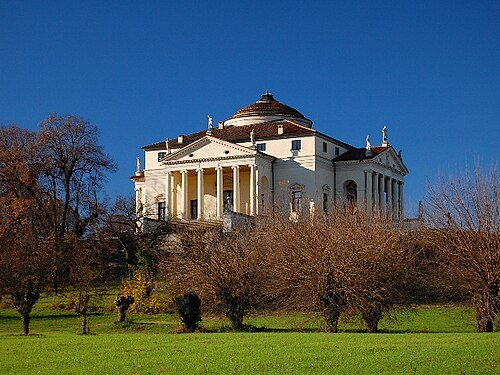
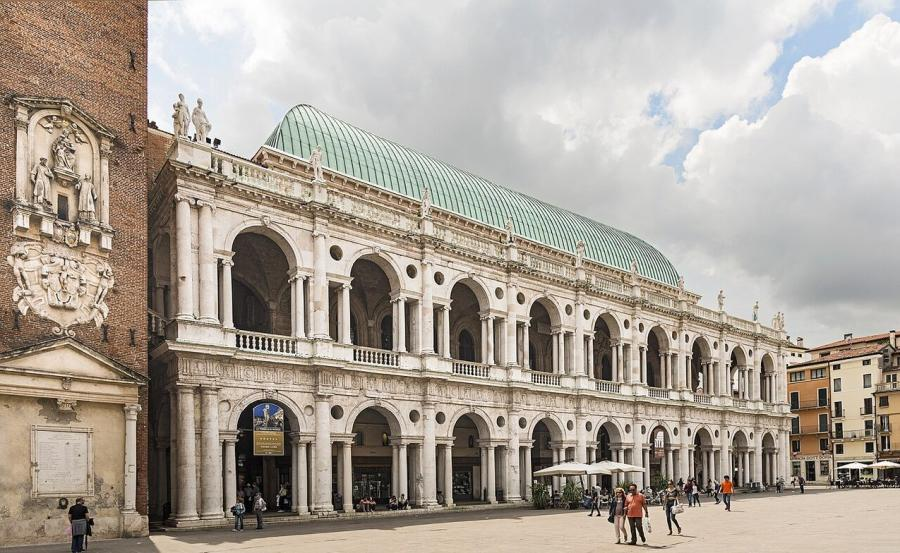
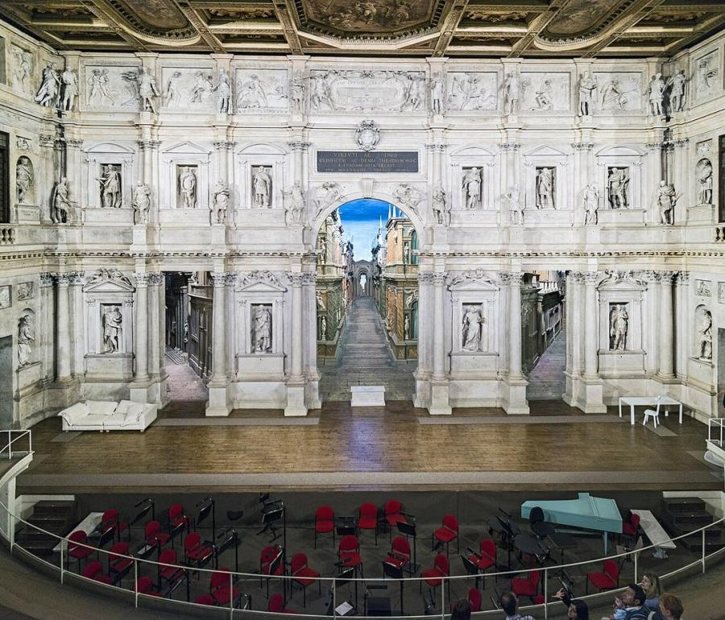
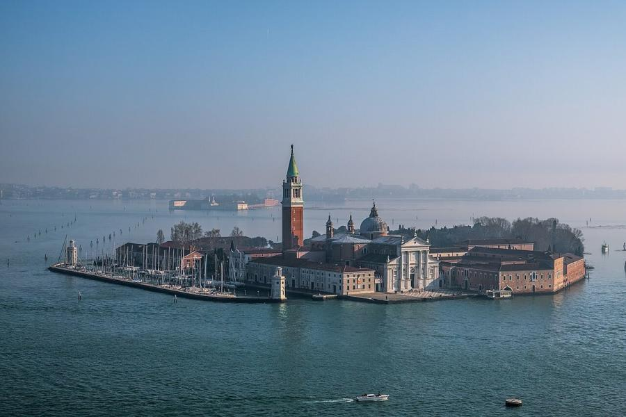
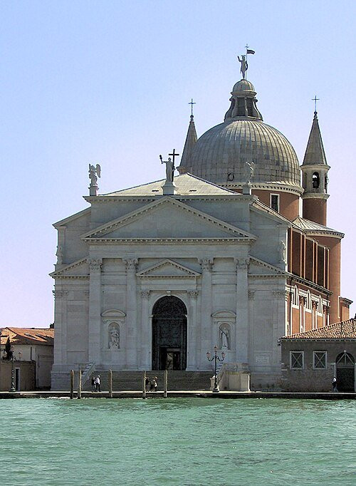

# Andrea Palladio (1508–1580)

> The Renaissance architect whose temple-fronted villas, churches and treatise turned Roman classicism into a portable, endlessly imitated style.

## Overview

Andrea Palladio is arguably the most influential individual architect in Western history, not for
the size of his body of work but for its reach: his villas and churches around Vicenza and Venice
codified a system of classical proportion that, through his own illustrated treatise, spread across
Europe and eventually to colonial North America. He trained as a stonemason, not an architect in
the modern sense, and it was a chance patronage that gave him both a classical education and the
name by which the world knows him.

## Life

Born Andrea di Pietro della Gondola in Padua in 1508, he was apprenticed to a stonemasons' guild in
his teens and moved to Vicenza to work as a carver. There the humanist nobleman Gian Giorgio
Trissino took him under his wing, gave him a classical education, and renamed him "Palladio" after
Pallas Athena, taking him on study trips to Rome to measure and draw ancient ruins firsthand. Back
in Vicenza, his 1549 remodelling of the town's medieval basilica made his name, and for the next
three decades he designed country villas for the Venetian nobility across the Veneto countryside
alongside major churches in Venice itself. In 1570 he published *I Quattro Libri dell'Architettura*
(The Four Books of Architecture), part treatise, part illustrated catalogue of his own buildings. He
died in Vicenza in 1580, leaving the Teatro Olimpico and Villa Rotonda to be finished by his pupil
Vincenzo Scamozzi.

## Style & Technique

Palladio treated ancient Roman temple architecture, colonnaded porticoes, pediments, domes, as a
system of proportion that could be adapted to any building type, from a working farm villa to a
cathedral. Drawing on Vitruvius and his own measured drawings of Roman ruins, he worked out room
dimensions using simple musical ratios he believed produced an innate sense of harmony. To keep
costs down for rural patrons, he built in brick and rendered stucco finished to imitate carved
stone. His four-square, centrally planned villas and his device for masking a basilica's
stepped roofline behind overlapping temple fronts became templates repeated for centuries.

## Legacy

The *Four Books* was translated widely and carried Palladio's system to England, where Inigo Jones
and later Lord Burlington built an entire "Palladian" movement on it, and from there to colonial
America: Thomas Jefferson owned and annotated a copy and drew directly on Palladio's plans for
Monticello and the rotunda of the University of Virginia. Vicenza's historic centre and the
Palladian villas of the surrounding Veneto region are together inscribed as a UNESCO World Heritage
Site. Few architects before or since have had a single book carry their style so far beyond their
own lifetime and country.

## Key Works

<!-- works:start -->

### 1. Villa Rotonda (1567–1592)

*Brick and stucco rendered to resemble stone · Vicenza, Republic of Venice (Italy)*

A country retreat for a retired papal official, built on a hilltop with views in every direction, and answered with a design of near-perfect symmetry: four identical temple-fronted porticoes, one on each face, around a central domed rotunda. Left unfinished at Palladio's death, it was completed by his pupil Vincenzo Scamozzi and became the most copied private house plan in Western architecture.

Image: [Wikimedia Commons](https://commons.wikimedia.org/wiki/File:Larotonda2009.JPG) · Marco Bagarella · [CC BY-SA 3.0](https://creativecommons.org/licenses/by-sa/3.0)

### 2. Basilica Palladiana (1549–1614)

*Marble-clad stone arcades wrapped around a medieval brick hall · Piazza dei Signori, Vicenza, Republic of Venice (Italy)*

Palladio's first major public commission and the building that made his reputation: a new classical skin wrapped around Vicenza's crumbling medieval town hall. His solution, a two-storey arcade of round arches framed by smaller flanking openings, a motif now called the Palladian window, let the load-bearing masonry flex slightly without cracking the stonework. Construction continued for decades after his death.

Image: [Wikimedia Commons](https://commons.wikimedia.org/wiki/File:Basilica_Palladiana_(Vicenza)_-_facade_on_Piazza_dei_signori.jpg) · Didier Descouens · [CC BY-SA 4.0](https://creativecommons.org/licenses/by-sa/4.0)

### 3. Teatro Olimpico (1580–1585)

*Wood, stucco and painted trompe-l'oeil scenery over a masonry shell · Vicenza, Republic of Venice (Italy)*

Palladio's last design, a covered theatre modelled on his study of ancient Roman precedent, completed after his death by Scamozzi. Behind its stage arch, streets built in forced perspective recede at a scale that makes them appear far longer than the shallow space allows, an illusion still used at the world's oldest surviving indoor theatre in continuous use.

Image: [Wikimedia Commons](https://commons.wikimedia.org/wiki/File:Interior_of_Teatro_Olimpico_(Vicenza)_scena_.jpg) · Didier Descouens · [CC BY-SA 4.0](https://creativecommons.org/licenses/by-sa/4.0)

### 4. San Giorgio Maggiore (1566–1610)

*Istrian stone facade over a brick basilica plan · Isola di San Giorgio Maggiore, Venice, Republic of Venice (Italy)*

A monastery church on its own island across the water from St Mark's Square, its bright white facade overlapping two classical temple fronts of different heights to mask the awkward profile of a basilica's tall nave and lower side aisles, a problem Palladio solved more elegantly here than any architect before him.

Image: [Wikimedia Commons](https://commons.wikimedia.org/wiki/File:San_Giorgio_Maggiore_from_the_top_of_St_Mark%27s_Campanile.jpg) · Anton Volnuhin · [CC BY 4.0](https://creativecommons.org/licenses/by/4.0)

### 5. Il Redentore (1577–1592)

*Istrian stone facade over a brick and stone basilica · Giudecca, Venice, Republic of Venice (Italy)*

A votive church commissioned by the Venetian Senate after a plague that killed roughly a third of the city's population, still visited every July in a footbridge-borne procession of thanksgiving. Its luminous white facade and centrally planned interior, lit from hidden windows, are considered among the calmest and most resolved of all his church designs.

Image: [Wikimedia Commons](https://commons.wikimedia.org/wiki/File:Chiesa_del_Santissimo_Redentore,_Venice,_Italy.jpg) · Il_Redentore.jpg : Wknight94 derivative work: Alberto Fernandez Fernandez ( talk ) · [CC BY-SA 3.0](https://creativecommons.org/licenses/by-sa/3.0)

<!-- works:end -->
## Sources

- [Andrea Palladio (Wikipedia)](https://en.wikipedia.org/wiki/Andrea_Palladio)
- [Villa La Rotonda (Wikipedia)](https://en.wikipedia.org/wiki/Villa_La_Rotonda)
- [I quattro libri dell'architettura (Wikipedia)](https://en.wikipedia.org/wiki/I_quattro_libri_dell%27architettura)
