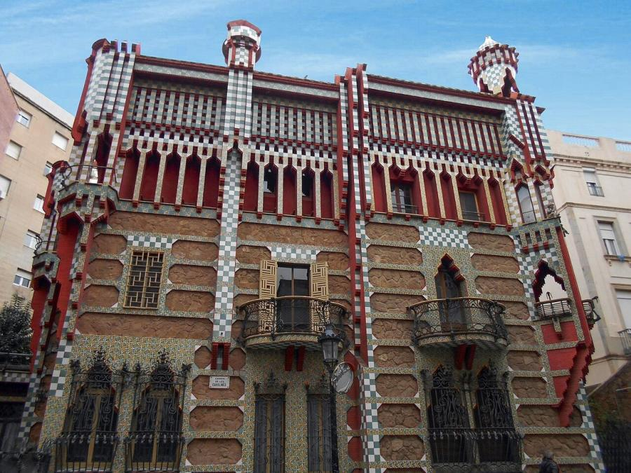
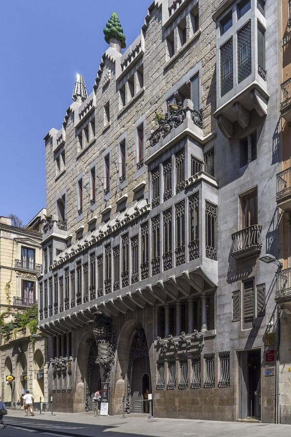
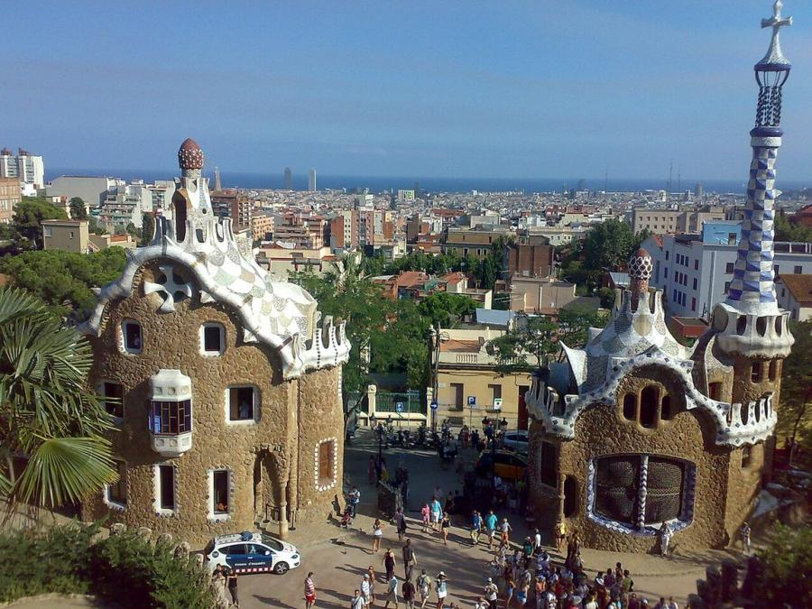
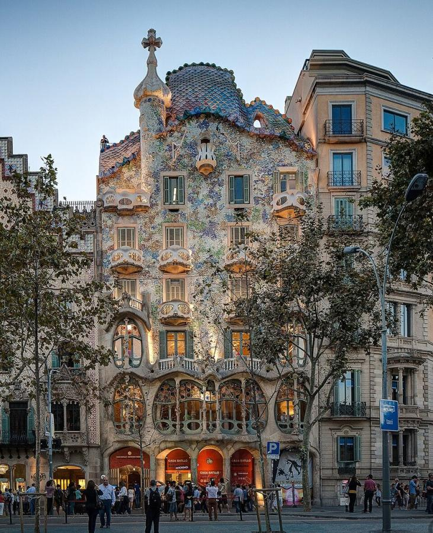
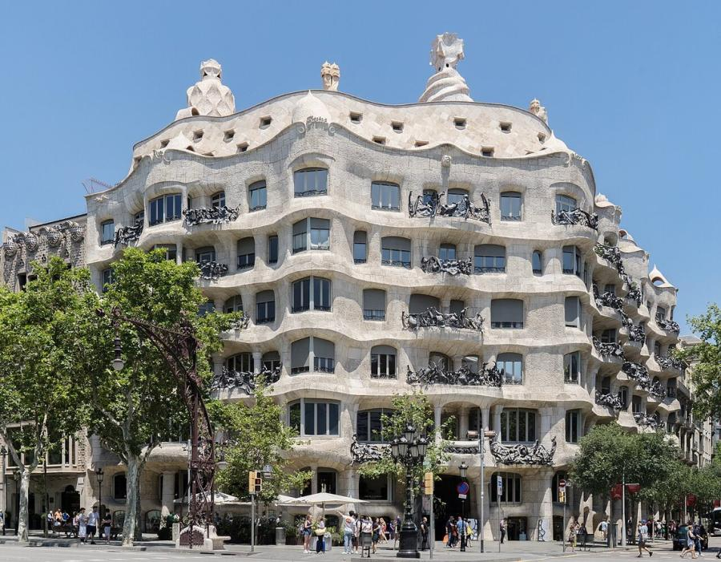
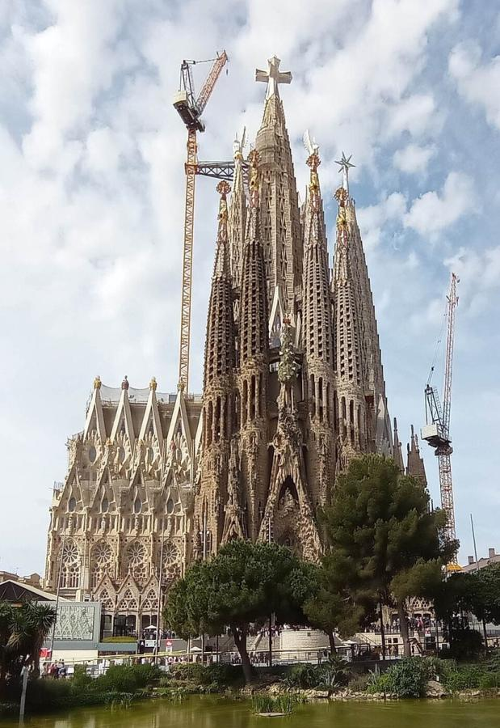

# Antoni Gaudí (1852–1926)

> The visionary architect of Catalan Modernisme, whose organic, structurally daring buildings, above all the still-unfinished Sagrada Família, made Barcelona his lifelong canvas.

## Overview

Antoni Gaudí i Cornet was the leading figure of Catalan Modernisme, the regional cousin of Art
Nouveau, and arguably the most original architect of his era. Rather than draw from a pattern book
of historical styles, he built as if imitating nature itself, using catenary arches, branching
columns and hyperbolic vaults he considered ready-made by God, and clad them in shattered tile
mosaic of his own invention. Almost all his mature work stands in a few square kilometres of
Barcelona, commissioned largely by one devoted patron, and it culminates in a cathedral he knew he
would never live to finish.

## Life

Gaudí was born on 25 June 1852 in Reus, Catalonia, the youngest son of a coppersmith; he later
credited his father's boiler-making workshop, and its stock of curved copper vessels, with teaching
him to see three-dimensional space before he could draw it on paper. Chronic rheumatism kept him
from playing outdoors as a child, and he spent long hours instead observing plants and animals
around his family's summer home. He studied at the Barcelona School of Architecture, graduating in
1878; the school's director is said to have remarked, on signing his diploma, that they had just
given it to either a madman or a genius.

That same year, a display case Gaudí designed for a Barcelona glove-maker caught the eye of the
industrialist Eusebi Güell at the Paris World's Fair. Güell became his patron for the rest of his
career, commissioning Palau Güell, Park Güell, a crypt for his textile colony, and more. Gaudí
never married, grew increasingly devout with age, and by his sixties lived an almost monastic life,
fasting for long stretches and devoting himself entirely to the Sagrada Família. On 7 June 1926,
walking to church in worn, shabby clothes, he was struck by a tram; mistaken for a beggar, he
received only delayed care, and died on 10 June 1926. Barcelona gave him a funeral procession
several kilometres long, and he was buried in the crypt of his unfinished basilica.

## Style & Technique

Gaudí modelled his forms directly on nature: tree trunks became columns, honeycombs became vault
cells, animal bones and shells suggested balconies and roofs. To find the ideal shape for a
compression-only stone arch, he hung scale models of chains and sandbags and photographed them
upside down, letting gravity solve the engineering for him before a single stone was cut. He
revived trencadís, mosaic made from broken tile and crockery, as a cheap, weatherproof and endlessly
flexible skin, and combined it with wrought iron, carved stone and stained glass made by
craftsmen he trained himself. His early work leaned on Mudéjar and Gothic revival forms; from Casa
Batlló onward these dissolved into an almost biomorphic vocabulary in which straight lines are rare.

## Legacy

Gaudí was a local celebrity in his lifetime but little known abroad, and modernist critics dismissed
him after his death as a wilful eccentric outside the mainstream of 20th-century architecture.
Salvador Dalí and the Surrealists were early champions; later architects and engineers, confronting
computer-modelled free-form structures of their own, recognised how far ahead of his tools Gaudí's
geometry had been. Seven of his Barcelona works are inscribed together as a UNESCO World Heritage
Site. The Sagrada Família, funded entirely by ticket sales and donations rather than public money,
is now one of the most visited monuments in Europe, with its main towers targeted for completion
around the centenary of his death.

## Key Works

<!-- works:start -->

### 1. Casa Vicens (1883–1885)

*Brick, ceramic tile and wrought iron · Carrer de les Carolines, Barcelona, Spain*

Gaudí's first major commission, built as a summer house for a tile manufacturer, and the building that announced his style: Mudéjar-inflected brickwork studded with green-and-white ceramic tiles shaped like marigolds, the flower that grew wild on the site. Iron palm-frond railings, cast from real leaves, guard the garden gate. It became a UNESCO World Heritage Site in 2005 and opened to the public as a museum in 2017.

Image: [Wikimedia Commons](https://commons.wikimedia.org/wiki/File:Gaud%C3%AD_-_Casa_Vicens.JPG) · Canaan · [CC BY-SA 4.0](https://creativecommons.org/licenses/by-sa/4.0)

### 2. Palau Güell (1886–1888)

*Stone, iron and Uruguayan pine, over a parabolic-arched brick basement · Carrer Nou de la Rambla, Barcelona, Spain*

A townhouse built just off Barcelona's Rambla for his lifelong patron, the industrialist Eusebi Güell. Behind a plain stone facade, Gaudí stacked parabolic arches to bring light into the dark, narrow site, and topped the roof with twenty tiled chimneys and ventilation cones, each a distinct sculptural experiment in trencadís, mosaic made of broken tile. It marks his shift from historical revival styles toward a structural language of his own.

Image: [Wikimedia Commons](https://commons.wikimedia.org/wiki/File:Palau_G%C3%BCell,_Antoni_Gaudi,_Barcelona_2.jpg) · Thomas Ledl · [CC BY-SA 4.0](https://creativecommons.org/licenses/by-sa/4.0)

### 3. Park Güell (1900–1914)

*Stone, concrete and trencadís mosaic, laid out over 17 hectares · La Salut, Barcelona, Spain*

Commissioned by Eusebi Güell as an English-style garden city of sixty houses, of which only two were ever built; the failed development became a public park instead. Its centrepiece is a Doric-columned market hall topped by a serpentine bench encrusted with shattered tile and glass, and a mosaic salamander on the entrance stairway that became an emblem of the city. Gaudí lived in one of its show houses for nearly twenty years.

Image: [Wikimedia Commons](https://commons.wikimedia.org/wiki/File:Parc_guell_-_panoramio.jpg) · essetefano · [CC BY 3.0](https://creativecommons.org/licenses/by/3.0)

### 4. Casa Batlló (1904–1906)

*Sandstone facade, trencadís mosaic, cast iron and stained glass · Passeig de Gràcia, Barcelona, Spain*

A radical remodelling of an existing apartment block, its facade a rippling field of blue-green mosaic and bone-shaped balconies that earned it the nickname Casa dels Ossos, "House of Bones." The tiled, arched roofline is usually read as a dragon's back, tied to the legend of St George, patron saint of Catalonia. Almost no straight line survives inside; even the light-wells are tiled in shades of blue graded from dark at the top to pale at the bottom, to spread daylight evenly.

Image: [Wikimedia Commons](https://commons.wikimedia.org/wiki/File:Casa_Batllo_Overview_Barcelona_Spain_cut.jpg) · ChristianSchd · [CC BY-SA 3.0](https://creativecommons.org/licenses/by-sa/3.0)

### 5. Casa Milà (La Pedrera) (1906–1912)

*Load-bearing limestone facade over a free-standing iron frame · Passeig de Gràcia, Barcelona, Spain*

Gaudí's last private commission before he devoted himself entirely to the Sagrada Família: an apartment building whose undulating stone facade earned it the nickname La Pedrera, "the quarry." A structure of iron columns and floor slabs freed the walls of any load-bearing role, allowing curved, column-free interiors below a rooftop forest of chimneys and stairwells sculpted into helmeted, faceless warriors.

Image: [Wikimedia Commons](https://commons.wikimedia.org/wiki/File:Casa_Mil%C3%A0,_general_view.jpg) · Thomas Ledl · [CC BY-SA 4.0](https://creativecommons.org/licenses/by-sa/4.0)

### 6. Sagrada Família (1882–present)

*Stone masonry and reinforced concrete, with hyperboloid and helicoidal vaulting · Eixample, Barcelona, Spain*

Gaudí took over this votive church in 1883, a year after it was begun, and rebuilt it around tree-like branching columns and parabolic vaults, with light filtered through forests of stained glass. He worked out its geometry largely through string-and-weight models rather than drawings. He gave his last forty years, and after 1914 his sole attention, to the project, eventually living on site. Still unfinished at his death, it remains under construction today, funded entirely by visitors and donations.

Image: [Wikimedia Commons](https://commons.wikimedia.org/wiki/File:SF_maig_2_cropped.jpg) · Canaan · [CC BY-SA 4.0](https://creativecommons.org/licenses/by-sa/4.0)

<!-- works:end -->
## Sources

- [Antoni Gaudí (Wikipedia)](https://en.wikipedia.org/wiki/Antoni_Gaud%C3%AD)
- [Sagrada Família (Wikipedia)](https://en.wikipedia.org/wiki/Sagrada_Fam%C3%ADlia)
- [Casa Batlló (Wikipedia)](https://en.wikipedia.org/wiki/Casa_Batll%C3%B3)
