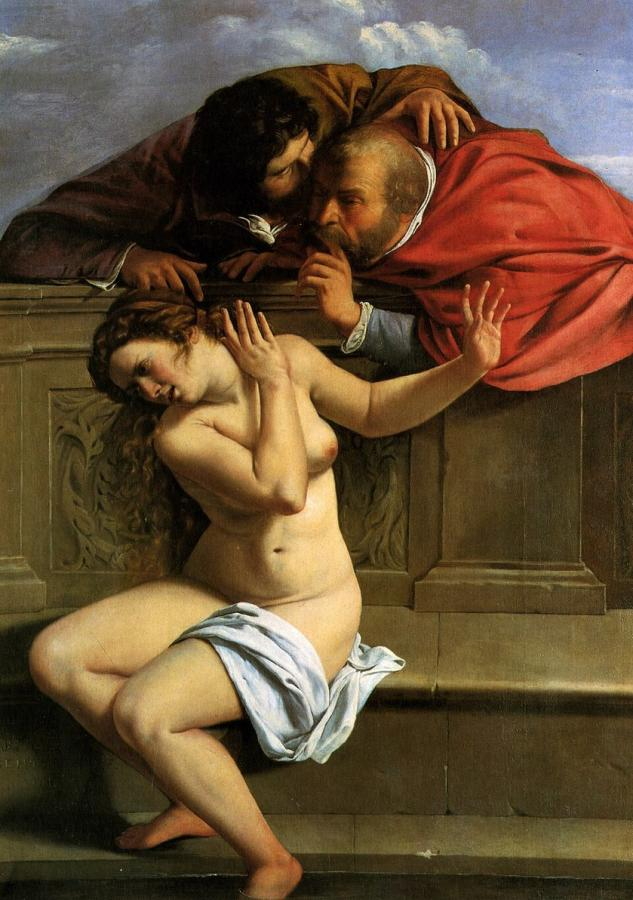
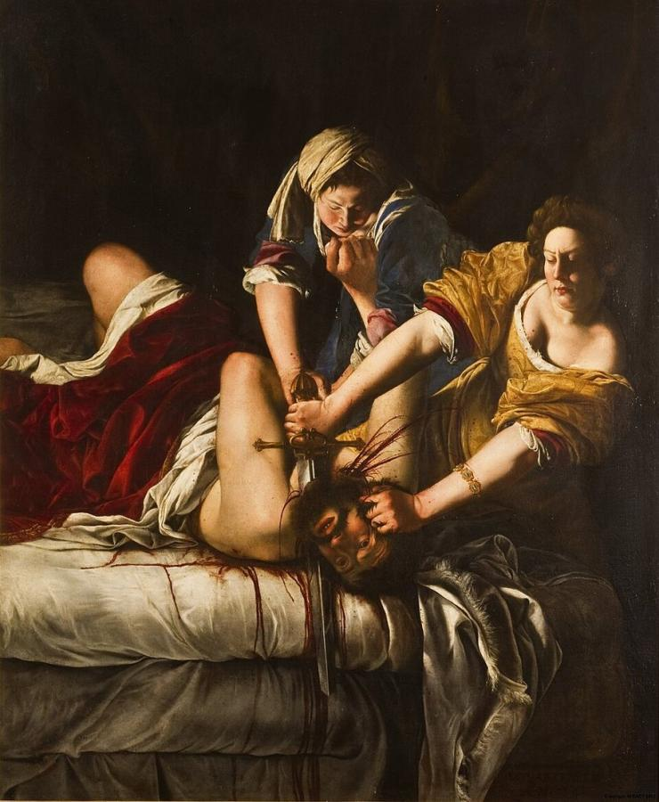
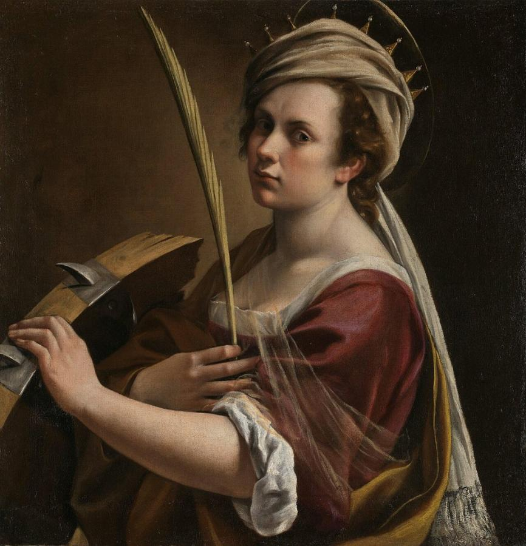
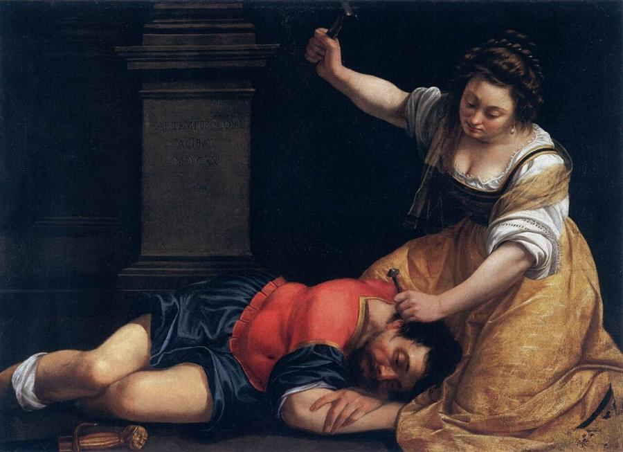
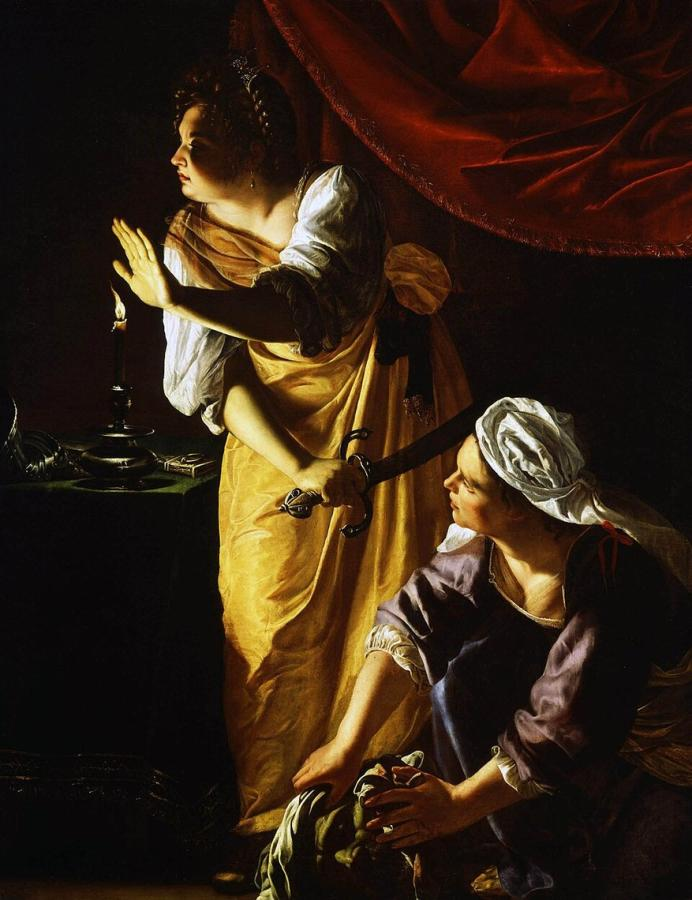
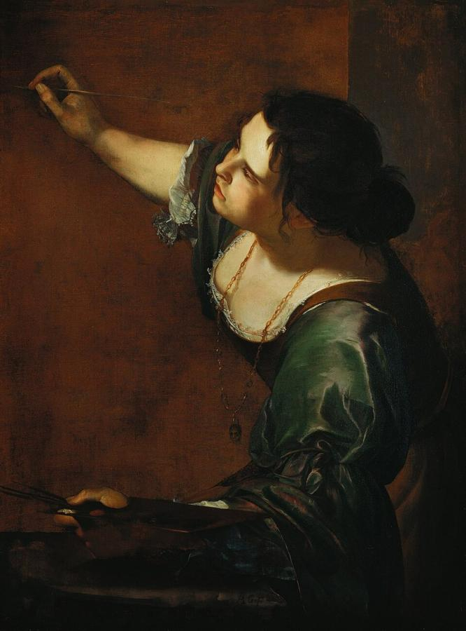

# Artemisia Gentileschi (1593–c. 1656)

> The most celebrated woman painter of the Baroque, known for powerful heroines painted with Caravaggesque drama.

## Overview

Artemisia Gentileschi was one of the most accomplished painters of the generation after Caravaggio,
and the first woman admitted to Florence's Academy of the Arts of Drawing. She specialised in strong
female figures from the Bible and ancient history: Judith, Susanna, Jael, Cleopatra, Lucretia. She
painted them with dramatic lighting, physical realism and psychological depth. For centuries her
fame was overshadowed by her father's and by the story of her rape and the trial that followed.
Since the 1970s she has been recognised as a major artist in her own right.

## Life

Artemisia was born in Rome on 8 July 1593, the eldest child of the painter Orazio Gentileschi, a
friend and follower of Caravaggio. She trained in her father's workshop, and by 17 she had painted
*Susanna and the Elders*. In 1611 she was raped by Agostino Tassi, a painter working with her father.
At the seven-month trial that followed in 1612, she was tortured with thumbscrews to test her
testimony. Tassi was convicted, though he never served his sentence.

Soon afterwards she married a Florentine painter, Pierantonio Stiattesi, and moved to Florence. There
she flourished. She won the patronage of Grand Duke Cosimo II de' Medici, befriended Galileo Galilei,
and in 1616 was admitted to the Accademia delle Arti del Disegno. She learned to read and write
during these years; her surviving letters are vivid and businesslike.

In the 1620s she worked in Rome and Venice, and from about 1630 she settled in Naples, which became
her base for the rest of her life. Around 1638 she travelled to London to join her father at the court
of Charles I, where Orazio died in 1639. Returning to Naples, she ran a workshop and corresponded with
collectors such as Don Antonio Ruffo. She is thought to have died there around 1656, possibly in the
plague that year.

## Style & Technique

Artemisia absorbed Caravaggio's strong light and shadow, his use of live models, and his focus on
dramatic moments. She added a strong sense of female experience and agency. Her heroines are solid,
muscular and believable, and their emotions are written on their faces and bodies.

She was admired for her rich colour, especially her golds, crimsons and blues, and for her rendering
of fabrics and skin. Her later Neapolitan works are more elegant and polished, adapting to the taste
of her patrons. She often painted herself into her pictures, lending her own features to saints and
allegories.

## Legacy

After her death Artemisia's reputation faded, and many works were credited to her father or to other
painters. The art historian Roberto Longhi wrote about her in 1916. From the 1970s feminist scholars,
notably Mary D. Garrard, made her a central figure in the history of women in art. Judy Chicago
gave her a place setting at *The Dinner Party*. Major exhibitions followed, including one at the
National Gallery, London, in 2020, and her work now commands record prices. Novels, plays and films
have retold her life.

## Key Works

<!-- works:start -->

### 1. Susanna and the Elders (1610)

*Oil on canvas, 170 × 119 cm · Schloss Weißenstein, Pommersfelden*

Signed and dated when Artemisia was just 17, this is her earliest known painting. Two older men lean over a wall to pressure the bathing Susanna, who twists away in distress. Male painters often treated the story as an excuse for an erotic nude. Artemisia shows it from Susanna's point of view, as an experience of threat and violation.

Image: [Wikimedia Commons](https://commons.wikimedia.org/wiki/File:Susanna_and_the_Elders_(1610),_Artemisia_Gentileschi.jpg) · Artemisia Gentileschi · Public domain

### 2. Judith Slaying Holofernes (c. 1620)

*Oil on canvas, 199 × 162.5 cm · Uffizi Gallery, Florence*

Judith and her maid pin down the Assyrian general and saw through his neck, the blood spraying in arcs across the white sheets. Unlike Caravaggio's hesitant, delicate Judith, Artemisia's women are strong, working together with physical effort. Many viewers read the painting in light of her own trial, though it is first of all a masterpiece of Baroque drama. An earlier version is in Naples.

Image: [Wikimedia Commons](https://commons.wikimedia.org/wiki/File:Judit_decapitando_a_Holofernes,_por_Artemisia_Gentileschi.jpg) · Artemisia Gentileschi · Public domain

### 3. Self-Portrait as Saint Catherine of Alexandria (c. 1615–1617)

*Oil on canvas, 71.4 × 69 cm · National Gallery, London*

Artemisia gives her own features to the early Christian martyr, shown with a palm and the broken spiked wheel on which she was to be tortured. The painting dates from her successful years in Florence. The National Gallery bought it in 2018, only the 21st painting by a woman to enter its collection. It then toured Britain, including a GP surgery and a women's prison.

Image: [Wikimedia Commons](https://commons.wikimedia.org/wiki/File:Self-Portrait_as_Saint_Catherine_of_Alexandria_(Gentileschi).jpg) · Artemisia Gentileschi · Public domain

### 4. Jael and Sisera (1620)

*Oil on canvas, 86 × 125 cm · Museum of Fine Arts, Budapest*

Another Old Testament heroine: Jael raises a hammer to drive a tent peg through the temple of the sleeping enemy general Sisera. Her calm, almost thoughtful face contrasts with the violence to come. The column at the right carries Artemisia's signature and the date.

Image: [Wikimedia Commons](https://commons.wikimedia.org/wiki/File:Giaele_e_Sisara_(ca.1620)_-_Artemisia_Gentileschi_(Museum_of_Fine_Arts,_Budapest).jpg) · Artemisia Gentileschi · Public domain

### 5. Judith and Her Maidservant (c. 1623–1625)

*Oil on canvas, 187 × 142 cm · Detroit Institute of Arts*

After the killing: in a tent lit by a single candle, Judith raises her hand to shade the light and listens for danger, sword still in hand, while her maid wraps the general's head in cloth. The suspense, the deep shadows and the glowing gold of Judith's dress make this one of the finest night scenes of the Caravaggesque movement.

Image: [Wikimedia Commons](https://commons.wikimedia.org/wiki/File:Artemisia_Gentileschi_Judith_Maidservant_DIA.jpg) · Artemisia Gentileschi · Public domain

### 6. Self-Portrait as the Allegory of Painting (La Pittura) (c. 1638–1639)

*Oil on canvas, 98.6 × 75.2 cm · Royal Collection, United Kingdom*

Artemisia shows herself as the personification of Painting itself, leaning into the canvas with brush raised, sleeves rolled up, a gold chain with a mask pendant at her neck. A male artist could paint the figure of Painting but could not become her. Artemisia claims both roles at once. Probably painted in London, where she joined her father at the court of Charles I.

Image: [Wikimedia Commons](https://commons.wikimedia.org/wiki/File:Self-portrait_as_the_Allegory_of_Painting_(La_Pittura)_-_Artemisia_Gentileschi.jpg) · Artemisia Gentileschi · Public domain

<!-- works:end -->
## Sources

- [Artemisia Gentileschi (Wikipedia)](https://en.wikipedia.org/wiki/Artemisia_Gentileschi)
- [Self-Portrait as Saint Catherine of Alexandria (Wikipedia)](https://en.wikipedia.org/wiki/Self-Portrait_as_Saint_Catherine_of_Alexandria)
- Mary D. Garrard, *Artemisia Gentileschi: The Image of the Female Hero in Italian Baroque Art* (1989)
