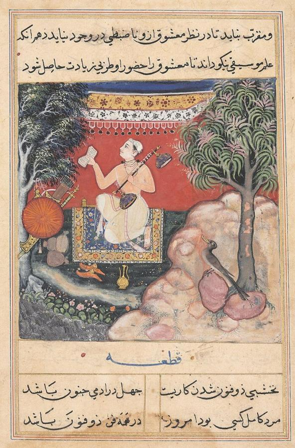
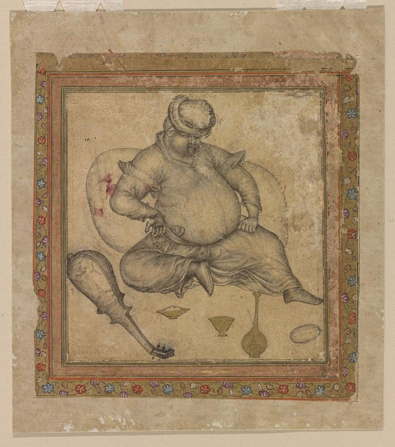
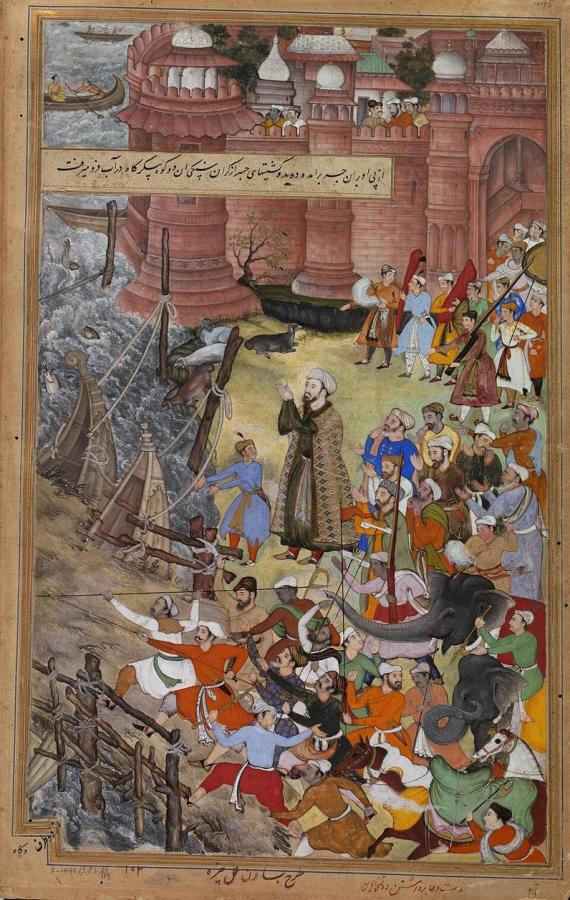
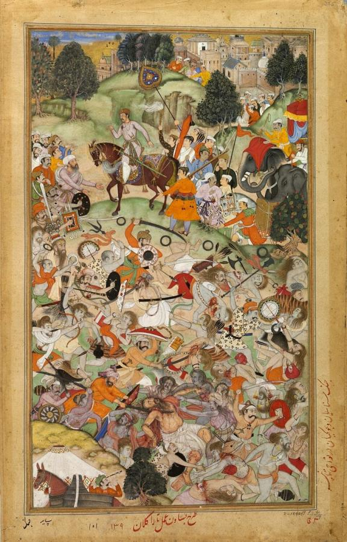
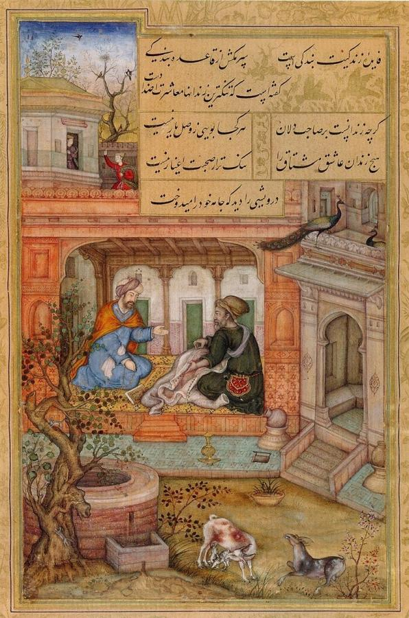
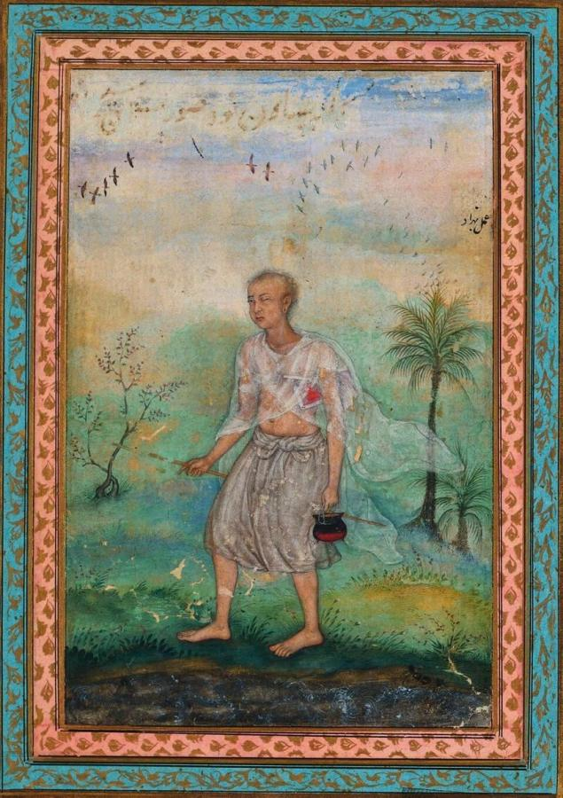

# Basawan (active c. 1560–1600)

> The leading painter of Emperor Akbar's workshop, admired for his lifelike figures, deep landscapes and bold compositions.

## Overview

Basawan was one of the greatest artists of the Mughal court under Emperor Akbar (reigned 1556–1605).
Akbar built a large imperial painting workshop in which Persian masters trained Indian artists, mostly
Hindus, to illustrate books of history, poetry and legend. Among more than a hundred painters, Basawan
stood out. Akbar's historian Abu'l-Fazl praised his skill in composition, faces, colour and portraiture,
and wrote that many critics preferred him even to the celebrated Daswanth. He was one of the first
Indian painters to absorb European techniques of modelling and perspective.

## Life

Almost nothing is known of Basawan's life beyond his paintings and the brief praise in Abu'l-Fazl's
*Ain-i-Akbari*. He was a Hindu and probably joined the imperial workshop as a young man in the 1560s.
There the Persian masters Mir Sayyid Ali and Abd al-Samad, who had trained in the tradition of
Behzād, directed Indian artists in producing vast illustrated manuscripts. The most famous of these was
the *Hamzanama*, 1,400 large paintings of the adventures of the hero Hamza, made over some 15 years.

Basawan's name, written in the margins of paintings by the imperial librarians, appears in the great
manuscripts of Akbar's reign. They include the *Razmnama* (a Persian translation of the *Mahabharata*),
the *Darabnama*, the *Akbarnama* (the official history of Akbar's reign) and luxurious small books of
Persian poetry made in Lahore in the 1590s. For big history manuscripts, the work was often divided:
Basawan designed the composition, and another artist completed the colouring.

From 1580 Jesuit missionaries at Akbar's court brought European engravings and paintings. Basawan
studied them closely, copying and adapting their figures, shading and deep space. He was active until
about 1600. His son Manohar became one of the leading painters under Akbar's son, Emperor Jahangir.

## Style & Technique

Mughal painters worked with opaque watercolour on burnished paper, grinding pigments from minerals
and plants and applying gold. Basawan's hallmark is a new sense of three-dimensional form. He modelled
bodies and faces with subtle shading, set figures in convincing space, and painted landscapes that
recede into soft, bluish distance. These ideas drew on both Persian tradition and European prints.

His crowded scenes of battles, hunts and court events are full of energy. He arranged them in dynamic
diagonals and swirling groups. At the same time he was a sympathetic observer of individuals:
ascetics, servants, animals and old people are drawn with character and warmth.

## Legacy

Basawan helped create the Mughal style, a synthesis of Persian refinement, Indian vitality and
European naturalism. It flourished under Jahangir and Shah Jahan. His pupils and his son Manohar
carried his approach into the 17th century. Today his paintings are treasured in the Victoria and
Albert Museum, the British Library, the Chester Beatty Library in Dublin, and museums in India and
the United States. Scholars recognise him as one of the first Indian artists whose individual
personality can be traced through his work.

## Key Works

<!-- works:start -->

### 1. The Origin of Music, from a Tutinama (Tales of a Parrot) (attributed) (c. 1560–1565)

*Opaque watercolour, ink and gold on paper · Cleveland Museum of Art*

From one of the earliest manuscripts made for the young emperor Akbar, a collection of tales told by a wise parrot. This page, attributed to Basawan, illustrates a story about how music was first discovered. It already shows the lively figures and bright colours that marked the new Mughal style, a blend of Persian and Indian painting.

Image: [Wikimedia Commons](https://commons.wikimedia.org/wiki/File:1_Basawan._The_Origin_of_Music_Page_from_a_Tutinama_Manuscript_1560-65_Cleveland_Museum_of_Art.jpg) · Basawan · Public domain

### 2. A European Seated on the Ground (A Drunk European) (c. 1580–1585)

*Ink, opaque watercolour and gold on paper · National Museum of Asian Art (Freer Gallery), Washington*

A slumped man in European dress sits on the ground with a wine flask, carefully shaded to give him volume. Portuguese traders and Jesuit missionaries had recently arrived at Akbar's court with European prints and paintings. Basawan was among the first Mughal artists to study them closely and absorb their modelling and perspective.

Image: [Wikimedia Commons](https://commons.wikimedia.org/wiki/File:Basawan._Drunk_European_seated_on_ground._ca._1580-1585._Freer_and_Sackler_Gallery,_Washington.jpg) · Basawan · Public domain

### 3. Akbar's Adventure with the Elephant Hawai, from the Akbarnama (c. 1590–1595)

*Opaque watercolour and gold on paper (design by Basawan, painted by Chetar Munti) · Victoria and Albert Museum, London*

One page of a double-page scene from the illustrated history of Akbar's reign. In 1561 the 19-year-old emperor mounted the ferocious elephant Hawai and drove it after another elephant across a bridge of boats on the Jumna at Agra. The boats sink and tilt beneath the animals as attendants leap into the water. Basawan designed the swirling composition, and another artist added the colours.

Image: [Wikimedia Commons](https://commons.wikimedia.org/wiki/File:Basawan._Akbar_Taming_Mad_Elephant_Hawai._Composition_by_Basawan,_coloring_by_Chitra._(right_part)_Akbarnama,_ca._1590,_Victoria_and_Albert_Museum,_London.._(2).jpg) · Basawan · Public domain

### 4. Battle between Rival Groups of Ascetics at Thanesar, from the Akbarnama (c. 1590–1595)

*Opaque watercolour and gold on paper · Victoria and Albert Museum, London*

In 1567 two rival bands of Hindu ascetics fought over the right to a sacred bathing place at Thanesar. Akbar watched, and let some of his soldiers join the fight. Basawan fills the page with dozens of near-naked, ash-smeared figures wielding swords and bows. Each body is shown in a different pose, with a vigour and anatomical study that were unmatched at the court.

Image: [Wikimedia Commons](https://commons.wikimedia.org/wiki/File:Basawan._Battle_of_rival_ascetics._Akbarnama,_ca._1590,_V%26A_Museum.jpg) · Basawan · Public domain

### 5. The Vain Dervish Rebuked, from the Baharistan of Jami (1595)

*Opaque watercolour and gold on paper · Bodleian Library, Oxford*

From a small, exquisite manuscript of Jami's *Baharistan* ("Spring Garden") made for Akbar's library in Lahore. A proud dervish is taught humility by a wiser Sufi. Basawan sets the scene in a soft, receding landscape with a distant town, showing his mastery of atmospheric depth learned partly from European models.

Image: [Wikimedia Commons](https://commons.wikimedia.org/wiki/File:Basawan._The_Vain_Dervish_and_the_Sufi._Baharistan_of_Jami._Dated_1595,_Bodleian_Library,_Oxford..jpg) · Basawan · Public domain

### 6. Jain Ascetic Walking Along a Riverbank (c. 1600)

*Ink and opaque watercolour on paper · Cleveland Museum of Art*

A lean, white-robed Jain monk walks along a river beneath trees, absorbed in thought, while life goes on around him. It is a late, intimate work, an individual study of a holy man rather than a page of history. It shows the naturalism and sympathy for ordinary people that Basawan passed on to the next generation of Mughal painters, including his son Manohar.

Image: [Wikimedia Commons](https://commons.wikimedia.org/wiki/File:Basawan._Jain-Ascetic-Walking-Along-a-Riverbank-ca.1600..jpg) · Basawan · Public domain

<!-- works:end -->
## Sources

- [Basawan (Wikipedia)](https://en.wikipedia.org/wiki/Basawan)
- [Mughal painting (Wikipedia)](https://en.wikipedia.org/wiki/Mughal_painting)
- [Akbarnama (Wikipedia)](https://en.wikipedia.org/wiki/Akbarnama)
- Abu'l-Fazl, *Ain-i-Akbari* (c. 1590s)
