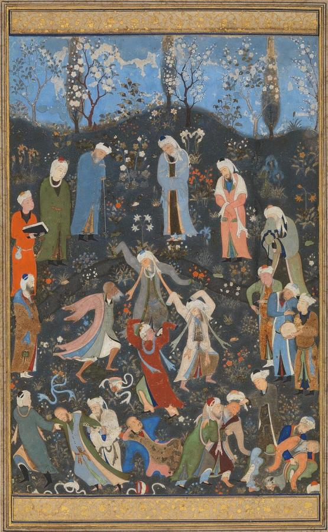
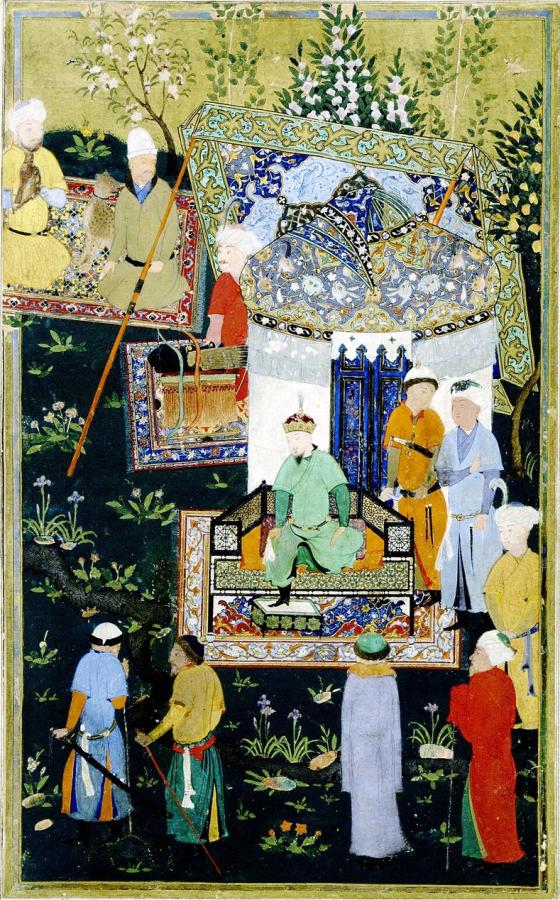
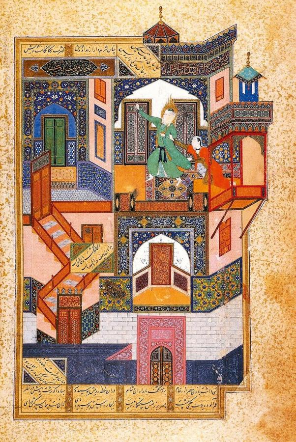
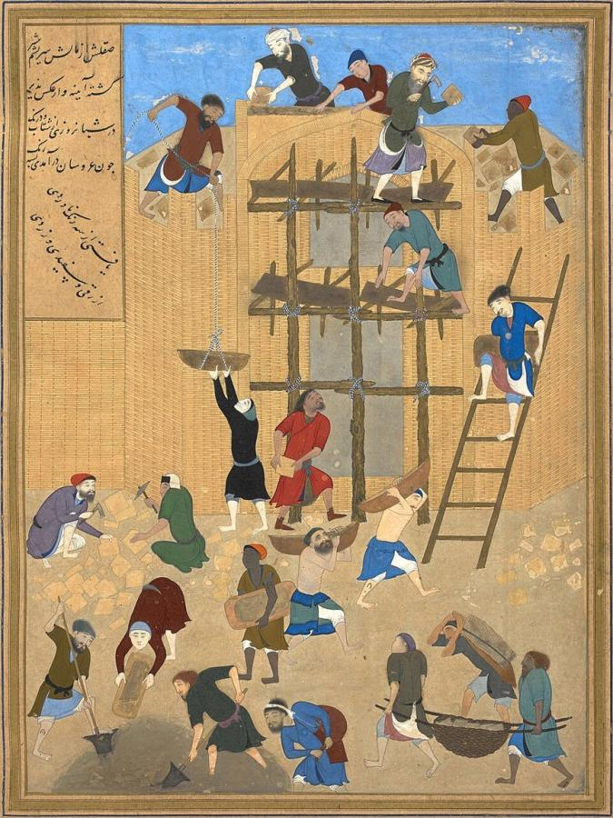
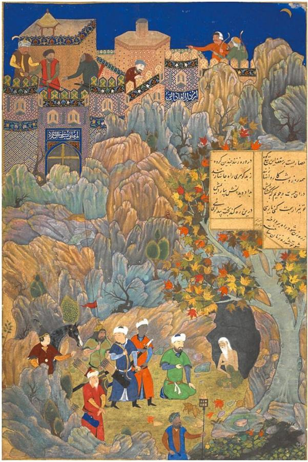
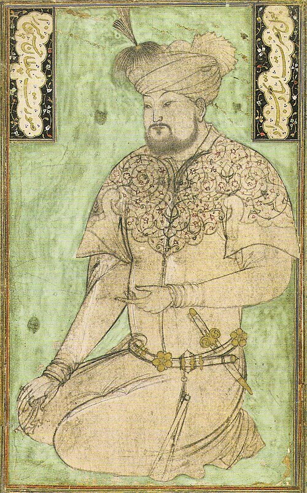

# Kamāl ud-Dīn Behzād (c. 1450–c. 1535)

> The greatest master of Persian miniature painting, head of the royal workshops of Herat and Tabriz.

## Overview

Kamāl ud-Dīn Behzād (also spelled Bihzad) is the most celebrated painter in the Persian tradition. He
worked at the court of Herat, now in Afghanistan, then one of the world's most brilliant cultural
centres, and later at the Safavid court in Tabriz. His manuscript paintings for poetry and history
books brought new naturalism, individual characters, scenes of everyday life and complex, carefully
balanced compositions to Persian painting. Within his lifetime his name became a byword for artistic
excellence, and painters across the Persian, Ottoman and Mughal worlds looked back to him as a model.

## Life

Behzād was probably born around 1450 in Herat, the capital of the Timurid dynasty founded by Timur
(Tamerlane). He was orphaned young and was brought up by the painter Mirak Naqqash, head of the
royal library. He also came under the protection of Mir Ali-Shir Nava'i, the great poet and minister
of Sultan Husayn Bayqara.

Under Husayn Bayqara, who ruled Herat from 1469 to 1506, the city became a centre of poetry, music,
calligraphy and painting. Behzād became the leading artist of the royal *kitabkhana*, the library
workshop where calligraphers, illuminators, painters and bookbinders made luxury manuscripts. His
most famous surviving works date from this period, including paintings in a *Bustan* of Sa'di (1488)
and a *Khamsa* of Nizami (1494–1495).

After Herat fell to the Uzbeks and then to the Safavid Shah Ismail I in 1510, Behzād moved to the
Safavid capital, Tabriz. A legend claims that during the Battle of Chaldiran in 1514 the shah hid
Behzād and a famous calligrapher in a cave, because he valued them more than his army. In 1522
Ismail appointed him director of the royal library. There he shaped the style of the next generation,
whose masterpiece is the great *Shahnameh* of Shah Tahmasp. He died in about 1535.

## Style & Technique

Persian manuscript painting used mineral and organic pigments bound with gum on burnished paper, with
gold and silver. The paintings were small and packed with detail, and they were meant to be seen up
close in a book. Behzād worked within this tradition but transformed it. His figures are no longer
standard types. They have individual faces, gestures and body language, and they are often busy with
ordinary tasks like building, washing or tending animals.

He was a master of composition. He organised complex scenes with architecture, patterned tiles and
screens, and geometric structures that guide the eye, and he balanced them with rich but harmonious
colour. He often hid his signature discreetly in the architecture of a painting. Many works are
attributed to him on the basis of style, and scholars debate which are by his own hand.

## Legacy

Behzād's pupils and followers spread his style to the Safavid court in Tabriz and later to Bukhara
and India. The Persian painters Mir Sayyid Ali and Abd al-Samad trained in his tradition and went on
to found the Mughal imperial workshop under Humayun and Akbar. That workshop is where Basawan worked.
Mughal and Ottoman writers praised Behzād as the ideal painter, and collectors prized anything
bearing his name, which led to many false attributions. In modern Iran and Afghanistan he is a
national hero, and his name is used for art schools and prizes.

## Key Works

<!-- works:start -->

### 1. Dancing Dervishes (attributed) (c. 1480)

*Opaque watercolour, ink and gold on paper, folio from a Divan of Hafiz · Metropolitan Museum of Art, New York*

Sufi mystics whirl and leap in ecstatic dance in a flowering garden while others look on, some calm, some overcome with emotion. Every figure has a distinct pose and expression. The painting captures the *sama*, the Sufi ceremony of music and movement, with a liveliness that marks the new naturalism of the Herat school.

Image: [Wikimedia Commons](https://commons.wikimedia.org/wiki/File:Dance_of_Sufi_Dervishes.jpg) · Kamāl ud-Dīn Behzād · Public domain

### 2. Timur Granting an Audience at Balkh (attributed) (c. 1467–1480s)

*Opaque watercolour, ink and gold on paper, from a *Zafarnama* (Book of Victory) · John Work Garrett Library, Johns Hopkins University, Baltimore*

From an illustrated history of the conqueror Timur (Tamerlane), made for Sultan Husayn Bayqara. Timur sits enthroned beneath a canopy at his accession in 1370, while courtiers and guards fill a flowering garden in a crowded yet ordered composition. This is one half of a double-page scene attributed to the young Behzād. It shows the courtly world he would record throughout his career.

Image: [Wikimedia Commons](https://commons.wikimedia.org/wiki/File:Timur_granting_audience_on_the_occasion_of_his_accession_(right).jpg) · Attributed to Bihzād · [CC BY-SA 2.0](https://creativecommons.org/licenses/by-sa/2.0)

### 3. The Seduction of Yusuf (1488)

*Opaque watercolour, ink and gold on paper, from a *Bustan* of Sa'di · Egyptian National Library (Dar al-Kutub), Cairo*

Behzād's most famous painting. The story of Yusuf (Joseph) and Zulaikha (Potiphar's wife) is set in a fantastic palace of staircases, doorways and tiled rooms. Zulaikha has led Yusuf through seven locked chambers, but as she reaches for him, the doors fly open and he escapes. The maze-like architecture becomes an image of the soul resisting desire, and the signed work is one of the high points of Persian painting.

Image: [Wikimedia Commons](https://commons.wikimedia.org/wiki/File:Yusuf_fleeing_the_Advances_of_Zulaikha.jpg) · Kamāl ud-Dīn Behzād · Public domain

### 4. The Construction of the Palace of Khawarnaq (1494–1495)

*Opaque watercolour, ink and gold on paper, from a *Khamsa* of Nizami · British Library, London (Or. 6810)*

Instead of a royal scene, Behzād painted workers building a palace: labourers carry bricks up ladders, masons lay courses, a man mixes mortar, another hauls water. Each figure is individually observed at a different task. It is one of the most celebrated images of labour in Islamic art, and it shows Behzād's interest in the everyday world.

Image: [Wikimedia Commons](https://commons.wikimedia.org/wiki/File:Kamal-ud-din_Bihzad_-_Construction_of_the_fort_of_Kharnaq.jpg) · Kamāl ud-Dīn Behzād · Public domain

### 5. Alexander Visits the Sage in His Cave (1494–1495)

*Opaque watercolour, ink and gold on paper, from a *Khamsa* of Nizami · British Library, London (Or. 6810, fol. 273r)*

The world conqueror Iskandar (Alexander the Great) dismounts to visit a wise hermit living in a cave in a wild, rocky landscape. It is a lesson in humility before spiritual wisdom. Alexander may be given the features of Behzād's patron, Sultan Husayn Bayqara, and the gnarled trees and rocks show the Herat school's delight in nature.

Image: [Wikimedia Commons](https://commons.wikimedia.org/wiki/File:Alexander_and_the_Hermit,_from_Nizami%27s_Iskandarnama,_1494-95,_by_Behzad._British_Library_OR.6810_Folio_273R.jpg) · c. 1494-1495 artist · Public domain

### 6. Portrait of Sultan Husayn Mirza Bayqara (after Behzād) (c. 1500–1525 (after an original of c. 1490))

*Opaque watercolour and ink on paper, album page · Harvard Art Museums, Cambridge, Massachusetts*

The last great Timurid ruler of Herat, Behzād's patron, sits cross-legged in a plain robe. His face is shown as that of a specific, ageing man rather than an idealised king. The painting is a copy after Behzād's lost original. Such individual portraits were a new development in Persian painting, and they influenced portraiture at the Mughal and Ottoman courts.

Image: [Wikimedia Commons](https://commons.wikimedia.org/wiki/File:Portrait_of_Sultan_Husayn_Mirza_Bayqara_at_the_age_of_about_50_years._1500%E2%80%9325_copy_from_Behz%C4%81d%27s_original_of_about_1490.jpg) · Kamāl ud-Dīn Behzād · Public domain

<!-- works:end -->
## Sources

- [Kamāl ud-Dīn Behzād (Wikipedia)](https://en.wikipedia.org/wiki/Kam%C4%81l_ud-D%C4%ABn_Behz%C4%81d)
- [Persian miniature (Wikipedia)](https://en.wikipedia.org/wiki/Persian_miniature)
- [Timurid Renaissance (Wikipedia)](https://en.wikipedia.org/wiki/Timurid_Renaissance)
