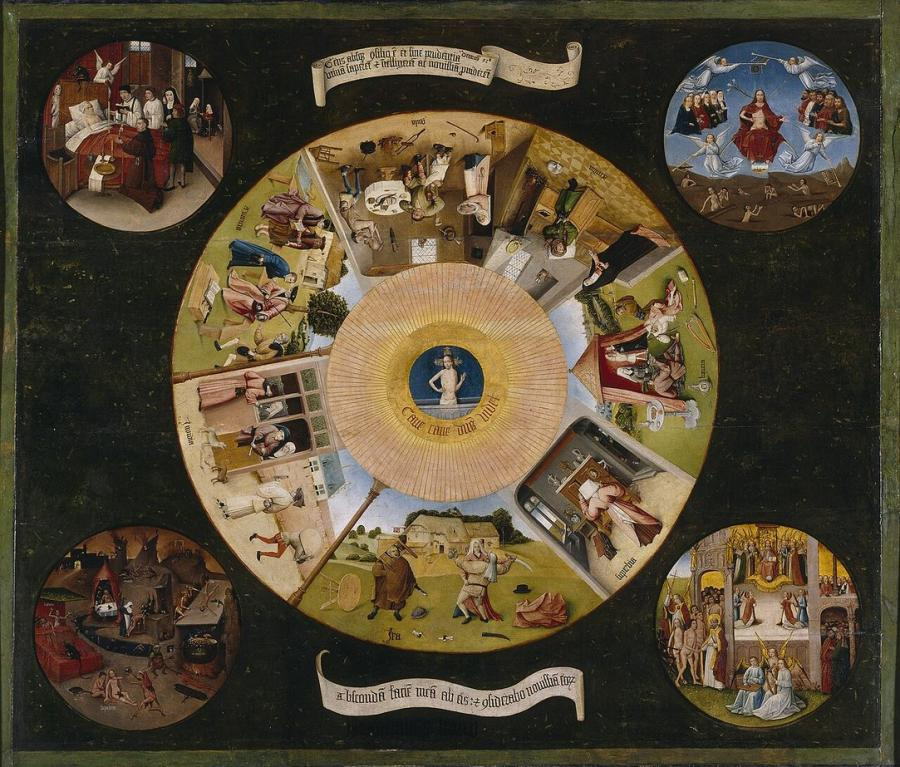
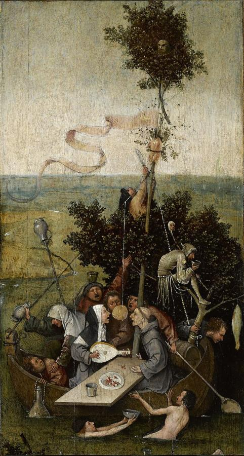
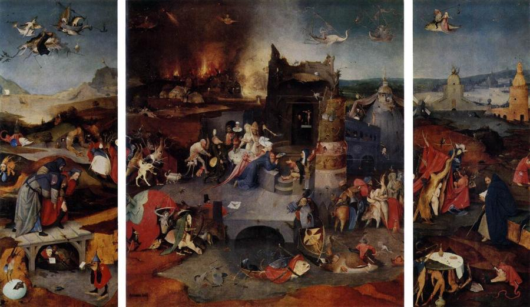
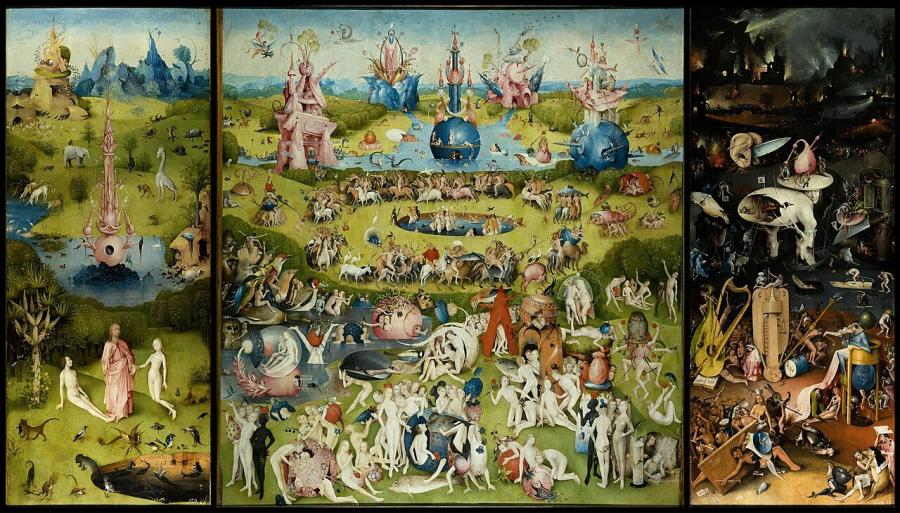
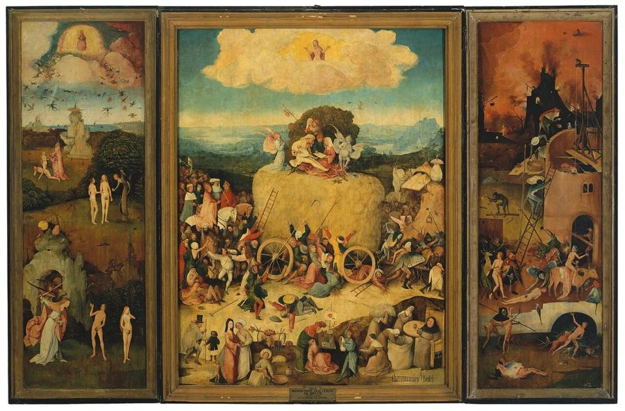
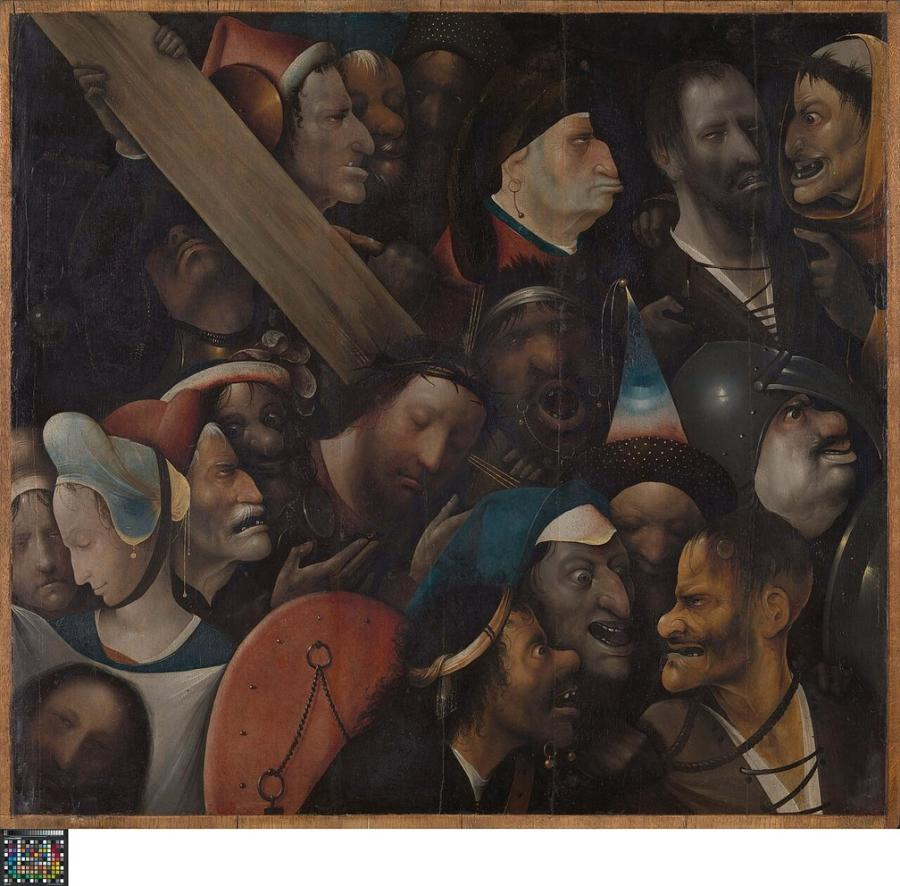

# Hieronymus Bosch (c. 1450–1516)

> The Dutch painter of paradise and nightmare, whose teeming visions of sin, folly and salvation still resist explanation.

## Overview

Hieronymus Bosch filled his paintings with strange creatures, impossible buildings and swarms of
tiny figures acting out the sins and follies of humanity. Behind the fantasy lay the deep religious
worries of the late Middle Ages: fear of Hell, suspicion of corrupt clergy, and the pull of earthly
pleasure. Only about 25 paintings are firmly attributed to him. They made him famous across Europe in
his lifetime, and centuries later the Surrealists hailed him as their forefather.

## Life

Bosch was born Jheronimus van Aken around 1450 in 's-Hertogenbosch, a prosperous town in the Duchy of
Brabant, now in the southern Netherlands. His grandfather, father and uncles were all painters, and
he learned the trade in the family workshop. He later signed his works "Jheronimus Bosch" after the
town's name.

Around 1481 he married Aleid van de Meervenne, the daughter of a wealthy family. The marriage gave
him financial independence. In 1488 he became a sworn member of the Illustrious Brotherhood of Our
Blessed Lady, a powerful religious confraternity whose members included the town's elite. He took
part in its feasts and designed works for it.

Bosch seems to have spent almost his whole life in 's-Hertogenbosch, yet his fame spread far. Philip
the Handsome, Duke of Burgundy, commissioned a Last Judgment from him in 1504. The Nassau family and
other nobles collected his paintings. He died in 1516, and the Brotherhood held a funeral mass for
him that August. Later in the century King Philip II of Spain became obsessed with his work and
bought every Bosch he could. That is why the Prado in Madrid holds his greatest paintings today.

## Style & Technique

Bosch painted in oil on oak panels, often as triptychs, three hinged panels that could be closed to
show grey-toned scenes on the outside. His technique was unusually quick and free for his time. He
often applied thin paint in a single layer, with lively, visible brushwork and bright highlights.

His imagination is his signature. He combined human, animal, plant and machine parts into hybrid
monsters. He turned proverbs and puns into images, and he packed his panels with hundreds of tiny
episodes that reward close looking. Beneath the fantasy, he was a sharp observer of ordinary life:
peasants, beggars, quack doctors and gluttons appear with satirical precision.

## Legacy

Bosch had many imitators in the 16th century, and Pieter Bruegel the Elder built on his crowded
moral landscapes. His work was then partly forgotten until the 20th century. Surrealists such as
Salvador Dalí and Max Ernst claimed him as a pioneer of dream imagery. In 2016, the 500th anniversary
of his death, the Bosch Research and Conservation Project re-examined his works, and several were
reattributed to his workshop. His imagery of the *Garden of Earthly Delights* now appears everywhere
from album covers to video games.

## Key Works

<!-- works:start -->

### 1. The Seven Deadly Sins and the Four Last Things (c. 1500 (attributed))

*Oil on panel, 120 × 150 cm · Museo del Prado, Madrid*

A painted tabletop arranged like a giant eye. At its centre, Christ rises from his tomb inside the "pupil" above the Latin warning *Beware, beware, the Lord sees*. Around him, seven scenes of everyday life act out Gluttony, Sloth, Lust, Pride, Anger, Envy and Avarice. Four roundels in the corners show Death, Judgment, Heaven and Hell. Philip II of Spain kept it in his bedroom at the Escorial. Some scholars now credit it to Bosch's workshop or a follower.

Image: [Wikimedia Commons](https://commons.wikimedia.org/wiki/File:Hieronymus_Bosch-_The_Seven_Deadly_Sins_and_the_Four_Last_Things.JPG) · Hieronymus Bosch or follower · Public domain

### 2. The Ship of Fools (c. 1500–1510)

*Oil on panel, 58 × 33 cm · Musée du Louvre, Paris*

A leaky boat drifts nowhere, crewed by a monk, a nun and a crowd of drunken revellers who sing, gorge and snap at a dangling cake. A tree serves as the mast, and a jester perches in its branches. It is a fragment of a larger triptych, and it mocks human folly and corrupt clergy with the sharp humour of its day.

Image: [Wikimedia Commons](https://commons.wikimedia.org/wiki/File:Jheronimus_Bosch_011.jpg) · Hieronymus Bosch · Public domain

### 3. The Temptation of St Anthony (c. 1501)

*Oil on oak panel, triptych, 131.5 × 225 cm (open) · Museu Nacional de Arte Antiga, Lisbon*

The desert hermit Anthony kneels in prayer while chaos swirls around him: fish that fly like airships, demons in armour, a black mass in a ruined tower, a city burning on the horizon. Bosch invented a whole world of hybrid monsters to show the saint's inner struggle against temptation. The painting inspired later Surrealists.

Image: [Wikimedia Commons](https://commons.wikimedia.org/wiki/File:Hieronymus_Bosch_-_Triptych_of_Temptation_of_St_Anthony_-_WGA2585.jpg) · Hieronymus Bosch · Public domain

### 4. The Garden of Earthly Delights (c. 1490–1510)

*Oil on oak panels, triptych, 205.5 × 384.9 cm (open) · Museo del Prado, Madrid*

Bosch's most famous and mysterious work. The left panel shows God presenting Eve to Adam in Paradise. The huge centre panel is filled with naked figures frolicking among giant birds, strawberries and crystal fountains. The right panel is a nightmarish, frozen Hell of musical torture instruments and the "Tree-Man". Whether it is a warning against sin or a vision of a lost innocence, scholars still disagree after five centuries.

Image: [Wikimedia Commons](https://commons.wikimedia.org/wiki/File:The_Garden_of_earthly_delights.jpg) · Hieronymus Bosch · Public domain

### 5. The Haywain Triptych (c. 1510–1516)

*Oil on panel, triptych, about 135 × 190 cm (open) · Museo del Prado, Madrid*

A giant cart of hay, a Flemish symbol of worthless worldly goods, rolls toward Hell pulled by demons. People of every class, from pope and emperor down, grab at the hay or fight and kill each other to get it. On top, a pair of lovers ignore the angel praying beside them. The story reads left to right: from the Fall in Eden to damnation.

Image: [Wikimedia Commons](https://commons.wikimedia.org/wiki/File:Bosch_-_Haywain_Triptych.jpg) · Hieronymus Bosch or workshop · Public domain

### 6. Christ Carrying the Cross (c. 1510–1516 (attributed))

*Oil on panel, 76.7 × 83.5 cm · Museum of Fine Arts (MSK), Ghent*

There is no landscape or sky, only a tight crush of grotesque, jeering faces pressed around the calm, closed-eyed Christ. Saint Veronica, holding the cloth with his image, turns away in the corner. The composition is claustrophobic and almost modern. Its attribution to Bosch himself is debated.

Image: [Wikimedia Commons](https://commons.wikimedia.org/wiki/File:Kruisdraging,_Hieronymus_Bosch,_ca._1510,_Koninklijk_Museum_voor_Schone_Kunsten_Gent,_1902-H.jpg) · Hieronymus Bosch · Public domain

<!-- works:end -->
## Sources

- [Hieronymus Bosch (Wikipedia)](https://en.wikipedia.org/wiki/Hieronymus_Bosch)
- [The Garden of Earthly Delights (Wikipedia)](https://en.wikipedia.org/wiki/The_Garden_of_Earthly_Delights)
- [The Haywain Triptych (Wikipedia)](https://en.wikipedia.org/wiki/The_Haywain_Triptych)
