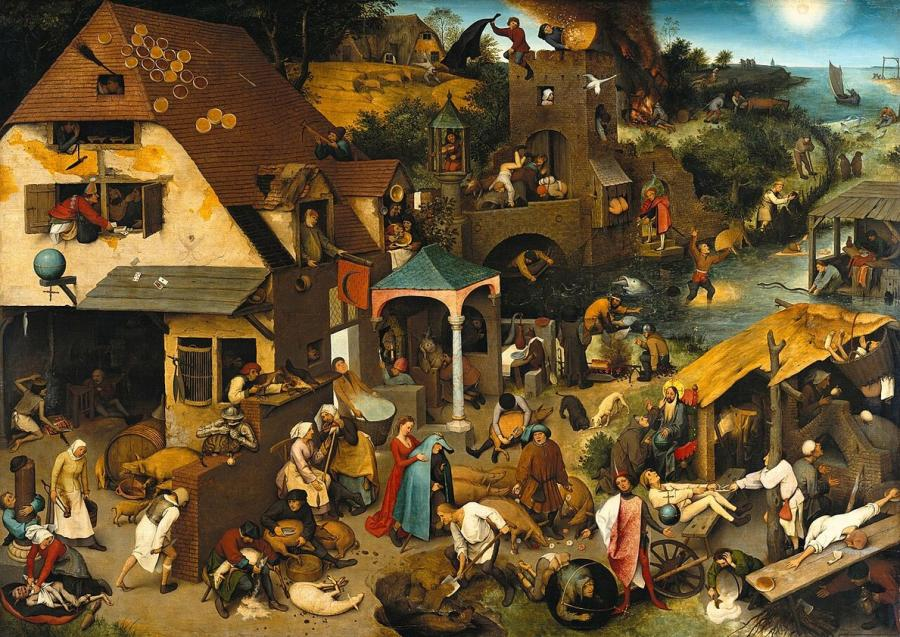
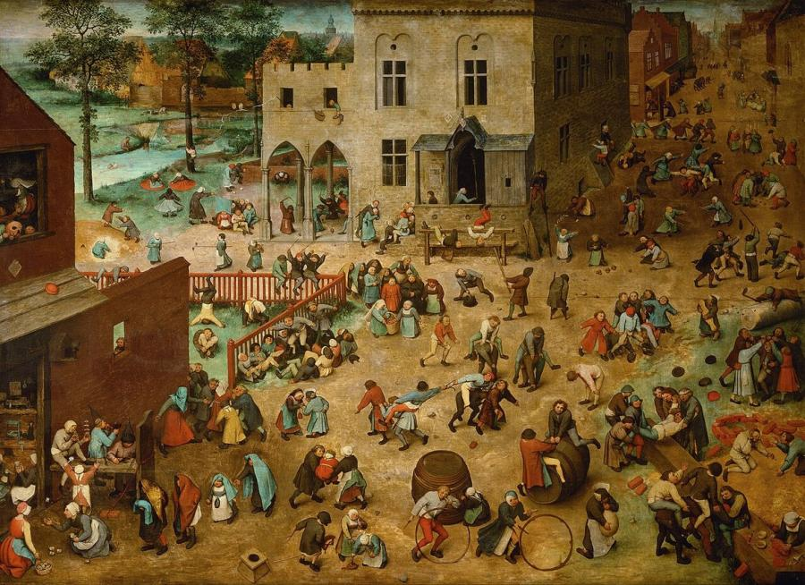
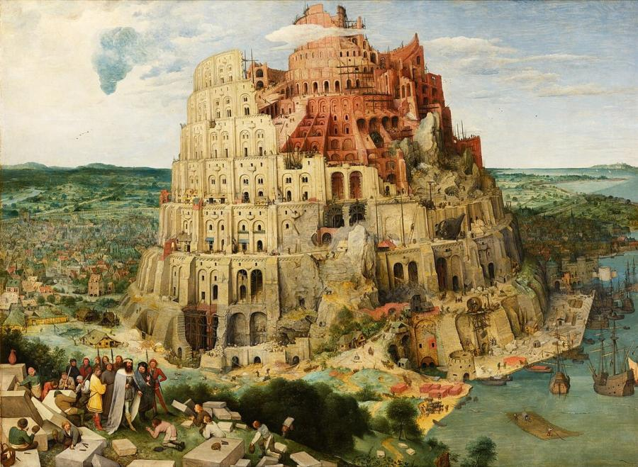
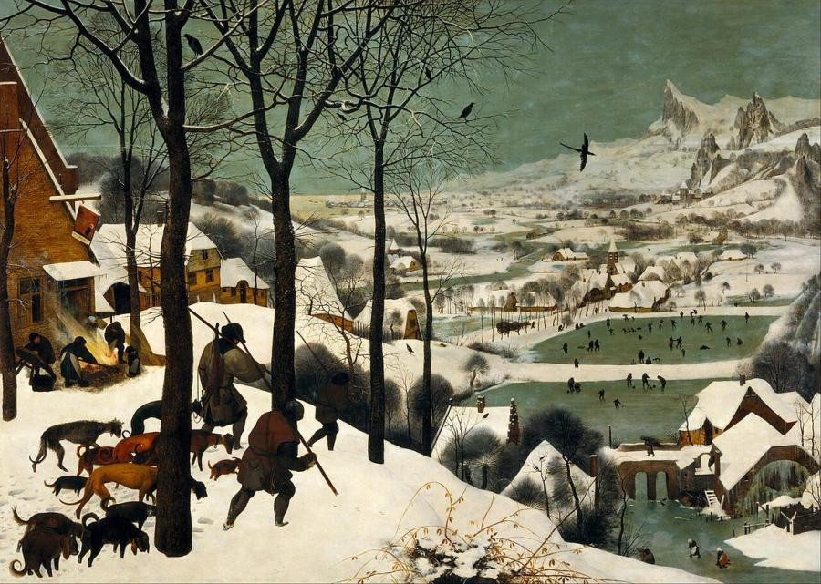
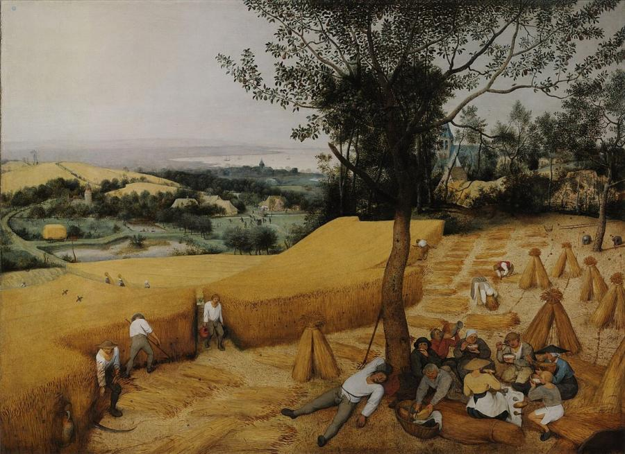
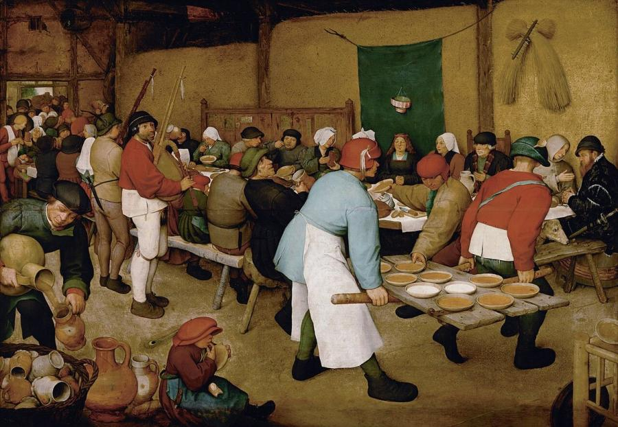

# Pieter Bruegel the Elder (c. 1525–1569)

> The great Flemish painter of peasant life and landscape, who filled his panels with crowds, proverbs and the turning of the seasons.

## Overview

Pieter Bruegel the Elder was the most important Netherlandish painter of the 16th century. He turned
away from saints and nobles and made ordinary people his subject: peasants working, feasting,
dancing and playing, set in sweeping landscapes that change with the seasons. His crowded panels
carry humour, moral warnings and sharp social observation, and they are some of the first great
landscape and genre paintings in Europe. Only about 40 of his paintings survive.

## Life

Little is certain about Bruegel's early life. He was probably born between 1525 and 1530, perhaps
near Breda in the Duchy of Brabant. In 1551 he became a master in the painters' guild of Antwerp, then
the richest trading city in northern Europe. The following year he set off for Italy, reaching Rome
and the far south. His drawings of the Alps on the way back fed the vast mountain views in his later
paintings.

Back in Antwerp he designed prints for the publisher Hieronymus Cock. Some were fantastic scenes in the
manner of Hieronymus Bosch, and they made his name. In 1563 he married Mayken Coecke, daughter of his
former teacher Pieter Coecke van Aelst, and moved to Brussels. There, in the last six years of his
life, he painted most of his masterpieces for collectors such as the merchant Nicolaes Jonghelinck
and Cardinal Granvelle.

According to the early biographer Karel van Mander, Bruegel and a friend dressed as peasants to join
village weddings and fairs, which is how he studied country life. He died in Brussels in September
1569. His two sons, Pieter Brueghel the Younger and Jan Brueghel the Elder, became successful
painters and founded a family dynasty that lasted for generations.

## Style & Technique

Bruegel often set his scenes from a high viewpoint, so that the eye can wander over dozens or
hundreds of small figures and episodes. His figures are sturdy and simplified, seen as types rather
than portraits, and often from behind. He worked in oil on oak panels, and sometimes in distemper
(glue-based paint) on linen.

His landscapes combine Flemish fields with imagined mountains, and capture the atmosphere of weather
and season as no one before him had. His pictures are often built around proverbs, games or Bible
stories retold in Flemish dress. He painted during the religious conflicts and Spanish repression that
led to the Dutch Revolt, and many scholars see hidden commentary on these events in his work.

## Legacy

Bruegel's sons copied and adapted his compositions for the rest of the century, spreading his
imagery widely. Dutch genre and landscape painters of the 17th century owe much to him. The
Kunsthistorisches Museum in Vienna holds the world's largest group of his paintings, a legacy of
Habsburg collectors. Poets such as W. H. Auden ("Musée des Beaux Arts") and William Carlos Williams
wrote about his pictures. *The Hunters in the Snow* has appeared in films by Andrei Tarkovsky and
Lars von Trier.

## Key Works

<!-- works:start -->

### 1. Netherlandish Proverbs (1559)

*Oil on oak panel, 117 × 163 cm · Gemäldegalerie, Berlin*

A village packed with people acting out more than 100 sayings, taken literally. A man bangs his head against a brick wall, another fills in the well after the calf has drowned, a woman ties the devil to a pillow. The painting is both a comic encyclopedia of folly and a portrait of a world turned upside down.

Image: [Wikimedia Commons](https://commons.wikimedia.org/wiki/File:Pieter_Brueghel_the_Elder_-_The_Dutch_Proverbs_-_Google_Art_Project.jpg) · Pieter Brueghel the Elder · Public domain

### 2. Children's Games (1560)

*Oil on oak panel, 118 × 161 cm · Kunsthistorisches Museum, Vienna*

Some 230 children fill a town square with about 80 games: leapfrog, hoops, stilts, blind man's buff, spinning tops, playing at weddings and processions. Seen from above, the crowded scene is a remarkable record of 16th-century play. It may also carry a moral: that adult affairs are just as foolish as a child's games.

Image: [Wikimedia Commons](https://commons.wikimedia.org/wiki/File:Pieter_Bruegel_the_Elder_-_Children%E2%80%99s_Games_-_Google_Art_Project.jpg) · Pieter Brueghel the Elder · Public domain

### 3. The Tower of Babel (1563)

*Oil on oak panel, 114 × 155 cm · Kunsthistorisches Museum, Vienna*

A colossal spiralling tower, modelled on Rome's Colosseum, rises above a Flemish harbour city. King Nimrod inspects the work in the foreground while hundreds of tiny labourers haul stone, operate cranes and build scaffolding. But the tower is already leaning, and its lower levels are crumbling before the top is finished: a warning about human pride.

Image: [Wikimedia Commons](https://commons.wikimedia.org/wiki/File:Pieter_Bruegel_the_Elder_-_The_Tower_of_Babel_(Vienna)_-_Google_Art_Project_-_edited.jpg) · Pieter Brueghel the Elder · Public domain

### 4. The Hunters in the Snow (1565)

*Oil on oak panel, 117 × 162 cm · Kunsthistorisches Museum, Vienna*

Three tired hunters and their dogs trudge home over a hill with a single fox to show for their day. Below, villagers skate on frozen ponds under a green-grey sky. It belongs to a series of six paintings of the seasons made for the Antwerp merchant Nicolaes Jonghelinck, and it is one of the most beloved winter scenes in art.

Image: [Wikimedia Commons](https://commons.wikimedia.org/wiki/File:Pieter_Bruegel_the_Elder_-_Hunters_in_the_Snow_(Winter)_-_Google_Art_Project.jpg) · Pieter Brueghel the Elder · Public domain

### 5. The Harvesters (1565)

*Oil on wood, 119 × 162 cm · Metropolitan Museum of Art, New York*

Another of the seasons series, showing late summer. Peasants scythe and bundle golden wheat while others rest under a pear tree to eat bread, porridge and cheese, one sprawled asleep. The landscape stretches to a hazy bay. It is one of the first great paintings of ordinary working life, with no religious or mythological story attached.

Image: [Wikimedia Commons](https://commons.wikimedia.org/wiki/File:Pieter_Bruegel_the_Elder-_The_Harvesters_-_Google_Art_Project.jpg) · Pieter Brueghel the Elder · Public domain

### 6. The Peasant Wedding (1567)

*Oil on oak panel, 114 × 164 cm · Kunsthistorisches Museum, Vienna*

A wedding feast in a barn: two men carry bowls of porridge on an unhinged door, a piper looks hungrily at the food, a child licks a plate clean. The bride sits beneath a paper crown in front of a green cloth, while the groom's identity is still debated. The painting is full of affectionate, comic detail, and it is one of the reasons for Bruegel's nickname "Peasant Bruegel".

Image: [Wikimedia Commons](https://commons.wikimedia.org/wiki/File:Pieter_Bruegel_the_Elder_-_Peasant_Wedding_-_Google_Art_Project_2.jpg) · Pieter Brueghel the Elder · Public domain

<!-- works:end -->
## Sources

- [Pieter Bruegel the Elder (Wikipedia)](https://en.wikipedia.org/wiki/Pieter_Bruegel_the_Elder)
- [The Hunters in the Snow (Wikipedia)](https://en.wikipedia.org/wiki/The_Hunters_in_the_Snow)
- [Netherlandish Proverbs (Wikipedia)](https://en.wikipedia.org/wiki/Netherlandish_Proverbs)
- Karel van Mander, *Schilder-boeck* (1604)
