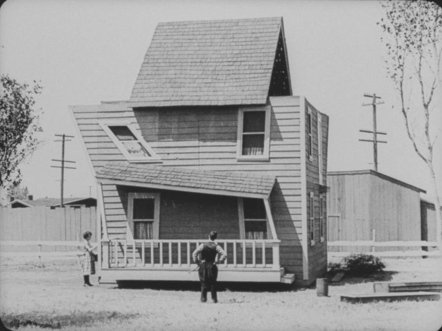
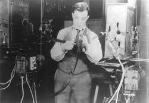
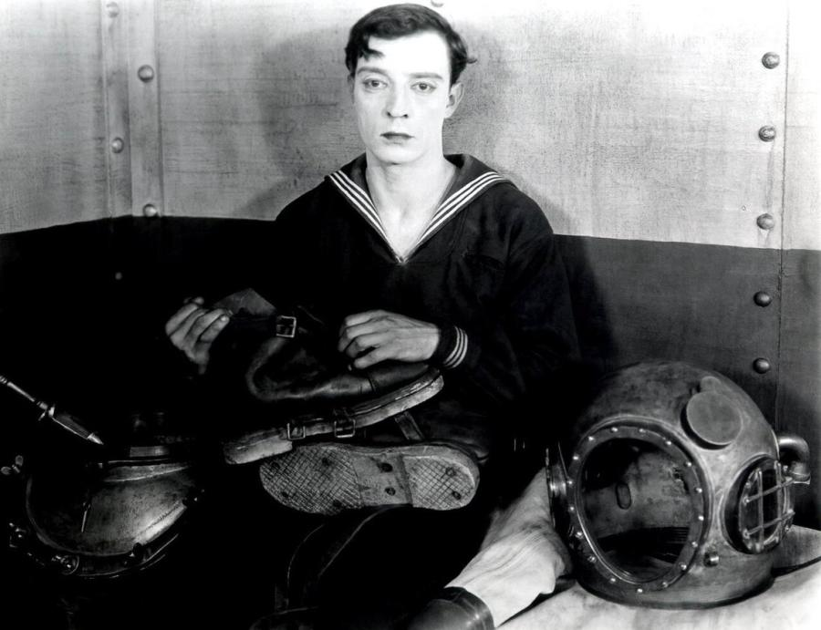
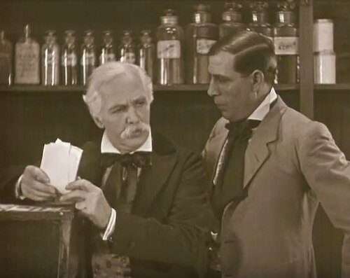
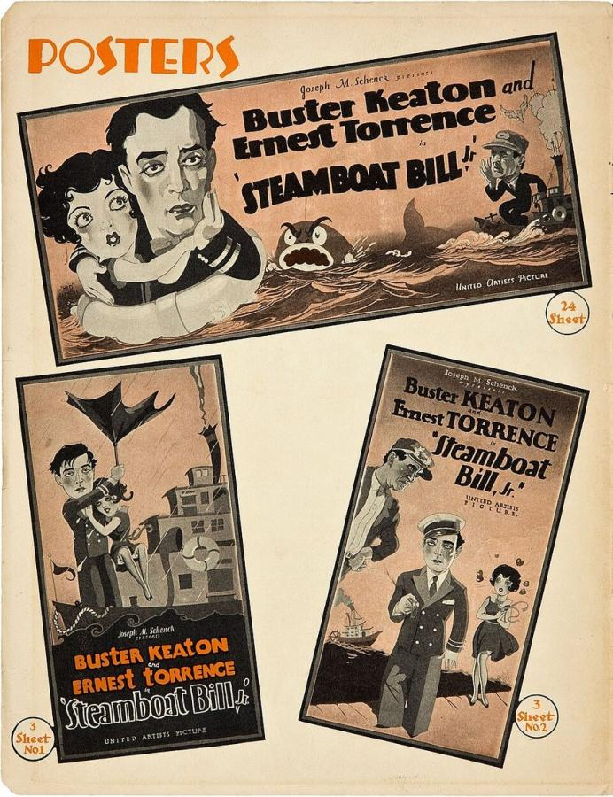

# Buster Keaton (1895–1966)

> The deadpan "Great Stone Face" of silent comedy, who wrote, directed and performed his own increasingly dangerous physical stunts in some of the era's most technically ambitious films.

## Overview

Buster Keaton was one of silent cinema's two great comic stars, alongside Charlie Chaplin, but built
his comedy on the opposite principle: an expressionless, unblinking face set against wildly
acrobatic, meticulously engineered physical stunts that he performed himself, often at genuine
personal risk. Across a run of shorts and features he wrote, directed and starred in during the
1920s, he turned trains, boats, houses and entire landscapes into elaborate mechanical props for
sight gags of a precision that still impresses stunt professionals a century later.

## Life

Keaton was born in 1895 into a vaudeville family and was performing on stage in the family act,
The Three Keatons, from the age of three, taking comic falls that built the physical control his
later film work depended on. He entered film in 1917 as a supporting player to Roscoe "Fatty"
Arbuckle, and by 1920 was writing, directing and starring in his own two-reel comedies, moving into
features with *Our Hospitality* (1923) and, across the mid-1920s, the run of films now considered
his finest work. *The General* (1926), now his most acclaimed film, was a costly box-office failure
on release, and by 1928 financial pressure pushed him into a contract with MGM that stripped him of
the creative control his best work had depended on. The following decade brought professional
decline, a difficult divorce, and alcoholism. From the 1950s, a new generation of critics and
filmmakers rediscovered his silent work, and Keaton, working again as an actor and consultant into
his final years, received an honorary Academy Award in 1959. He died of lung cancer in 1966.

## Style & Technique

Keaton's "Great Stone Face" persona, an expression that registers almost nothing even in the middle
of physical chaos, was itself a comic technique: the less his face reacted, the funnier and more
dangerous the surrounding disaster looked by contrast. He built gags around real, large-scale
mechanical objects, a house, a train, an ocean liner, rather than studio miniatures, and staged
stunts, most famously the collapsing building facade in *Steamboat Bill, Jr.*, with almost no
margin for error, trusting his own precisely measured mark on the ground rather than a stunt double
or special effect. In *Sherlock Jr.* he also used carefully calculated in-camera effects, rather than
editing tricks, to place himself convincingly inside a shifting dream of film scenes.

## Legacy

Keaton is now ranked with Chaplin as one of the two defining artists of silent-film comedy, and
*The General* regularly appears on lists of the greatest films ever made. His influence runs through
generations of physical comedians and stunt performers, including Jackie Chan, who has cited Keaton's
insistence on real, dangerous, camera-visible stunts as a direct model for his own work. Critical
rediscovery of his films from the 1950s onward, notably through James Agee's influential essay
"Comedy's Greatest Era" and later restoration efforts, restored Keaton's reputation after decades in
which his films had been eclipsed by Chaplin's more overtly sentimental fame.

## Key Works

<!-- works:start -->

### 1. One Week (1920)

*Silent film, black-and-white, 35mm, about 25 minutes · Comique Film Corporation, United States*

Keaton's first film as his own director, released just after he left Roscoe Arbuckle's unit to run his own studio: a newlywed couple try to assemble a mail-order build-it-yourself house from numbered parts that a jealous rival has secretly mislabelled, producing a lopsided, spinning structure. Its house-building gags set the template for the mechanically elaborate stunts of his features.

Image: [Wikimedia Commons](https://commons.wikimedia.org/wiki/File:Keaton_One_Week_1920.jpg) · Eddie Cline, Buster Keaton · Public domain

### 2. Sherlock Jr. (1924)

*Silent film, black-and-white, 35mm, about 45 minutes · Buster Keaton Productions, United States*

A film projectionist falls asleep and dreams himself into the movie he is screening, only to be thrown between rapidly changing film scenes, streets, cliffs, oceans, that shift under his feet with each cut. Achieved with precise in-camera measurements rather than trick editing, its dream sequence is still studied as one of cinema's most technically daring effects shots.

Image: [Wikimedia Commons](https://commons.wikimedia.org/wiki/File:Buster_keaton_in_sherlock_jr,_1924.jpg) · Buster Keaton; Metro Pictures Corporation · Public domain

### 3. The Navigator (1924)

*Silent film, black-and-white, 35mm, about 59 minutes · Buster Keaton Productions, United States*

Two pampered, helpless passengers find themselves alone aboard a huge ocean liner adrift at sea and must learn, through slapstick trial and error, to feed, navigate and defend themselves. Keaton's biggest commercial success of the 1920s, it turned an entire ocean liner, rented for the production, into a single elaborate comic prop.

Image: [Wikimedia Commons](https://commons.wikimedia.org/wiki/File:Buster_Keaton_in_The_Navigator.jpg) · Buster Keaton · Public domain

### 4. The General (1926)

*Silent film, black-and-white, 35mm, about 75 minutes · Buster Keaton Productions, United States*

A Confederate railway engineer chases his stolen locomotive, and the woman he loves, across Civil War battle lines in an action comedy built around full-scale trains rather than models, including a real locomotive plunged off a burning bridge, the most expensive single shot of the silent era. A box-office disappointment on release, it is now widely ranked among the greatest films ever made.

Image: [Wikimedia Commons](https://commons.wikimedia.org/wiki/File:The_General_18.jpg) · film screenshot (United Artists) · Public domain

### 5. Steamboat Bill, Jr. (1928)

*Silent film, black-and-white, 35mm, about 71 minutes · Buster Keaton Productions, United States*

A college dandy tries to win his riverboat-captain father's respect ahead of a cyclone that levels the town. Its climactic stunt, a two-ton house facade collapsing directly onto Keaton, who survives only because he is standing precisely where an open attic window will fall around him, is still cited as one of the most dangerous shots ever filmed, with almost no margin for error.

Image: [Wikimedia Commons](https://commons.wikimedia.org/wiki/File:Steamboat_Bill,_Jr._(United_Artists,_1928)._Pressbook_02.jpg) · United Artists · Public domain

<!-- works:end -->
## Sources

- [Buster Keaton (Wikipedia)](https://en.wikipedia.org/wiki/Buster_Keaton)
- [The General (1926 film) (Wikipedia)](https://en.wikipedia.org/wiki/The_General_(1926_film))
- [Sherlock Jr. (Wikipedia)](https://en.wikipedia.org/wiki/Sherlock_Jr.)
