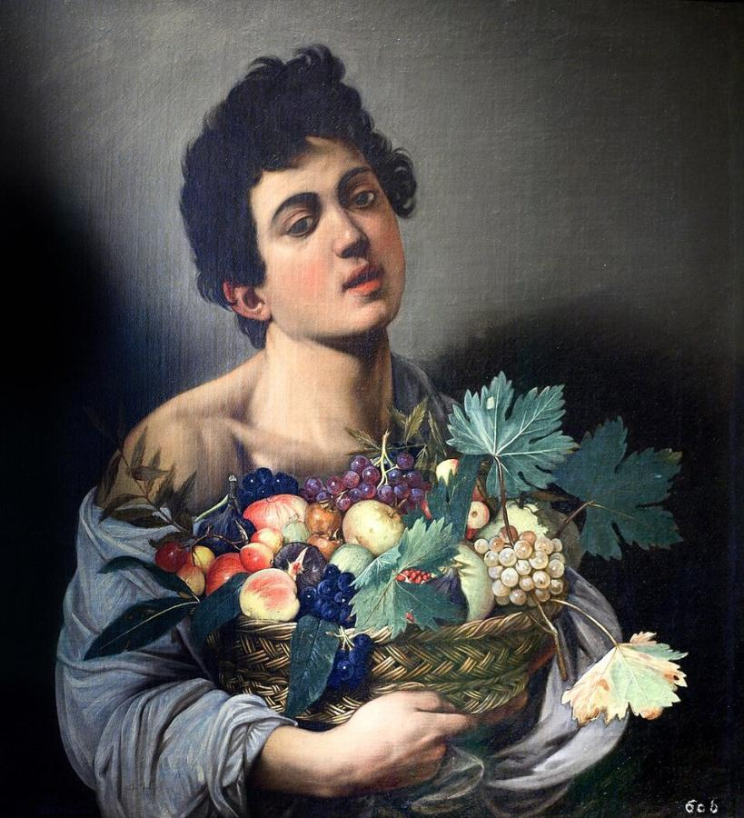
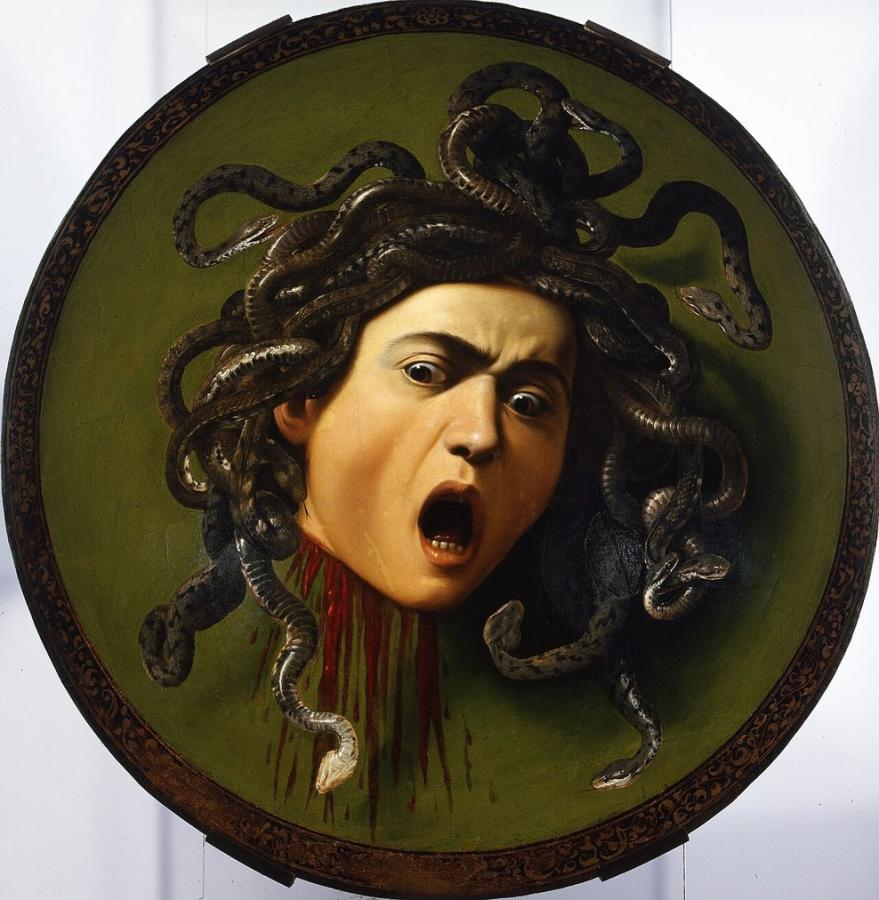
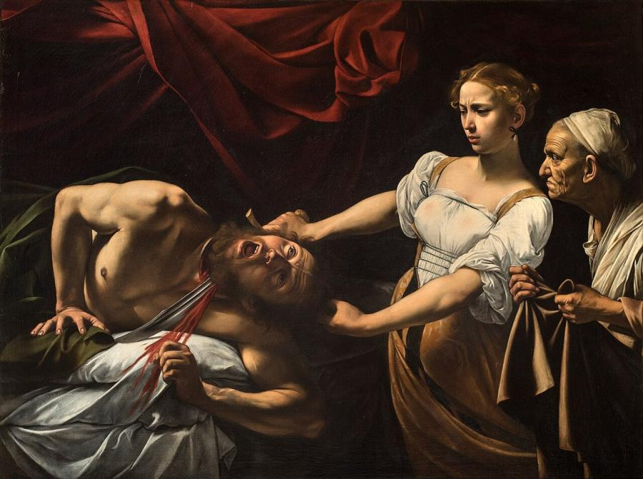
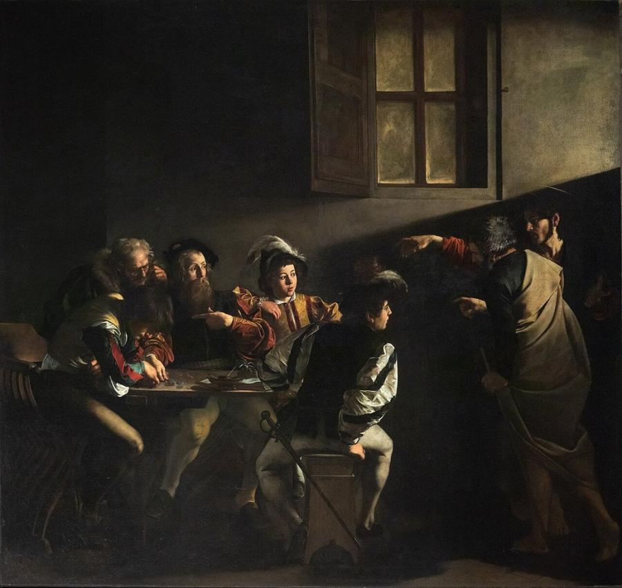
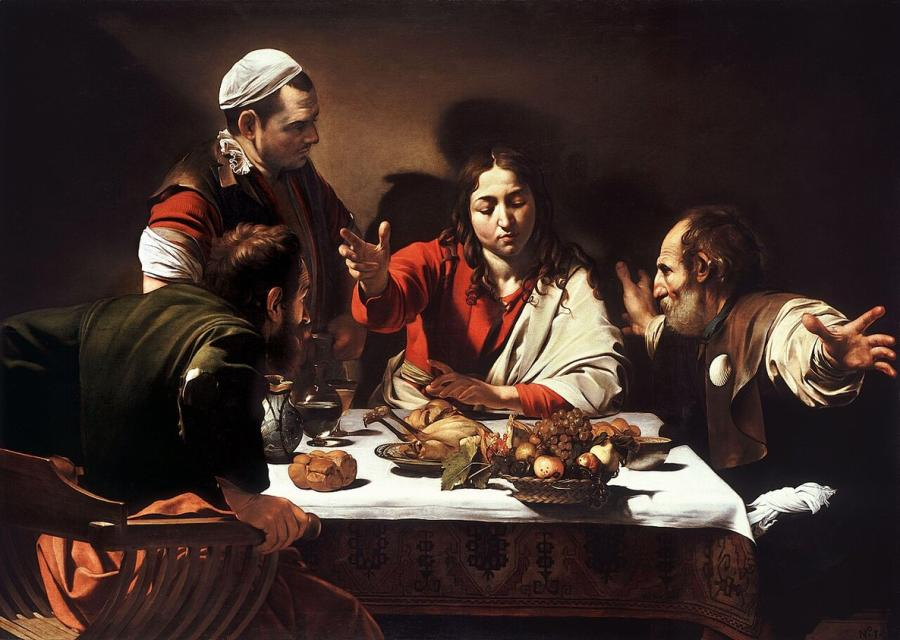
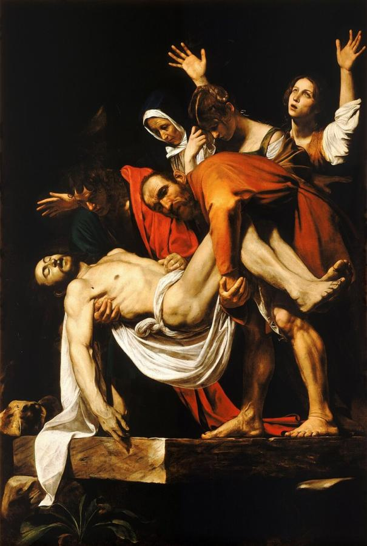

# Caravaggio (1571–1610)

> The rebel of Baroque Rome, whose dramatic light and street-level realism transformed European painting.

## Overview

Michelangelo Merisi, known as Caravaggio, burst onto the Roman art scene around 1600 with paintings of
startling realism. He painted saints and apostles using ordinary people as models: dirty feet, torn
clothes and all. He lit them with a harsh, theatrical light that plunged everything else into
darkness. This dramatic light and shadow, called *tenebrism*, and his directness shocked some patrons
and thrilled others. His turbulent, violent life ended at 38, but his influence spread across Europe
in a single generation.

## Life

Caravaggio was born in Milan in September 1571. His family came from the nearby town of Caravaggio,
which gave him his name. He lost his father to plague as a child and trained in Milan with the
painter Simone Peterzano. Around 1592 he arrived in Rome penniless, working in other painters'
studios, where he painted flowers and fruit, and selling small pictures of youths and still lifes.

Cardinal Francesco Maria del Monte, a sophisticated collector, took him into his household. In
1599–1600 Caravaggio won his first public commission, two large paintings of St Matthew for the
Contarelli Chapel in San Luigi dei Francesi. They caused a sensation. Commissions followed from
churches and wealthy collectors, although several altarpieces were rejected as indecorous.

His temper was as famous as his art. Police records list brawls, assaults and insults. In 1606 he
killed a man, Ranuccio Tomassoni, in a fight and fled Rome under sentence of death. He spent his last
years on the run, in Naples, Malta (where he was briefly made a Knight of the Order of St John before
being imprisoned and expelled) and Sicily. After being badly wounded in an attack in Naples, he set
off for Rome in 1610 hoping for a papal pardon. He died on the journey, at Porto Ercole in Tuscany,
in July 1610.

## Style & Technique

Caravaggio painted directly onto the canvas, apparently without preparatory drawings, working from
live models posed under a strong single light source. He sometimes scored outlines into the wet
ground with the end of his brush. His backgrounds are dark and bare, so the figures seem to push out
into the viewer's space.

He chose the moment of greatest drama: a conversion, a betrayal, a death. He showed it with
unidealised bodies and gestures. His religious paintings bring sacred events into the streets of
contemporary Rome. Late works, made in exile, grew sparer and darker, with small figures lost in
vast shadowy spaces.

## Legacy

Within a decade of his death, painters across Europe were imitating him. The "Caravaggisti" included
Orazio and Artemisia Gentileschi in Italy, Jusepe de Ribera in Naples, Georges de La Tour in France,
and the Utrecht painters Gerrit van Honthorst and Hendrick ter Brugghen. Through them his influence
reached Velázquez and Rembrandt. His reputation faded in later centuries, until a landmark 1951
exhibition in Milan revived it. Today he is one of the most popular of the Old Masters, and film
directors and photographers still borrow his dramatic lighting.

## Key Works

<!-- works:start -->

### 1. Boy with a Basket of Fruit (c. 1593)

*Oil on canvas, 70 × 67 cm · Galleria Borghese, Rome*

Painted soon after Caravaggio arrived in Rome, when he was selling pictures to survive. A young man with bare shoulder and parted lips holds a basket overflowing with grapes, peaches and figs. The fruit is painted with such botanical accuracy that its species can be identified, a sign of the young artist's commitment to painting straight from life.

Image: [Wikimedia Commons](https://commons.wikimedia.org/wiki/File:Boy_with_a_Basket_of_Fruit_by_Caravaggio.jpg) · Caravaggio · Public domain

### 2. Medusa (c. 1597)

*Oil on canvas mounted on a wooden shield, 60 × 55 cm · Uffizi Gallery, Florence*

Painted on a real parade shield as a gift for the Grand Duke of Tuscany, the Gorgon's severed head screams at the instant of death, blood spurting and snakes still writhing. Caravaggio probably used his own face as the model. The convex surface makes the head seem to jump forward.

Image: [Wikimedia Commons](https://commons.wikimedia.org/wiki/File:Caravaggio_-_Medusa_-_Google_Art_Project.jpg) · Caravaggio · Public domain

### 3. Judith Beheading Holofernes (c. 1598–1599)

*Oil on canvas, 145 × 195 cm · Galleria Nazionale d'Arte Antica (Palazzo Barberini), Rome*

The Jewish heroine Judith saws through the neck of the Assyrian general Holofernes, her face showing both determination and disgust. Her old maid waits eagerly with a sack. Against a black background and a blood-red curtain, the violence is shockingly direct. The picture helped establish Caravaggio's reputation for brutal realism.

Image: [Wikimedia Commons](https://commons.wikimedia.org/wiki/File:Caravaggio_-_Giuditta_e_Oloferne_(ca._1599).jpg) · Caravaggio · Public domain

### 4. The Calling of Saint Matthew (1599–1600)

*Oil on canvas, 322 × 340 cm · Contarelli Chapel, San Luigi dei Francesi, Rome*

Caravaggio's first public commission, and the painting that made him famous overnight. In a dim tax office, Christ enters from the right and points at Matthew, echoing God's hand in Michelangelo's *Creation of Adam*. A shaft of light cuts across the wall to single him out. Matthew, surrounded by men in modern Roman dress, gestures as if to say, "Who, me?"

Image: [Wikimedia Commons](https://commons.wikimedia.org/wiki/File:Caravaggio_%E2%80%94_The_Calling_of_Saint_Matthew.jpg) · Gleb Simonov · [CC0](http://creativecommons.org/publicdomain/zero/1.0/deed.en)

### 5. Supper at Emmaus (1601)

*Oil and tempera on canvas, 141 × 196 cm · National Gallery, London*

Two disciples realise that the stranger they have met on the road is the risen Christ. One pushes back his chair, the other flings his arms wide, and the gesture seems to break through the picture plane into our space. A basket of fruit teeters on the edge of the table, its shadow painted with eye-fooling realism.

Image: [Wikimedia Commons](https://commons.wikimedia.org/wiki/File:Supper_at_Emmaus-Caravaggio_(1601).jpg) · Caravaggio · Public domain

### 6. The Entombment of Christ (1603–1604)

*Oil on canvas, 300 × 203 cm · Vatican Museums (Pinacoteca), Vatican City*

Christ's body is lowered toward a stone slab whose sharp corner seems to project out toward the viewer, as if we stood inside the tomb. The mourners form a falling diagonal, from Mary Cleophas throwing up her arms down to the dead man's hand brushing the stone. Rubens, Géricault, Cézanne and many others made copies of it.

Image: [Wikimedia Commons](https://commons.wikimedia.org/wiki/File:The_Entombment_of_Christ-Caravaggio_(c.1602-3).jpg) · Caravaggio · Public domain

<!-- works:end -->
## Sources

- [Caravaggio (Wikipedia)](https://en.wikipedia.org/wiki/Caravaggio)
- [The Calling of Saint Matthew (Wikipedia)](https://en.wikipedia.org/wiki/The_Calling_of_Saint_Matthew)
- [National Gallery, London: Caravaggio](https://www.nationalgallery.org.uk/artists/michelangelo-merisi-da-caravaggio)
