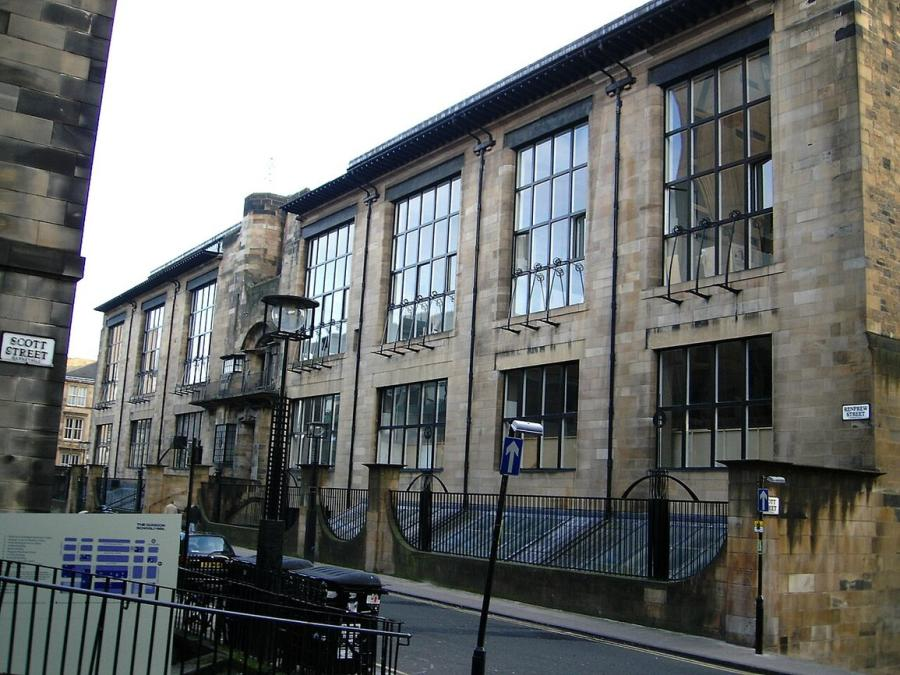
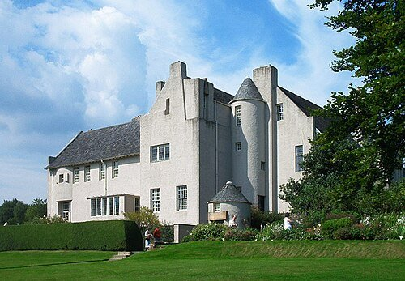
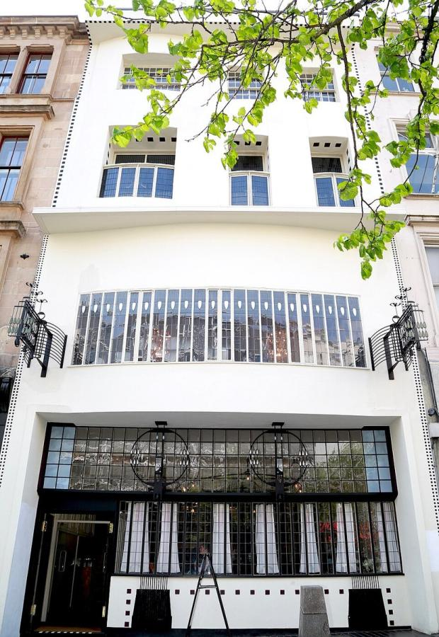
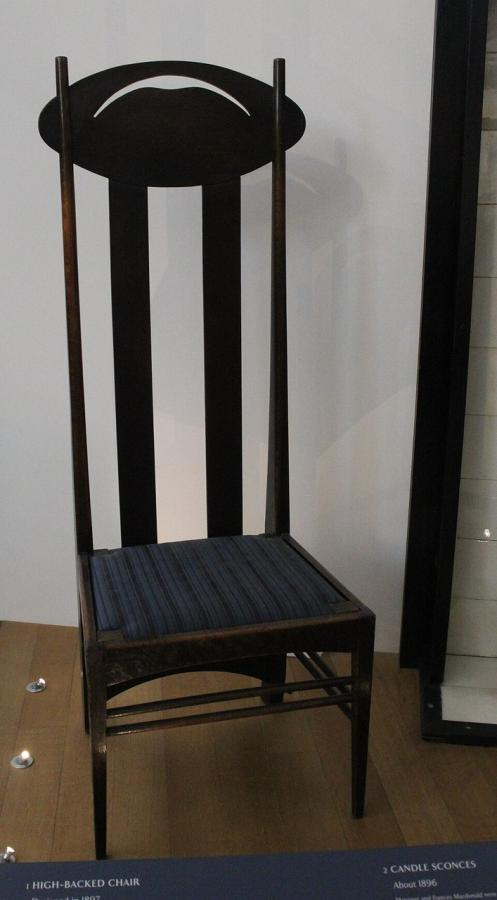
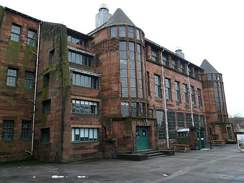

# Charles Rennie Mackintosh (1868–1928)

> The Glasgow architect-designer whose buildings, furniture and interiors, largely unrecognised in his own later career, became one of the defining styles of European Art Nouveau.

## Overview

Charles Rennie Mackintosh was the central figure of the "Glasgow Style," a distinctly Scottish strand
of Art Nouveau built on severe geometric form, tall vertical lines and restrained ornament, applied
across architecture, furniture and interior design as a single integrated art. His most celebrated
building, the Glasgow School of Art, and his total interior schemes for private houses and tearooms
made him a significant influence on continental European design even as his career in Britain
struggled after 1910, and he spent his final years painting watercolours rather than designing
buildings.

## Life

Mackintosh was born in Glasgow in 1868 and trained as an architect while attending evening classes at
the Glasgow School of Art, where he met his future wife, the artist Margaret Macdonald; together with
her sister Frances and Frances's husband Herbert MacNair, they became known as "The Four," developing
a shared symbolist decorative style. Working for the Glasgow firm Honeyman and Keppie, Mackintosh won
the competition to design a new building for his own art school in 1896, and its completion in 1909
established his reputation. He designed several private houses, tearooms and a school in and around
Glasgow over the following decade, always in close collaboration with Margaret Macdonald on
furnishings and decoration. Commissions dried up after around 1910, partly through changing taste and
partly through his own uncompromising manner with clients, and by 1914 he had left Glasgow for
England. In the 1920s he and Margaret settled in the south of France, where he largely abandoned
architecture and design for landscape watercolours. He returned to London for cancer treatment and
died there in 1928, in relative obscurity and financial hardship.

## Style & Technique

Mackintosh treated a building, its furniture and its decoration as a single design problem rather
than separate disciplines, working out room proportions, light fittings, stencilled wall patterns and
chair silhouettes together as one composition. His furniture, especially his towering ladder-back
chairs, often prioritised a striking vertical silhouette that shaped the feeling of a room over
conventional comfort, treating a chair as a piece of spatial design as much as a seat. Restrained,
geometric ornament, stylised roses, grids of glazing bars, contrasted with the more overtly organic,
curving forms typical of French and Belgian Art Nouveau, giving the Glasgow Style its more austere,
architectural character.

## Legacy

Mackintosh found greater recognition on the European continent during his own lifetime than at home:
his work was exhibited at the 1900 Vienna Secession show and directly influenced Josef Hoffmann and
the Wiener Werkstätte. Largely forgotten in Britain by the time of his death, he was rediscovered by
architectural historians from the mid-twentieth century onward and is now regarded as one of the most
important European architect-designers of his generation. The 2014 and 2018 fires at the Glasgow
School of Art, destroying much of his most celebrated interior, were treated as a major cultural loss
in Scotland and remain the subject of ongoing conservation and rebuilding work.

## Key Works

<!-- works:start -->

### 1. Glasgow School of Art (1897–1909)

*Sandstone, iron and timber, built in two phases · Glasgow, Scotland*

Mackintosh's masterpiece and, at the time, an almost unknown young architect's first major commission, won through an anonymous competition. Its severe stone facades and soaring, timber-lined library interior fused Scottish baronial tradition with an entirely original Art Nouveau vocabulary. Two catastrophic fires, in 2014 and 2018, destroyed much of the original library and interior, a loss still being assessed and, in part, rebuilt.

Image: [Wikimedia Commons](https://commons.wikimedia.org/wiki/File:Schoolofart1.jpg) · No machine-readable author provided. Twid assumed (based on copyright claims). · [CC BY-SA 3.0](http://creativecommons.org/licenses/by-sa/3.0/)

### 2. Hill House (1902–1904)

*Roughcast render over stone, with integrated interior furnishings · Helensburgh, Scotland*

A private house for the publisher Walter Blackie, designed down to its furniture, light fittings and stencilled wall decoration as a single unified scheme. Considered Mackintosh's finest domestic building, it is now protected under a giant steel "box" and rain shield while conservators address decades of water damage to its experimental cement render.

Image: [Wikimedia Commons](https://commons.wikimedia.org/wiki/File:HillHouse.jpg) · [CC BY-SA 2.5](https://creativecommons.org/licenses/by-sa/2.5)

### 3. Willow Tearooms (1903)

*Timber, leaded glass and gesso panels · Sauchiehall Street, Glasgow, Scotland*

Designed for the entrepreneur Catherine Cranston down to the cutlery and waitress uniforms, its "Room de Luxe" salon is lined with silvered high-backed chairs and leaded mirror glass. It is the most complete surviving example of the total interior environments Mackintosh and his wife, the artist Margaret Macdonald, designed together for Cranston's chain of tearooms.

Image: [Wikimedia Commons](https://commons.wikimedia.org/wiki/File:Mackintosh_At_The_Willow.jpg) · JJCMarshall · [CC BY-SA 4.0](https://creativecommons.org/licenses/by-sa/4.0)

### 4. High-backed chair (c. 1900–1904)

*Ebonised oak · Designed for the Argyle Street and Ingram Street tearooms, Glasgow, Scotland*

An elongated ladder-back chair whose towering rear rail was designed as much to define and divide a room visually as to be sat in comfortably. Variants of this silhouette became Mackintosh's most widely recognised design and one of the signature furniture forms of the Glasgow Style.

Image: [Wikimedia Commons](https://commons.wikimedia.org/wiki/File:High-backed_chair_by_Charles_Rennie_Mackintosh,_V%26A_London.jpg) · 14GTR · [CC0](http://creativecommons.org/publicdomain/zero/1.0/deed.en)

### 5. Scotland Street School (1903–1906)

*Sandstone with twin glazed stair towers · Glasgow, Scotland*

A working elementary school built around two dramatic glass-fronted stair towers that flood the interior with light, a functional solution Mackintosh turned into the building's defining visual feature. It operated as a school until 1979 and is now a museum of Scottish education.

Image: [Wikimedia Commons](https://commons.wikimedia.org/wiki/File:Scotland_Street_school_museum_-_geograph.org.uk_-_1190061.jpg) · Dave Forrest · [CC BY-SA 2.0](https://creativecommons.org/licenses/by-sa/2.0)

<!-- works:end -->
## Sources

- [Charles Rennie Mackintosh (Wikipedia)](https://en.wikipedia.org/wiki/Charles_Rennie_Mackintosh)
- [Glasgow School of Art (Wikipedia)](https://en.wikipedia.org/wiki/Glasgow_School_of_Art)
- [Hill House, Helensburgh (Wikipedia)](https://en.wikipedia.org/wiki/Hill_House,_Helensburgh)
