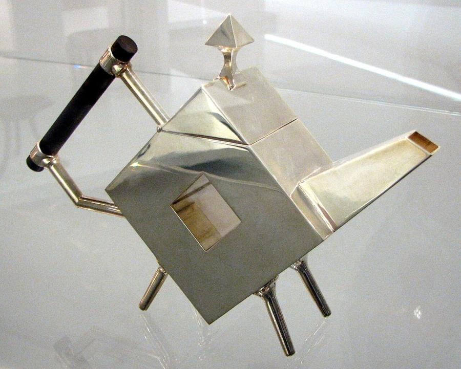
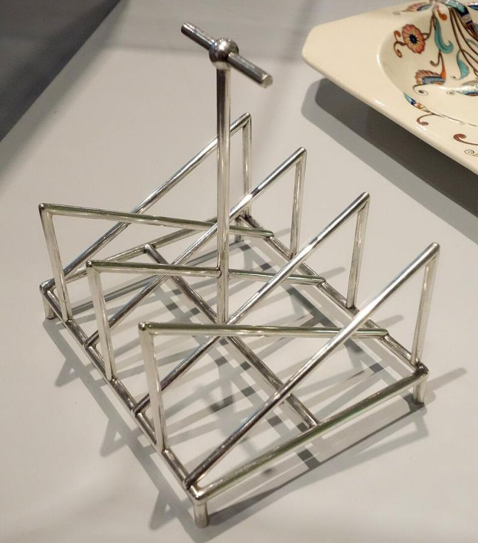
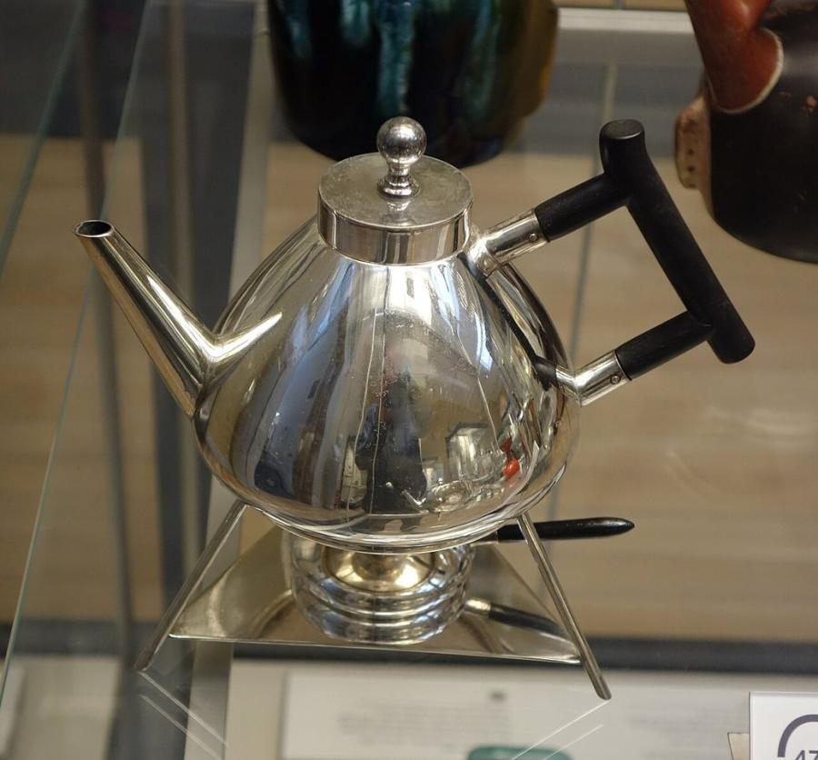
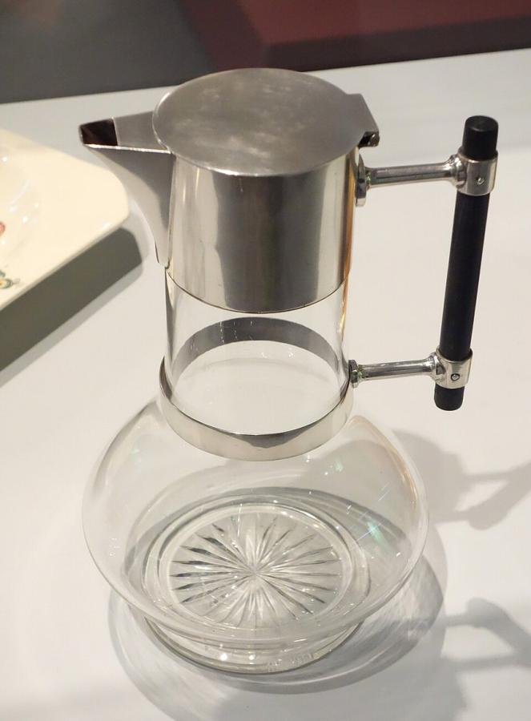
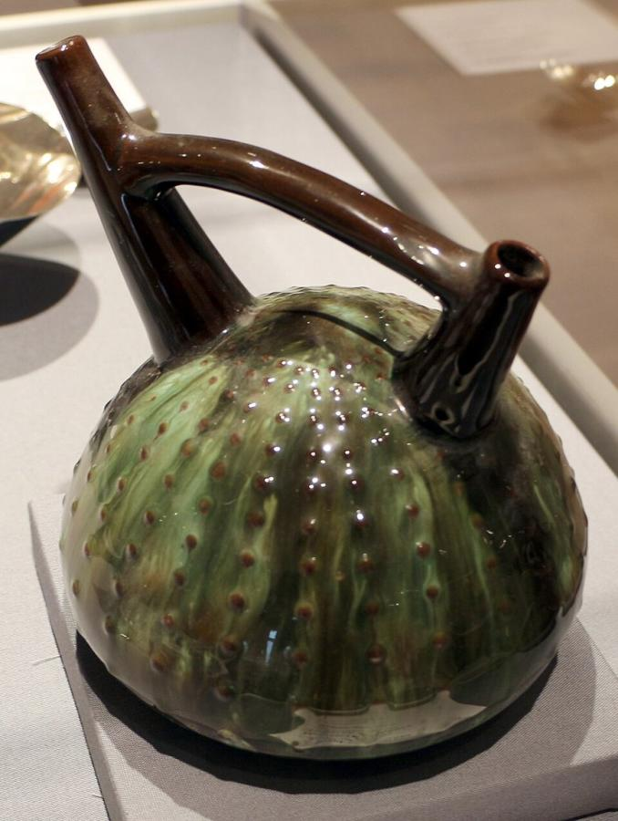

# Christopher Dresser (1834–1904)

> A botanist turned industrial designer whose radically geometric silverware and ceramics anticipated 20th-century modernism by decades.

## Overview

Christopher Dresser is now regarded as one of the first modern industrial designers, a figure who
worked as an independent design consultant across dozens of manufacturers and materials, metalwork,
ceramics, glass, textiles, decades before that way of working became standard practice. Trained
first as a botanist, he built an entire design theory on the underlying geometric structure of
plants rather than their decorative surface, producing objects so stripped of ornament that many
look, to modern eyes, startlingly ahead of their time.

## Life

Dresser was born in Glasgow in 1834 and trained at the Government School of Design in London,
where his early ambitions leaned toward botany rather than design; he lectured on botany and, in
1859, received an honorary doctorate from the University of Jena for his research into plant
structure. He shifted fully into design in the 1860s, publishing influential theoretical books,
*The Art of Decorative Design* (1862) and *Principles of Decorative Design* (1873), that argued
ornament should follow the underlying structural logic of natural forms rather than copy their
surface appearance. In 1876 and 1877 he travelled to Japan, one of the first Western designers to do
so, partly on commission from Tiffany & Co. to report on Japanese art and manufacturing; the trip
reshaped his sense of asymmetry, restraint and structural honesty for the rest of his career. He
designed prolifically for manufacturers including Minton, Wedgwood, Coalbrookdale, Hukin & Heath and
James Dixon & Sons, and served as art director of the Linthorpe Art Pottery, until his death in 1904.

## Style & Technique

Where William Morris, his contemporary, based ornament on naturalistic copies of plant forms,
Dresser worked the opposite way, reducing plants and shells to their underlying geometric structure
and building objects from that abstraction rather than from decorative imitation. He embraced
industrial materials and mass-production methods, electroplating, moulded earthenware, that many
reform-minded designers of his generation rejected, seeing no conflict between good design and the
machine. His study of Japanese design reinforced this instinct toward asymmetry, negative space and
visible function over applied decoration, producing angular teapots, kettles and vases that read as
strikingly modern even now.

## Legacy

Long overshadowed in design history by William Morris and the more overtly craft-based wing of the
Aesthetic Movement, Dresser has been substantially rediscovered since the late twentieth century, and
major retrospectives have presented his most radical metalwork as a direct ancestor of modernist
industrial design. His insistence that a mass-manufactured object could be both functional and
beautiful, without applied ornament to justify it, anticipated design principles usually credited to
the Bauhaus a generation later.

## Key Works

<!-- works:start -->

### 1. Electroplated teapot (1879)

*Silver-plated metal and ebony · Manufactured by James Dixon & Sons, Sheffield, England*

A geometric, faceted teapot so stripped of ornament that it is still routinely mistaken for a much later, mid-20th-century object. Its angular silhouette and ebony insulated handle put function ahead of any decorative flourish, decades before "form follows function" became a slogan of modernist design.

Image: [Wikimedia Commons](https://commons.wikimedia.org/wiki/File:Christopher_Dresser_-_Teapot_-_1879.jpg) · [CC BY-SA 3.0](https://creativecommons.org/licenses/by-sa/3.0)

### 2. Toast rack (c. 1880)

*Silver · Manufactured by Tiffany & Co., New York*

A rack of slotted silver fins holding toast upright, reduced to the simplest structural shape that will do the job, with no applied ornament at all. Dresser designed for manufacturers on both sides of the Atlantic, and pieces like this show how thoroughly his geometric vocabulary could travel across markets and materials.

Image: [Wikimedia Commons](https://commons.wikimedia.org/wiki/File:Toast_Rack_by_Christopher_Dresser_(1834-1904),_made_by_Tiffany_%26_Co.,_New_York,_c._1880,_silver_-_Brooklyn_Museum_-_Brooklyn,_NY_-_DSC08876.JPG) · Daderot · [CC0](http://creativecommons.org/publicdomain/zero/1.0/deed.en)

### 3. Electroplate kettle and stand (1878)

*Electroplated metal and ebony · Manufactured by Hukin & Heath, Birmingham, England*

A kettle on a tripod stand designed for mass production by electroplating, one of the first designs Dresser registered after Japanese design principles, simplicity, asymmetry, structural honesty, reshaped his sense of ornament following his 1876–77 study trip to Japan.

Image: [Wikimedia Commons](https://commons.wikimedia.org/wiki/File:Electroplate_kettle_and_stand_with_burner,_designed_by_Christopher_Dresser,_made_by_Hukin_%26_Heath,_design_registered_May_6,_1878_-_British_Museum_-_DSC00162.jpg) · Daderot · [CC0](http://creativecommons.org/publicdomain/zero/1.0/deed.en)

### 4. Decanter (c. 1881)

*Glass, silver and ebonised wood · Manufactured by Hukin & Heath, Birmingham, England*

A claret decanter built around a plain glass cylinder cradled in a silver frame, its stability and pouring action worked out as an engineering problem rather than decorated after the fact. Dresser designed dozens of variations on this glass-and-metal claret jug format for several manufacturers.

Image: [Wikimedia Commons](https://commons.wikimedia.org/wiki/File:Decanter_by_Christopher_Dresser_(1834-1904),_made_by_Hukin_%26_Heath_(1878-1887),_Birmingham,_England,_designed_c._1881,_glass,_silver,_ebonized_wood_-_Brooklyn_Museum_-_Brooklyn,_NY_-_DSC08879.JPG) · Daderot · [CC0](http://creativecommons.org/publicdomain/zero/1.0/deed.en)

### 5. Linthorpe "sea urchin" vase (1879–1892)

*Glazed earthenware · Linthorpe Art Pottery, Middlesbrough, England*

Dresser served as art director of the Linthorpe Art Pottery, designing organic, asymmetrical forms finished in dripping, mixed glazes that let each piece vary slightly in the kiln. Shapes like this one, echoing gourds, shells and sea creatures, drew on his early training as a botanist as much as on Japanese ceramic traditions.

Image: [Wikimedia Commons](https://commons.wikimedia.org/wiki/File:Christopher_dresser_per_linthorpe_art_pottery,_contenitore_sea_urchin,_linthorpe_UK_1879-92.jpg) · Sailko · [CC BY 3.0](https://creativecommons.org/licenses/by/3.0)

<!-- works:end -->
## Sources

- [Christopher Dresser (Wikipedia)](https://en.wikipedia.org/wiki/Christopher_Dresser)
- [Linthorpe Pottery (Wikipedia)](https://en.wikipedia.org/wiki/Linthorpe_Pottery)
