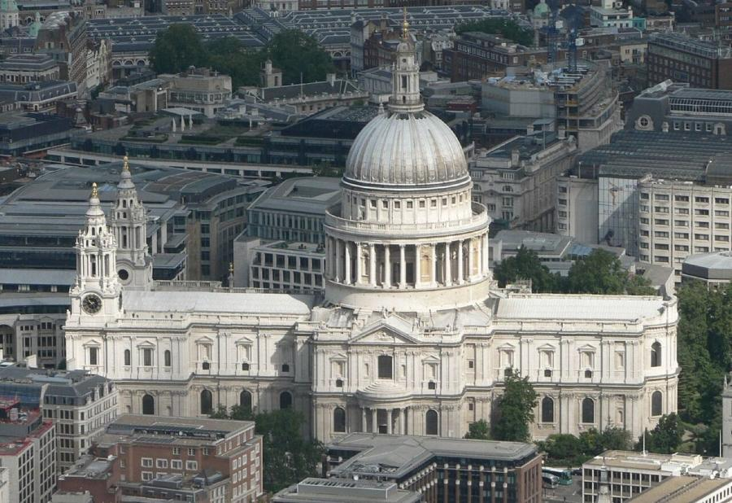
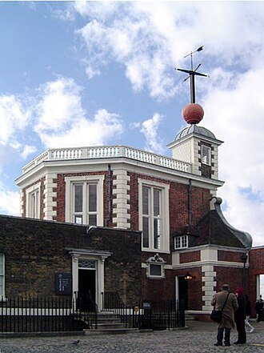
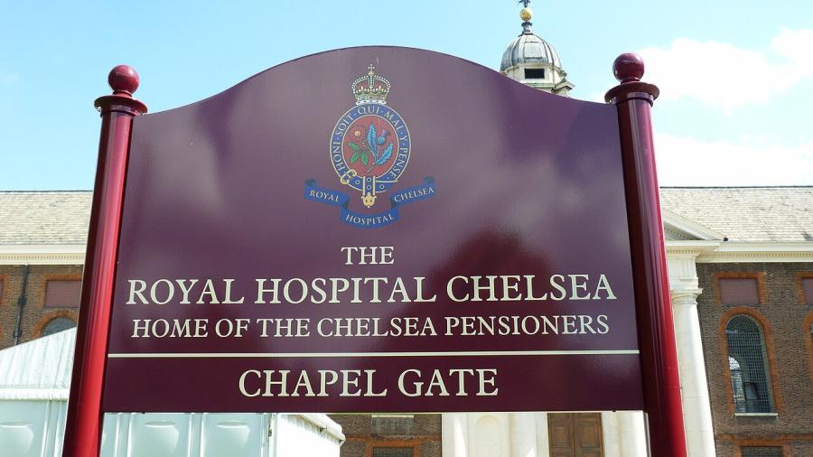
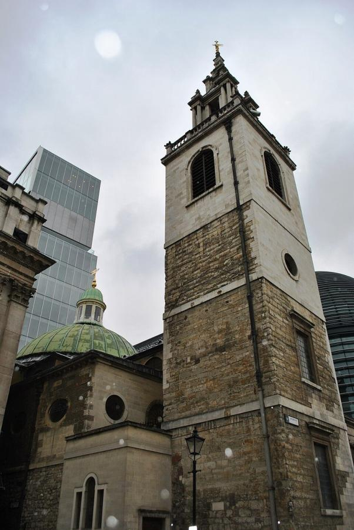
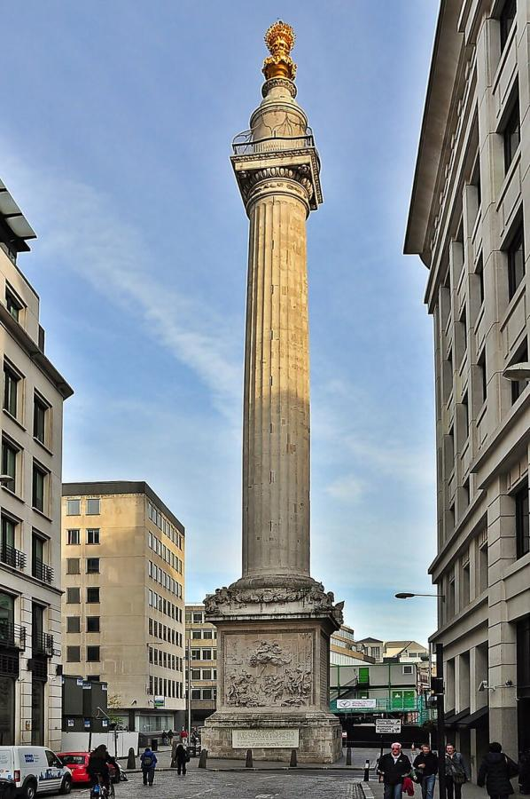

# Christopher Wren (1632–1723)

> The scientist turned architect who rebuilt London's skyline after the Great Fire, above all in the dome of St Paul's Cathedral.

## Overview

Christopher Wren came to architecture unusually late and by an unusual route: as one of the leading
mathematicians and astronomers of Restoration England, a founder of the Royal Society, before the
Great Fire of London in 1666 handed him the chance to rebuild much of the City almost from scratch.
Over the following decades he designed more than fifty parish churches and, above all, a new St
Paul's Cathedral, whose triple-shell dome remains one of the most admired pieces of structural
engineering in architectural history.

## Life

Wren was born in 1632 in East Knoyle, Wiltshire, the son of a clergyman who would become Dean of
Windsor. A gifted student at Westminster School and Wadham College, Oxford, he was appointed
professor of astronomy at Gresham College in London at just 25, then Savilian Professor of Astronomy
at Oxford. He was a founding member of the Royal Society in 1662 and later served as its president.
His architectural career began with the Sheldonian Theatre in Oxford and a proposed restoration of
old St Paul's Cathedral; the Great Fire of September 1666, which destroyed the cathedral along with
most of the City, changed the scale of the task entirely. Appointed Surveyor of the King's Works in
1669, Wren spent the rest of his working life on the City's parish churches and on St Paul's, which
was finally completed in 1710. He died in 1723, aged 90, and is buried in the cathedral's crypt
beneath a Latin epitaph that translates as "Reader, if you seek his monument, look around you."

## Style & Technique

Wren fused the classical vocabulary of Inigo Jones and Palladio with elements drawn from French and
Italian Baroque architecture he studied on a research trip to Paris, the only time he travelled
outside England. His scientific training shows most clearly in St Paul's dome, engineered as three
independent shells nested inside one another so that its exterior profile, interior coffered
ceiling, and structural core could each be optimised separately, a solution more sophisticated than
any single-shell dome before it. In his City churches, working on cramped and irregular medieval
plots, he treated each floor plan as a fresh geometric problem rather than repeating a single
template.

## Legacy

St Paul's Cathedral became a symbol of London's endurance, especially after photographs of its dome
rising intact above the smoke of the Blitz in 1940 circulated worldwide. Many of Wren's City
churches were later damaged or demolished, by Victorian redevelopment and then German bombing, but
a substantial number still stand and function as parish churches. He is generally regarded as
England's greatest architect, and his integration of scientific reasoning with architectural design
influenced generations of British engineers and builders who followed him.

## Key Works

<!-- works:start -->

### 1. St Paul's Cathedral (1675–1710)

*Portland stone, with a triple-shell lead-covered dome · Ludgate Hill, City of London, England*

Wren's masterpiece and the building he spent 35 years on, rising on the site of a medieval cathedral gutted in the Great Fire of London. Its dome is really three shells in one: a shallow inner dome seen from the floor, a hidden brick cone that carries the real structural load, and a tall outer dome of timber and lead that gives St Paul's its skyline silhouette. Wren's son laid the final stone in 1710.

Image: [Wikimedia Commons](https://commons.wikimedia.org/wiki/File:St_Pauls_aerial_(cropped).jpg) · Mark Fosh · [CC BY 2.0](https://creativecommons.org/licenses/by/2.0)

### 2. Royal Observatory, Greenwich (1675–1676)

*Brick with stone dressings, built partly from recycled materials from a demolished fort · Greenwich Park, London, England*

Built in under a year for the newly created post of Astronomer Royal, John Flamsteed, on the foundations of an old fort in Greenwich Park. Wren, himself a former professor of astronomy, oriented the main hall along a north-south meridian; the site later gave its name to Greenwich Mean Time and the line of zero longitude.

Image: [Wikimedia Commons](https://commons.wikimedia.org/wiki/File:Royal_observatory_greenwich.jpg) · [CC BY-SA 3.0](http://creativecommons.org/licenses/by-sa/3.0/)

### 3. Royal Hospital Chelsea (1682–1692)

*Brick with stone dressings around three courtyards · Chelsea, London, England*

A retirement and nursing home for army veterans, commissioned by Charles II and modelled loosely on Les Invalides in Paris, arranged around three plain, dignified brick courtyards rather than a single showpiece facade. It still houses several hundred retired soldiers, known as Chelsea Pensioners, who continue to wear the scarlet coats introduced in Wren's time.

Image: [Wikimedia Commons](https://commons.wikimedia.org/wiki/File:The_Royal_Hospital_Chelsea_(1).jpg) · Colin McLaughlin · [CC0](http://creativecommons.org/publicdomain/zero/1.0/deed.en)

### 4. St Stephen Walbrook (1672–1679)

*Stone piers and a coffered dome on a wooden frame · Walbrook, City of London, England*

One of more than fifty City parish churches Wren rebuilt after the Great Fire, squeezed onto an awkward, irregular plot yet crowned with a coffered dome carried on slender Corinthian columns, widely read as his working study for the dome of St Paul's, then still on the drawing board a few streets away.

Image: [Wikimedia Commons](https://commons.wikimedia.org/wiki/File:St_Stephen_Walbrook_20130324_033.jpg) · Elisa.rolle · [CC BY-SA 4.0](https://creativecommons.org/licenses/by-sa/4.0)

### 5. The Monument to the Great Fire of London (1671–1677)

*Portland stone Doric column with an internal spiral staircase · Monument Street, City of London, England*

A fluted Doric column raised, with Robert Hooke, near the bakery where the Great Fire of 1666 began, its height of 202 feet equal to its exact distance from the fire's starting point. A gilded urn of flames tops the column, and 311 steps of an internal spiral staircase lead to a viewing platform still open to the public.

Image: [Wikimedia Commons](https://commons.wikimedia.org/wiki/File:The_Monument_to_the_Great_Fire_of_London.JPG) · Eluveitie · [CC BY-SA 3.0](https://creativecommons.org/licenses/by-sa/3.0)

<!-- works:end -->
## Sources

- [Christopher Wren (Wikipedia)](https://en.wikipedia.org/wiki/Christopher_Wren)
- [St Paul's Cathedral (Wikipedia)](https://en.wikipedia.org/wiki/St_Paul%27s_Cathedral)
- [Monument to the Great Fire of London (Wikipedia)](https://en.wikipedia.org/wiki/Monument_to_the_Great_Fire_of_London)
