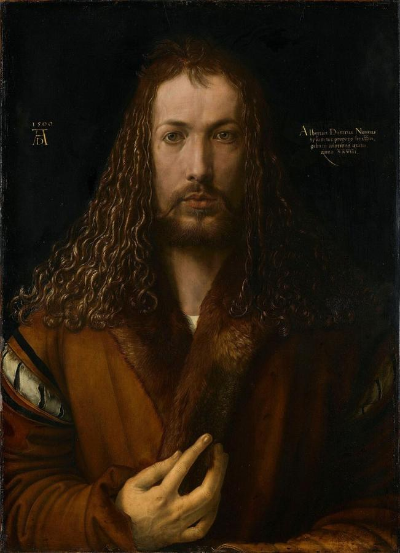
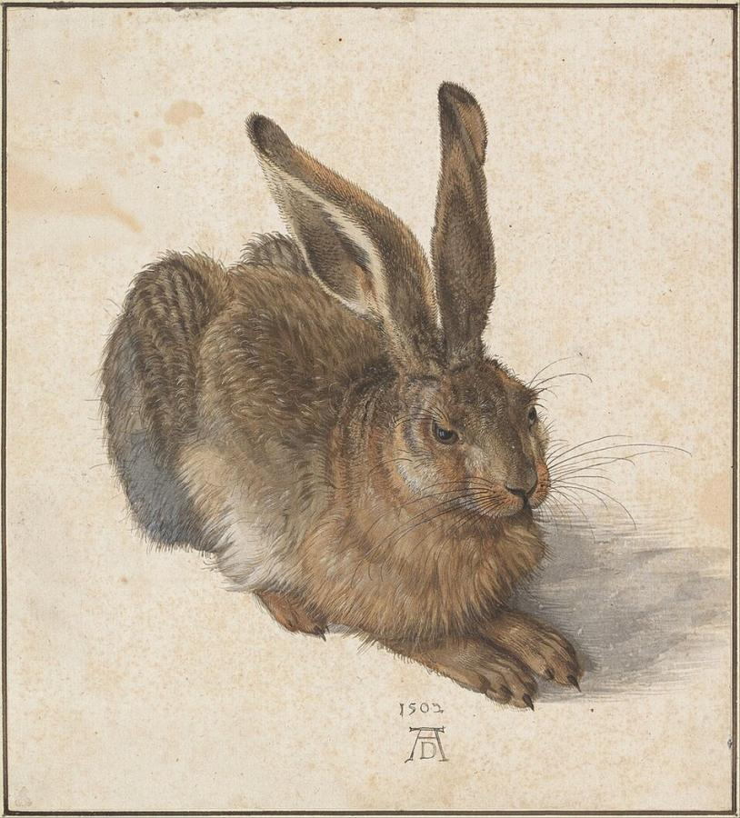
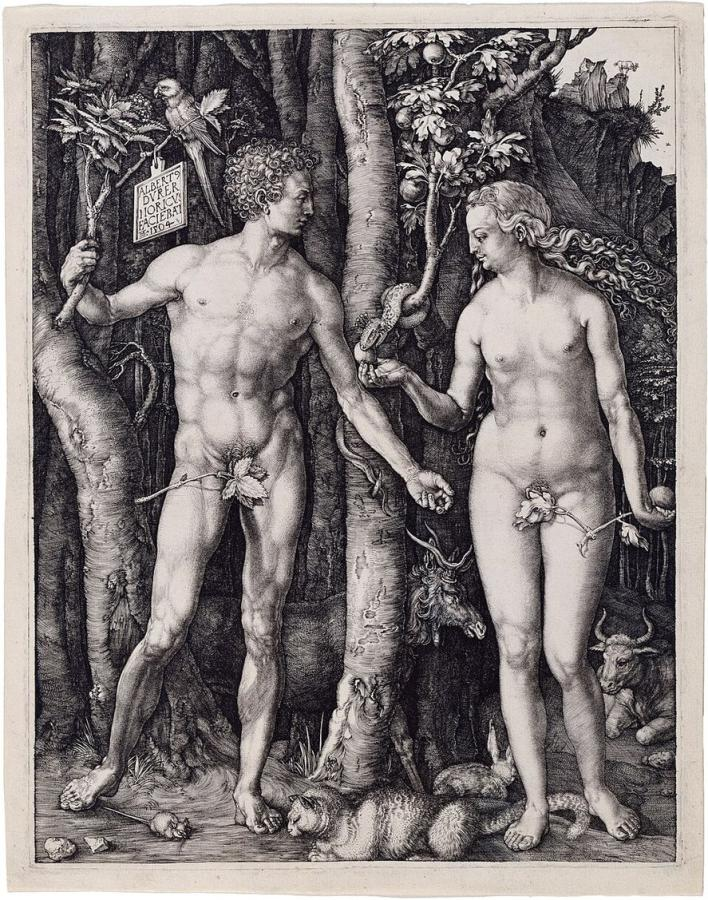
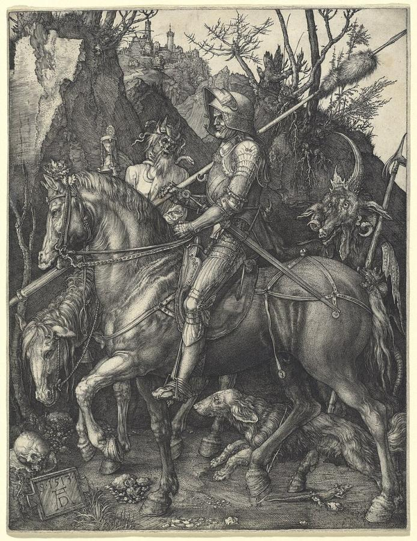
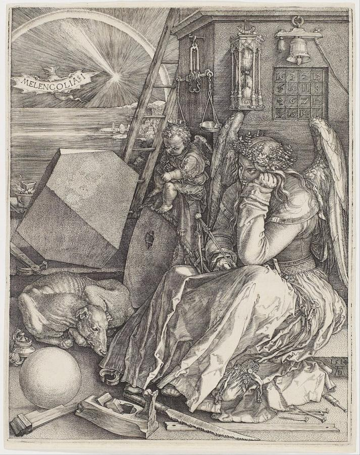
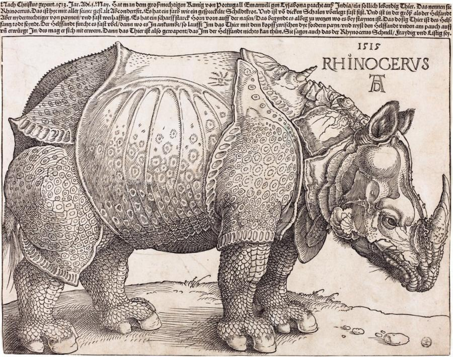

# Albrecht Dürer (1471–1528)

> Nuremberg's great painter and printmaker, who brought the Italian Renaissance north and made the print an art form.

## Overview

Albrecht Dürer was the leading artist of the German Renaissance. He travelled to Italy twice,
absorbed its ideas about proportion, perspective and the dignity of the artist, and combined them
with the precise, detailed tradition of the North. His woodcuts and engravings, sold across Europe,
made him the first artist with an international reputation built largely on prints. He was also a
theorist who wrote books on geometry and human proportion, and a pioneer of self-portraiture and
nature study.

## Life

Dürer was born in Nuremberg on 21 May 1471, the son of a Hungarian-born goldsmith. He trained first in
his father's workshop, which taught him the fine engraving skills of a goldsmith. At 13 he drew a
remarkable self-portrait in silverpoint. From 1486 he was apprenticed to Michael Wolgemut, whose
workshop produced woodcuts for book illustration. After years of travel on the Upper Rhine, he
returned home in 1494 to marry Agnes Frey, and almost at once left for Venice.

Back in Nuremberg he set up his own workshop and in 1498 published the *Apocalypse*, 15 huge woodcuts
that made him famous. A second stay in Venice (1505–1507) brought a major commission, the *Feast of
the Rosary*. The Venetian painter Giovanni Bellini treated him as an equal. From 1512 Emperor
Maximilian I employed him on grand projects and granted him a pension.

In 1520–1521 Dürer travelled through the Netherlands to have his pension confirmed by the new
emperor, Charles V. His diary of the trip records his amazement at Aztec treasures sent from Mexico.
He sympathised with Martin Luther's reforms. In his last years he published treatises on
measurement, fortification and human proportion. He died in Nuremberg on 6 April 1528.

## Style & Technique

Dürer drew with extraordinary control. In engraving he built up tone with networks of fine, swelling
lines, reaching a range from brilliant white to deep black. He took the woodcut, until then a fairly
crude craft, and made it do what engraving could, working with skilled block cutters. His famous
"AD" monogram served as a trademark, and he took action against copyists who used it.

He looked both north and south. From Italy he took classical proportion, perspective and a new
ideal of the human body. From the North he kept meticulous detail and a love of the natural world.
You can see it in his watercolours of hares, turf and landscapes. His self-portraits present the
artist as a learned, even god-like creator.

## Legacy

Dürer's prints circulated across Europe and were copied by artists from Italy to Persia and Mughal
India. Raphael exchanged drawings with him. His treatises spread Renaissance theory in the German
language. In the 19th century German Romantics made him a national hero, and his *Praying Hands*
and *Young Hare* became some of the most reproduced images in the world. His house in Nuremberg is
a museum, and his monogram remains one of the most recognisable artist signatures in history.

## Key Works

<!-- works:start -->

### 1. Self-Portrait at the Age of Twenty-Eight (1500)

*Oil on lime panel, 67.1 × 48.9 cm · Alte Pinakothek, Munich*

Dürer faces us head-on, in the symmetrical pose normally used for images of Christ. His hair falls in perfect ringlets, and his hand touches the fur of his coat. The Latin inscription states that he painted himself "in everlasting colours" at age 28. It is a daring claim for the dignity of the artist, whose creative gift was seen as a reflection of God's.

Image: [Wikimedia Commons](https://commons.wikimedia.org/wiki/File:Albrecht_D%C3%BCrer_-_1500_self-portrait_(High_resolution_and_detail).jpg) · Albrecht Dürer · Public domain

### 2. Young Hare (1502)

*Watercolour and bodycolour on paper, 25 × 22.5 cm · Albertina, Vienna*

A crouching hare, painted fur by fur, its ears alert and whiskers catching the light. A window is reflected in its eye. Dürer's nature studies were far ahead of their time. This one shows an animal as an individual living creature, not a symbol, and it became one of the most copied images in German art.

Image: [Wikimedia Commons](https://commons.wikimedia.org/wiki/File:Albrecht_D%C3%BCrer_-_Hare,_1502_-_Google_Art_Project.jpg) · Albrecht Dürer · Public domain

### 3. Adam and Eve (1504)

*Engraving, 25.2 × 19.4 cm · Impressions in many collections (e.g. National Gallery of Art, Washington)*

Dürer's showpiece of the ideal human body, drawn from classical proportions he had studied in Italy. Adam and Eve stand in a dark forest full of animals, and each animal stands for one of the four medieval "temperaments". A small tablet hanging from a branch carries his proud signature. The engraving's range of tones, from bright skin to velvety black, shows his total command of the burin.

Image: [Wikimedia Commons](https://commons.wikimedia.org/wiki/File:Albrecht_D%C3%BCrer,_Adam_and_Eve,_1504,_Engraving.jpg) · Albrecht Dürer · Public domain

### 4. Knight, Death and the Devil (1513)

*Engraving, 24.5 × 19 cm · Impressions in many collections (e.g. National Gallery of Art, Washington)*

An armoured knight rides steadily through a gloomy ravine, ignoring Death, who holds up an hourglass, and a pig-snouted devil lurking behind. It is one of Dürer's three "Master Engravings". It is often read as an image of the Christian who keeps to the path of faith despite fear and temptation.

Image: [Wikimedia Commons](https://commons.wikimedia.org/wiki/File:Albrecht_D%C3%BCrer,_Knight,_Death_and_Devil,_1513,_NGA_6637.jpg) · Albrecht Dürer · [CC0](http://creativecommons.org/publicdomain/zero/1.0/deed.en)

### 5. Melencolia I (1514)

*Engraving, 24 × 18.8 cm · Impressions in many collections (e.g. Metropolitan Museum of Art, New York)*

A winged figure sits brooding among scattered tools of measurement and craft: a compass, a polyhedron, a sphere, an hourglass. Behind her hangs a magic square whose rows add up to 34 and whose bottom row contains the year, 1514. It has been called the most debated print ever made. It is often read as a portrait of the creative mind stalled by doubt.

Image: [Wikimedia Commons](https://commons.wikimedia.org/wiki/File:Albrecht_D%C3%BCrer_-_Melencolia_I_-_Google_Art_Project_(_AGDdr3EHmNGyA).jpg) · Albrecht Dürer · Public domain

### 6. The Rhinoceros (1515)

*Woodcut, 23.5 × 29.8 cm · Impressions in many collections (e.g. National Gallery of Art, Washington)*

In 1515 an Indian rhinoceros arrived in Lisbon, the first seen in Europe since Roman times. Dürer never saw it. He worked from a letter and a sketch, and imagined an animal clad in riveted armour plates with a small extra horn on its back. The print sold in thousands and remained Europe's standard picture of a rhinoceros for about 250 years.

Image: [Wikimedia Commons](https://commons.wikimedia.org/wiki/File:The_Rhinoceros_(NGA_1964.8.697)_enhanced.png) · Albrecht Dürer · Public domain

<!-- works:end -->
## Sources

- [Albrecht Dürer (Wikipedia)](https://en.wikipedia.org/wiki/Albrecht_D%C3%BCrer)
- [Melencolia I (Wikipedia)](https://en.wikipedia.org/wiki/Melencolia_I)
- [Dürer's Rhinoceros (Wikipedia)](https://en.wikipedia.org/wiki/D%C3%BCrer%27s_Rhinoceros)
