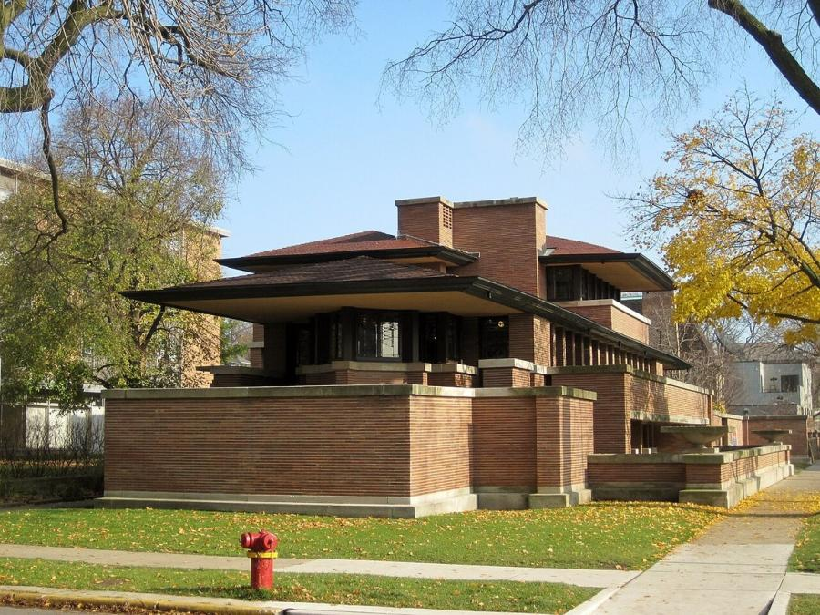
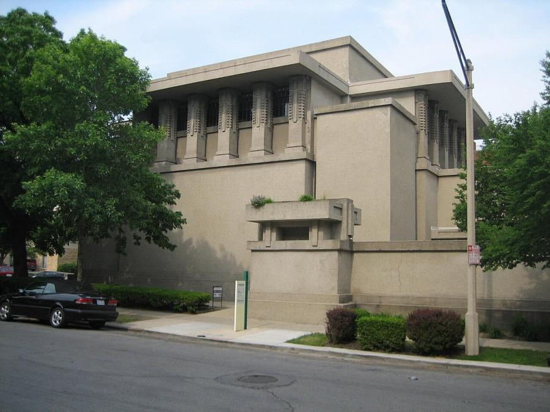
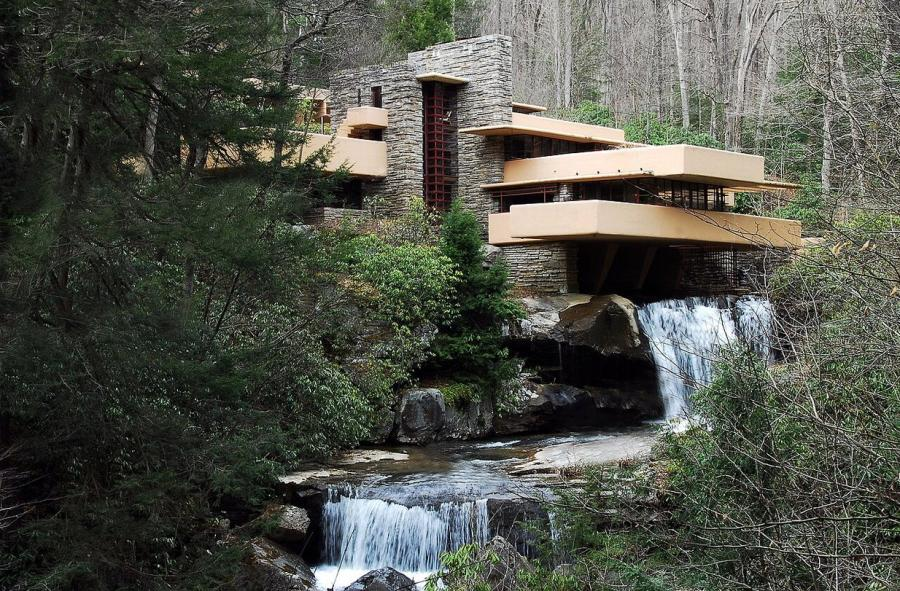
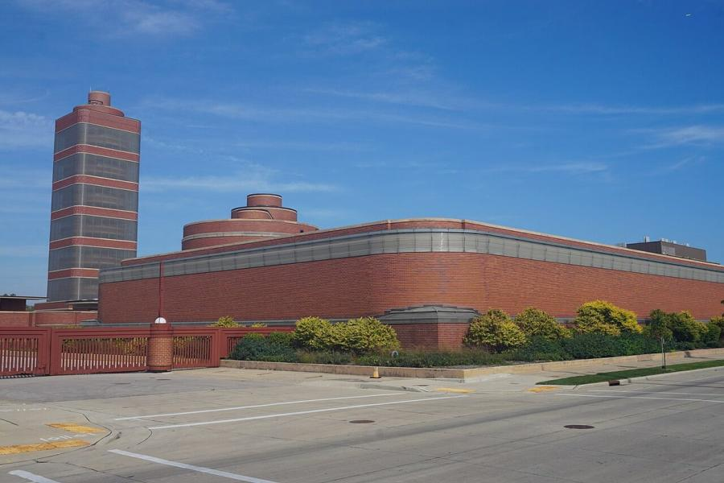
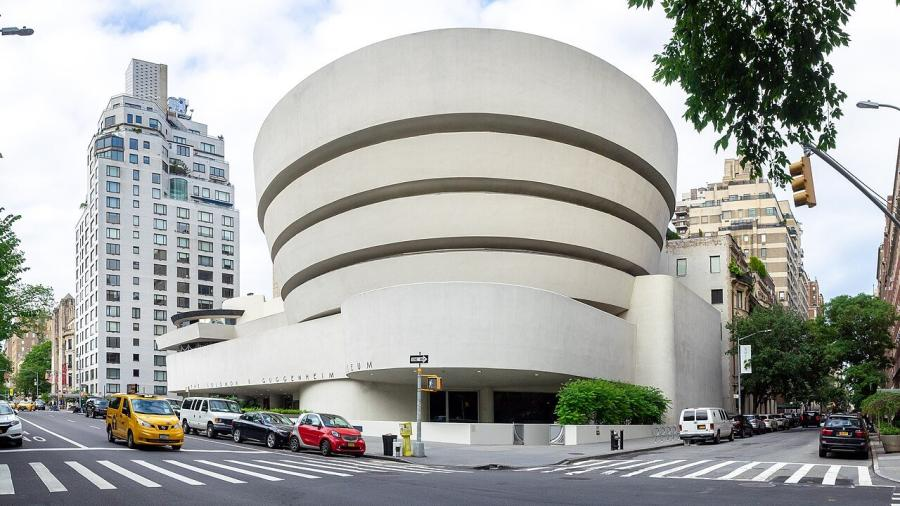

# Frank Lloyd Wright (1867–1959)

> The American architect of "organic architecture," who spent seven decades redefining the house, the office and the museum around open space, natural light and the shape of the land.

## Overview

Frank Lloyd Wright was the most influential American architect of the twentieth century, working
across an unusually long career that ran from the horizontal, ground-hugging houses of his Prairie
School period through radical public buildings like Unity Temple and the Johnson Wax headquarters,
to Fallingwater and the spiralling Guggenheim Museum near the very end of his life. He argued for
what he called "organic architecture," buildings designed from the inside out around their site,
their materials and the people who would use them, rather than applied historical style.

## Life

Wright was born in 1867 in Richland Center, Wisconsin, and studied engineering briefly at the
University of Wisconsin before moving to Chicago, where he worked under Louis Sullivan, the pioneer
of the skyscraper, who became his chief early influence and whom Wright later called his
"Lieber Meister." Setting up his own practice in the Chicago suburb of Oak Park in the 1890s, he
developed the low, wide-eaved Prairie house style through the following decade. His personal life
was turbulent and often scandalous by the standards of the time, including an affair, a
double murder at his Wisconsin home Taliesin in 1914, and bankruptcy during the Depression; each
crisis was followed by a fresh burst of work. In his late sixties, rather than winding down, he
designed some of his most celebrated buildings, Fallingwater, the Johnson Wax headquarters and
finally the Guggenheim Museum, working until shortly before his death in 1959 at the age of 91.

## Style & Technique

Wright designed around open, flowing interior space rather than a sequence of enclosed rooms,
breaking up walls with bands of art-glass windows and extending rooflines far beyond their walls in
deep, cantilevered overhangs. He treated concrete, steel and glass as materials to be used
honestly and inventively rather than disguised as historical stonework, engineering unusually
slender cantilevers and columns that alarmed structural engineers of the day, most famously the
tapering "dendriform" columns at the Johnson Wax headquarters. He also designed most of the
furniture, textiles and stained glass within his buildings himself, treating each project as a
single integrated work rather than a shell to be furnished afterward.

## Legacy

Wright designed more than a thousand structures over his career, of which roughly half were built,
and left an influence on residential design, particularly the open-plan living spaces standard in
American houses today, that is hard to overstate. Fallingwater and several other Wright buildings
are inscribed together as a UNESCO World Heritage Site. Late in life he also planned an entire
unrealised city, Broadacre City, laying out a vision of low-density, car-based suburban living that
anticipated, for better and worse, much of postwar American development.

## Key Works

<!-- works:start -->

### 1. Robie House (1909–1910)

*Roman brick, limestone trim and art-glass windows over a steel-framed cantilevered roof · Chicago, Illinois, United States*

The most fully resolved of Wright's Prairie School houses, built for a bicycle manufacturer on a narrow urban lot. Long, low rooflines cantilever dramatically beyond their brick walls with almost no visible support, echoing the flat horizon of the Midwestern prairie, while art-glass windows dissolve the boundary between rooms and garden.

Image: [Wikimedia Commons](https://commons.wikimedia.org/wiki/File:Frederick_C._Robie_House.JPG) · Teemu08 · [CC BY-SA 3.0](https://creativecommons.org/licenses/by-sa/3.0)

### 2. Unity Temple (1905–1908)

*Board-formed reinforced concrete, one of the earliest uses of the material for a public building · Oak Park, Illinois, United States*

A Unitarian church built to a tight budget, and Wright's first major public building, cast almost entirely in raw concrete left exposed rather than faced with stone. Worshippers enter through a low, compressed passage before the space opens dramatically upward into a top-lit, cube-shaped sanctuary, a sequence of compression and release Wright reused throughout his career.

Image: [Wikimedia Commons](https://commons.wikimedia.org/wiki/File:Oak_Park_Il_Unity_Temple8.jpg) · IvoShandor · [CC BY 2.5](https://creativecommons.org/licenses/by/2.5)

### 3. Fallingwater (1936–1939)

*Reinforced concrete cantilevers, sandstone walls and steel-framed glazing · Mill Run, Pennsylvania, United States*

A weekend house built directly over a waterfall for the Kaufmann family, its stacked concrete terraces cantilevered dramatically out over the falling water rather than facing it from a safe distance. Widely considered Wright's masterpiece, it was designed when he was nearly 70, in the middle of what is often called his career's second, "Usonian" act.

Image: [Wikimedia Commons](https://commons.wikimedia.org/wiki/File:Fallingwater3.jpg) · lachrimae72 · [CC0](http://creativecommons.org/publicdomain/zero/1.0/deed.en)

### 4. Johnson Wax Headquarters (1936–1939)

*Brick with slender reinforced-concrete "dendriform" (tree-shaped) columns and Pyrex glass tubing · Racine, Wisconsin, United States*

An open-plan office hall lit not by conventional windows but by bands of glass tubing between slender, mushroom-capped concrete columns that widen toward the ceiling like tree trunks and leaves. Wright had to build a test column and load it with sandbags to prove to sceptical building inspectors that the unusually thin supports would hold.

Image: [Wikimedia Commons](https://commons.wikimedia.org/wiki/File:Racine_October_2023_102_(S._C._Johnson_and_Son_Administration_Building_and_Research_Tower).jpg) · Michael Barera · [CC BY-SA 4.0](https://creativecommons.org/licenses/by-sa/4.0)

### 5. Solomon R. Guggenheim Museum (1956–1959)

*Reinforced concrete · New York City, United States*

Wright's last major work, completed the year of his death after sixteen years of design and dispute with the client and the city. A continuous spiral ramp, rather than a sequence of separate rooms, lets visitors descend past artworks along one unbroken gallery wound around an open, skylit central well.

Image: [Wikimedia Commons](https://commons.wikimedia.org/wiki/File:Solomon_R._Guggenheim_Museum_(48059131351).jpg) · Ajay Suresh from New York, NY, USA · [CC BY 2.0](https://creativecommons.org/licenses/by/2.0)

<!-- works:end -->
## Sources

- [Frank Lloyd Wright (Wikipedia)](https://en.wikipedia.org/wiki/Frank_Lloyd_Wright)
- [Fallingwater (Wikipedia)](https://en.wikipedia.org/wiki/Fallingwater)
- [Solomon R. Guggenheim Museum (Wikipedia)](https://en.wikipedia.org/wiki/Solomon_R._Guggenheim_Museum)
