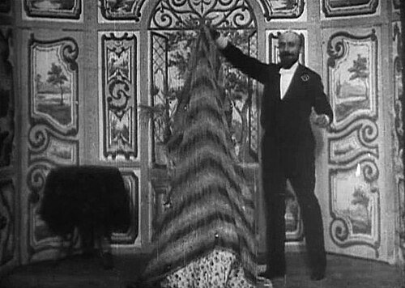
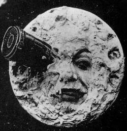
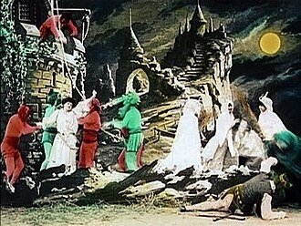
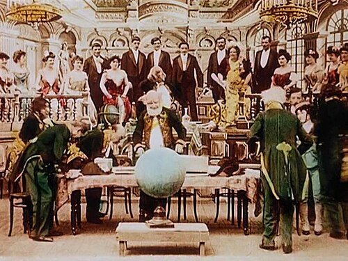
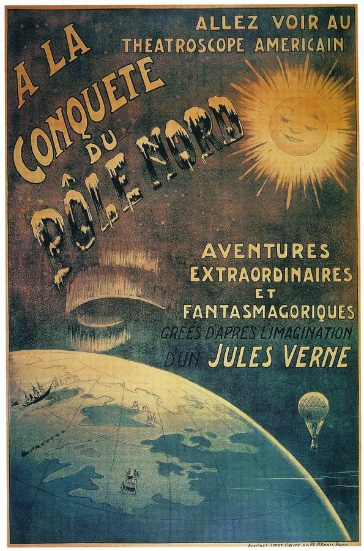

# Georges Méliès (1861–1938)

> The stage magician turned filmmaker who invented cinema's first special effects and its first trip to the Moon.

## Overview

Georges Méliès was a Paris stage magician who, within a year of seeing the Lumière brothers'
first film screening in 1895, built his own camera, opened a working film studio, and began
inventing the visual grammar of trick photography almost from nothing. Over roughly 500 films made
in under twenty years, he pioneered stop-motion substitution, multiple exposure, dissolves and
hand-painted colour, and turned cinema from a novelty for recording reality into a machine for
staging the impossible.

## Life

Méliès was born in Paris in 1861 to a prosperous shoe-manufacturing family and trained as a painter
before buying the Théâtre Robert-Houdin, a famous conjuring theatre, in 1888. After attending the
Lumière brothers' first public film screening in December 1895, he tried to buy a camera from them
and was refused, so he acquired one from a British inventor instead and built his own studio at
Montreuil, complete with a glass-walled stage that let him control light like a photographer.
Around 1896 he discovered, by accident when his camera jammed mid-shot, that stopping and
restarting filming could make objects vanish or transform, the basis of the trick films that made
him internationally famous, culminating in *A Trip to the Moon* in 1902. American piracy of his
films, the rise of narrative-driven studio filmmaking, and the disruption of the First World War
ruined his business; he was reduced to running a toy stall in a Paris train station before being
rediscovered and honoured late in life. He died in Paris in 1938.

## Style & Technique

Méliès treated the camera as a magician's prop rather than a recording device, developing the "stop
trick" (halting the camera to swap or remove a subject, then resuming filming to create a seamless
transformation), multiple exposure, dissolves, and elaborate hand-painted glass and canvas sets
built to force perspective. Colour prints were tinted by hand, frame by frame, in an assembly line
of women colourists at his studio. Where the Lumières had pointed a camera at real life, Méliès
built an entire theatrical world in front of it, closer to stage illusion than documentary.

## Legacy

Méliès is now regarded as the father of narrative and special-effects filmmaking, and *A Trip to the
Moon* as one of the most important films ever made, its imagery still endlessly quoted and parodied.
Forgotten and impoverished by the 1920s, he was rediscovered in his final decade, awarded the Légion
d'honneur, and given a small pension. His full rehabilitation in popular culture arrived generations
later, notably through Martin Scorsese's 2011 film *Hugo*, which dramatised his life and reintroduced
his work to new audiences.

## Key Works

<!-- works:start -->

### 1. The Vanishing Lady (1896)

*Silent film, black-and-white, 35mm, about 1 minute · Star Film Company, Montreuil, France*

One of Méliès's earliest trick films, made within months of discovering, by accident, that stopping and restarting his camera mid-shot could make an object or person vanish and reappear. Here a woman disappears from a chair, is replaced by a skeleton, and reappears, the basic "stop trick" that launched his career as cinema's first great illusionist.

Image: [Wikimedia Commons](https://commons.wikimedia.org/wiki/File:M%C3%A9li%C3%A8s,_Escamotage_d%27une_dame_chez_Robert-Houdin_(Star_Film_70,_1896).jpg) · Georges Méliès · Public domain

### 2. A Trip to the Moon (1902)

*Silent film, black-and-white and hand-tinted colour, 35mm, about 13 minutes · Star Film Company, Montreuil, France*

Cinema's first true science-fiction film, loosely adapted from Jules Verne and H. G. Wells, following astronomers who fire themselves to the Moon by cannon and battle its insect-like inhabitants, the Selenites. Its image of the capsule lodged in the Man in the Moon's eye is among the most reproduced in film history. Méliès hand-painted colour prints frame by frame in his own studio.

Image: [Wikimedia Commons](https://commons.wikimedia.org/wiki/File:Le_Voyage_dans_la_lune.jpg) · Georges Méliès · Public domain

### 3. The Kingdom of the Fairies (1903)

*Silent film, black-and-white, 35mm, about 17 minutes · Star Film Company, Montreuil, France*

An elaborate fairy-tale spectacle, one of the longest and most expensively staged films of its day, moving a kidnapped princess through underwater grottoes, an ice palace and a wedding procession across more than twenty painted sets. It shows Méliès at the height of his output as, in effect, the theatre magician he had been before cinema, now with a camera as his stage.

Image: [Wikimedia Commons](https://commons.wikimedia.org/wiki/File:Royaume_des_fees.jpg) · Georges Méliès · Public domain

### 4. The Impossible Voyage (1904)

*Silent film, black-and-white and hand-tinted colour, 35mm, about 24 minutes · Star Film Company, Montreuil, France*

A follow-up to *A Trip to the Moon*, sending a party of scientists by train, car, submarine and balloon across the globe and into the sun itself, satirising Jules Verne's adventure novels and the era's faith in engineering. Its miniature sets and multiple exposures pushed his in-camera effects further than any of his earlier films.

Image: [Wikimedia Commons](https://commons.wikimedia.org/wiki/File:Impossible_Voyage_2.jpg) · Georges Méliès · Public domain

### 5. The Conquest of the Pole (1912)

*Silent film, black-and-white and hand-tinted colour, 35mm, about 30 minutes · Star Film Company, Montreuil, France*

One of Méliès's last films, sending a competing international expedition to the North Pole by flying machine, where they encounter a giant "Snow Giant." Made as the fashion for hand-crafted trick films was giving way to narrative realism, it sold poorly and hastened his retirement from filmmaking two years later.

Image: [Wikimedia Commons](https://commons.wikimedia.org/wiki/File:Conquest_of_the_Pole_1912_Melies.jpg) · Unknown author Unknown author · Public domain

<!-- works:end -->
## Sources

- [Georges Méliès (Wikipedia)](https://en.wikipedia.org/wiki/Georges_M%C3%A9li%C3%A8s)
- [A Trip to the Moon (Wikipedia)](https://en.wikipedia.org/wiki/A_Trip_to_the_Moon)
- [The Conquest of the Pole (Wikipedia)](https://en.wikipedia.org/wiki/The_Conquest_of_the_Pole)
