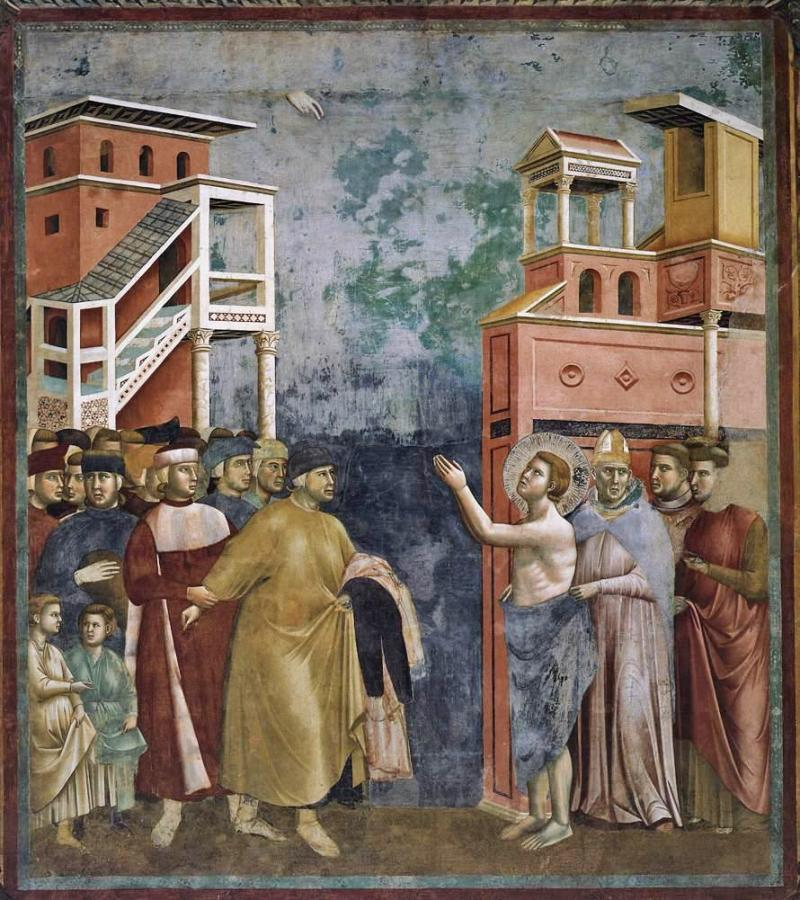
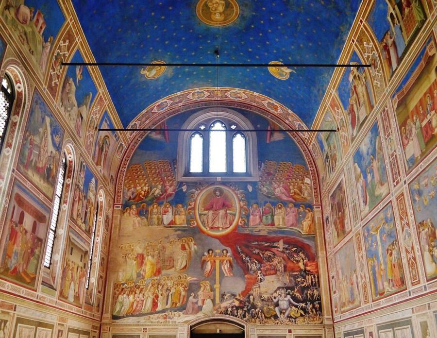
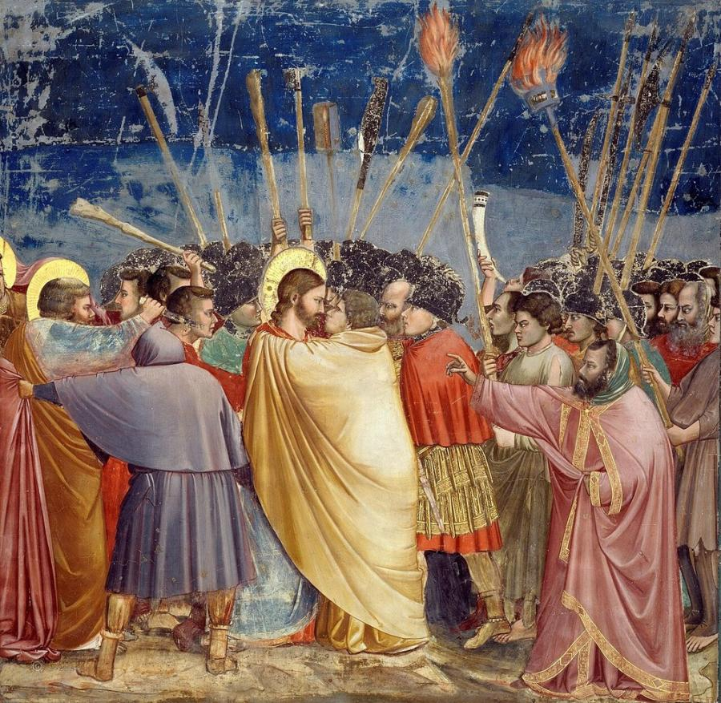
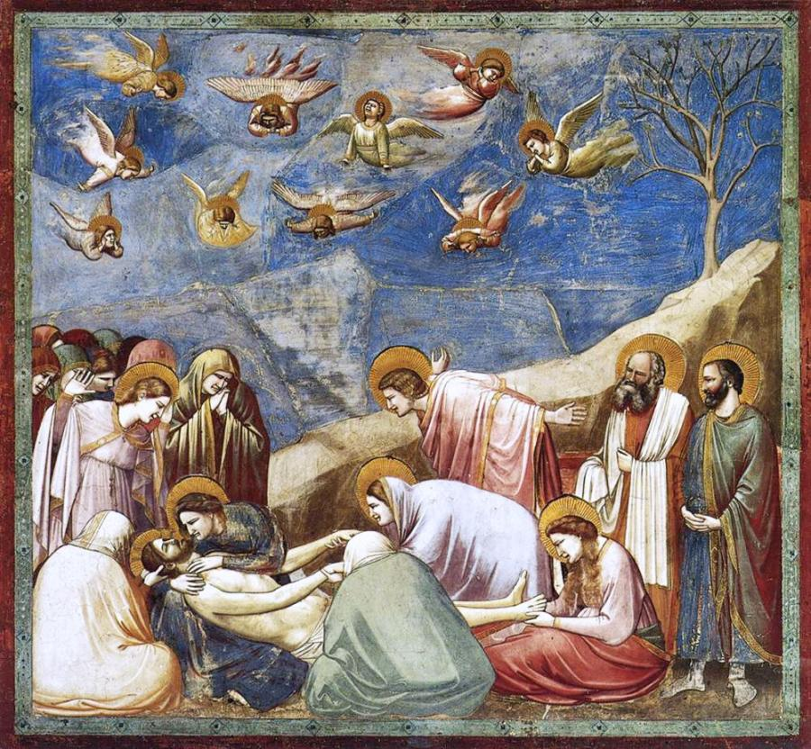
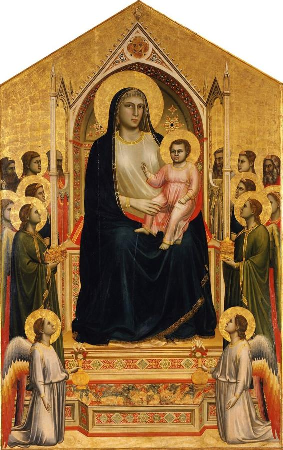
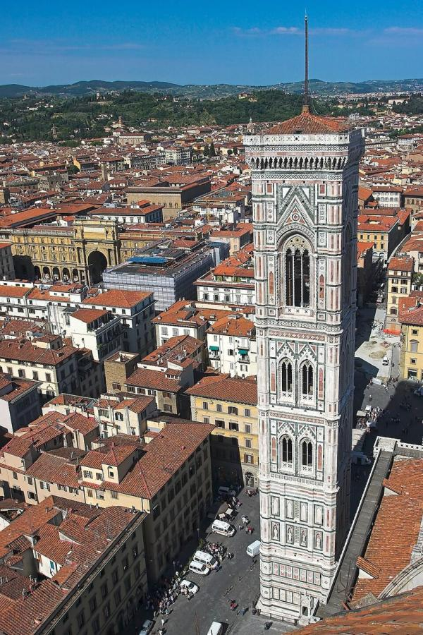

# Giotto di Bondone (c. 1267–1337)

> The Florentine painter who gave medieval figures weight, emotion and space. Many call him the father of Western painting.

## Overview

Giotto broke with the flat, gold-ground style that Italian painting had inherited from Byzantium. His
figures stand on solid ground, their clothes fall with real weight, and their faces show grief, anger
and tenderness. In the frescoes of the Scrovegni Chapel in Padua he told sacred stories as human
drama, with a directness that later artists admired for two centuries. Writers of his own day already
counted him the greatest painter alive. By the Renaissance he was seen as the artist who had started
painting again from nature.

## Life

Giotto was probably born around 1267 in the Mugello valley north of Florence. Giorgio Vasari tells
the story in his *Lives of the Artists* (1550): the painter Cimabue came upon the young shepherd
drawing a sheep on a flat rock and took him on as an apprentice. The tale is legend, but Giotto was
almost certainly trained in the Florentine workshops of the late 1200s.

His early career is still debated. Many scholars believe he worked on the fresco cycle of the Legend
of St Francis in the Upper Church at Assisi in the late 1290s. His name is firmly attached to the
Scrovegni Chapel in Padua, painted around 1303–1305 for the banker Enrico Scrovegni. From then on he
ran a busy workshop and worked across Italy: in Rome for Cardinal Stefaneschi at Old St Peter's, in
the Bardi and Peruzzi chapels of Santa Croce in Florence, and at the court of King Robert of Anjou in
Naples from about 1328 to 1333.

Giotto was also a shrewd businessman who owned property and rented out looms. He was famous enough
that Dante wrote of him in the *Divine Comedy*: "Cimabue thought to hold the field in painting, and
now Giotto has the cry." In 1334 Florence named him master of works for the cathedral, and he
designed its bell tower. He died in Florence in January 1337 and was buried with public honours.

## Style & Technique

Giotto worked mainly in *buon fresco*, painting into wet plaster one day's section (a *giornata*) at a
time so that the colour bonded with the wall. He simplified his scenes to a few strong figures set in
shallow, stage-like spaces. Rocks, buildings and furniture are drawn at angles that suggest depth,
more than 100 years before linear perspective was worked out.

Above all he made painting physical and emotional. His figures have volume, like carved stone, and
they react to one another through glances, gestures and body language. He often chose the most
charged moment in a story and built the picture around it. In the *Lamentation* he even placed
mourners with their backs to the viewer, pulling us into the scene.

## Legacy

Vasari opened his history of Italian art with Cimabue and Giotto, saying Giotto had brought back "the
good modern manner" of painting from nature. Masaccio in the 1420s and Michelangelo after him studied
and copied Giotto's frescoes. The Scrovegni Chapel is now a UNESCO World Heritage Site, part of
Padua's fourteenth-century fresco cycles. In the chapel's *Adoration of the Magi*, the star of
Bethlehem is painted as a blazing comet, perhaps inspired by Halley's Comet of 1301. When the
European Space Agency sent a probe to Halley's Comet in 1986, it named the mission Giotto.

## Key Works

<!-- works:start -->

### 1. St Francis Renounces His Worldly Goods (c. 1297–1300)

*Fresco · Upper Church, Basilica of San Francesco, Assisi*

One of 28 scenes from the Legend of St Francis in Assisi. The young Francis strips off his clothes and hands them back to his furious father, while the bishop covers him with his cloak. The painting splits into two crowds, family on one side and Church on the other, with an empty gap between them. Scholars still argue over how much of the cycle is Giotto's own work, but its solid figures and clear storytelling point toward the Scrovegni Chapel.

Image: [Wikimedia Commons](https://commons.wikimedia.org/wiki/File:Giotto_di_Bondone_-_Legend_of_St_Francis_-_5._Renunciation_of_Wordly_Goods_-_WGA09123.jpg) · Giotto · Public domain

### 2. Scrovegni Chapel (c. 1303–1305)

*Fresco cycle · Scrovegni (Arena) Chapel, Padua*

The banker Enrico Scrovegni paid for this small chapel, and Giotto covered its whole interior with paint. Rows of scenes tell the lives of Joachim and Anna, the Virgin Mary and Christ, all under a deep blue vault scattered with gold stars. A Last Judgment fills the entrance wall. Below the stories, painted figures of the Virtues and Vices are done in grey to look like stone sculpture. It is the most complete surviving work by Giotto, and one of the great turning points in European art.

Image: [Wikimedia Commons](https://commons.wikimedia.org/wiki/File:Padova_Cappella_degli_Scrovegni_Innen_Langhaus_West_5.jpg) · Zairon · [CC BY-SA 4.0](https://creativecommons.org/licenses/by-sa/4.0)

### 3. The Kiss of Judas (c. 1304–1306)

*Fresco · Scrovegni Chapel, Padua*

Judas wraps Christ in a sweeping yellow cloak as he leans in for the kiss that betrays him. The two faces meet in profile, calm against treacherous, while torches, clubs and lances crowd the sky above. At the left, Peter cuts off a servant's ear. Giotto puts the whole drama into one locked gaze, which makes this one of the most psychologically charged images of the Middle Ages.

Image: [Wikimedia Commons](https://commons.wikimedia.org/wiki/File:Giotto_-_Scrovegni_-_-31-_-_Kiss_of_Judas.jpg) · Giotto · Public domain

### 4. Lamentation (The Mourning of Christ) (c. 1305)

*Fresco · Scrovegni Chapel, Padua*

Mourners gather around the body of Christ. A bare, rocky ridge runs diagonally down the picture and leads the eye to his face, which Mary holds close to her own. Two figures sit with their backs to us, a bold idea that places the viewer inside the circle of grief. Above, angels twist and cry out in the sky. The fresco shows Giotto's gift for turning sacred stories into human feeling.

Image: [Wikimedia Commons](https://commons.wikimedia.org/wiki/File:Giotto_-_Scrovegni_-_-36-_-_Lamentation_(The_Mourning_of_Christ)_adj.jpg) · Giotto · Public domain

### 5. Ognissanti Madonna (c. 1306–1310)

*Tempera and gold on panel, 325 × 204 cm · Uffizi Gallery, Florence*

Painted for the church of Ognissanti in Florence, this huge altarpiece shows the Virgin enthroned among saints and angels. Earlier Madonnas, such as Cimabue's, look flat and weightless. Giotto's Virgin has real bulk: her knees push forward under her robe, and her throne recedes like a piece of architecture. It hangs in the Uffizi beside the Madonnas of Cimabue and Duccio, so visitors can see the change for themselves.

Image: [Wikimedia Commons](https://commons.wikimedia.org/wiki/File:Giotto,_1267_Around-1337_-_Maest%C3%A0_-_Google_Art_Project.jpg) · Giotto · Public domain

### 6. Giotto's Campanile (begun 1334)

*Marble-clad bell tower (architecture), 84.7 m tall · Piazza del Duomo, Florence*

In 1334 Florence appointed Giotto master of works for its cathedral, and he designed this bell tower beside it. He lived to see only the lowest storey built. Andrea Pisano and Francesco Talenti finished the tower in the 1350s, but it still carries his name. Its patterned facing of white, green and pink marble became one of the symbols of the city.

Image: [Wikimedia Commons](https://commons.wikimedia.org/wiki/File:CampanileGiotto-01.jpg) · Thermos · [CC BY-SA 2.5](https://creativecommons.org/licenses/by-sa/2.5)

<!-- works:end -->
## Sources

- [Giotto (Wikipedia)](https://en.wikipedia.org/wiki/Giotto)
- [Scrovegni Chapel (Wikipedia)](https://en.wikipedia.org/wiki/Scrovegni_Chapel)
- [Ognissanti Madonna (Wikipedia)](https://en.wikipedia.org/wiki/Ognissanti_Madonna)
- [Giotto's Campanile (Wikipedia)](https://en.wikipedia.org/wiki/Giotto%27s_Campanile)
- Giorgio Vasari, *Lives of the Most Excellent Painters, Sculptors, and Architects* (1550; 2nd ed. 1568)
