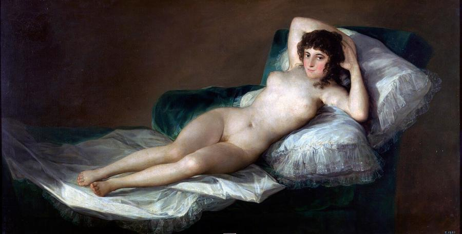
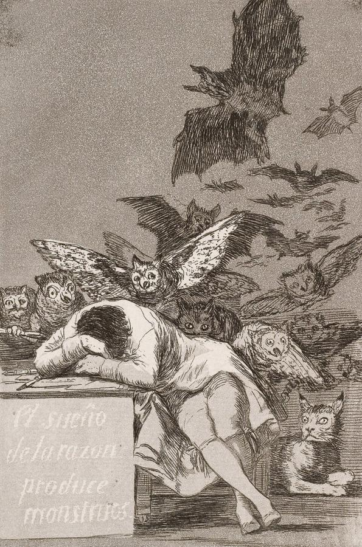
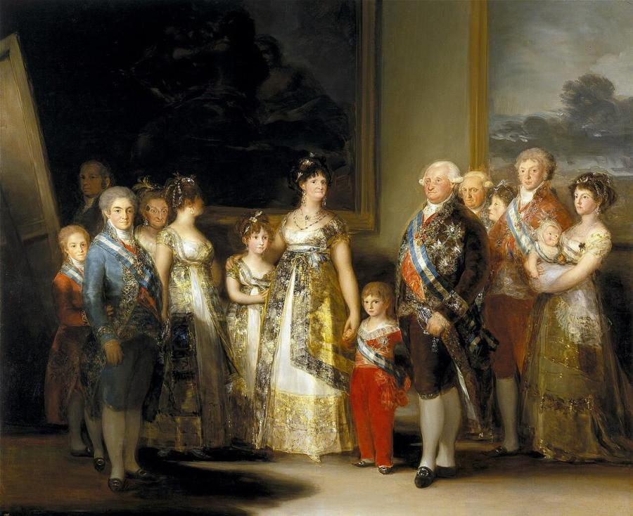
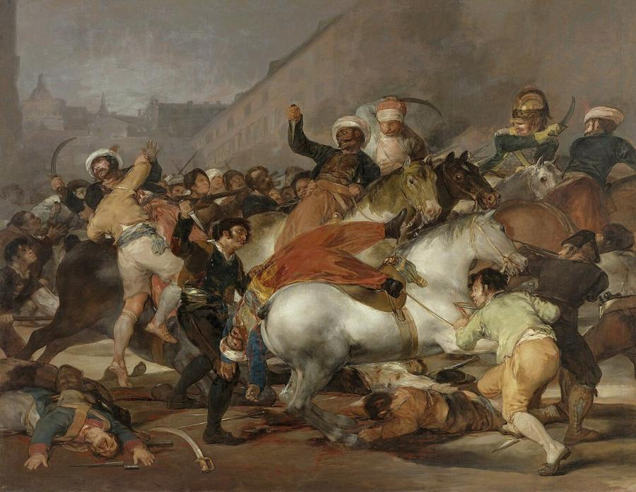
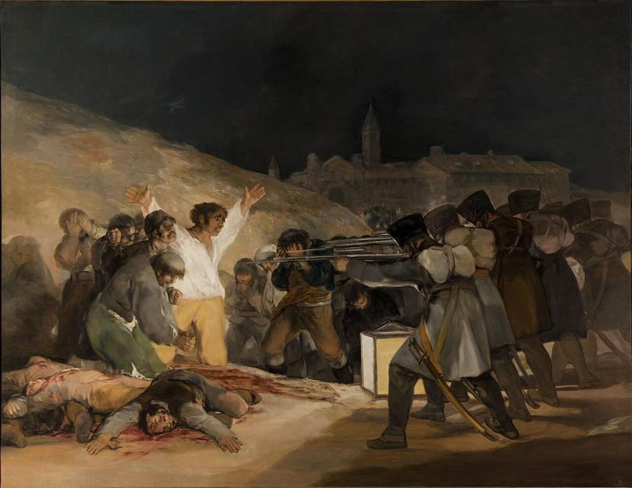
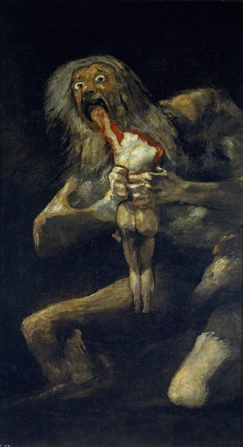

# Francisco Goya (1746–1828)

> Court painter and fierce witness to his age, whose work runs from sunny tapestry designs to the nightmares of war and the Black Paintings.

## Overview

Francisco Goya is often called the last of the Old Masters and the first of the moderns. He rose from
a provincial background to become First Court Painter to the King of Spain, producing brilliant
portraits of royalty and aristocrats. Yet illness, deafness, political repression and the horrors of
the Napoleonic wars drove him toward darker subjects: satire, violence, madness and the irrational.
His prints and late paintings anticipate Romanticism, Expressionism and modern war reporting.

## Life

Goya was born on 30 March 1746 in Fuendetodos, a village in Aragon, and grew up in Zaragoza. He
trained with a local painter and travelled to Italy around 1770. In 1773 he married Josefa Bayeu,
sister of the court painter Francisco Bayeu, who helped him obtain work designing tapestry cartoons for
the Royal Tapestry Factory in Madrid. These cheerful scenes of picnics, games and fairs brought him
royal attention.

By 1786 he was painter to the king, and in 1799 he became First Court Painter to Charles IV. In
1792–1793 a mysterious illness left him permanently deaf. His art turned more personal and critical.
In 1799 he published *Los Caprichos*, satirical etchings mocking superstition and the clergy.

When Napoleon's armies invaded Spain in 1808, Goya witnessed atrocities on both sides. He recorded
them in *The Disasters of War*, prints so savage they were published only 35 years after his death.
After the war he painted *The Second* and *Third of May 1808*. Disillusioned with the repressive rule
of the restored king Ferdinand VII, he retreated to a house outside Madrid, the Quinta del Sordo
("Deaf Man's Villa"), and covered its walls with the Black Paintings. In 1824 he went into exile in
Bordeaux, where he died on 16 April 1828.

## Style & Technique

Goya's early style is light and decorative, influenced by Tiepolo and Mengs. His mature portraits,
influenced by Velázquez, use loose, rapid brushwork and sparkling highlights, and they avoid flattery.
As a printmaker he mastered aquatint, a technique that creates areas of tone, and used it for deep,
velvety shadows.

In his later work he painted with increasing freedom and darkness. He applied paint with knives,
rags and even his fingers, and restricted his palette to blacks, browns and ochres. His subjects
became visions: crowds of witches, giants, faces twisted by fear. He painted private obsessions
rather than commissions.

## Legacy

Goya's unflinching treatment of war and cruelty has made him a model for artists confronting
violence. Manet's *Execution of Emperor Maximilian* and Picasso's *Guernica* both descend from *The
Third of May*. The Romantics admired his imagination, the Expressionists and Surrealists his dark
visions. His *Disasters of War* remain a benchmark for images of atrocity. The Prado holds the
greatest collection of his work, and a statue of him stands outside its north entrance.

## Key Works

<!-- works:start -->

### 1. La maja desnuda (The Nude Maja) (c. 1797–1800)

*Oil on canvas, 97 × 190 cm · Museo del Prado, Madrid*

A young woman reclines on green cushions, arms behind her head, looking straight at the viewer without shame or mythological excuse. It is one of the earliest Western paintings of a real nude woman who is not a goddess. It was probably made for the royal favourite Manuel Godoy, who also owned its clothed pendant, *La maja vestida*. In 1815 the Inquisition summoned Goya to explain the "obscene" picture.

Image: [Wikimedia Commons](https://commons.wikimedia.org/wiki/File:Goya_Maja_naga2.jpg) · Francisco Goya · Public domain

### 2. The Sleep of Reason Produces Monsters (Los Caprichos, plate 43) (1799)

*Etching and aquatint, 21.5 × 15 cm · Impressions in many collections (e.g. Museo del Prado, Madrid)*

A man, perhaps Goya himself, slumps asleep over his desk while owls, bats and a staring lynx swarm out of the darkness behind him. The title is inscribed on the desk. It comes from *Los Caprichos*, 80 satirical prints attacking superstition, ignorance and the abuses of Spanish society. The image has become an emblem of the Enlightenment and its fears.

Image: [Wikimedia Commons](https://commons.wikimedia.org/wiki/File:Francisco_Jos%C3%A9_de_Goya_y_Lucientes_-_The_sleep_of_reason_produces_monsters_(No._43),_from_Los_Caprichos_-_Google_Art_Project.jpg) · Francisco Goya · Public domain

### 3. Charles IV of Spain and His Family (1800–1801)

*Oil on canvas, 280 × 336 cm · Museo del Prado, Madrid*

The Spanish royal family lined up in glittering silks and sashes, painted with an honesty that has sometimes been read as satire. The queen, Maria Luisa, dominates the centre; the king looks vacant. In a nod to Velázquez's *Las Meninas*, Goya painted himself in the shadows at the left, working at a large canvas.

Image: [Wikimedia Commons](https://commons.wikimedia.org/wiki/File:La_familia_de_Carlos_IV.jpg) · Francisco Goya · Public domain

### 4. The Second of May 1808 (The Charge of the Mamelukes) (1814)

*Oil on canvas, 268 × 347 cm · Museo del Prado, Madrid*

The people of Madrid rise up against Napoleon's troops, attacking the Egyptian Mameluke cavalry with knives in a tangle of horses, bodies and blood. Painted after the French were expelled, it shows no heroes, only the chaos and fury of street fighting.

Image: [Wikimedia Commons](https://commons.wikimedia.org/wiki/File:El_dos_de_mayo_de_1808_en_Madrid.jpg) · Francisco Goya · Public domain

### 5. The Third of May 1808 (1814)

*Oil on canvas, 268 × 347 cm · Museo del Prado, Madrid*

The companion to *The Second of May*. At night, a faceless line of French soldiers aims its muskets at Spanish prisoners. At the centre a man in a white shirt flings his arms wide, lit by a lantern, his pose recalling the crucified Christ. It is one of the first great paintings to show war as senseless slaughter rather than glory, and it prepared the way for Manet and Picasso's *Guernica*.

Image: [Wikimedia Commons](https://commons.wikimedia.org/wiki/File:El_Tres_de_Mayo,_by_Francisco_de_Goya,_from_Prado_thin_black_margin.jpg) · El_Tres_de_Mayo,_by_Francisco_de_Goya,_from_Prado_in_Google_Earth.jpg : Francisco de Goya derivative work: Papa Lima Whiskey 2 · Public domain

### 6. Saturn Devouring His Son (1819–1823)

*Mixed media mural transferred to canvas, 143.5 × 81.4 cm · Museo del Prado, Madrid*

One of the 14 "Black Paintings" that the aged, deaf Goya painted directly on the walls of his farmhouse outside Madrid, never meant for public view. The Titan Saturn, fearing that his children will overthrow him, tears into a headless body, eyes wild with horror. The murals were transferred to canvas in 1874 and are now among the most disturbing images in the Prado.

Image: [Wikimedia Commons](https://commons.wikimedia.org/wiki/File:Francisco_de_Goya,_Saturno_devorando_a_su_hijo_(1819-1823).jpg) · Francisco Goya · Public domain

<!-- works:end -->
## Sources

- [Francisco Goya (Wikipedia)](https://en.wikipedia.org/wiki/Francisco_Goya)
- [The Third of May 1808 (Wikipedia)](https://en.wikipedia.org/wiki/The_Third_of_May_1808)
- [Black Paintings (Wikipedia)](https://en.wikipedia.org/wiki/Black_Paintings)
