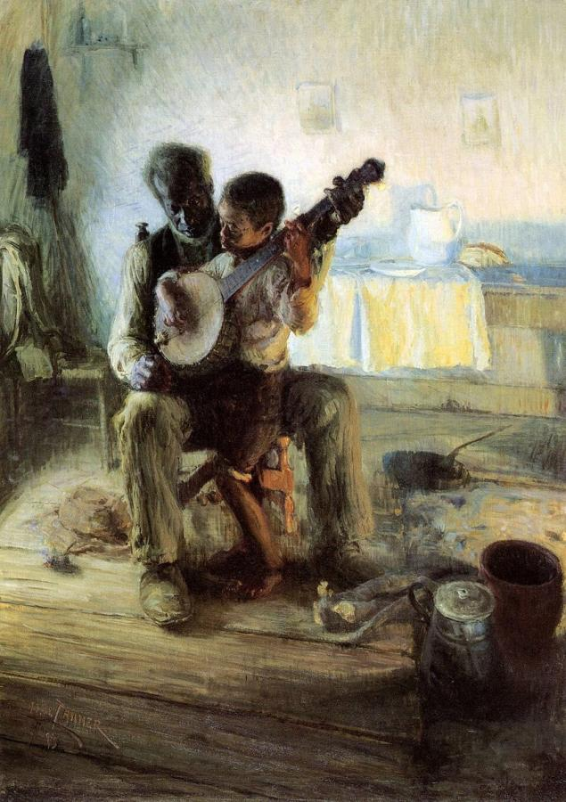
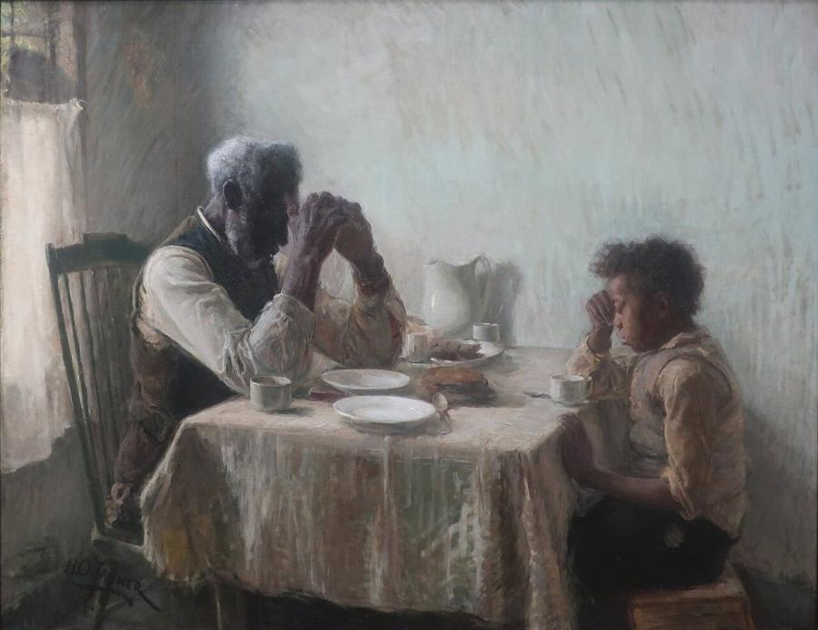
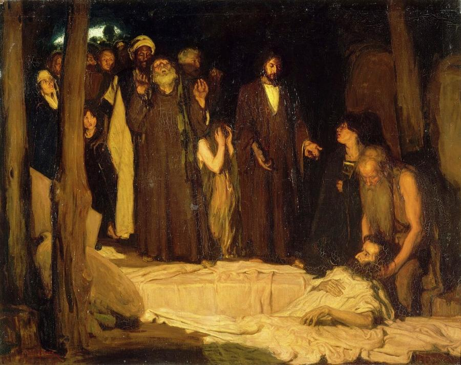
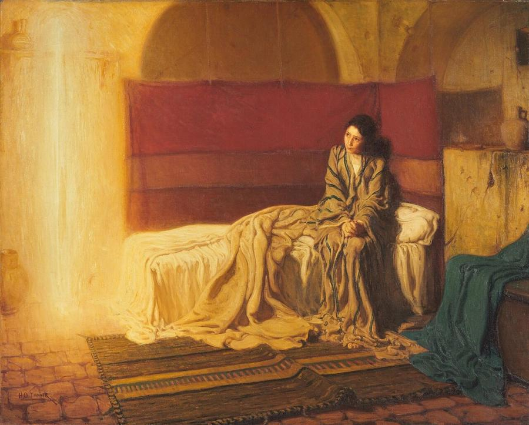
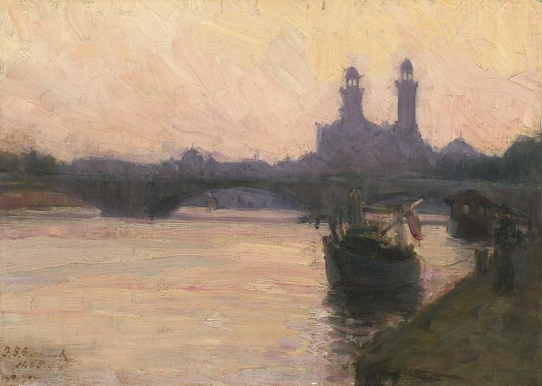
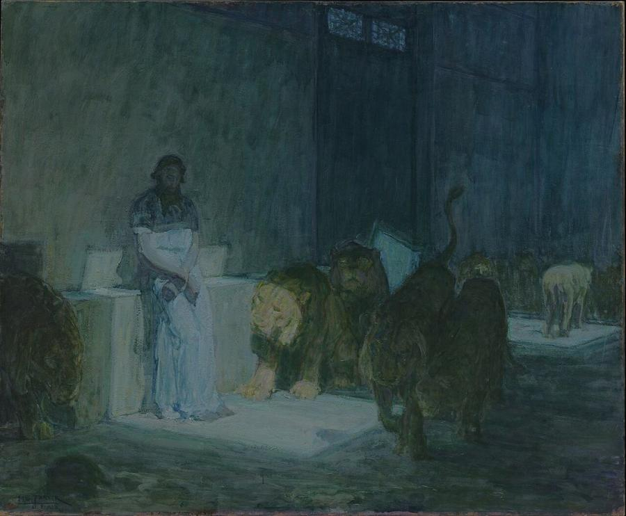

# Henry Ossawa Tanner (1859–1937)

> The first African American painter to win international fame, known for his dignified genre scenes and luminous biblical paintings.

## Overview

Henry Ossawa Tanner was the most accomplished African American artist of the 19th century and the first
to gain international acclaim. Frustrated by racism in the United States, he settled in Paris in 1891
and built his career there, winning medals at the Paris Salon. He is best known for two groups of
paintings. The first is a few powerful genre scenes of Black American life that challenged racist
stereotypes. The second is his many religious paintings, bathed in glowing blue and gold light and
informed by travels in the Holy Land.

## Life

Tanner was born on 21 June 1859 in Pittsburgh, Pennsylvania, the eldest of nine children. His father,
Benjamin Tucker Tanner, became a bishop of the African Methodist Episcopal Church, and his mother,
Sarah, had escaped slavery via the Underground Railroad. The family moved to Philadelphia. At 13,
seeing a painter at work in a park, Henry decided to become an artist.

In 1879 he enrolled at the Pennsylvania Academy of the Fine Arts, studying with Thomas Eakins, who
encouraged his realism. He was the only Black student and faced harassment. After years of struggle,
including running a photography studio in Atlanta, he left for Europe in 1891 and studied at the
Académie Julian in Paris. On a return visit to the United States in 1893 he painted *The Banjo Lesson*
and *The Thankful Poor*.

Back in France, he turned to biblical subjects. *The Resurrection of Lazarus* won a medal at the 1897
Salon, and the French government bought it. His patron Rodman Wanamaker paid for trips to Egypt and
Palestine to study the landscapes and people of the Bible. He married a white Swedish-American
singer, Jessie Olssen, in 1899. Their son Jesse was born in 1903. Tanner lived in Paris and in the
artists' colony of Trépied on the Normandy coast, and was made a Chevalier of the Légion d'honneur in
1923. He died in Paris on 25 May 1937.

## Style & Technique

Tanner's early work reflects the realism of Thomas Eakins, with solid figures, careful observation and
honest treatment of everyday life. In France his style became softer and more atmospheric. He came to
prefer a limited palette dominated by deep blues and blue-greens, which became his signature, with
glowing highlights of gold light.

In his religious paintings he aimed for historical and emotional truth. He studied the landscapes,
architecture and costumes of the Middle East and modelled biblical figures on ordinary people. He
often reworked his canvases for years, building up layers of glazes to achieve their mysterious,
luminous effects.

## Legacy

Tanner opened a path for African American artists. He advised younger painters such as William Edouard
Scott and Hale Woodruff, and he was a hero to the artists of the Harlem Renaissance. In 1996 his *Sand
Dunes at Sunset, Atlantic City* became the first painting by an African American artist in the White
House collection. Major retrospectives, including *Modern Spirit* at the Pennsylvania Academy of the
Fine Arts in 2012, have secured his place in American art history. A US postage stamp honoured him in 1973.

## Key Works

<!-- works:start -->

### 1. The Banjo Lesson (1893)

*Oil on canvas, 124.5 × 90.2 cm · Hampton University Museum, Virginia*

An elderly Black man patiently teaches a small boy on his lap to play the banjo, in a simple room lit by a warm fire and cool daylight. Tanner deliberately countered the demeaning minstrel-show stereotypes of Black musicians. He showed instead the dignity, tenderness and knowledge passed from one generation to the next. It is one of the landmarks of African American art.

Image: [Wikimedia Commons](https://commons.wikimedia.org/wiki/File:Henry_Ossawa_Tanner,_The_Banjo_Lesson_(darker).jpg) · Henry Ossawa Tanner · Public domain

### 2. The Thankful Poor (1894)

*Oil on canvas, 90.2 × 112.4 cm · Private collection*

A grandfather and grandson bow their heads in grace over a modest meal. Based on photographs Tanner took, the painting presents a Black family with quiet spiritual strength, reflecting the values of his father, a bishop of the African Methodist Episcopal Church. In 1981 it set an auction record for an African American artist.

Image: [Wikimedia Commons](https://commons.wikimedia.org/wiki/File:The_Thankful_Poor,_1894._Henry_Ossawa_Tanner.jpg) · Henry Ossawa Tanner · Public domain

### 3. The Resurrection of Lazarus (1896)

*Oil on canvas, 95 × 120.5 cm · Musée d'Orsay, Paris*

In a dim tomb, Christ gestures as the pale Lazarus stirs back to life, watched by astonished onlookers in Middle Eastern dress. The painting won a medal at the 1897 Paris Salon and was bought by the French state, a rare honour for any American. It made Tanner famous on both sides of the Atlantic.

Image: [Wikimedia Commons](https://commons.wikimedia.org/wiki/File:Resurrection_of_Lazarus_by_Henry_Ossawa_Tanner.jpg) · Henry Ossawa Tanner · Public domain

### 4. The Annunciation (1898)

*Oil on canvas, 144.8 × 181 cm · Philadelphia Museum of Art*

Painted after Tanner's first trip to Palestine, it shows Mary as a young Middle Eastern girl in a rumpled nightdress, sitting on her bed. Instead of a winged figure, the angel Gabriel appears as a column of golden light. The mix of everyday realism and mystical glow is typical of Tanner's religious work. It was the first of his paintings bought by an American museum.

Image: [Wikimedia Commons](https://commons.wikimedia.org/wiki/File:The_Annunciation,_Philadelphia_Museum_of_Art,_W1899-1-1-pma,_by_Henry_Ossawa_Tanner.jpg) · Henry Ossawa Tanner · Public domain

### 5. The Seine (c. 1902)

*Oil on canvas, 22.8 × 33 cm · National Gallery of Art, Washington*

A small, atmospheric view of the river in Paris at dusk, with a bridge and quays dissolving into blue haze. Tanner lived in France for most of his career, and he painted many such tonal, poetic landscapes, influenced by Whistler, alongside his large religious works.

Image: [Wikimedia Commons](https://commons.wikimedia.org/wiki/File:Henry_Ossawa_Tanner,_The_Seine,_c._1902,_NGA_52624.jpg) · Henry Ossawa Tanner · [CC0](http://creativecommons.org/publicdomain/zero/1.0/deed.en)

### 6. Daniel in the Lions' Den (1907–1918)

*Oil on paper mounted on canvas · Los Angeles County Museum of Art*

The prophet Daniel stands calmly in the pit while lions pace around him, lit by a shaft of light from a high window. Tanner reworked the subject over many years. The deep blue-green tones and glowing light are characteristic of his mature style, and they give the scene a quiet, spiritual mood rather than violent drama.

Image: [Wikimedia Commons](https://commons.wikimedia.org/wiki/File:Daniel_in_the_Lions%27_Den_LACMA_22.6.3.jpg) · Henry Ossawa Tanner (United States, Pennsylvania, Pittsburgh, 1859-1937) · Public domain

<!-- works:end -->
## Sources

- [Henry Ossawa Tanner (Wikipedia)](https://en.wikipedia.org/wiki/Henry_Ossawa_Tanner)
- [The Banjo Lesson (Wikipedia)](https://en.wikipedia.org/wiki/The_Banjo_Lesson)
- [The Thankful Poor (Wikipedia)](https://en.wikipedia.org/wiki/The_Thankful_Poor)
