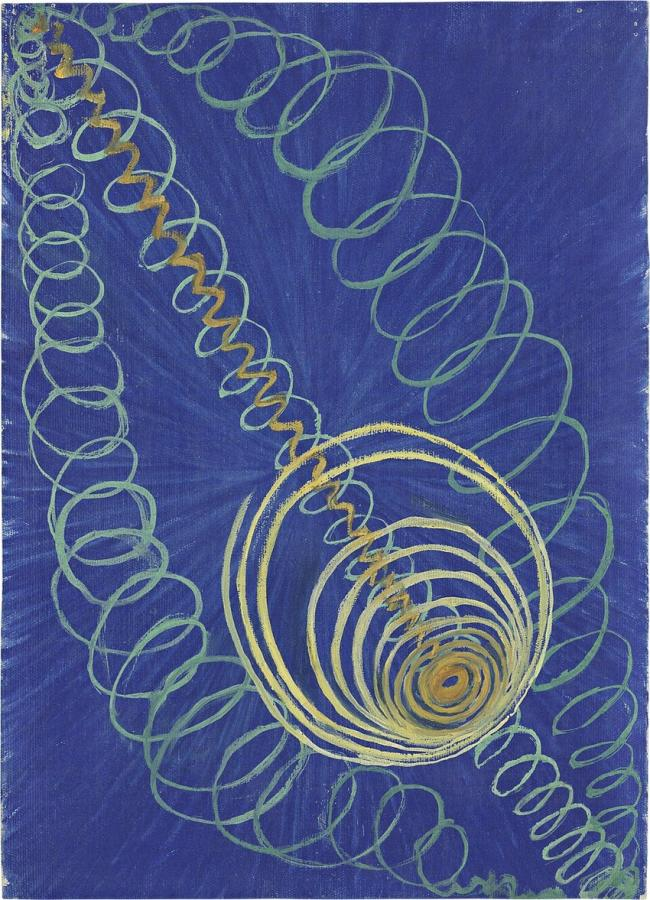
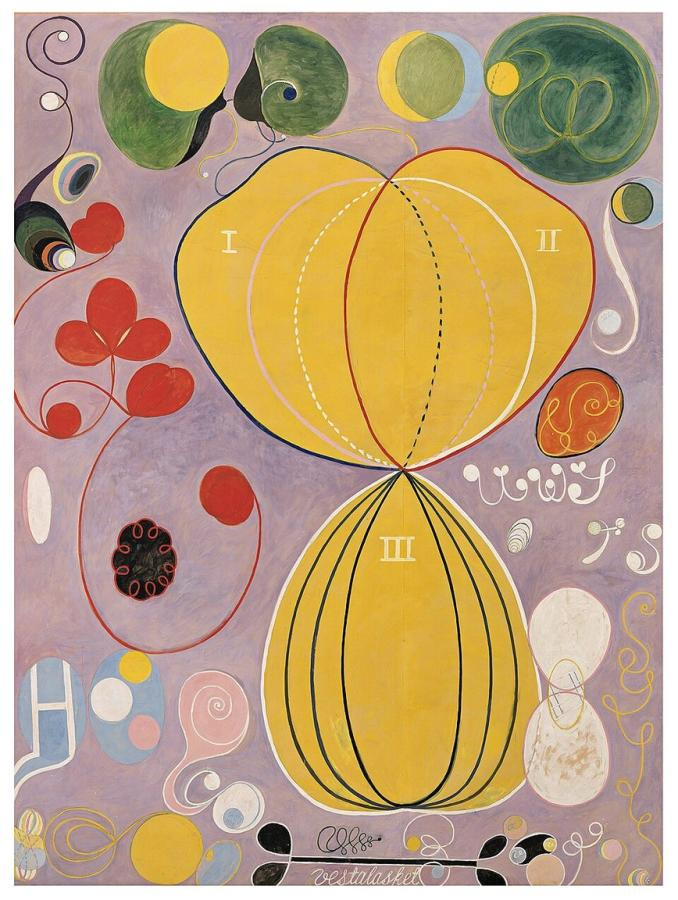
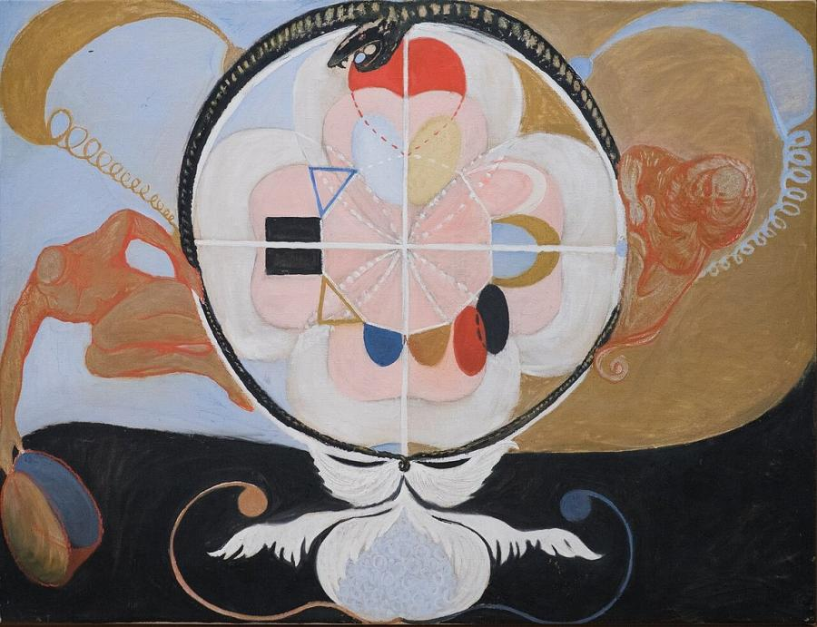
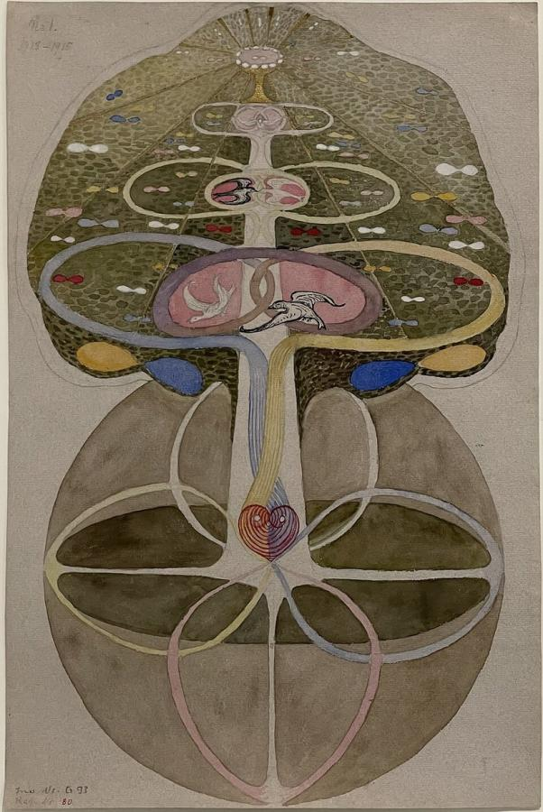
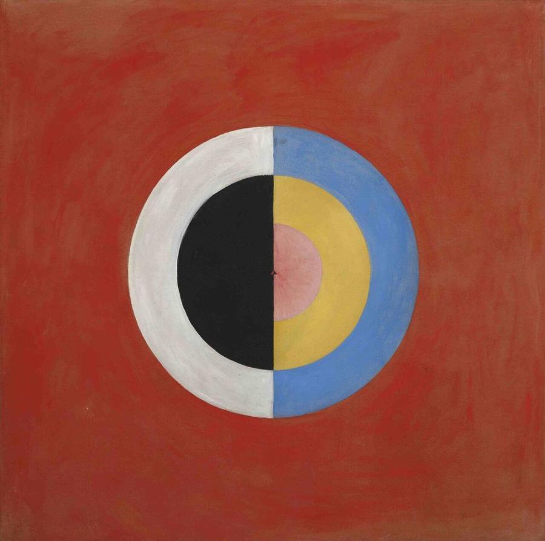
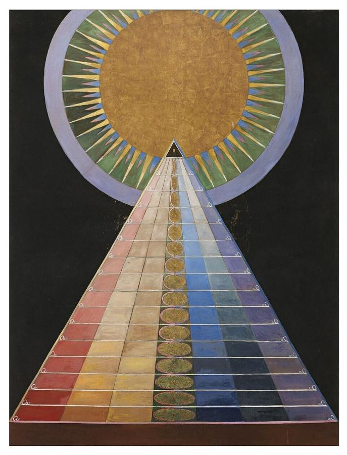

# Hilma af Klint (1862–1944)

> The Swedish visionary who painted radical abstract works years before Kandinsky, and kept them hidden from the world.

## Overview

Hilma af Klint was a trained academic painter who, from 1906, created hundreds of abstract paintings
guided by her spiritual beliefs. She made them several years before Kandinsky, Mondrian and Malevich,
who are usually credited with inventing abstraction. She believed the world was not ready for them. She
showed them to very few people and directed that they should not be exhibited until 20 years after her
death. Revealed to the public only in the 1980s, her work has since rewritten the history of modern
art. Her 2018–2019 retrospective became the most visited exhibition in the Guggenheim Museum's history.

## Life

Hilma af Klint was born on 26 October 1862 at Karlberg Palace in Solna, near Stockholm, where her
father, a naval commander, taught at the military academy. From 1882 to 1887 she studied at the Royal
Academy of Fine Arts in Stockholm, which had begun admitting women in 1864. She then made a
respectable living painting landscapes, portraits and botanical illustrations, and had a studio in
central Stockholm.

The death of her younger sister in 1880 drew her toward spiritualism and Theosophy. In 1896 she and four
other women formed a group called "The Five", which held séances and experimented with automatic
drawing and writing. In 1906, believing she had received a commission from a spiritual guide, she began
the *Paintings for the Temple*, a cycle of nearly 200 works completed in 1915.

In 1908 she showed her work to the Austrian philosopher Rudolf Steiner. His cool response contributed
to a four-year break in the series, during which she cared for her blind mother. She later joined
Steiner's Anthroposophical Society and continued painting and writing into old age, filling some 125
notebooks. She died on 21 October 1944 after a traffic accident, leaving more than 1,200 paintings and
drawings to her nephew, Erik af Klint.

## Style & Technique

Af Klint's abstract works combine geometric shapes, such as circles, spirals, triangles and grids,
with organic forms like petals, shells and cells, together with letters, words and symbols. Colour
carries meaning: in her code, blue often stood for the female and yellow for the male, while green
suggested their union. The paintings range from small canvases to the vast *Ten Largest*, painted in
tempera on paper laid on the floor.

She worked in series, developing a theme through variations, and considered herself a medium through
whom the works were created. Her art draws on Theosophy, Christianity, botany and the new sciences of
her time: evolution, atomic physics and invisible radiation.

## Legacy

Af Klint's abstract paintings were unknown until they appeared in the 1986 exhibition *The Spiritual in
Art: Abstract Painting 1890–1985* at the Los Angeles County Museum of Art. A major show at Moderna
Museet in Stockholm in 2013 brought international fame, and the Guggenheim's *Paintings for the Future*
(2018–2019) drew more than 600,000 visitors. Her work has prompted a rethinking of who invented
abstraction and why women artists were written out of the story. It has inspired films, books and new
research, and the Hilma af Klint Foundation cares for her legacy.

## Key Works

<!-- works:start -->

### 1. Primordial Chaos, No. 16 (Group I, WU/Rose Series) (1906–1907)

*Oil on canvas, 53 × 37 cm · Hilma af Klint Foundation, Stockholm*

From the very first group of her *Paintings for the Temple*. Coiling spirals of green and yellow unwind across a deep blue ground. They represent the origins of the world and the division of unity into opposites, male and female, spirit and matter. Painted in 1906, these small works are among the earliest abstract paintings in Western art.

Image: [Wikimedia Commons](https://commons.wikimedia.org/wiki/File:Hilma_af_Klint,_1906-07,_Primordial_Chaos_-_No_16.jpg) · Hilma af Klint · Public domain

### 2. The Ten Largest, No. 7, Adulthood (Group IV) (1907)

*Tempera on paper mounted on canvas, 315 × 235 cm · Hilma af Klint Foundation, Stockholm*

One of ten huge paintings describing the stages of human life, from childhood to old age. Af Klint painted them in a few months, on paper laid on the floor. Blossoming flower-like forms, spirals and Roman numerals drift over a lilac ground. They seem to celebrate growth, love and maturity. The series was the centrepiece of the record-breaking Guggenheim exhibition of 2018–2019.

Image: [Wikimedia Commons](https://commons.wikimedia.org/wiki/File:Hilma_af_Klint_-_The_Ten_Largest_No._7_-_Adulthood_-_1907.jpg) · Hilma af Klint · Public domain

### 3. Evolution, No. 13 (Group VI) (1908)

*Oil on canvas · Hilma af Klint Foundation, Stockholm*

A great circle, ringed by a serpent, holds a pink, flower-like form divided into quarters and scattered with geometric signs: triangles, a crescent, black bars and coloured ovals. Reddish human figures twist toward it from either side. The series traces humanity's evolution through the meeting of opposites, such as light and dark or male and female. Shortly afterwards af Klint stopped painting the temple works for four years, partly discouraged by Rudolf Steiner's lukewarm response.

Image: [Wikimedia Commons](https://commons.wikimedia.org/wiki/File:Hilma_af_Klint_-_Group_VI,_Evolution_No._13_(13949).jpg) · Rhododendrites · Public domain

### 4. The Tree of Knowledge, No. 1 (1913–1915)

*Watercolour and gouache on paper · Glenstone Museum, Potomac, Maryland*

One of eight delicate works on paper showing the biblical tree of knowledge as a symmetrical, diagram-like form of branches, birds, circles and hearts. Af Klint combined Christian, Theosophical and scientific imagery into a personal symbolic language. It is as much a spiritual diagram as a painting. Glenstone acquired the series of eight in 2022, among the most significant af Klint works ever sold.

Image: [Wikimedia Commons](https://commons.wikimedia.org/wiki/File:Tree_of_Knowledge_No._1,_Hilma_af_Klint,_1913-1915,_Glenstone_2023.jpg) · Hilma af Klint · Public domain

### 5. The Swan, No. 17 (Group IX/SUW) (1915)

*Oil on canvas · Hilma af Klint Foundation, Stockholm*

The Swan series begins with realistic black and white swans and gradually turns them into pure geometry. In this late work a single circle, split into black and white on one side and blue and yellow on the other around a pink core, floats on a red ground in perfect balance. The series shows af Klint moving from symbol to hard-edged abstraction years before such painting became common.

Image: [Wikimedia Commons](https://commons.wikimedia.org/wiki/File:Hilma_af_Klint,_1915,_Svanen,_No._17.jpg) · Hilma af Klint · Public domain

### 6. Altarpiece, No. 1 (Group X) (1915)

*Oil and metal leaf on canvas, 237.5 × 179.5 cm · Hilma af Klint Foundation, Stockholm*

The last series of the *Paintings for the Temple*. A rainbow-coloured triangle rises like a mountain or a pyramid toward a golden disc, symbolising the soul's ascent from the physical to the spiritual world. Af Klint imagined these altarpieces hanging in a spiral-shaped temple, a building that was never realised.

Image: [Wikimedia Commons](https://commons.wikimedia.org/wiki/File:Hilma_af_Klint_-_1907_-_Altarpiece_-_No_1_-_Group_X_-_Altarpieces.jpg) · Hilma af Klint · Public domain

<!-- works:end -->
## Sources

- [Hilma af Klint (Wikipedia)](https://en.wikipedia.org/wiki/Hilma_af_Klint)
- [Guggenheim: Hilma af Klint, Paintings for the Future](https://www.guggenheim.org/exhibition/hilma-af-klint)
- Tracey Bashkoff (ed.), *Hilma af Klint: Paintings for the Future* (Guggenheim Museum, 2018)
