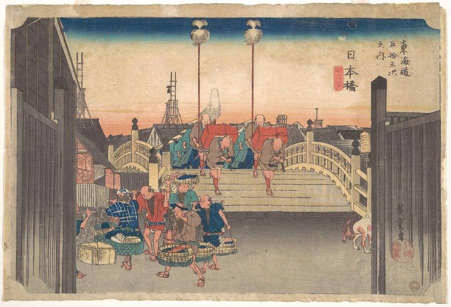
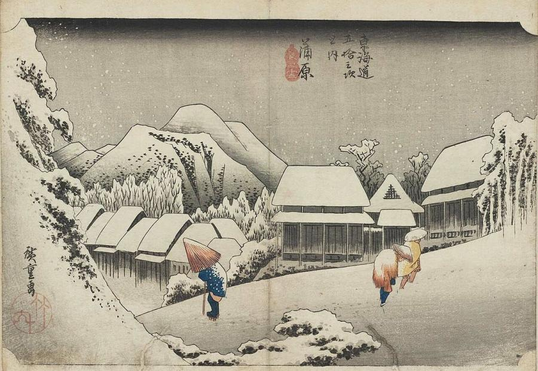
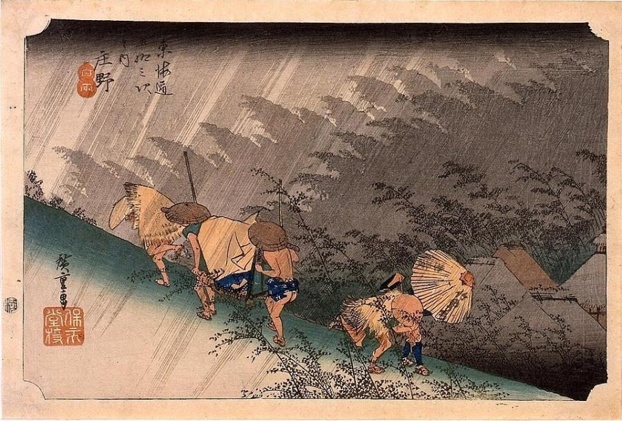
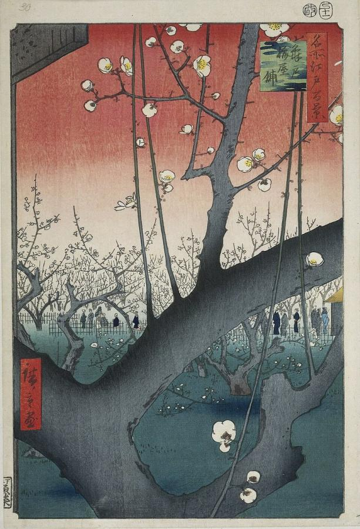
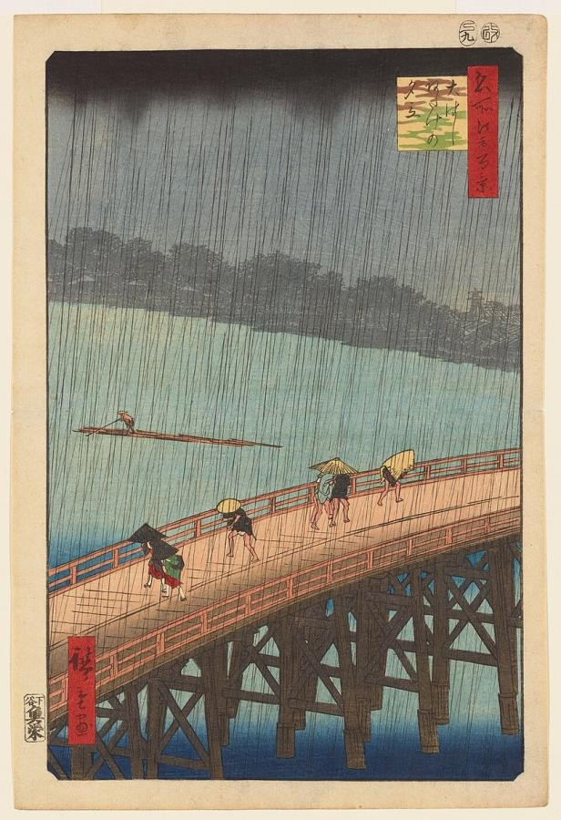
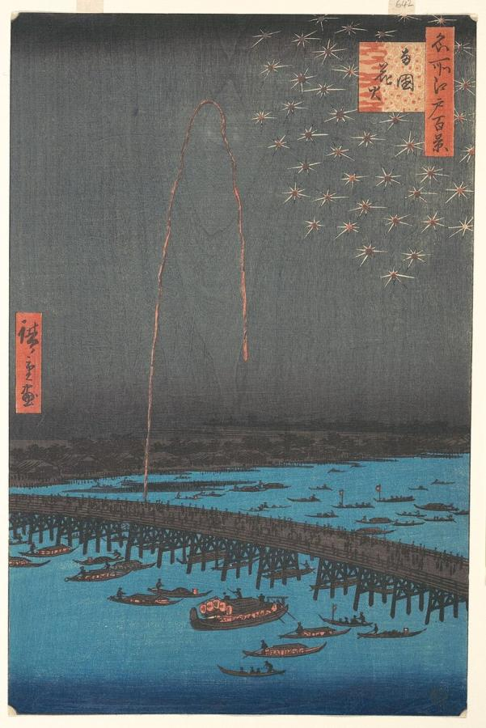

# Utagawa Hiroshige (1797–1858)

> The poet of the Japanese landscape print, whose rain, snow, moonlight and travellers on the road inspired Van Gogh and the Impressionists.

## Overview

Utagawa Hiroshige was the last great master of the ukiyo-e woodblock print. Where his older rival
Hokusai was dramatic and restless, Hiroshige was lyrical and atmospheric. He captured the mood of a
place at a particular moment: travellers caught in a downpour, a village under silent snow, cherry
blossoms by moonlight. His series *The Fifty-three Stations of the Tōkaidō* and *One Hundred Famous
Views of Edo* were enormous commercial successes. In Europe his bold compositions and colours helped
spark the craze for Japanese art.

## Life

Hiroshige was born in Edo (modern Tokyo) in 1797 into a samurai family, the Andō, whose hereditary job
was fire warden at Edo Castle. Both his parents died when he was about 12, and he inherited his
father's post. Around 1811 he became a pupil of the print designer Utagawa Toyohiro, who gave him the
name Hiroshige.

His early work was conventional: actors, beautiful women and warriors. He later handed the fire
warden post on to a relative and turned to landscape. The success of Hokusai's *Thirty-six Views of Mount Fuji*
had opened a new market. According to tradition, in 1832 he travelled the Tōkaidō, the great highway
between Edo and Kyoto, with an official delegation. The prints he published in 1833–1834 made him the
most popular landscape artist in Japan.

He went on to produce thousands of designs, including series on the Kisokaidō highway, the
provinces of Japan, and birds and flowers. In 1856, aged about 60, he became a Buddhist monk, but he
kept working on his last great project, *One Hundred Famous Views of Edo*. He died in Edo on 12
October 1858, probably in a cholera epidemic, leaving a farewell poem about travelling west to see
the famous sights of the Western Paradise.

## Style & Technique

Hiroshige designed his prints; carvers and printers made them. His designs use soft colour gradations
(*bokashi*), printed by wiping ink across the block, to suggest dawn, dusk, mist and moonlight. He was
a master of weather: rain drawn as fine lines, snow as blank paper, wind shown through bending trees
and flying hats.

In his late series *One Hundred Famous Views of Edo* he adopted a vertical format and strikingly
modern compositions. A huge object in the foreground, such as a branch, a horse's leg or a lantern,
frames a distant view. The effect is close to a photographer's use of depth of field. His deep blue,
made with imported Prussian blue, is sometimes called "Hiroshige blue".

## Legacy

Hiroshige's prints poured into Europe after Japan opened to trade, where artists collected them
eagerly. Vincent van Gogh painted careful copies of *Plum Park in Kameido* and *Sudden Shower*.
Whistler's nocturnes of the Thames and Monet's Japanese bridge at Giverny show his influence, as do
the Art Nouveau posters of the 1890s. In Japan his views remain the classic images of old Edo and the
Tōkaidō. Frank Lloyd Wright was a major collector and dealer of his prints.

## Key Works

<!-- works:start -->

### 1. Nihonbashi: Morning View (The Fifty-three Stations of the Tōkaidō, No. 1) (1833–1834)

*Woodblock print, ink and colour on paper · Impressions in many collections (e.g. Metropolitan Museum of Art)*

The first print of the series that made Hiroshige famous. At dawn, a feudal lord's procession marches over Edo's Nihonbashi bridge, the starting point of the Tōkaidō highway, while fish sellers hurry past with their loads. The great wooden gates open like a curtain on the journey ahead.

Image: [Wikimedia Commons](https://commons.wikimedia.org/wiki/File:%E6%9D%B1%E6%B5%B7%E9%81%93%E4%BA%94%E5%8D%81%E4%B8%89%E6%AC%A1%E4%B9%8B%E5%86%85_%E6%97%A5%E6%9C%AC%E6%A9%8B_%E6%9C%9D%E4%B9%8B%E6%99%AF-Stations_One-_Morning_View_of_Nihonbashi_MET_DP122174.jpg) · Utagawa Hiroshige · [CC0](http://creativecommons.org/publicdomain/zero/1.0/deed.en)

### 2. Kanbara: Night Snow (The Fifty-three Stations of the Tōkaidō, No. 16) (1833–1834)

*Woodblock print, ink and colour on paper · Impressions in many collections (e.g. Museum of Fine Arts, Boston)*

Snow blankets a mountain village at night, muffling every sound, as three figures trudge uphill under umbrellas and straw capes. Kanbara, on the warm Pacific coast, rarely sees snow. Hiroshige invented the scene for its poetic mood. The subtle grey gradations of the night sky, printed by wiping the block, show the refinement of Edo printmaking.

Image: [Wikimedia Commons](https://commons.wikimedia.org/wiki/File:Hiroshige-53-Stations-Hoeido-16-Kanbara-MFA-01.jpg) · Utagawa Hiroshige · Public domain

### 3. Shōno: Driving Rain (The Fifty-three Stations of the Tōkaidō, No. 46) (1833–1834)

*Woodblock print, ink and colour on paper · Impressions in many collections (e.g. Edo-Tokyo Museum)*

A sudden downpour sweeps across a hillside. Palanquin bearers and travellers run for shelter, bent against the wind, while bamboo groves toss in silhouette. The rain is drawn as fine diagonal lines across the whole sheet. It is one of the most celebrated images of weather in Japanese art.

Image: [Wikimedia Commons](https://commons.wikimedia.org/wiki/File:Hiroshige-53-Stations-Hoeido-46-Shono-Edo-Tokyo-M-01.jpg) · Utagawa Hiroshige · Public domain

### 4. Plum Park in Kameido (One Hundred Famous Views of Edo, No. 30) (1857)

*Woodblock print, ink and colour on paper, 36 × 24 cm · Impressions in many collections (e.g. Rijksmuseum, Amsterdam)*

A gnarled plum branch, dotted with white blossoms, fills the foreground so closely that it seems to press against our eyes. Visitors admire the orchard beyond, beneath a sky shading from red to white. Vincent van Gogh copied this print in oil in 1887, and its dramatic cropping became a lesson for European modernists.

Image: [Wikimedia Commons](https://commons.wikimedia.org/wiki/File:De_pruimenboomgaard_te_Kameido-Rijksmuseum_RP-P-1956-743.jpeg) · Utagawa; Hiroshige (I) , Utagawa died 1858; Uoya Eikichi Hiroshige (I) · Public domain

### 5. Sudden Shower over Shin-Ōhashi Bridge and Atake (One Hundred Famous Views of Edo, No. 58) (1857)

*Woodblock print, ink and colour on paper, 36 × 24 cm · Impressions in many collections (e.g. Brooklyn Museum)*

A summer storm breaks over a wooden bridge in Edo. People scurry across under hats and straw mats, and the far bank fades into grey. The rain is printed from two separate blocks, crossing at different angles, to suggest a heavy downpour. Van Gogh painted his own version, *Bridge in the Rain*, in 1887.

Image: [Wikimedia Commons](https://commons.wikimedia.org/wiki/File:Utagawa_Hiroshige_-_Evening_Shower_at_Atake_and_the_Great_Bridge.jpg) · Utagawa Hiroshige · Public domain

### 6. Fireworks at Ryōgoku (One Hundred Famous Views of Edo, No. 98) (1858)

*Woodblock print, ink and colour on paper, 36 × 24 cm · Impressions in many collections (e.g. Metropolitan Museum of Art)*

A single firework bursts in a shower of sparks over the Sumida River at night, while pleasure boats crowd the dark water below the Ryōgoku bridge. The deep, velvety blues and blacks and the tiny points of light anticipate Whistler's *Nocturne in Black and Gold: The Falling Rocket* (1875).

Image: [Wikimedia Commons](https://commons.wikimedia.org/wiki/File:%E5%90%8D%E6%89%80%E6%B1%9F%E6%88%B6%E7%99%BE%E6%99%AF_%E4%B8%A1%E5%9B%BD%E8%8A%B1%E7%81%AB-Fireworks_at_Ry%C5%8Dgoku_Bridge,_from_the_series_One_Hundred_Famous_Views_of_Edo_MET_DP121524.jpg) · Utagawa Hiroshige · [CC0](http://creativecommons.org/publicdomain/zero/1.0/deed.en)

<!-- works:end -->
## Sources

- [Hiroshige (Wikipedia)](https://en.wikipedia.org/wiki/Hiroshige)
- [The Fifty-three Stations of the Tōkaidō (Wikipedia)](https://en.wikipedia.org/wiki/The_Fifty-three_Stations_of_the_T%C5%8Dkaid%C5%8D)
- [One Hundred Famous Views of Edo (Wikipedia)](https://en.wikipedia.org/wiki/One_Hundred_Famous_Views_of_Edo)
