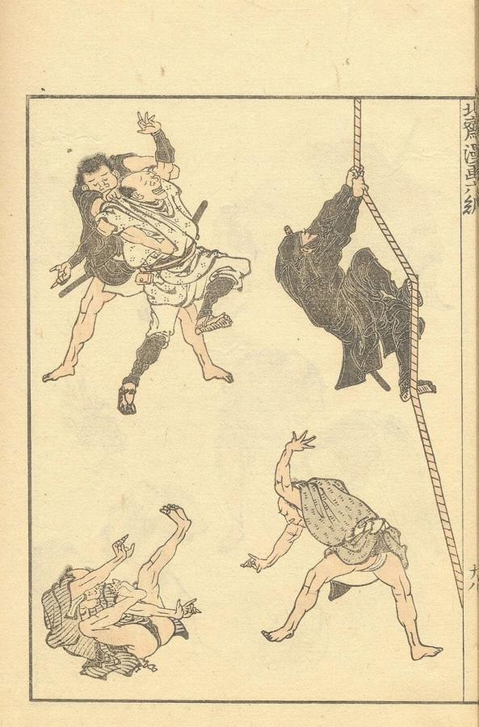
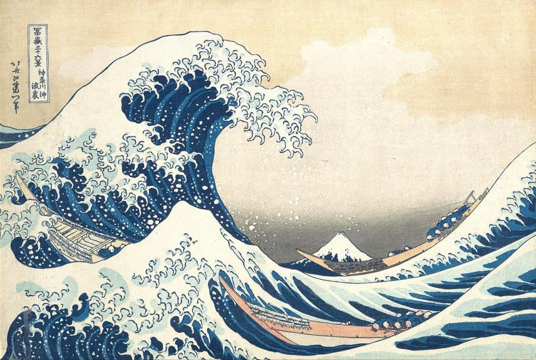
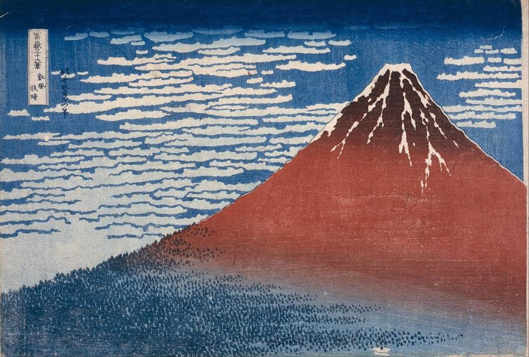
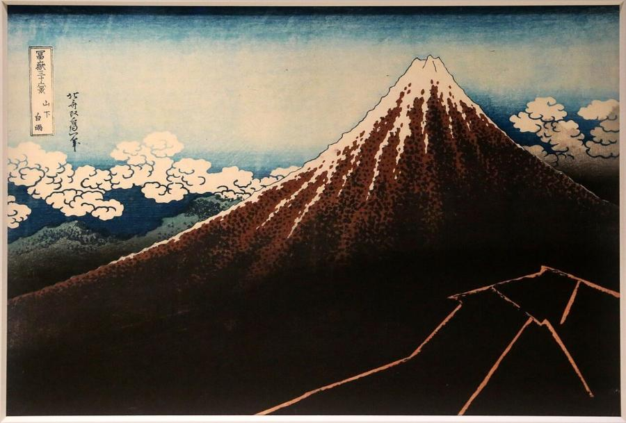
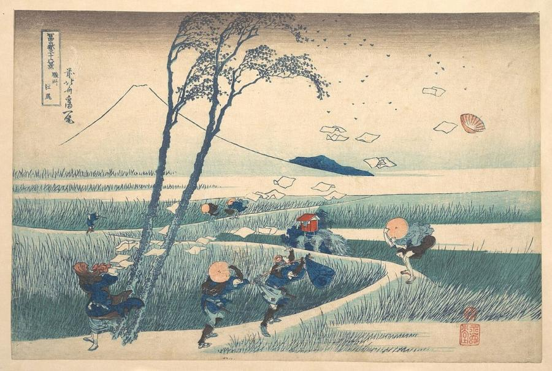
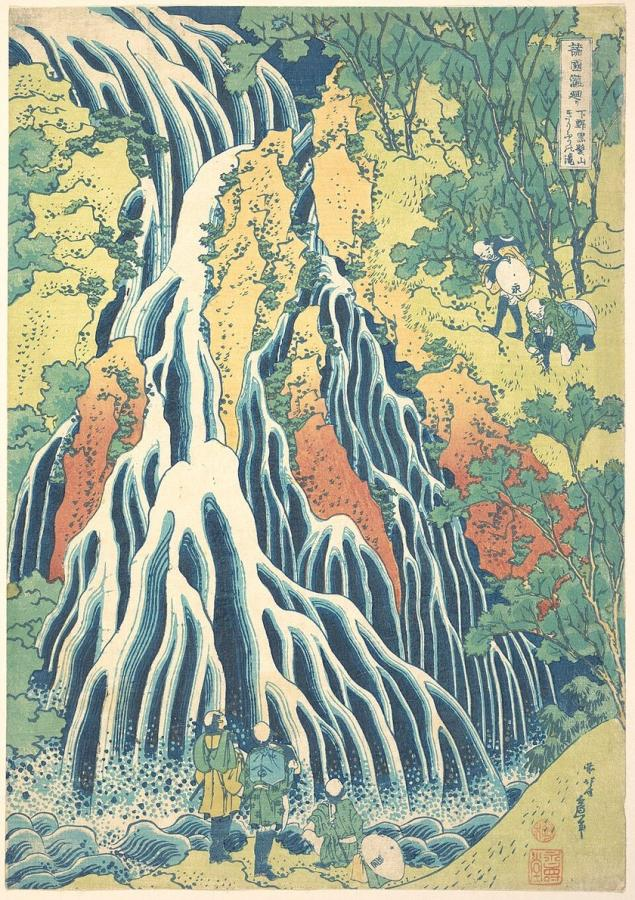

# Katsushika Hokusai (1760–1849)

> The restless Edo master of the woodblock print, creator of *The Great Wave*, who called himself "the old man mad about painting".

## Overview

Katsushika Hokusai was one of the most prolific and inventive artists in history. Over a career of 70
years he produced paintings, book illustrations, erotic prints, surimono (privately published prints),
drawing manuals and, in his seventies, the landscape print series that made him world-famous. *The
Great Wave off Kanagawa* is instantly recognisable across the globe. Hokusai's energy, humour and
endless curiosity about the visible world also made him a major influence on European art in the
late 19th century.

## Life

Hokusai was born in 1760 in the Katsushika district of Edo (modern Tokyo). As a teenager he worked in a
lending library and trained as a woodblock carver. At about 18 he entered the studio of Katsukawa
Shunshō, a leading designer of prints of kabuki actors. He later broke away and studied other
schools of painting, Japanese, Chinese and even Western.

He changed his artistic name more than 30 times, often to mark a new phase of his work. He is also
said to have moved house more than 90 times, and he lived in poverty for much of his life despite
his fame. His daughter Katsushika Ōi became a fine painter and assisted him in his old age.

In 1814 he began publishing the *Hokusai Manga*. Around 1830–1832, in his early seventies, he
designed *Thirty-six Views of Mount Fuji*, followed by series on waterfalls, bridges and birds and
flowers. In the postscript to *One Hundred Views of Mount Fuji* (1834) he wrote that nothing he drew
before age 70 was worth noticing, and that by 110 every dot and line would be alive. He died in Edo on
10 May 1849, at 88, reportedly saying that with five more years he could have become a true painter.

## Style & Technique

Ukiyo-e ("pictures of the floating world") were a collaborative art. Hokusai drew the design, and
specialist carvers cut it into cherry-wood blocks, one for each colour. Printers then pressed the
paper onto the inked blocks by hand. Hokusai's designs push this medium to its limits, with bold
outlines, dramatic cropping and vivid colour, including the imported Prussian blue that
characterises his Fuji series.

He was a keen student of Western perspective, which he learned from Dutch prints available in Japan.
He combined it with Japanese traditions of flat colour and strong design. He observed people at work
and nature in motion, especially water: waves, waterfalls, rain and whirlpools. He drew them with
extraordinary precision and fantasy.

## Legacy

When Japanese prints reached Europe after Japan opened to trade in the 1850s, Hokusai became a
sensation. The craze for Japanese art, *Japonisme*, shaped the Impressionists and Post-Impressionists.
Monet, Degas, Van Gogh and Cassatt all learned from him, and Debussy kept a copy of *The Great Wave*
and put it on the cover of his score *La Mer*. Today his wave appears on everything from Japanese
banknotes (the 1,000-yen note issued in 2024) to emoji. A museum dedicated to him, the Sumida Hokusai
Museum, opened in Tokyo in 2016.

## Key Works

<!-- works:start -->

### 1. Hokusai Manga (Sketches by Hokusai) (1814–1878)

*Woodblock-printed books, 15 volumes · Copies in many collections*

Fifteen volumes of sketches published from 1814 onwards, the last appearing long after Hokusai's death. They show thousands of subjects: people at work and play, animals, plants, gods, ghosts, landscapes and comic figures, drawn with wit and economy. Meant as a model book for students, the *Manga* became a best-seller. It was one of the first Japanese books to excite European artists in the 1850s–60s.

Image: [Wikimedia Commons](https://commons.wikimedia.org/wiki/File:Hokusai_sketches_-_hokusai_manga_vol6.jpg) · Katsushika Hokusai · Public domain

### 2. The Great Wave off Kanagawa (c. 1831)

*Woodblock print, ink and colour on paper, 25.7 × 37.9 cm · Impressions in many collections (e.g. Metropolitan Museum of Art, British Museum)*

A towering wave curls over three fishing boats, its foam breaking into claw-like fingers, while Mount Fuji sits small and calm in the distance. It opens the series *Thirty-six Views of Mount Fuji*. The print used the newly imported Prussian blue pigment. Thousands of impressions were made, and it has become perhaps the most famous Japanese artwork in the world.

Image: [Wikimedia Commons](https://commons.wikimedia.org/wiki/File:Tsunami_by_hokusai_19th_century.jpg) · Katsushika Hokusai · Public domain

### 3. Fine Wind, Clear Morning ("Red Fuji") (c. 1831)

*Woodblock print, ink and colour on paper, 25.7 × 38 cm · Impressions in many collections (e.g. Metropolitan Museum of Art)*

Mount Fuji, turned red by early morning light in late summer, rises against a blue sky filled with rows of mackerel clouds. Almost nothing else is shown: a few trees at its base. The utter simplicity makes it one of the boldest images of the series and an icon of the sacred mountain.

Image: [Wikimedia Commons](https://commons.wikimedia.org/wiki/File:Katsushika_Hokusai_-_Fine_Wind,_Clear_Morning_(Gaif%C5%AB_kaisei)_-_Google_Art_Project.jpg) · Katsushika Hokusai · Public domain

### 4. Thunderstorm Beneath the Summit (c. 1831)

*Woodblock print, ink and colour on paper · Impressions in many collections*

The companion to *Red Fuji*. The mountain's peak rises serenely into clear sky, while far below on its dark slopes a zigzag of lightning flashes through the storm. The contrast between the calm summit and the violent weather beneath suggests the mountain's permanence above the storms of the world.

Image: [Wikimedia Commons](https://commons.wikimedia.org/wiki/File:Katsushika_Hokusai,_tempesta_sotto_la_vetta,_dalla_serie_delle_36_vedute_del_monte_fuji,_1831_ca.jpg) · Sailko · [CC BY 3.0](https://creativecommons.org/licenses/by/3.0)

### 5. Ejiri in Suruga Province (c. 1832)

*Woodblock print, ink and colour on paper · Impressions in many collections (e.g. Metropolitan Museum of Art)*

A sudden gust sweeps across a marshy road. Travellers bend double and clutch their hats, and a stream of papers flies from a woman's kimono into the sky. Fuji is reduced to a simple white outline in the background. Hokusai captures an invisible force, wind, through its effects. Photographer Jeff Wall restaged the scene in 1993.

Image: [Wikimedia Commons](https://commons.wikimedia.org/wiki/File:%E5%86%A8%E5%B6%BD%E4%B8%89%E5%8D%81%E5%85%AD%E6%99%AF_%E9%A7%BF%E5%B7%9E%E6%B1%9F%E5%B0%BB-Ejiri_in_Suruga_Province_(Sunsh%C5%AB_Ejiri),_from_the_series_Thirty-six_Views_of_Mount_Fuji_(Fugaku_sanj%C5%ABrokkei)_MET_DP141030.jpg) · Katsushika Hokusai · [CC0](http://creativecommons.org/publicdomain/zero/1.0/deed.en)

### 6. Kirifuri Waterfall at Kurokami Mountain in Shimotsuke (c. 1832)

*Woodblock print, ink and colour on paper · Impressions in many collections (e.g. Metropolitan Museum of Art)*

From the series *A Tour of the Waterfalls of the Provinces*. The falls pour down the rock face in branching, finger-like streams of blue and white, while tiny pilgrims gaze up in wonder. Hokusai treats falling water as a living, almost animal form. The series shows his lifelong fascination with water in every state.

Image: [Wikimedia Commons](https://commons.wikimedia.org/wiki/File:Kirifuri_Waterfall_at_Kurokami_Mountain_in_Shimotsuke_MET_DP141256.jpg) · Katsushika Hokusai · [CC0](http://creativecommons.org/publicdomain/zero/1.0/deed.en)

<!-- works:end -->
## Sources

- [Hokusai (Wikipedia)](https://en.wikipedia.org/wiki/Hokusai)
- [The Great Wave off Kanagawa (Wikipedia)](https://en.wikipedia.org/wiki/The_Great_Wave_off_Kanagawa)
- [Thirty-six Views of Mount Fuji (Wikipedia)](https://en.wikipedia.org/wiki/Thirty-six_Views_of_Mount_Fuji)
