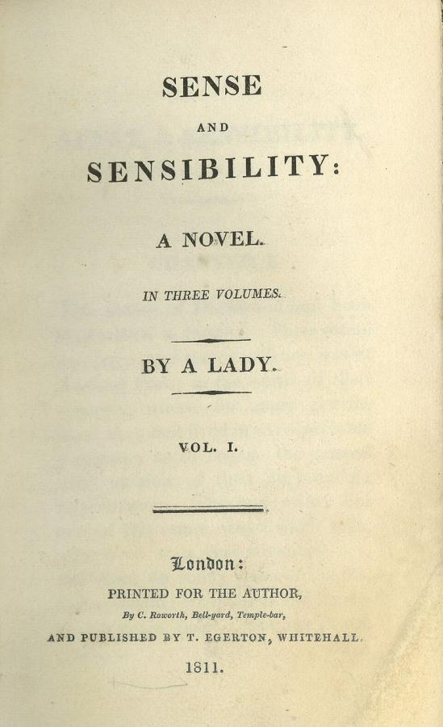
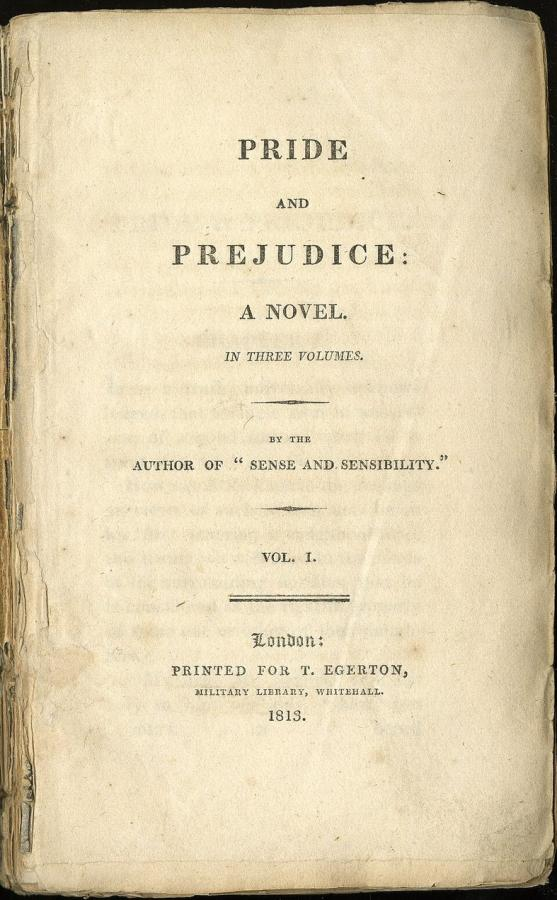
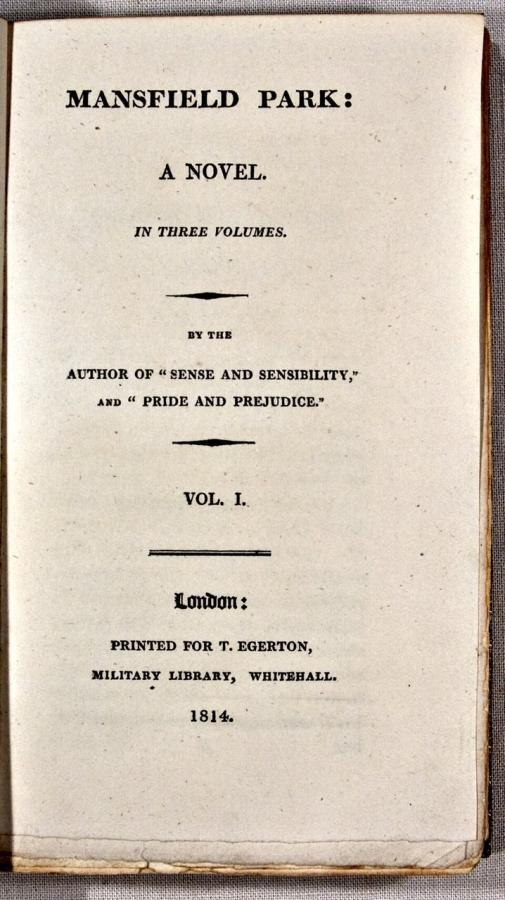
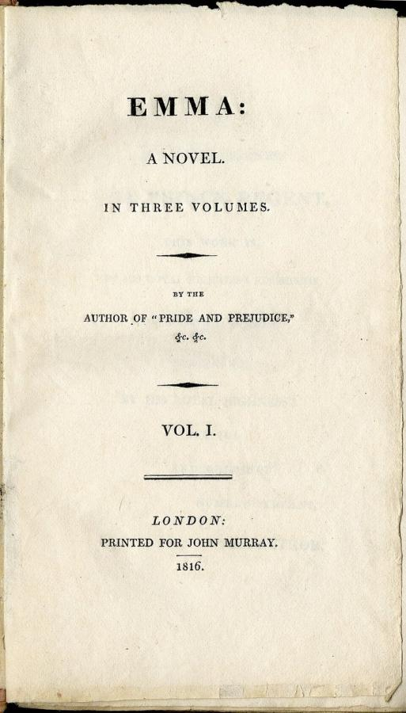
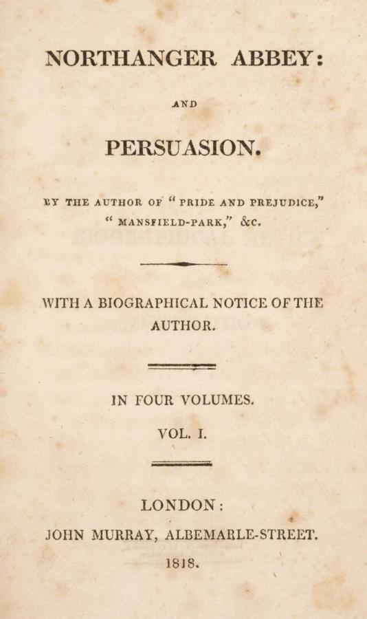

# Jane Austen (1775–1817)

> The English novelist whose six domestic comedies of manners, courtship and money remain among the most widely read novels in the language.

## Overview

Jane Austen wrote six completed novels, published anonymously during her lifetime, that turned the
narrow social world of the English gentry, courtship, inheritance, class anxiety and the search for a
good marriage, into some of the most enduringly popular fiction in English. Her narrow ironic focus
and precise control of free indirect narration, letting a story's language slide into a character's
own voice without announcing it, influenced the development of the novel as a form well beyond her
own century.

## Life

Austen was born in 1775 in Steventon, Hampshire, the seventh of eight children of a country clergyman,
and grew up in a family that encouraged reading, amateur theatre and writing from childhood; her early,
often absurdist "juvenilia" already show a sharp comic sensibility. She began drafting early versions
of what became *Sense and Sensibility* and *Pride and Prejudice* in her twenties, though publication
came only later, after her father's death and years of family financial instability had settled the
family at Chawton Cottage in Hampshire. *Sense and Sensibility* appeared in 1811, credited only to "A
Lady," and four more novels followed over the next six years, each published anonymously, with only
close family aware of her authorship. She fell ill, probably with Addison's disease though the exact
cause remains debated, and died in 1817 at 41, with her authorship publicly acknowledged only in a
biographical notice her brother attached to the posthumous publication of her final two novels.

## Style & Technique

Austen worked within a deliberately narrow social canvas, mainly the English gentry and their
immediate social concerns, courtship, income, inheritance, rather than the broader historical and
political events of her turbulent era. Her most distinctive technical achievement is her mastery of
free indirect discourse, narrating events in the third person while letting the prose subtly absorb a
character's own irony, self-deception or blind spots, so that a reader senses a character's error
before the character does. Her irony operates at the level of the sentence as much as the plot,
producing comedy that depends on precise, economical language rather than incident.

## Legacy

Austen's six novels have remained continuously in print since her death and are now among the most
widely read and adapted works in English literature, generating a large and continuing industry of
film, television and stage adaptation. Her technical innovations in narrative point of view influenced
the development of the novel through the nineteenth and twentieth centuries, and she is now routinely
placed among the greatest novelists in the English language, a reputation that grew steadily after her
death rather than during the modest, anonymous success of her own lifetime.

## Key Works

<!-- works:start -->

### 1. Sense and Sensibility (1811)

*Novel, first edition title page · Published by Thomas Egerton, London, England*

Austen's first published novel, issued anonymously as "By a Lady," follows two sisters of contrasting temperament, one guided by prudent restraint and one by open emotion, through courtship and financial precarity after their father's death leaves them dependent on relatives.

Image: [Wikimedia Commons](https://commons.wikimedia.org/wiki/File:SenseAndSensibilityTitlePage.jpg) · Jane Austen (1775-1817) · Public domain

### 2. Pride and Prejudice (1813)

*Novel, first edition title page · Published by Thomas Egerton, London, England*

Austen's best-known novel, following the sharp-witted Elizabeth Bennet and the proud, initially off-putting Mr Darcy as misunderstanding and social pressure over five sisters' marriage prospects slowly give way to mutual respect, still one of the most widely read novels in the English language.

Image: [Wikimedia Commons](https://commons.wikimedia.org/wiki/File:PrideAndPrejudiceTitlePage.jpg) · Jane Austen (1775-1817) · Public domain

### 3. Mansfield Park (1814)

*Novel, first edition title page · Published by Thomas Egerton, London, England*

Austen's longest and most morally serious novel, following the quiet, principled Fanny Price as a poor relation raised among wealthy cousins, and touching, more directly than her other novels, on the West Indian slave-plantation wealth underpinning the English gentry households she otherwise portrays with comic detachment.

Image: [Wikimedia Commons](https://commons.wikimedia.org/wiki/File:MansfieldParkTitlePage.jpg) · Jane Austen (1775 - 1817) · Public domain

### 4. Emma (1815)

*Novel, first edition title page · Published by John Murray, London, England*

A comedy of misplaced matchmaking, following the wealthy, well-meaning but overconfident Emma Woodhouse as her attempts to arrange other people's romances repeatedly misfire, widely admired for the tightly controlled irony of its narration, which lets readers see through Emma's misjudgements well before she does.

Image: [Wikimedia Commons](https://commons.wikimedia.org/wiki/File:EmmaTitlePage.jpg) · Jane Austen · Public domain

### 5. Northanger Abbey and Persuasion (1817)

*Novel, first edition title page, published together in four volumes · Published posthumously by John Murray, London, England*

Two novels published together the year after Austen's death, with a biographical notice by her brother revealing her authorship publicly for the first time. Northanger Abbey gently satirises Gothic novel conventions, while Persuasion, her last completed work, follows a quieter, more autumnal story of a woman reconsidering a broken engagement years later.

Image: [Wikimedia Commons](https://commons.wikimedia.org/wiki/File:NorthangerPersuasionTitlePage.jpg) · Unknown author Unknown author · Public domain

<!-- works:end -->
## Sources

- [Jane Austen (Wikipedia)](https://en.wikipedia.org/wiki/Jane_Austen)
- [Pride and Prejudice (Wikipedia)](https://en.wikipedia.org/wiki/Pride_and_Prejudice)
- [Free indirect speech (Wikipedia)](https://en.wikipedia.org/wiki/Free_indirect_speech)
