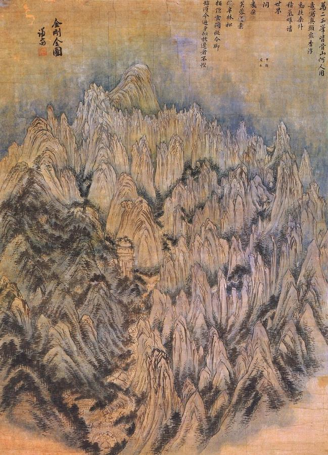
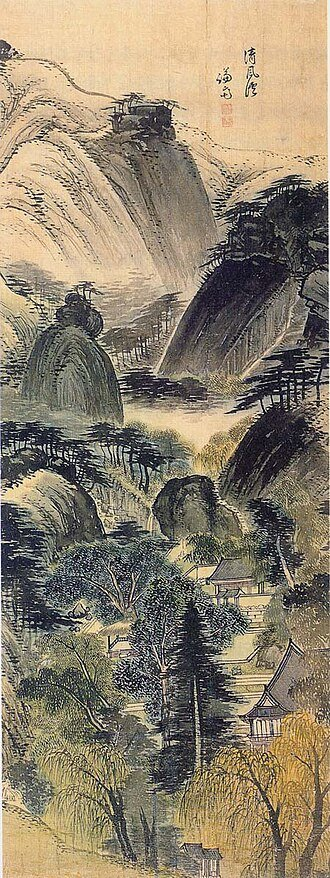
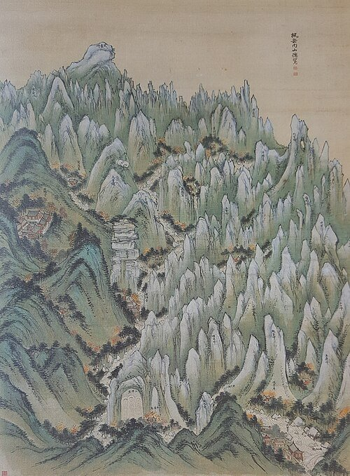
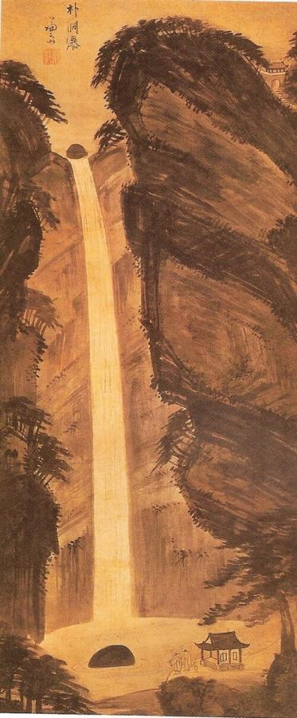
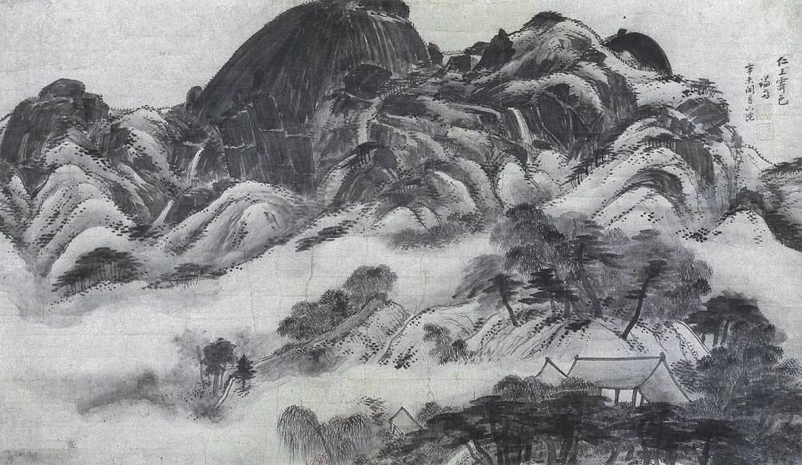
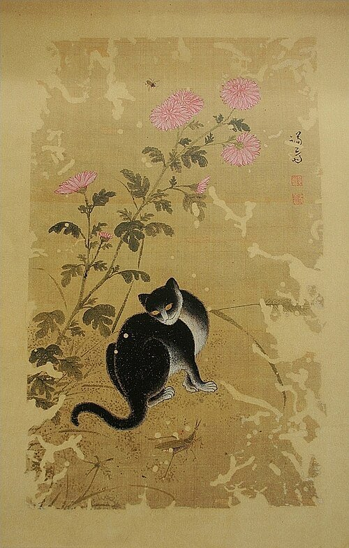

# Jeong Seon (1676–1759)

> Korea's great landscape painter, who created "true-view" painting of real Korean mountains instead of imagined Chinese scenery.

## Overview

Jeong Seon, known by his pen name Gyeomjae, transformed Korean landscape painting. For centuries
Korean painters had followed Chinese models, painting idealised mountains they had never seen. Jeong
Seon instead painted the actual scenery of Korea: the Diamond Mountains (Geumgangsan), the hills and
valleys of Seoul, riverside pavilions and famous waterfalls. He devised new brush techniques to
capture their granite peaks and wooded slopes. This "true-view landscape" (*jingyeong sansuhwa*)
expressed a growing pride in Korean culture during the 18th-century Joseon dynasty.

## Life

Jeong Seon was born in 1676 in Hanyang (modern Seoul), into a scholarly family of modest means. His
father died when he was young, and his talent for painting brought him to the attention of scholars
and officials. He trained in painting and in Neo-Confucian learning. Through recommendations he held a
series of government posts, eventually serving as county magistrate in places such as Hayang and
Yangcheon, near Seoul. He rose to high official rank in old age.

He lived most of his life near Mount Inwang in the western part of Seoul, where his circle of friends
included the poet Yi Byeong-yeon. The two men exchanged poems and paintings for decades. In 1711 and
1712 Jeong Seon travelled to the Diamond Mountains, and the albums he made there made his name. He
painted until late in life, and he produced a vast body of work. He died in 1759 at 83.

## Style & Technique

Jeong Seon painted in ink, sometimes with light colour, on paper or silk. To capture the distinctive
landscape of Korea he invented his own vocabulary of brushstrokes. He used sharp, vertical strokes
for crystalline granite peaks, and soft, wet dots (the "rice-dot" technique of Chinese tradition, used
in a new way) for rounded, forested earth mountains.

He often combined a bird's-eye view with exaggeration, compressing whole mountain ranges into one
dramatic composition. In his late work, such as *Inwang jesaekdo*, he used heavy, broad sweeps of dark
ink to make rocks look massive and wet. His paintings are not maps but expressions of the emotional
experience of real places.

## Legacy

Jeong Seon's true-view landscapes inspired a generation of Korean painters, including Kim Hong-do
and Sim Sa-jeong, and helped establish a distinctly Korean school of painting. Two of his works,
*Geumgang jeondo* and *Inwang jesaekdo*, are designated National Treasures of South Korea. The
Gyeomjae Jeong Seon Art Museum opened in 2009 in Seoul's Gangseo district, where he once served as
magistrate. He is regarded, with Kim Hong-do and Sin Yun-bok, as one of the great painters of the
Joseon dynasty.

## Key Works

<!-- works:start -->

### 1. General View of Mount Geumgang (Geumgang jeondo) (1734)

*Hanging scroll, ink and light colour on paper, 130.7 × 94.1 cm · Leeum, Samsung Museum of Art, Seoul (National Treasure)*

The famous Diamond Mountains of Korea's east coast seen as if from the air, packed into a great circular composition. Sharp white granite peaks, drawn with vertical, needle-like strokes, rise around softer, wooded earthen hills rendered with wet dots. Jeong Seon balanced them like the yin and yang of Korean thought. It is one of the landmark images of Korean art.

Image: [Wikimedia Commons](https://commons.wikimedia.org/wiki/File:Geumgangjeondo.jpg) · Jeong Seon · Public domain

### 2. Valley of Clear Wind (Cheongpunggye) (1739)

*Hanging scroll, ink and light colour on silk · Gansong Art Museum, Seoul*

A wooded valley at the foot of Mount Inwang in Seoul, where a scholarly family kept a pavilion among pines and rocks. Jeong Seon painted many such views of real places in and around the capital. He mixed dense, dark ink with lighter washes to capture the texture of the hills he knew from daily walks.

Image: [Wikimedia Commons](https://commons.wikimedia.org/wiki/File:Jeong_Seon-Cheongpung.gye-02.jpg) · Jeong Seon · Public domain

### 3. Overview of Inner Mount Geumgang in Autumn (Pungak naesan chongram) (c. 1740)

*Hanging scroll, ink and colour on silk · Gansong Art Museum, Seoul*

Another vision of the Diamond Mountains, this time in autumn, when they are called Pungak ("maple mountain"). Temples and hermitages are tucked among the crowded peaks, with touches of red foliage. Jeong Seon travelled to Mount Geumgang several times from 1711 and painted it throughout his life.

Image: [Wikimedia Commons](https://commons.wikimedia.org/wiki/File:Jeong_Seon-PungakNaesanChongramDo.jpg) · Jeong Seon · Public domain

### 4. Bakyeon Falls (18th century)

*Hanging scroll, ink on silk, 119.5 × 52.2 cm · Private collection*

A waterfall near Kaesong, counted among the "three wonders" of that old capital, crashes down a sheer cliff into a deep pool while tiny visitors watch from below. Jeong Seon exaggerated the height of the falls and darkened the cliffs with heavy ink so that the white water seems to roar out of the picture.

Image: [Wikimedia Commons](https://commons.wikimedia.org/wiki/File:Jeong_Seon-Bakyeon_pokpo.jpg) · 겸제 정선 (1676 숙종 2년 출생- 1759 영조35년 사망) · Public domain

### 5. Clearing after Rain on Mount Inwang (Inwang jesaekdo) (1751)

*Hanging scroll, ink on paper, 79.2 × 138.2 cm · National Museum of Korea, Seoul (National Treasure)*

Jeong Seon's masterpiece, painted at 75. The granite peaks of Mount Inwang, behind the royal palace in Seoul, rise dark and wet after a summer rain, while mist drifts through the pine woods below. The rock faces are built with broad, heavy sweeps of ink, a daring technique for its time. According to tradition, he painted it hoping for the recovery of his dying friend, the poet Yi Byeong-yeon. It entered the national collection in 2021 as part of the Lee Kun-hee donation.

Image: [Wikimedia Commons](https://commons.wikimedia.org/wiki/File:Inwangjesaekdo.jpg) · Jeong Seon · Public domain

### 6. Cat on an Autumn Day (Chuil hanmyo) (18th century)

*Ink and colour on silk · Gansong Art Museum, Seoul*

Not all of Jeong Seon's work is grand landscape. Here a cat sits among autumn flowers, alert and relaxed at once. Small paintings of animals, insects and plants were popular with Korean collectors. This one shows his gentle observation of everyday nature.

Image: [Wikimedia Commons](https://commons.wikimedia.org/wiki/File:Jeong_Seon-Chuil_hanmyo-Free_cat_on_an_autumn_day-01.jpg) · Jeong Seon · Public domain

<!-- works:end -->
## Sources

- [Jeong Seon (Wikipedia)](https://en.wikipedia.org/wiki/Jeong_Seon)
- [Inwang jesaekdo (Wikipedia)](https://en.wikipedia.org/wiki/Inwang_jesaekdo)
- [Korean painting (Wikipedia)](https://en.wikipedia.org/wiki/Korean_painting)
