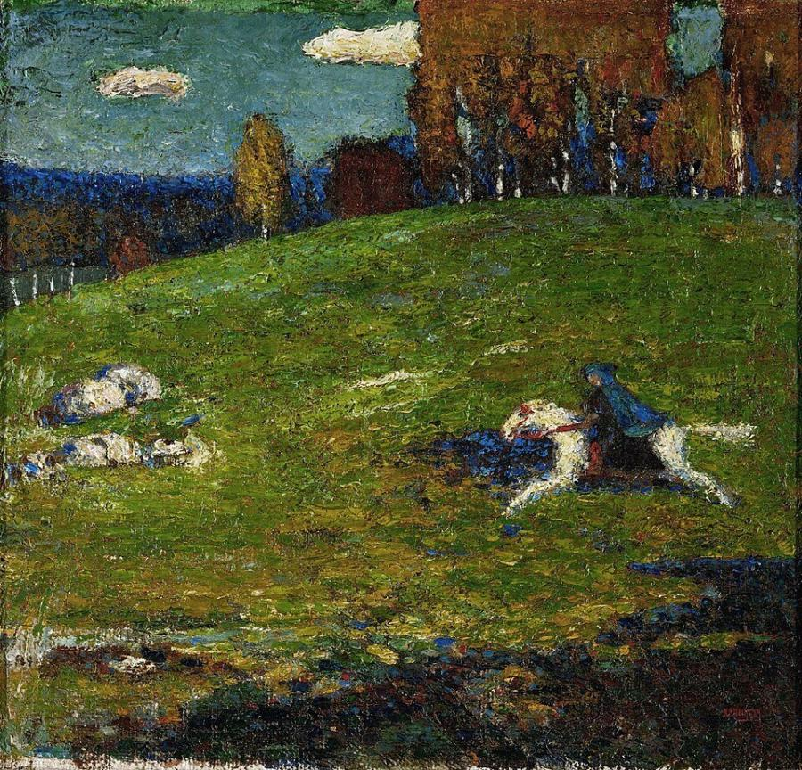
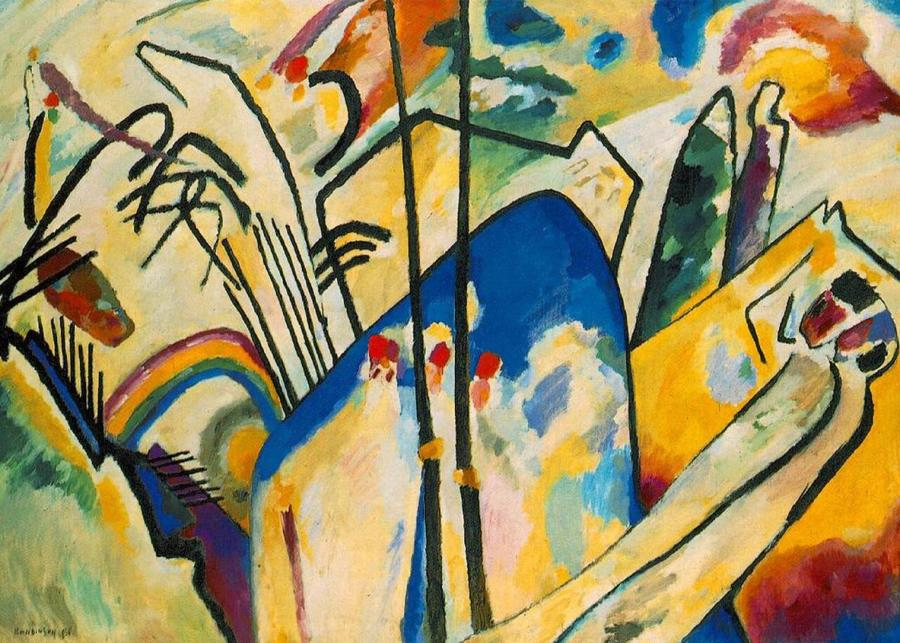
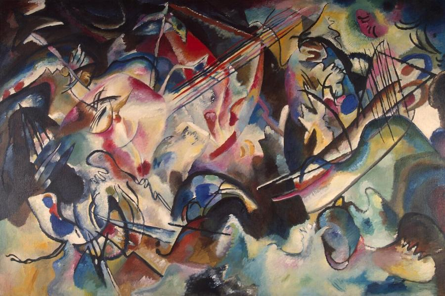
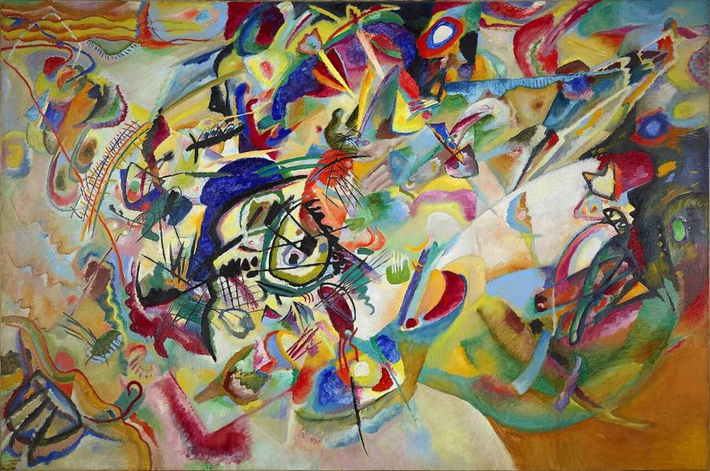
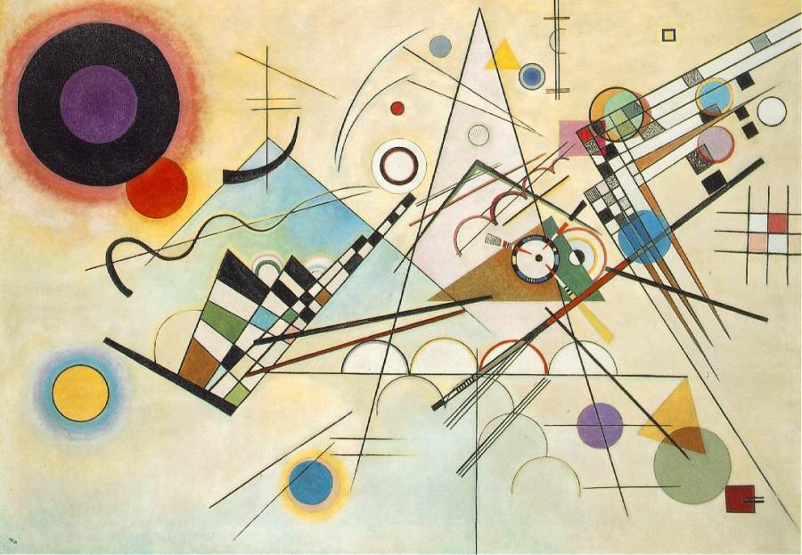
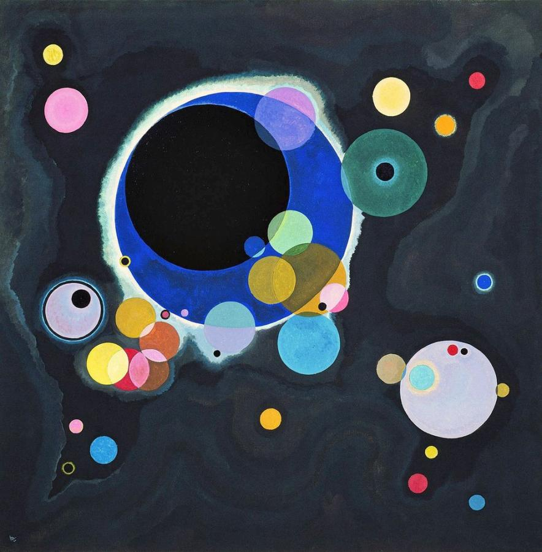

# Wassily Kandinsky (1866–1944)

> Russian painter and theorist, one of the pioneers of abstract art, who believed colour could affect the soul like music.

## Overview

Wassily Kandinsky is widely credited as one of the first painters to create purely abstract works in
Europe, and he was abstraction's most influential theorist. Trained as a lawyer, he turned to art at
30. He came to believe that colours and forms, freed from the task of depicting objects, could express
spiritual truths and move the viewer as directly as music. He co-founded the Blue Rider group in
Munich, taught at the Bauhaus, and wrote *On the Spiritual in Art* (1911), a key text of modernism.

## Life

Kandinsky was born in Moscow on 16 December 1866 and grew up in Odessa. He studied law and economics
at Moscow University and began a promising academic career. In 1896, having seen one of Monet's
*Haystacks* in an exhibition and heard Wagner's *Lohengrin* at the Bolshoi, he gave up law and moved to
Munich to study painting.

In Munich he founded an art school and exhibiting society. He lived and travelled with the painter
Gabriele Münter, and in the Bavarian village of Murnau his colours grew bolder. In 1911 he and Franz
Marc founded *Der Blaue Reiter* (The Blue Rider) and published an influential almanac. Around the same
time he painted his first fully abstract works.

The First World War forced him back to Russia, where he took part in the new Soviet cultural
institutions after the 1917 Revolution and married Nina Andreevskaya. Disillusioned, he returned to
Germany in 1921 and from 1922 to 1933 taught at the Bauhaus in Weimar and Dessau, where he published
*Point and Line to Plane* (1926). When the Nazis closed the Bauhaus he moved to Neuilly-sur-Seine near
Paris, becoming a French citizen in 1939. He died there on 13 December 1944.

## Style & Technique

Kandinsky's work evolved from Russian folk and fairy-tale scenes, through Fauve-like landscapes at
Murnau, to the explosive abstractions of 1911–1914. He sorted his works into *Impressions* (from
nature), *Improvisations* (spontaneous expressions of inner feeling) and *Compositions* (the most
carefully planned works). He made only ten *Compositions* over 30 years.

He probably experienced synaesthesia, seeing colours when hearing sounds. He assigned emotional and
musical qualities to colours: yellow was like a trumpet, blue a deep cello. At the Bauhaus his work
became geometric, built from circles, triangles and lines in careful balance. In Paris his late style
included soft, biomorphic forms that resemble microscopic organisms.

## Legacy

Kandinsky's writings and paintings laid the foundations for 20th-century abstraction. They influenced
the Abstract Expressionists in New York and generations of designers through his Bauhaus teaching.
The Solomon R. Guggenheim Museum, founded around a collection of "non-objective" art, holds more than
150 of his works. Compositions I–III were destroyed in the Second World War. His paintings now sell for
tens of millions of dollars, and in 2017 *Murnau with Church II* sold for £33 million.

## Key Works

<!-- works:start -->

### 1. The Blue Rider (1903)

*Oil on cardboard, 52.1 × 54.6 cm · Foundation E.G. Bührle Collection, Zurich (on loan to Kunsthaus Zürich)*

A rider in a blue cloak gallops across a sunlit meadow, painted in dabs of colour that break up the forms. The small painting is still figurative, but colour is already doing the expressive work. Its title later gave its name to the artists' group that Kandinsky and Franz Marc founded in 1911.

Image: [Wikimedia Commons](https://commons.wikimedia.org/wiki/File:Wassily_Kandinsky,_1903,_The_Blue_Rider_(Der_Blaue_Reiter),_oil_on_canvas,_52.1_x_54.6_cm,_Stiftung_Sammlung_E.G._B%C3%BChrle,_Zurich.jpg) · Wassily Kandinsky · Public domain

### 2. Composition IV (1911)

*Oil on canvas, 159.5 × 250.5 cm · Kunstsammlung Nordrhein-Westfalen, Düsseldorf*

Behind the bursts of colour and black lines lie hidden images: Cossacks with lances, a castle on a blue mountain, reclining lovers, a rainbow. Kandinsky was gradually stripping away recognisable subject matter so that colour and line could act directly on the viewer's emotions, like music.

Image: [Wikimedia Commons](https://commons.wikimedia.org/wiki/File:Vassily_Kandinsky,_1911_-_Composition_No_4.jpg) · Wassily Kandinsky · Public domain

### 3. Composition VI (1913)

*Oil on canvas, 195 × 300 cm · State Hermitage Museum, St Petersburg*

Kandinsky struggled for months with the theme of the Flood, and in the end he found release by repeating the word "Deluge" to himself. The finished canvas is a storm of colliding colour, line and form, a vision of destruction and rebirth in which the original subject is almost entirely dissolved.

Image: [Wikimedia Commons](https://commons.wikimedia.org/wiki/File:Kandinsky_-_Composition_VI,_1913,_%D0%93%D0%AD-9662.jpg) · Wassily Kandinsky · Public domain

### 4. Composition VII (1913)

*Oil on canvas, 200 × 300 cm · State Tretyakov Gallery, Moscow*

Considered the summit of Kandinsky's pre-war work, this huge canvas swirls with intersecting shapes and colours around a dark central vortex. It draws on the themes of resurrection, the Last Judgment and the Garden of Love. He made more than 30 preparatory studies and then painted it in about four days.

Image: [Wikimedia Commons](https://commons.wikimedia.org/wiki/File:Composition_VII_-_Wassily_Kandinsky,_GAC.jpg) · Wassily Kandinsky · Public domain

### 5. Composition VIII (1923)

*Oil on canvas, 140 × 201 cm · Solomon R. Guggenheim Museum, New York*

Painted at the Bauhaus, it shows the change in Kandinsky's style after his years in revolutionary Russia. Instead of stormy colour, crisp geometric circles, triangles, grids and lines float on a pale ground in precise balance. He called circles "the synthesis of the greatest oppositions".

Image: [Wikimedia Commons](https://commons.wikimedia.org/wiki/File:Vassily_Kandinsky,_1923_-_Composition_8,_huile_sur_toile,_140_cm_x_201_cm,_Mus%C3%A9e_Guggenheim,_New_York.jpg) · Wassily Kandinsky · Public domain

### 6. Several Circles (1926)

*Oil on canvas, 140.3 × 140.7 cm · Solomon R. Guggenheim Museum, New York*

Translucent coloured circles, large and small, overlap and float on a dark, cosmic ground. They look like planets, cells or musical notes. It is one of Kandinsky's purest and most serene works, reducing painting to the interplay of a single shape and colour.

Image: [Wikimedia Commons](https://commons.wikimedia.org/wiki/File:Vassily_Kandinsky,_1926_-_Several_Circles,_Gugg_0910_25.jpg) · Wassily Kandinsky · Public domain

<!-- works:end -->
## Sources

- [Wassily Kandinsky (Wikipedia)](https://en.wikipedia.org/wiki/Wassily_Kandinsky)
- [Guggenheim: Vasily Kandinsky](https://www.guggenheim.org/artwork/artist/vasily-kandinsky)
- Wassily Kandinsky, *Concerning the Spiritual in Art* (1911)
