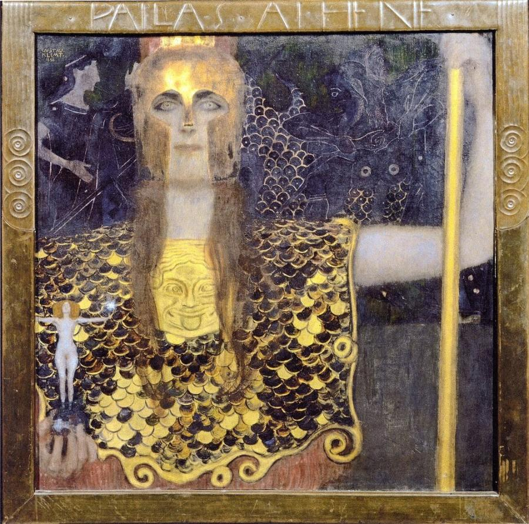
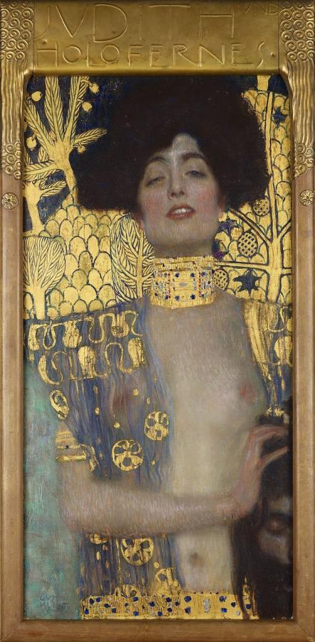
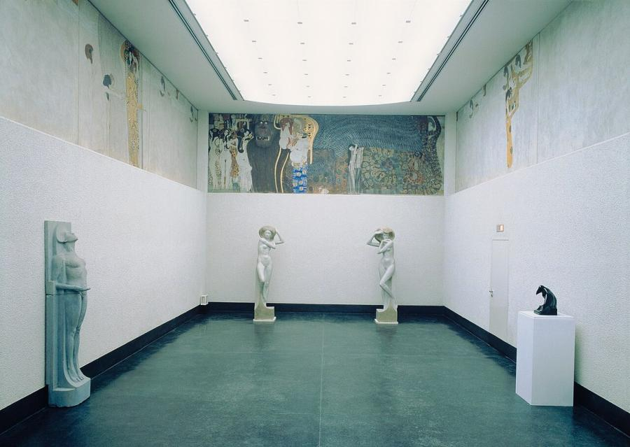
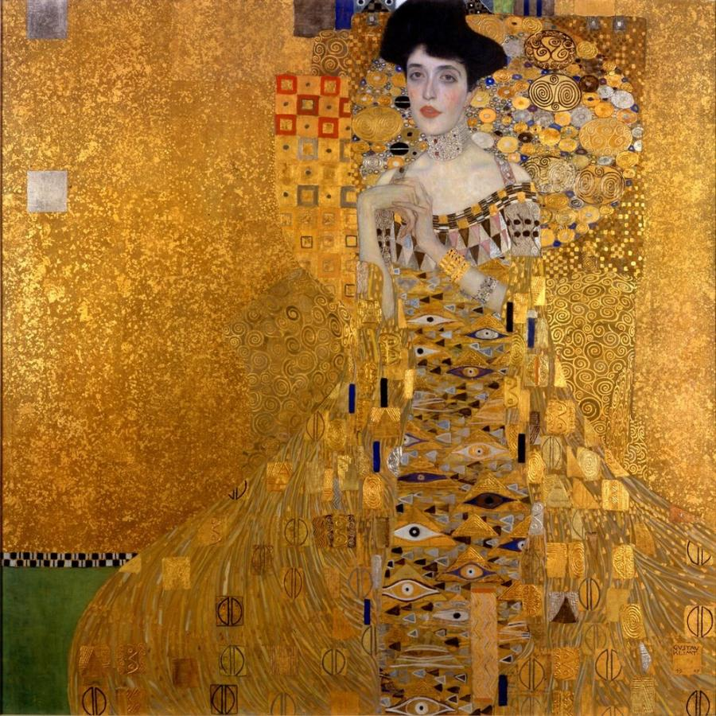
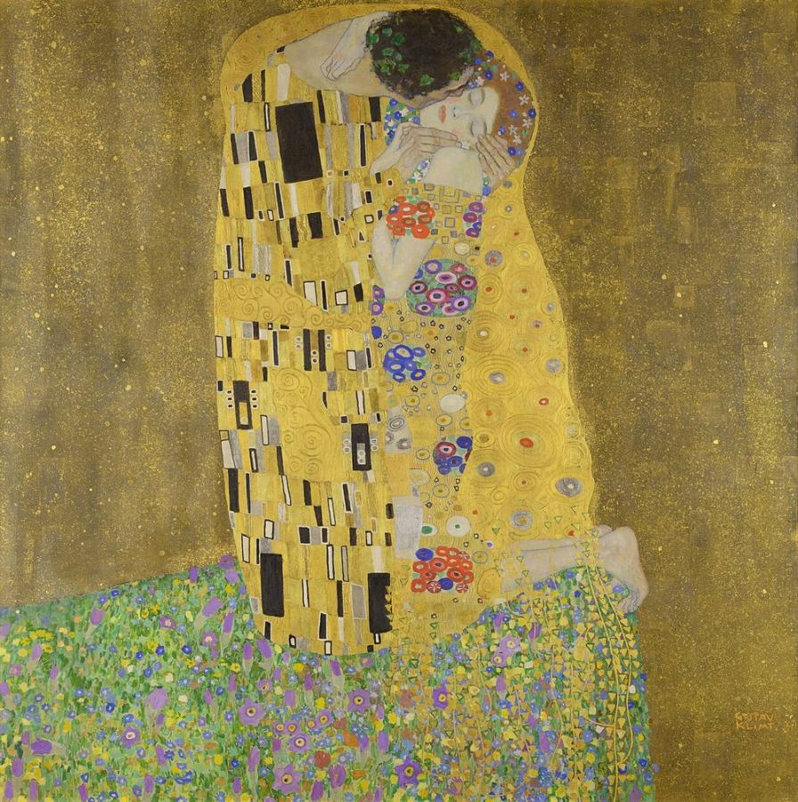
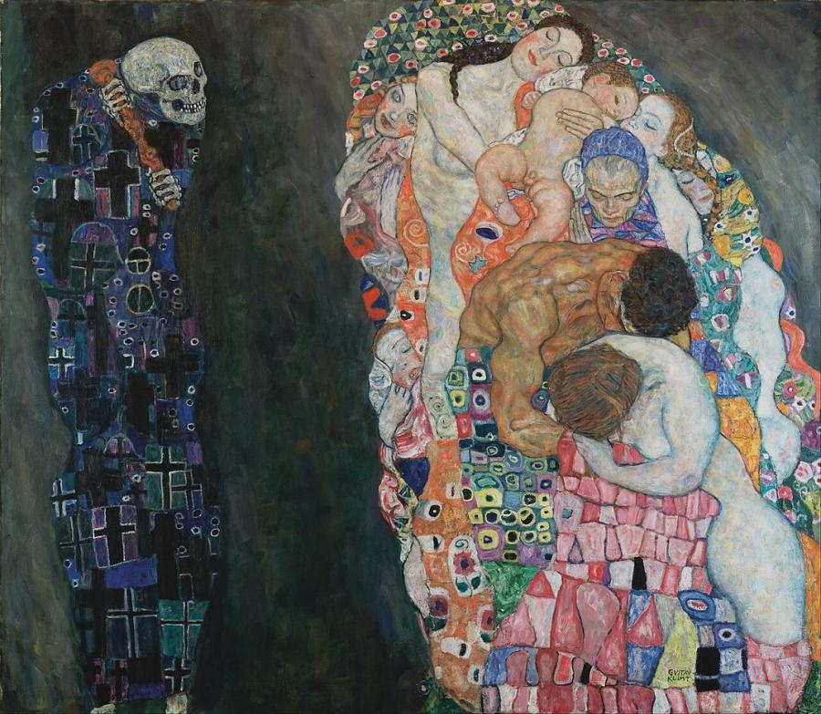

# Gustav Klimt (1862–1918)

> Leader of the Vienna Secession, whose golden, patterned paintings of women and love are icons of turn-of-the-century Vienna.

## Overview

Gustav Klimt was the central figure of Viennese art around 1900. He began as a successful decorator of
public buildings, then broke with the conservative establishment to found the Vienna Secession, a
movement that championed modern art and the unity of all the arts. His paintings mix realistic faces
and bodies with flat, jewel-like ornament and real gold leaf. They explore love, desire, death and the
cycle of life. *The Kiss* and the *Portrait of Adele Bloch-Bauer I* are among the most famous images
in the world.

## Life

Klimt was born on 14 July 1862 at Baumgarten, near Vienna, the second of seven children of a gold
engraver. He won a scholarship to the Vienna School of Arts and Crafts in 1876. With his brother Ernst
and his friend Franz Matsch he formed the Künstler-Compagnie ("Company of Artists"), which painted
murals and ceilings for the Burgtheater and the Kunsthistorisches Museum in Vienna.

In 1892 his father and brother Ernst both died, and Klimt's style began to change. In 1897 he became
the first president of the Vienna Secession, a group of artists who broke away from the official
academy with the motto "To every age its art, to art its freedom". His ceiling paintings for the
University of Vienna, showing *Philosophy*, *Medicine* and *Jurisprudence*, caused a public scandal
over their nudity and pessimism. He withdrew from the commission, and the paintings were later
destroyed in a fire in 1945.

Klimt never married but had a lifelong companionship with the fashion designer Emilie Flöge and
fathered several children with his models. He spent summers painting landscapes by the Attersee lake.
He supported younger artists such as Egon Schiele and Oskar Kokoschka. He died in Vienna on 6 February
1918, after a stroke, during the influenza pandemic.

## Style & Technique

Klimt's mature style joins sharp, sensitive drawing of faces and hands with flat, decorative surfaces
of pattern. He drew on Byzantine mosaics, which he saw in Ravenna in 1903, as well as on Japanese
art, Egyptian and Mycenaean ornament, and the Arts and Crafts movement. During his "golden period"
(about 1899–1910) he applied real gold and silver leaf to his canvases.

He was a superb draughtsman who made thousands of drawings, many of them intimate studies of women.
His square landscape paintings of gardens, lakes and forests are almost abstract carpets of dots and
colour. Later works dropped the gold for brighter, more colourful patterns influenced by Matisse and
Fauvism.

## Legacy

Klimt shaped the look of Vienna 1900 and of Art Nouveau across Europe. His influence runs through
Schiele and Kokoschka to decorative arts, fashion and design. Many of his works were owned by Jewish
collectors and looted by the Nazis. Restitution cases, above all the return of Adele Bloch-Bauer's
portrait to Maria Altmann, made headlines worldwide. In 2006 Ronald Lauder bought that portrait for a
reported $135 million, and in 2023 Klimt's *Lady with a Fan* sold for £85.3 million, a record for a
painting at auction in Europe.

## Key Works

<!-- works:start -->

### 1. Pallas Athene (1898)

*Oil on canvas, 75 × 75 cm · Wien Museum, Vienna*

The Greek goddess of wisdom stares out from a golden helmet and breastplate, holding a tiny figure of Truth, a nude woman with a mirror, in her hand. Painted in the year of the first Secession exhibition, it announces Klimt's rebellion against academic art and the start of his use of gold. Athena was the Secession's patron goddess.

Image: [Wikimedia Commons](https://commons.wikimedia.org/wiki/File:Klimt_-_Pallas_Athene.jpeg) · Gustav Klimt · Public domain

### 2. Judith I (1901)

*Oil and gold leaf on canvas, 84 × 42 cm · Österreichische Galerie Belvedere, Vienna*

The biblical heroine who beheaded Holofernes appears as a modern Viennese *femme fatale*, eyes half closed and lips parted, the severed head barely visible at the edge of the frame. A heavy gold collar and a stylised golden background frame her face. The painting shocked viewers with its fusion of violence and sensuality.

Image: [Wikimedia Commons](https://commons.wikimedia.org/wiki/File:Judith_1_(cropped).jpg) · Gustav Klimt · Public domain

### 3. Beethoven Frieze (installation view) (1902)

*Casein paint, gold, and semi-precious stones on plaster, 2.15 × 34.14 m (whole frieze) · Secession Building, Vienna*

Made for the 1902 Secession exhibition in honour of Beethoven, this frieze runs around three walls of a room high above the viewer. It interprets the Ninth Symphony as humanity's search for happiness, beginning with floating figures and a knight in golden armour, passing the "Hostile Forces" and ending in the "Kiss to the whole world" from Schiller's *Ode to Joy*. The end wall, seen here, shows the Hostile Forces: the ape-like giant Typhoeus surrounded by his daughters, the Gorgons, and the figures of Sickness, Madness and Death. Meant to be temporary, the frieze was saved and is now on permanent display.

Image: [Wikimedia Commons](https://commons.wikimedia.org/wiki/File:Gustav_Klimt_-_Beethovenfries,_%22Die_Sehnsucht_nach_dem_Gl%C3%BCck%22_(nach_Richard_Wagners_Interpretation_der_IX._Sinfonie_von_Ludwig_van_Beethoven)_-_5987_-_%C3%96sterreichische_Galerie_Belvedere.jpg) · Gustav Klimt · Public domain

### 4. Portrait of Adele Bloch-Bauer I (1907)

*Oil, silver and gold on canvas, 138 × 138 cm · Neue Galerie, New York*

The Viennese salon hostess Adele Bloch-Bauer, her face and hands painted realistically, seems almost dissolved in a shimmering field of gold ornament, eyes and spirals. Seized by the Nazis, it hung for decades in the Belvedere as "The Woman in Gold". In 2006 her niece Maria Altmann won its return after a long legal battle, a story told in the 2015 film *Woman in Gold*.

Image: [Wikimedia Commons](https://commons.wikimedia.org/wiki/File:Gustav_Klimt_046.jpg) · Gustav Klimt · Public domain

### 5. The Kiss (1907–1908)

*Oil and gold leaf on canvas, 180 × 180 cm · Österreichische Galerie Belvedere, Vienna*

A couple embrace on the edge of a flowering meadow, wrapped together in a single golden cloak. His robe is patterned with black and white rectangles, hers with colourful circles and flowers. Only their faces, hands and her feet are shown as flesh. It is the high point of Klimt's "golden period", and the Belvedere bought it even before it was finished.

Image: [Wikimedia Commons](https://commons.wikimedia.org/wiki/File:The_Kiss_-_Gustav_Klimt_-_Google_Cultural_Institute.jpg) · Gustav Klimt · Public domain

### 6. Death and Life (1910–1915)

*Oil on canvas, 178 × 198 cm · Leopold Museum, Vienna*

On the left, Death, a skeleton in a robe of crosses, leers at a tangle of sleeping figures on the right: babies, lovers, mothers and an old woman, woven into a colourful blanket of patterns. Klimt reworked the painting after it won first prize in Rome in 1911, replacing its gold background with blue-grey. The sleepers seem unaware of Death's presence.

Image: [Wikimedia Commons](https://commons.wikimedia.org/wiki/File:Gustav_Klimt_-_Death_and_Life_-_Google_Art_Project.jpg) · Gustav Klimt · Public domain

<!-- works:end -->
## Sources

- [Gustav Klimt (Wikipedia)](https://en.wikipedia.org/wiki/Gustav_Klimt)
- [The Kiss (Wikipedia)](https://en.wikipedia.org/wiki/The_Kiss_%28Klimt%29)
- [Beethoven Frieze (Wikipedia)](https://en.wikipedia.org/wiki/Beethoven_Frieze)
