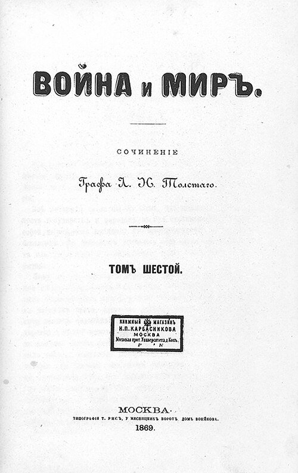
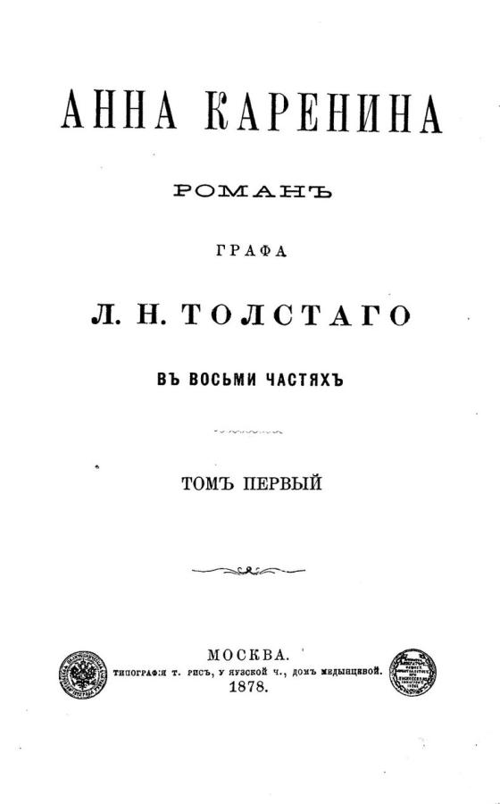
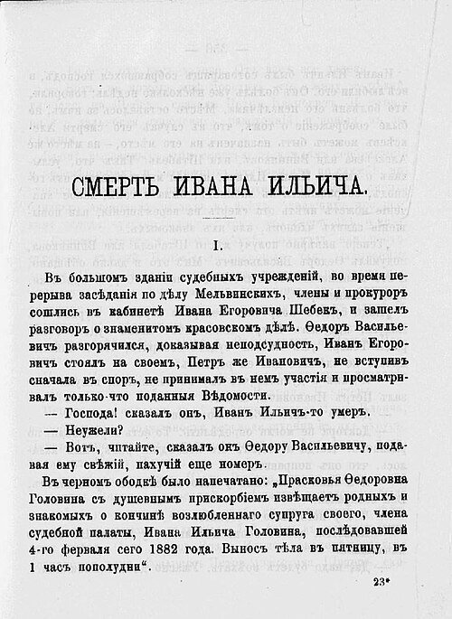
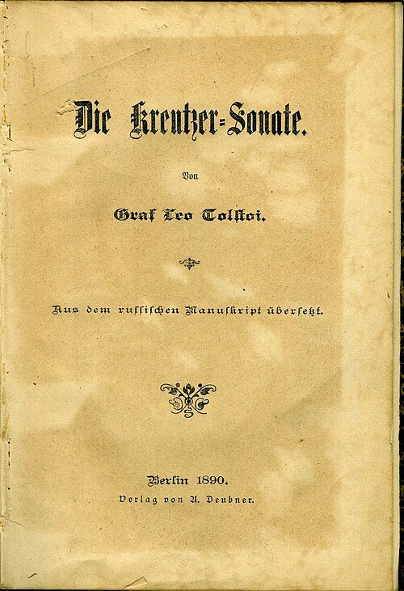
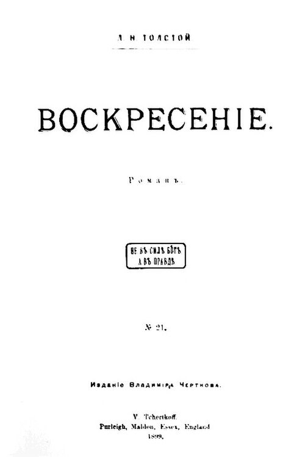

# Leo Tolstoy (1828–1910)

> The Russian novelist whose sweeping social epics and stark late parables of mortality and conscience made him one of the most influential moral voices of his century.

## Overview

Leo Tolstoy is regarded as one of the greatest novelists in world literature, best known for two vast
works of Russian realism, *War and Peace* and *Anna Karenina*, that combine intimate personal drama
with sweeping historical and philosophical ambition. In the second half of his life a profound
religious and moral crisis redirected him toward shorter, starker fiction and nonfiction on faith,
mortality and nonviolence that influenced moral and political thinkers, including Mahatma Gandhi, well
beyond the literary world.

## Life

Tolstoy was born in 1828 into an aristocratic family at Yasnaya Polyana, the family estate south of
Moscow he would inherit and manage for most of his life. He served briefly as an army officer during
the Crimean War, an experience that shaped his unsentimental early writing on combat, before turning
fully to literature and estate management. Through the 1860s and 1870s he wrote his two major novels,
*War and Peace* and *Anna Karenina*, while also experimenting with peasant education, founding a
school for the children on his estate. In the years after *Anna Karenina* he underwent an intense
spiritual crisis, described in his memoir *A Confession*, that led him to reject the Russian Orthodox
Church, embrace an ascetic, pacifist reading of Christian ethics, and increasingly disown his own
earlier fiction as morally frivolous. His last decades were marked by growing international fame as a
moral and religious thinker, tension with his wife and the Orthodox Church, and a final, dramatic
flight from his estate in old age; he died of pneumonia at a remote railway station in 1910, having
collapsed during that journey.

## Style & Technique

Tolstoy's major novels move fluidly between intimate psychological detail and broad historical and
philosophical argument, most famously in *War and Peace*'s long essayistic digressions on the forces
that actually drive historical events, which Tolstoy argued lay far beyond the control of any single
general or emperor. His prose favours plain, direct description over ornamental style, aiming for what
he considered moral and psychological truth rather than literary display. After his religious crisis,
his later fiction, *The Death of Ivan Ilyich*, *The Kreutzer Sonata*, *Resurrection*, grew shorter,
starker and more didactic, using narrower, more claustrophobic stories to press a single moral question
rather than the panoramic social canvas of his earlier novels.

## Legacy

*War and Peace* and *Anna Karenina* are routinely ranked among the greatest novels ever written, and
Tolstoy's realist technique influenced the development of the novel worldwide. His later ethical and
religious writing, arguing for nonviolent resistance to evil, directly influenced Mahatma Gandhi, who
corresponded with Tolstoy near the end of the writer's life, and through Gandhi fed into the broader
twentieth-century tradition of nonviolent political resistance. Yasnaya Polyana, his family estate, is
preserved as a museum and remains a major literary pilgrimage site in Russia.

## Key Works

<!-- works:start -->

### 1. War and Peace (1869)

*Novel, first edition title page · Published in Moscow, Russian Empire*

A sprawling novel following five aristocratic families through the Napoleonic Wars, mixing intimate personal drama with long philosophical digressions on history and free will. Its scale and ambition, several hundred named characters moving across a decade of war and peace, made it an immediate landmark of Russian and world literature.

Image: [Wikimedia Commons](https://commons.wikimedia.org/wiki/File:Tolstoy_-_War_and_Peace_-_first_edition,_1869.jpg) · Leo Tolstoy · Public domain

### 2. Anna Karenina (1877)

*Novel, first edition title page · Published in Moscow, Russian Empire*

A married aristocrat's affair and social ruin, set against a parallel story of a landowner's search for meaning through farming and family life, opens with one of the most quoted lines in fiction: "All happy families are alike; each unhappy family is unhappy in its own way."

Image: [Wikimedia Commons](https://commons.wikimedia.org/wiki/File:AnnaKareninaTitle.jpg) · Leo Tolstoy · Public domain

### 3. The Death of Ivan Ilyich (1886)

*Novella, first edition title page · Published in Moscow, Russian Empire*

A short, unsparing novella following a mid-ranking judge's slow, isolating death from illness, and his dawning realisation that his comfortable, conventional life had been essentially meaningless. Written after Tolstoy's own religious crisis, it is often read as his starkest statement on mortality.

Image: [Wikimedia Commons](https://commons.wikimedia.org/wiki/File:The_Death_of_Ivan_Ilyich.jpg) · Leo Tolstoy · Public domain

### 4. The Kreutzer Sonata (1889)

*Novella, first edition title page · Published in Russian Empire (initially banned by censors)*

A jealous husband's confession of murdering his wife over a suspected affair becomes the occasion for a bitter attack on marriage, sexual desire and upper-class hypocrisy. Its unsparing content led Russian censors to ban it outright, and it circulated for a time only in hand-copied and foreign editions.

Image: [Wikimedia Commons](https://commons.wikimedia.org/wiki/File:Titelseite_Tolstoi_Kreutzer-Sonate_1890.jpg) · Karli22 · [CC0](http://creativecommons.org/publicdomain/zero/1.0/deed.en)

### 5. Resurrection (1899)

*Novel, first edition title page · Published in Russian Empire*

Tolstoy's last novel, following an aristocrat who serves on the jury that wrongly convicts a woman he had once seduced and abandoned, and who sets out to seek both her forgiveness and his own moral reform. Its royalties were directed to fund the emigration of the Doukhobors, a persecuted Russian pacifist sect.

Image: [Wikimedia Commons](https://commons.wikimedia.org/wiki/File:Resurrection_1899.jpg) · Vladimir Chertkov · Public domain

<!-- works:end -->
## Sources

- [Leo Tolstoy (Wikipedia)](https://en.wikipedia.org/wiki/Leo_Tolstoy)
- [War and Peace (Wikipedia)](https://en.wikipedia.org/wiki/War_and_Peace)
- [Anna Karenina (Wikipedia)](https://en.wikipedia.org/wiki/Anna_Karenina)
