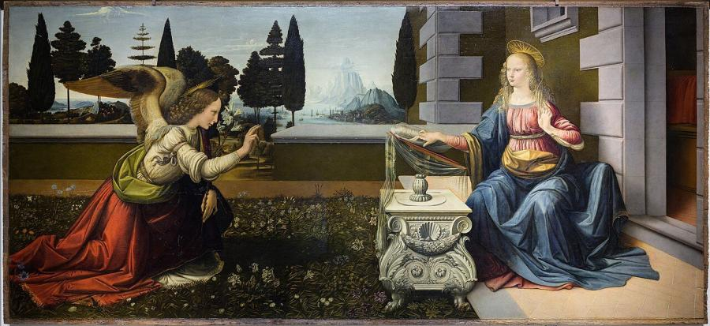
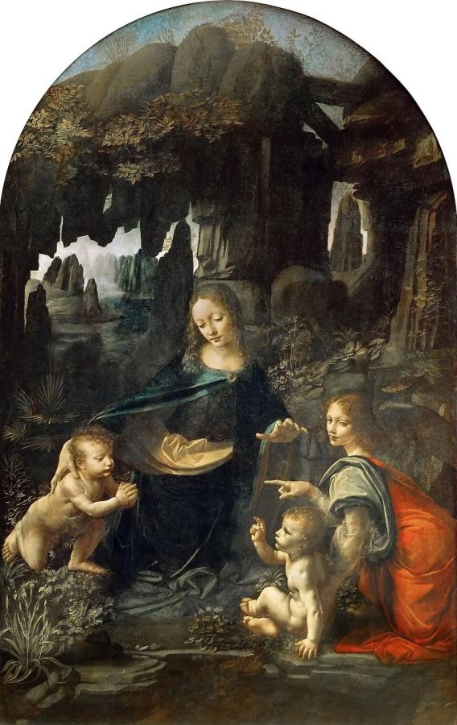
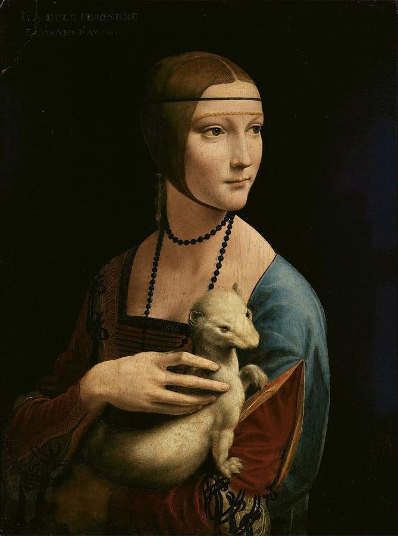
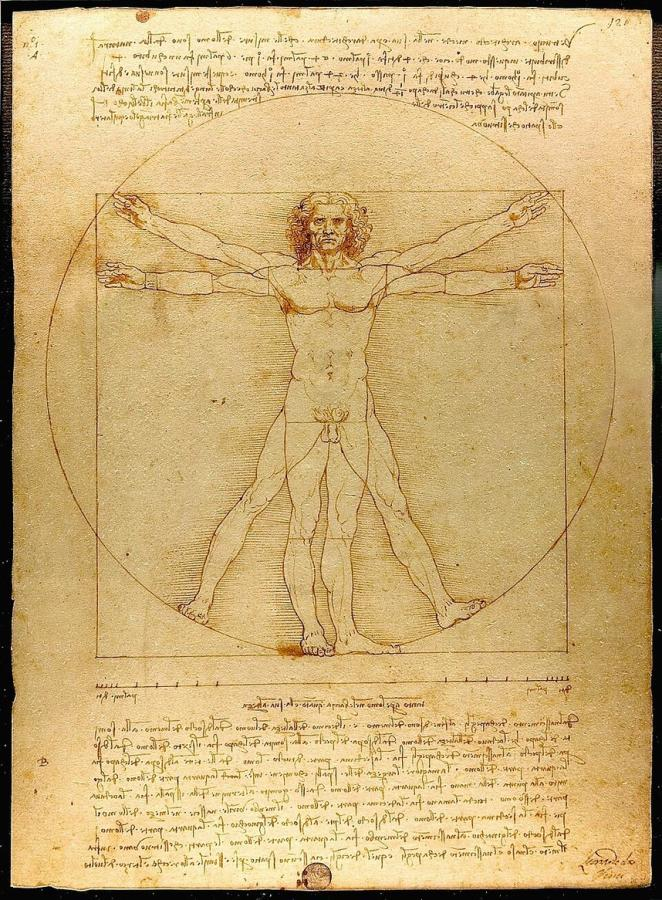
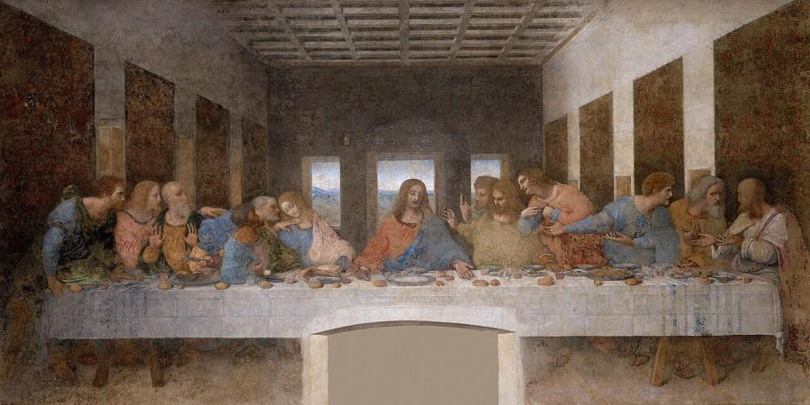
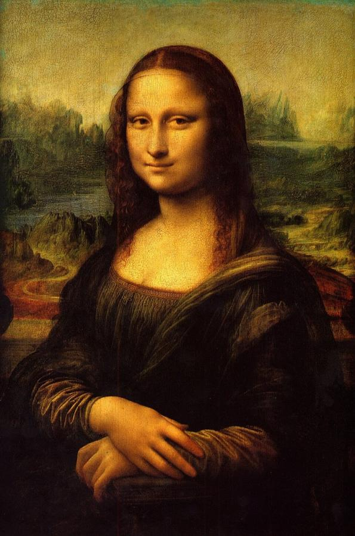

# Leonardo da Vinci (1452–1519)

> Painter, engineer, anatomist and inventor, the restless genius who became the model of the "Renaissance man".

## Overview

Leonardo da Vinci left fewer than 20 finished paintings, yet they include the *Mona Lisa* and *The
Last Supper*, perhaps the two most famous images in Western art. His painting grew out of endless
investigation: of light and shadow, of anatomy, of water, flight and geology. He recorded these in
thousands of notebook pages filled with drawings and mirror-writing. He pioneered the soft modelling
called *sfumato* ("smoky") and a new psychological depth in portraiture, and he helped define the
High Renaissance.

## Life

Leonardo was born on 15 April 1452 near the Tuscan town of Vinci, the illegitimate son of a notary,
Ser Piero, and a young woman named Caterina. Around his mid-teens he was apprenticed in Florence to
Andrea del Verrocchio, a leading sculptor and painter. According to Vasari, the angel Leonardo
painted in Verrocchio's *Baptism of Christ* was so beautiful that his master gave up painting.

In about 1482 he moved to Milan. He offered his services to Duke Ludovico Sforza in a letter that
stressed his skills as a military engineer before mentioning his art. In Milan he painted *The Last
Supper*, designed festivals, and modelled a giant clay horse for a bronze monument that was never
cast. After the French invaded in 1499 he moved between Mantua, Venice and Florence. He worked
briefly as a military engineer for Cesare Borgia, and in Florence he began the *Mona Lisa*.

His later years took him back to Milan under the French, then to Rome under the Medici pope Leo X. In
1516 King Francis I invited him to France and gave him the manor of Clos Lucé near the royal château
at Amboise. He died there on 2 May 1519. His pupil Francesco Melzi inherited his notebooks.

## Style & Technique

Leonardo believed painting was a science based on observation. He studied how light falls on
curved surfaces and how distant objects lose sharpness and turn blue (atmospheric perspective). He
dissected corpses to understand muscles and bones. In his paintings, forms emerge from shadow through
very gradual changes of tone, without hard outlines: this is *sfumato*.

He composed with geometry, often arranging figures in stable pyramids. He gave faces and hands subtle
expressions that suggest what the sitters are thinking. He also experimented constantly with
materials, sometimes disastrously: *The Last Supper* began to decay within decades. His slowness and
perfectionism meant that many projects were left unfinished.

## Legacy

Raphael, Giorgione and generations of Italian painters absorbed Leonardo's sfumato and his
compositions. His notebooks, scattered after Melzi's death, reveal studies of anatomy, flight,
hydraulics and optics that were centuries ahead of their time. Today they are prized collections,
such as the Codex Leicester, bought by Bill Gates in 1994. The *Mona Lisa* draws millions of
visitors to the Louvre every year. In 2017 the *Salvator Mundi*, attributed to Leonardo, sold for
$450 million, the highest price ever paid for a painting, though its attribution remains disputed.

## Key Works

<!-- works:start -->

### 1. Annunciation (c. 1472–1476)

*Oil and tempera on panel, 98 × 217 cm · Uffizi Gallery, Florence*

Probably painted while Leonardo was still in Verrocchio's workshop, this is one of his earliest surviving paintings. The angel Gabriel kneels on a flowering lawn to greet the Virgin. The angel's wings were modelled on a real bird's, and a hazy landscape of trees and mountains opens up behind. There are youthful mistakes in the perspective, but the careful study of nature points to everything that came later.

Image: [Wikimedia Commons](https://commons.wikimedia.org/wiki/File:Annunciation_(Leonardo_c._1472%E2%80%931476).jpg) · Leonardo da Vinci · Public domain

### 2. Virgin of the Rocks (c. 1483–1486)

*Oil on panel (transferred to canvas), 199 × 122 cm · Musée du Louvre, Paris*

Mary, the infant Jesus, the infant John the Baptist and an angel sit in a shadowy grotto of strange rock formations and carefully observed plants. Leonardo bound the figures together with glances and gestures in a pyramid shape. He modelled them with soft shadow, the technique later called *sfumato*. A second version, painted after a dispute with the patrons, hangs in the National Gallery, London.

Image: [Wikimedia Commons](https://commons.wikimedia.org/wiki/File:Leonardo_Da_Vinci_-_Vergine_delle_Rocce_(Louvre).jpg) · Leonardo da Vinci · Public domain

### 3. Lady with an Ermine (c. 1489–1491)

*Oil on walnut panel, 54 × 39 cm · Czartoryski Museum, Kraków*

Cecilia Gallerani, the teenage companion of Ludovico Sforza, Duke of Milan, turns as if someone had just called to her. She holds a sleek white ermine, a pun on her surname and a symbol of the duke. The twisting pose and her long, expressive hand brought a new sense of life and movement to the Italian portrait.

Image: [Wikimedia Commons](https://commons.wikimedia.org/wiki/File:Lady_with_an_Ermine_-_Leonardo_da_Vinci_(adjusted_levels).jpg) · Leonardo da Vinci · Public domain

### 4. Vitruvian Man (c. 1490)

*Pen and ink with wash on paper, 34.4 × 25.5 cm · Gallerie dell'Accademia, Venice*

A man with arms and legs in two positions fits inside both a circle and a square, illustrating the Roman architect Vitruvius's claim that the ideal human body mirrors the geometry of the universe. Leonardo's notes in mirror-writing record the proportions he measured. Because it is fragile and light-sensitive, the drawing is rarely displayed. Even so, it has become a universal symbol of the union of art and science.

Image: [Wikimedia Commons](https://commons.wikimedia.org/wiki/File:Da_Vinci_Vitruve_Luc_Viatour.jpg) · Leonardo da Vinci · Public domain

### 5. The Last Supper (c. 1495–1498)

*Tempera and oil on gesso, pitch and mastic, 460 × 880 cm · Convent of Santa Maria delle Grazie, Milan*

Painted on the refectory wall of a Milanese convent, it shows the moment Christ announces that one of his disciples will betray him. The apostles recoil in waves of shock and questioning, grouped in threes. All the lines of the architecture lead to Christ's head. Leonardo experimented with painting on dry plaster so that he could work slowly, but the paint began flaking within his lifetime. A 21-year restoration ended in 1999.

Image: [Wikimedia Commons](https://commons.wikimedia.org/wiki/File:The_Last_Supper_-_Leonardo_Da_Vinci_-_High_Resolution_32x16.jpg) · Leonardo da Vinci · Public domain

### 6. Mona Lisa (c. 1503–1519)

*Oil on poplar panel, 77 × 53 cm · Musée du Louvre, Paris*

Lisa Gherardini, wife of the Florentine silk merchant Francesco del Giocondo, sits before a dreamlike landscape, her smile hovering at the edges of her mouth and eyes. Leonardo kept the portrait for the rest of his life and reworked it for years, blurring its transitions with *sfumato*. Its theft from the Louvre in 1911, and its return two years later, helped make it the most famous painting in the world.

Image: [Wikimedia Commons](https://commons.wikimedia.org/wiki/File:Mona_Lisa.jpg) · Leonardo da Vinci · Public domain

<!-- works:end -->
## Sources

- [Leonardo da Vinci (Wikipedia)](https://en.wikipedia.org/wiki/Leonardo_da_Vinci)
- [Mona Lisa (Wikipedia)](https://en.wikipedia.org/wiki/Mona_Lisa)
- [The Last Supper (Wikipedia)](https://en.wikipedia.org/wiki/The_Last_Supper_%28Leonardo%29)
- Giorgio Vasari, *Lives of the Most Excellent Painters, Sculptors, and Architects* (1550)
