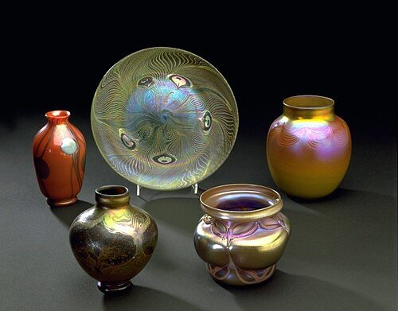
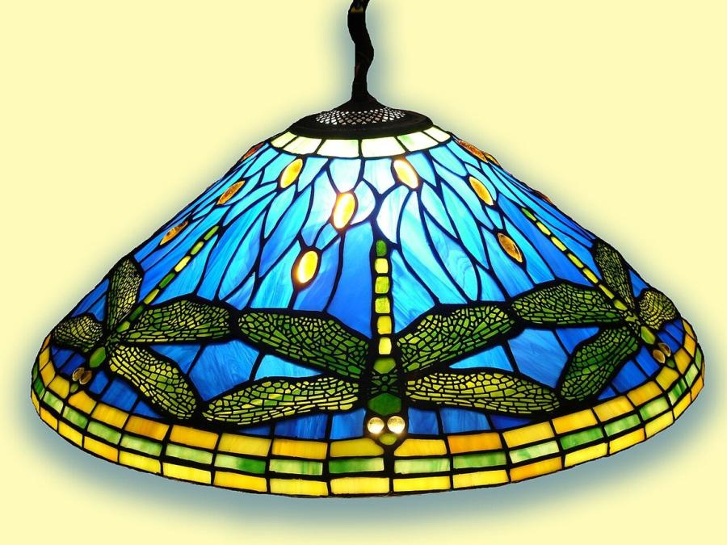
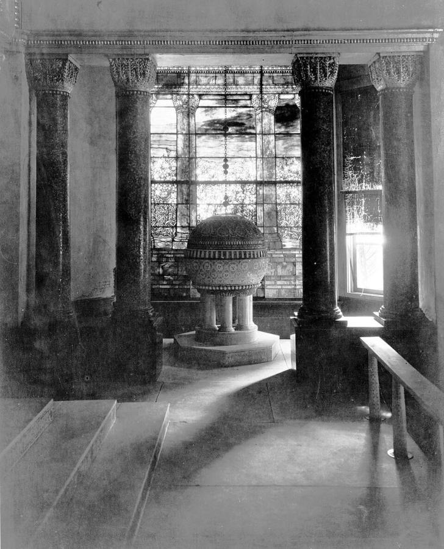
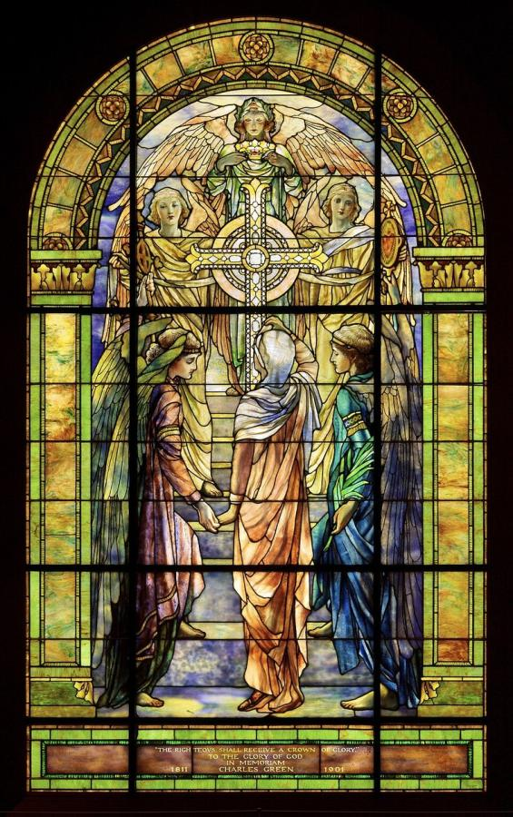
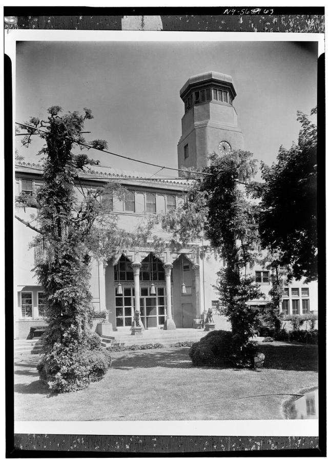

# Louis Comfort Tiffany (1848–1933)

> The American designer whose iridescent Favrile glass, stained-glass windows and lamps became the signature look of American Art Nouveau.

## Overview

Louis Comfort Tiffany, son of the jeweller Charles Lewis Tiffany, built one of the most successful
design enterprises in American decorative art around a single material innovation: Favrile glass,
whose shimmering colour and texture come from the glass itself rather than from paint applied to its
surface. From stained-glass windows and mosaic interiors to the lamps that still bear his name,
Tiffany Studios turned that material into an entire vocabulary of nature-derived Art Nouveau design,
though recent scholarship has shown many of its most celebrated individual designs to be the work of
staff designers, especially Clara Driscoll, working under Tiffany's overall direction.

## Life

Tiffany was born in New York in 1848 and originally trained as a painter, studying under the
landscape painter George Inness, before turning to interior design and decorative arts in the 1870s.
His decorating firm undertook prominent commissions, including a redecoration of state rooms in the
White House in 1882 for President Chester Arthur, later removed by a subsequent administration. In
1885 he founded what became Tiffany Studios, concentrating on stained glass, and in 1894 patented
Favrile glass, the iridescent material that became the foundation of the studio's output in windows,
lamps, vases and mosaics. His Byzantine-style chapel interior for the 1893 World's Columbian
Exposition in Chicago won international acclaim and established Tiffany Studios as a leading design
house. He built an elaborate estate, Laurelton Hall, on Long Island as a personal showcase of his
work, and continued directing the studio's design output until financial losses during the
Depression forced its closure. He died in New York in 1933.

## Style & Technique

Tiffany drew his motifs directly from nature, dragonflies, wisteria, peacock feathers, water lilies,
and worked to make colour and texture properties of the glass itself rather than additions painted
onto it. Favrile glass built iridescent, metallic colour into molten glass through mineral oxides;
"drapery glass," another Tiffany Studios innovation, was manipulated while still hot to form folds
resembling real fabric, letting a window suggest robes or foliage in relief rather than as a flat
painted image. Tiffany oversaw the studio's overall aesthetic and technical direction, while much of
the detailed design of individual pieces, particularly its famous lamps, was carried out by staff
designers, above all Clara Driscoll, who led the studio's women's glass-cutting department.

## Legacy

Tiffany lamps and windows are today among the most valuable and recognisable objects in American
decorative art, and Favrile glass remains a benchmark for art glass technique. For most of the
twentieth century, Tiffany was credited as the sole designer of Tiffany Studios' output; the
rediscovery in the mid-2000s of letters written by Clara Driscoll substantially revised that picture,
crediting her and the women of the "Tiffany Girls" department with designing several of the studio's
most famous lamps, including the Dragonfly, a correction now generally accepted by museums and
scholars.

## Key Works

<!-- works:start -->

### 1. Favrile glass (1894)

*Blown iridescent art glass · Tiffany Glass and Decorating Company, Corona, New York*

A patented iridescent glass Tiffany developed by mixing metallic oxides directly into molten glass, so its shimmering, oil-slick surface colour is built into the material itself rather than painted on afterward. Favrile glass became the raw material for nearly everything Tiffany Studios produced, from windows to vases to lampshades.

Image: [Wikimedia Commons](https://commons.wikimedia.org/wiki/File:Favrile.jpg) · VAwebteam at English Wikipedia · [CC BY-SA 3.0](http://creativecommons.org/licenses/by-sa/3.0/)

### 2. Dragonfly table lamp (c. 1900)

*Leaded Favrile glass and bronze · Tiffany Studios, Corona, New York*

One of Tiffany Studios' most celebrated lamp designs, its shade built from hundreds of small cut pieces of glass forming dragonflies with wings of rippled, filigree-edged glass around a mosaic-glass base. Long credited to Tiffany personally, it is now attributed, following the rediscovery of her letters in the 2000s, to Clara Driscoll, head of the studio's women's glass department.

Image: [Wikimedia Commons](https://commons.wikimedia.org/wiki/File:Tiffany_dragonfly_hg.jpg) · Hannes Grobe 19:33, 20 June 2007 (UTC) · [CC BY-SA 2.5](https://creativecommons.org/licenses/by-sa/2.5)

### 3. Tiffany Chapel (1893)

*Marble, mosaic and leaded Favrile glass · Originally built for the World's Columbian Exposition, Chicago; later Laurelton Hall, New York*

A complete Byzantine-influenced interior, mosaic columns, a baptismal font and stained-glass windows, built to showcase Tiffany's full range of decorative techniques at the 1893 Chicago World's Fair, where it won several awards and established his international reputation almost overnight.

Image: [Wikimedia Commons](https://commons.wikimedia.org/wiki/File:Tiffany_Chapel_from_HABS_crop.jpg) · G.G. from Hoxie, Kansas, USA; cropped by Beyond My Ken ( talk ) 16:18, 29 June 2011 (UTC) · [CC BY 2.0](https://creativecommons.org/licenses/by/2.0)

### 4. The Righteous Shall Receive a Crown of Glory (1901)

*Leaded Favrile glass window · Tiffany Studios, Corona, New York*

A memorial window built almost entirely from richly textured "drapery glass," sheets of glass manipulated while molten to form folds resembling actual fabric, letting Tiffany suggest robes and landscape without a single painted line, an effect unique to his studio's glass-making technique.

Image: [Wikimedia Commons](https://commons.wikimedia.org/wiki/File:Louis_Comfort_Tiffany_-_The_Righteous_Shall_Receive_A_Crown_of_Glory,_1901.jpg) · Louis Comfort Tiffany; design by Frederick Wilson · Public domain

### 5. Laurelton Hall (1902–1905)

*Stucco, tile and stained glass over a steel frame · Long Island, New York*

Tiffany's own eighty-room estate on Long Island, designed as a total showcase of his work, from its stained-glass windows and mosaic-tiled courtyard fountain to its furniture and landscaping. Largely abandoned after the Depression and destroyed by fire in 1957, its surviving architectural fragments and windows are now held by the Charles Hosmer Morse Museum of American Art.

Image: [Wikimedia Commons](https://commons.wikimedia.org/wiki/File:Laurelton_Hall_(demolished)_from_HABS_(3707667352).jpg) · whitewall buick from Hoxie, Kansas, USA · [CC BY 2.0](https://creativecommons.org/licenses/by/2.0)

<!-- works:end -->
## Sources

- [Louis Comfort Tiffany (Wikipedia)](https://en.wikipedia.org/wiki/Louis_Comfort_Tiffany)
- [Clara Driscoll (designer) (Wikipedia)](https://en.wikipedia.org/wiki/Clara_Driscoll_(designer))
- [Favrile glass (Wikipedia)](https://en.wikipedia.org/wiki/Favrile_glass)
