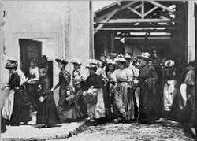
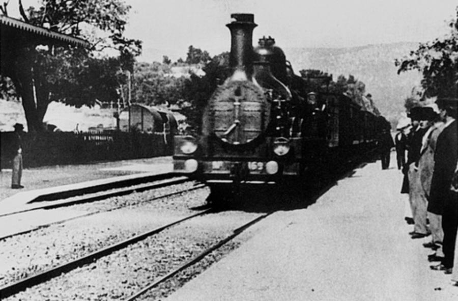
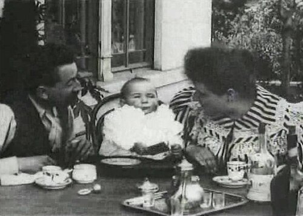
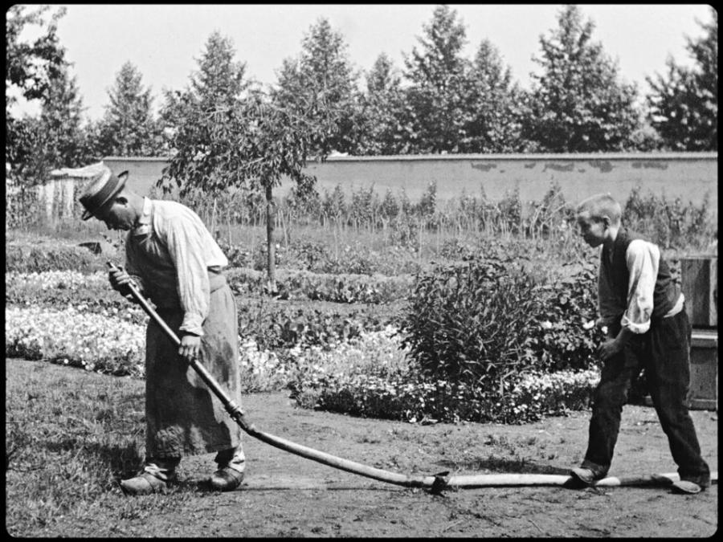
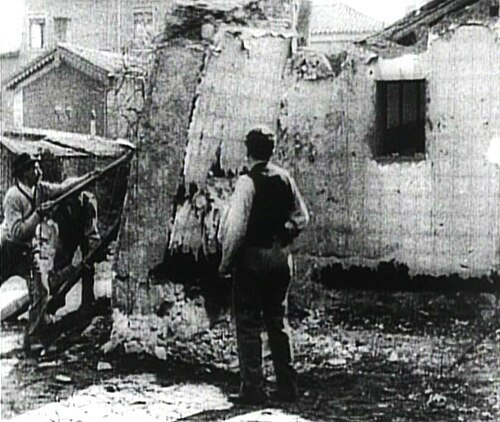

# Auguste and Louis Lumière (1862–1954)

> The French brothers whose Cinématographe and first public film screening, in a Paris basement in 1895, launched cinema as a shared public medium.

## Overview

Auguste and Louis Lumière were manufacturers of photographic plates in Lyon who, in 1895, patented
the Cinématographe, a single lightweight device that could shoot, print and project film, and used
it to stage the first paying public screening of projected motion pictures in history. Their short,
unedited "actuality" films of everyday life, workers, trains, family meals, established projected
cinema as a shared public experience rather than a private peep-show novelty, and their camera
operators carried the new medium to audiences on every continent within a few years.

## Life

Born in Besançon, Auguste in 1862 and Louis in 1864, the brothers grew up in Lyon, where their
father Antoine ran a photographic portrait studio and later a factory producing dry photographic
plates, a business the sons helped industrialise and expand. After their father saw a demonstration
of Thomas Edison's Kinetoscope, a single-viewer peephole device, in 1894, the brothers set out to
build something that could project moving images to a seated audience. Louis is generally credited
with the key mechanical insight, adapting the sewing machine's intermittent claw movement to advance
film steadily through the camera. They patented the Cinématographe in February 1895 and held their
first paying public screening on 28 December 1895 in the basement of the Grand Café on Paris's
Boulevard des Capucines, showing ten short films to an audience of about thirty-five people. Within
two years they largely withdrew from film production to focus on other photographic ventures,
notably the Autochrome, an early commercially successful colour photography process they introduced
in 1907. Louis died in 1948 and Auguste in 1954.

## Style & Technique

The Lumières' films, later called "actualities," were almost always a single static, carefully
composed shot lasting under a minute, unedited and largely unstaged, aimed at capturing recognisable
fragments of everyday life rather than telling a constructed story. Their choice of camera position,
often placed to let motion develop in depth toward or away from the lens rather than sideways across
the frame, gave ordinary subjects, a train, spilled water, toppling bricks, an unexpected charge.
*L'Arroseur arrosé* stands apart as a rare deliberately staged, scripted gag, effectively cinema's
first fiction film.

## Legacy

The Lumières sent camera operators around the world to film and screen their actualities, effectively
creating the first global newsreel and travelogue circuit and spreading projected cinema to India,
Japan, Australia and the Americas within a year or two of that first Paris screening. Though Louis
and Auguste stepped back from filmmaking itself by the turn of the century, the technical and
commercial model they established, a projected film shown to a paying audience, remained the basic
shape of cinema for the century that followed. "Lumière" is still used across French-speaking cinema
as shorthand for the medium's very beginning.

## Key Works

<!-- works:start -->

### 1. Workers Leaving the Lumière Factory (1895)

*Silent film, black-and-white, 35mm, under 1 minute · Lumière factory, Lyon, France*

A single, unedited shot of employees streaming out of the Lumière family's own photographic plate factory at the end of the working day. Shown at the brothers' first paying public screening on 28 December 1895, it is often cited as the first true motion picture ever exhibited to an audience, and they filmed at least three separate versions of it.

Image: [Wikimedia Commons](https://commons.wikimedia.org/wiki/File:La_sortie_des_usines_Lumiere.jpg) · Louis Lumière · Public domain

### 2. The Arrival of a Train at La Ciotat (1896)

*Silent film, black-and-white, 35mm, under 1 minute · La Ciotat railway station, France*

A train pulls into a seaside station as passengers wait on the platform, filmed from an angle that lets the locomotive grow rapidly toward the camera. A durable, probably exaggerated legend holds that early audiences screamed and ducked for cover, taking the image for a real train bearing down on them.

Image: [Wikimedia Commons](https://commons.wikimedia.org/wiki/File:Arriv%C3%A9e_d%E2%80%99un_train_%C3%A0_La_Ciotat_1897.png) · Louis Lumière · Public domain

### 3. Le Repas de bébé (Feeding the Baby) (1895)

*Silent film, black-and-white, 35mm, under 1 minute · La Ciotat, France*

Auguste Lumière, his wife and their infant daughter share breakfast in the garden of the family's holiday home, a scene notable at the time less for its subject than for the leaves visibly stirring in the background, incidental motion that struck audiences accustomed to still photography as almost magical.

Image: [Wikimedia Commons](https://commons.wikimedia.org/wiki/File:Le_Repas_de_b%C3%A9b%C3%A9_(1895).jpg) · Auguste Lumière · Public domain

### 4. L'Arroseur arrosé (The Sprinkler Sprinkled) (1895)

*Silent film, black-and-white, 35mm, under 1 minute · Lyon, France*

A boy sneaks up on a gardener watering a lawn, steps on the hose to cut the flow, then lifts his foot just as the gardener peers into the nozzle, soaking him. Staged and acted rather than simply observed, it is generally regarded as cinema's first scripted comedy.

Image: [Wikimedia Commons](https://commons.wikimedia.org/wiki/File:L%27Arroseur_arros%C3%A9_(Louis_Lumi%C3%A8re,_1895).png) · TB54 · [CC BY-SA 4.0](https://creativecommons.org/licenses/by-sa/4.0)

### 5. Démolition d'un mur (Demolition of a Wall) (1896)

*Silent film, black-and-white, 35mm, under 1 minute · Lyon, France*

Workers topple a brick wall with picks and a rope, a mundane demonstration of the new camera's ability to record real motion. The Lumières discovered that running the film backwards made the wall reassemble itself, one of the medium's first accidental special effects and an early hint of cinema's power to reverse and manipulate time.

Image: [Wikimedia Commons](https://commons.wikimedia.org/wiki/File:La_D%C3%A9molition_d%27un_mur.jpg) · Louis Lumière · [CC0](http://creativecommons.org/publicdomain/zero/1.0/deed.en)

<!-- works:end -->
## Sources

- [Auguste and Louis Lumière (Wikipedia)](https://en.wikipedia.org/wiki/Auguste_and_Louis_Lumi%C3%A8re)
- [Cinématographe (Wikipedia)](https://en.wikipedia.org/wiki/Cin%C3%A9matographe)
- [Workers Leaving the Lumière Factory (Wikipedia)](https://en.wikipedia.org/wiki/Workers_Leaving_the_Lumi%C3%A8re_Factory)
