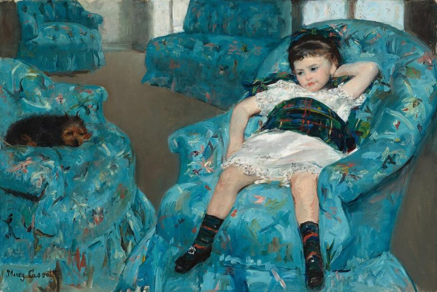
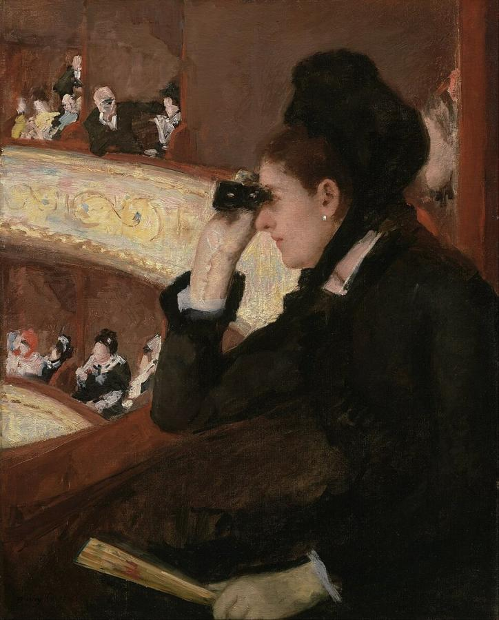
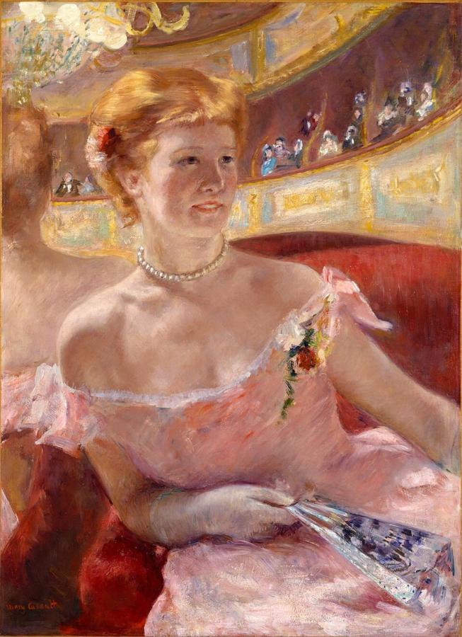
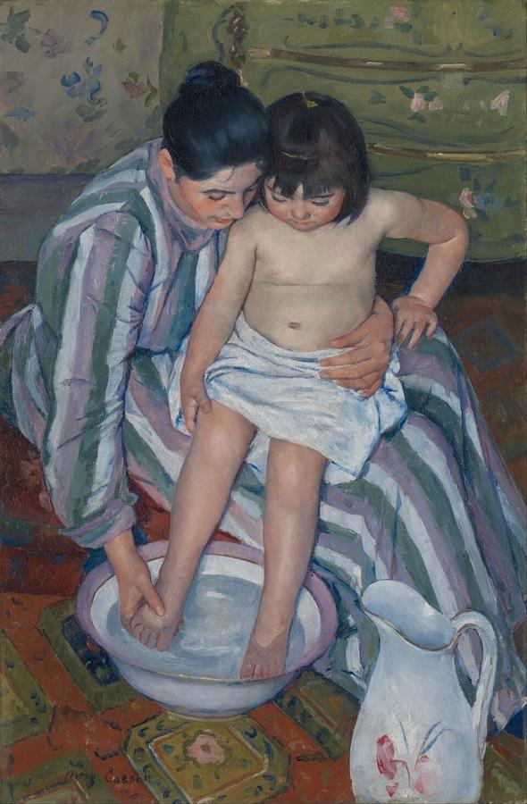
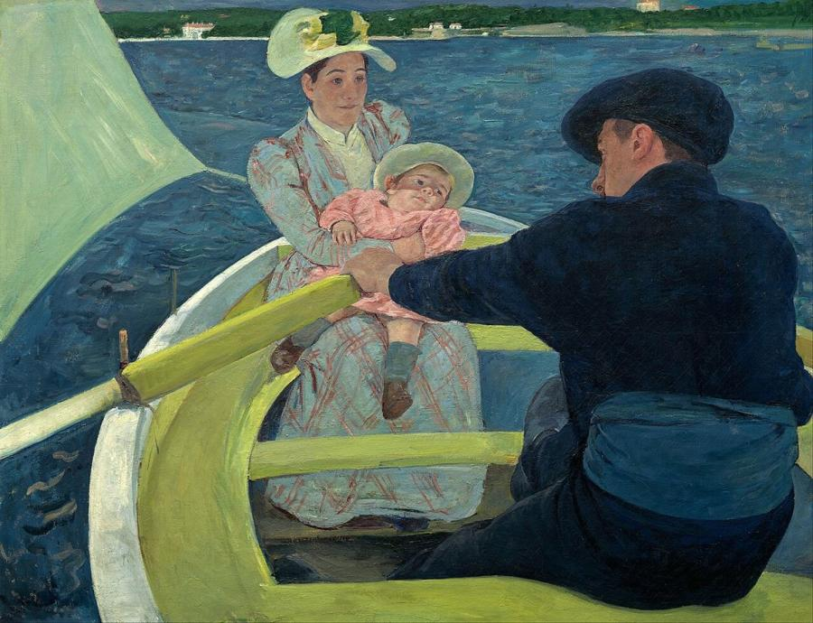
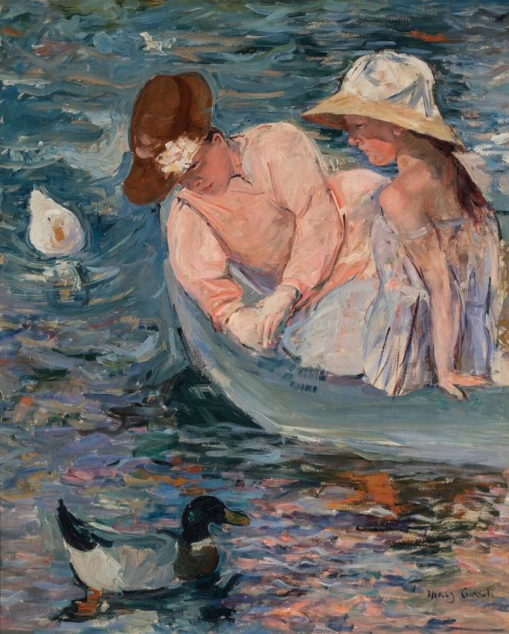

# Mary Cassatt (1844–1926)

> The only American to exhibit with the French Impressionists, celebrated for her tender, unsentimental images of women and children.

## Overview

Mary Cassatt was born in Pennsylvania but spent most of her adult life in France. There she became a
close friend of Edgar Degas and a full member of the Impressionist circle. She painted the private
lives of women: at the theatre, drinking tea, reading, and above all caring for children. She observed
them with honesty and without sentimentality. She was also an innovative printmaker and an influential
adviser to American collectors, and she helped bring Impressionism to the United States.

## Life

Cassatt was born on 22 May 1844 in Allegheny City, now part of Pittsburgh, into a wealthy family. As
a child she lived in Europe for several years. Against her father's wishes she studied at the
Pennsylvania Academy of the Fine Arts from 1860, then left for Paris in 1866. Women could not enter the
École des Beaux-Arts, so she studied privately and copied Old Masters in the Louvre.

She had paintings accepted at the official Salon, but grew frustrated with its conservative taste. In
1877 Degas invited her to exhibit with the Impressionists, and she accepted with delight. She showed
with them in 1879, 1880, 1881 and 1886. Her parents and sister Lydia moved to Paris to live with her,
and her family became her favourite models.

In 1890 a large exhibition of Japanese prints in Paris inspired her to make a set of ten colour prints
combining drypoint and aquatint, now considered masterpieces. In 1893 she painted a large mural, *Modern
Woman*, for the Woman's Building at the World's Columbian Exposition in Chicago; it has since been
lost. She advised her friend Louisine Havemeyer and other Americans on buying Old Masters and
Impressionists, many of which are now in the Metropolitan Museum. Failing eyesight forced her to stop
working around 1914. She died at her château near Paris on 14 June 1926.

## Style & Technique

Cassatt combined Impressionism's bright colour and loose brushwork with a strong sense of drawing
learned from Degas and the Old Masters. Her figures are solid and carefully constructed, even when the
backgrounds dissolve into quick strokes. She worked in oil, pastel, and printmaking.

From Japanese prints she took flat areas of colour, strong outlines, unusual viewpoints and cropped
compositions. Her mothers and children are ordinary people absorbed in daily tasks: bathing, feeding,
holding. Their gestures of care are observed exactly. She painted women as active, thinking people.

## Legacy

Cassatt helped shape American taste for modern French painting, which is why American museums hold
such rich Impressionist collections. France made her a Chevalier of the Légion d'honneur in 1904. She
supported the women's suffrage movement and lent works to exhibitions that raised money for it. Her
images of mothers and children remain among the most reproduced of the period, and her colour prints
are prized as some of the finest of the 19th century.

## Key Works

<!-- works:start -->

### 1. Little Girl in a Blue Armchair (1878)

*Oil on canvas, 89.5 × 129.8 cm · National Gallery of Art, Washington*

A small girl sprawls, bored and slouching, in an overstuffed armchair while a dog naps in the chair beside her. Cassatt shows a child as she really behaves, not posed and sweet. Degas helped with the background. When the painting was rejected by the American section of the 1878 Paris World's Fair, Cassatt was furious.

Image: [Wikimedia Commons](https://commons.wikimedia.org/wiki/File:Cassat_-_Blue_Armchair_NGA.jpg) · Mary Cassatt · Public domain

### 2. In the Loge (1878)

*Oil on canvas, 81.3 × 66 cm · Museum of Fine Arts, Boston*

A woman in black sits in a box at the Paris opera, peering through her opera glasses, while a man in a distant box trains his glasses on her. Cassatt reverses the usual situation: here the woman is the one who actively looks, even as she is being watched. It was one of the first works she showed in America.

Image: [Wikimedia Commons](https://commons.wikimedia.org/wiki/File:Mary_Stevenson_Cassatt_-_In_the_Loge_-_Google_Art_Project.jpg) · Mary Cassatt · Public domain

### 3. Woman with a Pearl Necklace in a Loge (1879)

*Oil on canvas, 81.3 × 59.7 cm · Philadelphia Museum of Art*

The artist's sister Lydia sits in a theatre box, her pink dress and skin glowing in the gaslight, while a mirror behind her reflects the chandeliers and balconies. Shown at the fourth Impressionist exhibition in 1879, it was praised by critics and helped establish Cassatt's reputation in Paris.

Image: [Wikimedia Commons](https://commons.wikimedia.org/wiki/File:Mary_Cassatt_-_Woman_with_a_Pearl_Necklace.jpg) · Mary Cassatt · Public domain

### 4. The Child's Bath (1893)

*Oil on canvas, 100.3 × 66 cm · Art Institute of Chicago*

A woman washes a young child's feet in a basin, both of them looking down, absorbed. The steep, tilted viewpoint, bold patterns and strong outlines show the influence of Japanese prints. It is Cassatt's best-known treatment of her central theme, the everyday bond between mothers and children.

Image: [Wikimedia Commons](https://commons.wikimedia.org/wiki/File:Mary_Cassatt_-_The_Child%27s_Bath_-_Google_Art_Project.jpg) · Mary Cassatt · Public domain

### 5. The Boating Party (1893–1894)

*Oil on canvas, 90 × 117 cm · National Gallery of Art, Washington*

A man rows a woman and a baby across a bright blue bay. The curving yellow boat, the flat areas of colour and the high horizon, cut off at the top, come from Japanese prints. The oarsman's dark bulk fills the foreground, and every line of the composition leads to the baby.

Image: [Wikimedia Commons](https://commons.wikimedia.org/wiki/File:Mary_Cassatt_-_The_Boating_Party_-_Google_Art_Project.jpg) · Mary Cassatt · Public domain

### 6. Summertime (1894)

*Oil on canvas, 100.7 × 81.3 cm · Terra Foundation for American Art, Chicago*

A woman and a girl lean over the side of a small boat to watch ducks on a pond, painted with the loose, bright brushwork of Impressionism. The water shimmers with reflected colour. This is one of Cassatt's most purely Impressionist outdoor pictures, painted during summers in the French countryside.

Image: [Wikimedia Commons](https://commons.wikimedia.org/wiki/File:Mary_Cassatt_-_Summertime_-_TFAA_1988.25.jpg) · Mary Cassatt · Public domain

<!-- works:end -->
## Sources

- [Mary Cassatt (Wikipedia)](https://en.wikipedia.org/wiki/Mary_Cassatt)
- [The Child's Bath (Wikipedia)](https://en.wikipedia.org/wiki/The_Child%27s_Bath)
- [Little Girl in a Blue Armchair (Wikipedia)](https://en.wikipedia.org/wiki/Little_Girl_in_a_Blue_Armchair)
