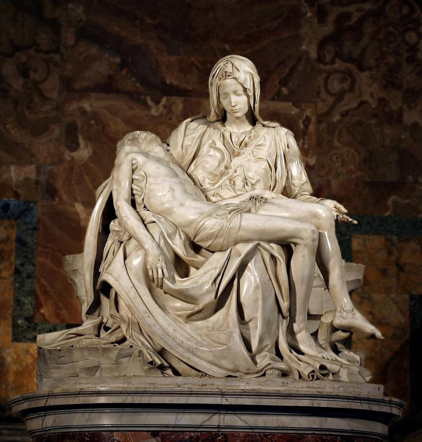
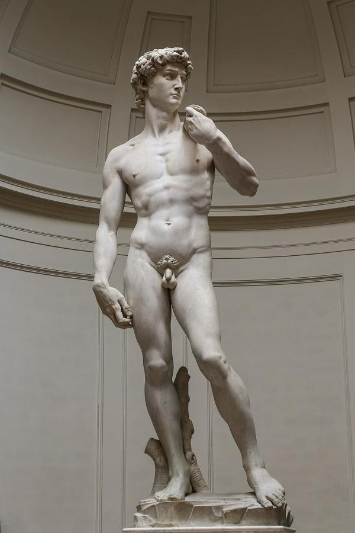
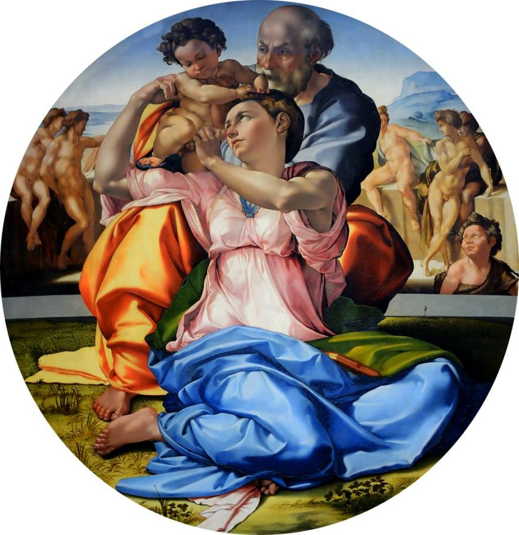
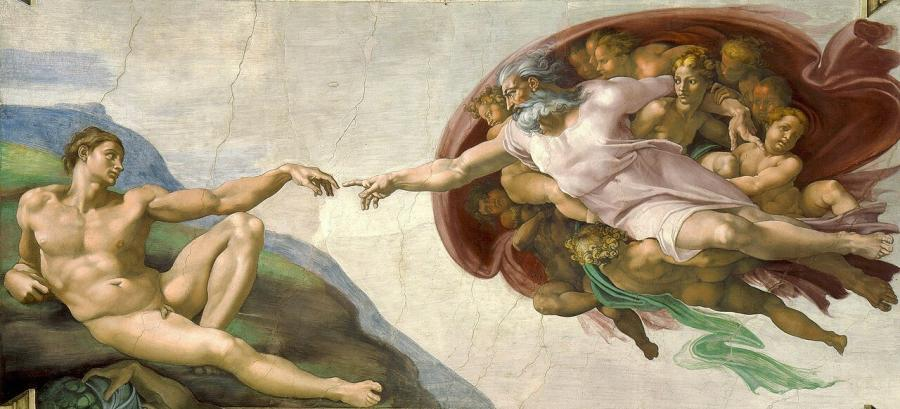
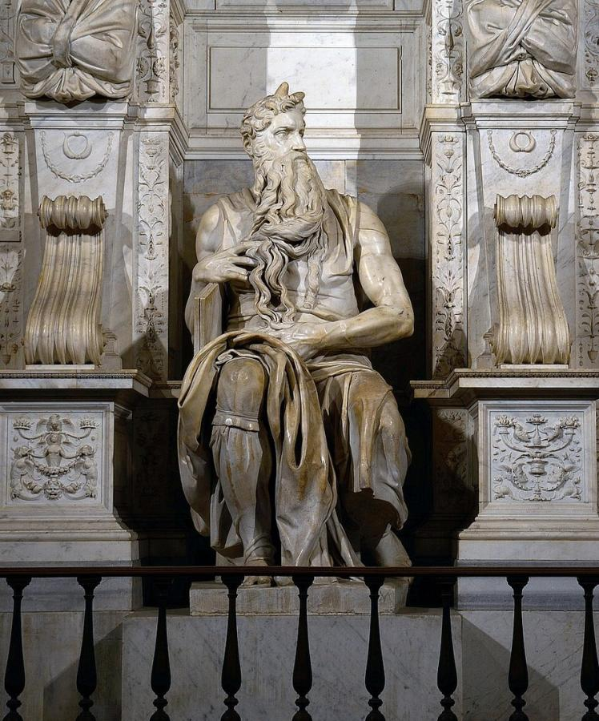
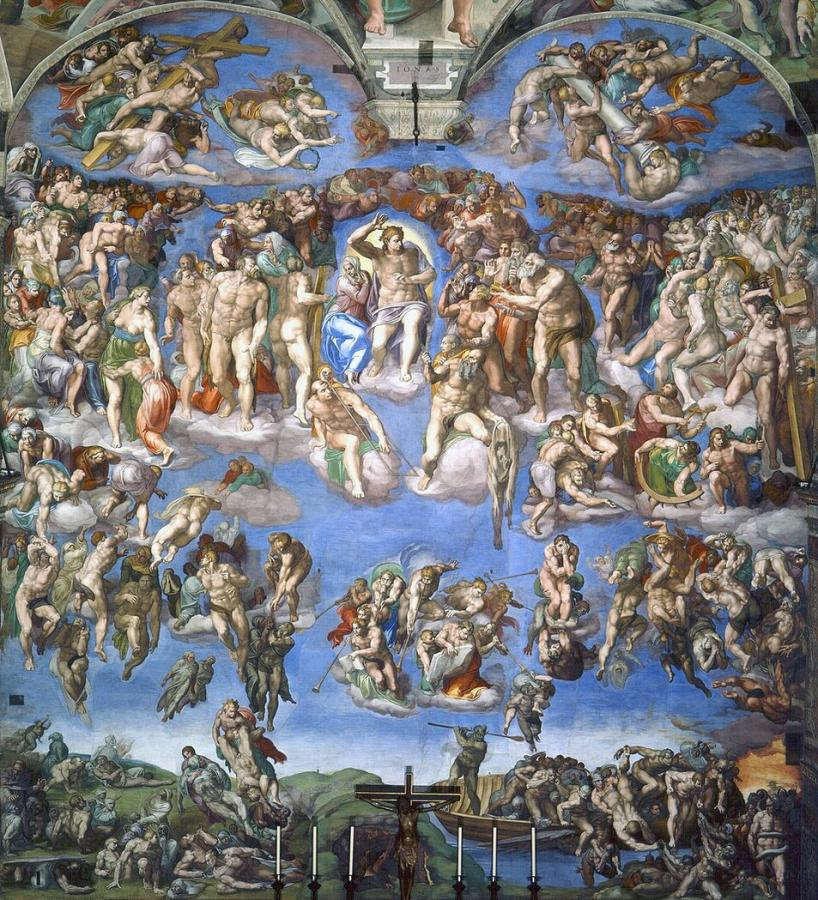

# Michelangelo Buonarroti (1475–1564)

> Sculptor, painter, architect and poet, whose heroic figures of the Pietà, David and the Sistine Chapel defined the High Renaissance.

## Overview

Michelangelo thought of himself first as a sculptor, yet he produced the most famous painted ceiling
in the world and designed the dome of St Peter's in Rome. His art is built on the nude human body,
powerful, twisting and charged with feeling. Contemporaries called it *terribilità*, an awe-inspiring
intensity. He lived to almost 89, worked for a long line of popes, and was the first Western artist to have his
biography published while he was still alive. Admirers called him *Il Divino*, "the Divine One".

## Life

Michelangelo was born on 6 March 1475 at Caprese, in Tuscany, where his father was a local
magistrate. He grew up in Florence. At 13 he was apprenticed to the painter Domenico Ghirlandaio,
but he soon moved to the sculpture garden of Lorenzo de' Medici. There he studied ancient statues
and lived in the Medici household among poets and philosophers.

After Lorenzo's death he went to Rome, where the *Pietà* (1498–1499) made his name. Returning to
Florence, he carved the *David* (1501–1504). In 1505 Pope Julius II called him to Rome to design a
colossal tomb, then diverted him to paint the ceiling of the Sistine Chapel (1508–1512), a task he
at first resisted. The unfinished tomb haunted him for decades.

He later worked for the Medici in Florence, designing the New Sacristy with its tomb sculptures and
the Laurentian Library. In 1534 he settled permanently in Rome, where he painted *The Last Judgment*
(1536–1541). In 1546 he became chief architect of St Peter's Basilica. He also wrote hundreds of
poems, many addressed to the nobleman Tommaso de' Cavalieri and the poet Vittoria Colonna. He died in
Rome on 18 February 1564, and his body was secretly taken to Florence for burial in Santa Croce.

## Style & Technique

Michelangelo believed the figure already existed inside the marble block and that the sculptor's
job was to free it. He carved directly, often without full-size models, attacking the stone with
chisels whose marks remain visible in his unfinished works. He studied anatomy through dissection,
and his figures have exaggerated, muscular bodies in complex, twisting poses called
*contrapposto* and *figura serpentinata*.

As a painter he worked like a sculptor, giving bodies strong modelling. The 1980s–1990s cleaning of
the Sistine Chapel revealed vivid, even acidic colours. His late work grew more spiritual and
distorted, as in the unfinished *Rondanini Pietà*. That intensity pointed toward Mannerism.

## Legacy

Vasari's *Lives* (1550) ended with Michelangelo as the peak of all art, and Ascanio Condivi published
a biography of him in 1553. Generations of artists, from Raphael and the Mannerists to Rubens and
Rodin, learned from his figures. His dome for St Peter's became the model for domes from London to
Washington. The *David* is a worldwide symbol of Florence, and *The Creation of Adam*'s nearly
touching fingers are among the most reproduced images ever made.

## Key Works

<!-- works:start -->

### 1. Pietà (1498–1499)

*Carrara marble, 174 × 195 cm · St Peter's Basilica, Vatican City*

Made when Michelangelo was in his early twenties for a French cardinal's tomb, this shows the Virgin cradling the dead Christ across her lap. Her calm, youthful face and the heavy folds of her robe turn the marble into flesh and cloth. It is the only work he ever signed: his name is carved on the sash across Mary's chest. Vasari says he added it after hearing visitors credit the statue to another sculptor.

Image: [Wikimedia Commons](https://commons.wikimedia.org/wiki/File:Pieta_de_Michelangelo_-_Vaticano.jpg) · original file by Stanislav Traykov · [CC BY 2.5](https://creativecommons.org/licenses/by/2.5)

### 2. David (1501–1504)

*Carrara marble, 517 cm tall · Galleria dell'Accademia, Florence*

Carved from a tall, narrow block that other sculptors had abandoned, this giant David is shown before his fight with Goliath, tense, watchful and fully alert. The Florentine Republic set it in front of the Palazzo Vecchio as a symbol of the city's defiance of stronger enemies. It was moved indoors in 1873, and a copy now stands in its original place.

Image: [Wikimedia Commons](https://commons.wikimedia.org/wiki/File:%27David%27_by_Michelangelo_Fir_JBU004.jpg) · Jörg Bittner Unna · [CC BY 3.0](https://creativecommons.org/licenses/by/3.0)

### 3. Doni Tondo (The Holy Family) (c. 1506–1507)

*Oil and tempera on panel, diameter 120 cm · Uffizi Gallery, Florence*

Michelangelo's only generally accepted finished panel painting. It was made for the wedding of the merchant Agnolo Doni. Mary, Joseph and the Christ Child twist together in a tight spiral of sculptural bodies and sharp, acid colours. Nude youths lounge in the background. The original carved frame, probably designed by Michelangelo himself, survives.

Image: [Wikimedia Commons](https://commons.wikimedia.org/wiki/File:Tondo_Doni_2015.png) · Michelangelo · Public domain

### 4. The Creation of Adam (Sistine Chapel ceiling) (c. 1508–1512)

*Fresco, 280 × 570 cm (part of a ceiling of about 40 × 13 m) · Sistine Chapel, Vatican City*

The best-known scene of the vast Sistine ceiling, which Michelangelo painted largely by himself for Pope Julius II. God, borne on a swirl of angels, reaches toward the languid Adam; their fingers almost, but not quite, touch. Around this and eight other Genesis scenes, he painted prophets, sibyls, ancestors of Christ and 20 muscular nudes, over 300 figures in all.

Image: [Wikimedia Commons](https://commons.wikimedia.org/wiki/File:Michelangelo_-_Creation_of_Adam_(cropped).jpg) · Michelangelo · Public domain

### 5. Moses (c. 1513–1515)

*Marble, 235 cm tall · San Pietro in Vincoli, Rome*

The centrepiece of the tomb of Julius II, a project that dragged on for 40 years and that Michelangelo called "the tragedy of the tomb". The seated prophet grips the tablets of the law, his beard flowing like water, his gaze fierce. The horns on his head come from a traditional mistranslation of the Hebrew for "rays of light".

Image: [Wikimedia Commons](https://commons.wikimedia.org/wiki/File:Michelangelo%27s_Moses_(Rome).jpg) · Livioandronico2013 · [CC BY-SA 4.0](https://creativecommons.org/licenses/by-sa/4.0)

### 6. The Last Judgment (1536–1541)

*Fresco, 13.7 × 12 m · Sistine Chapel, Vatican City*

More than 20 years after the ceiling, Michelangelo returned to cover the altar wall with a whirling vision of the end of time. A powerful, beardless Christ raises his arm as the saved rise and the damned are dragged down. Its crowds of nudes caused scandal, and after the Council of Trent another painter was hired to add draperies. St Bartholomew holds a flayed skin whose face is thought to be Michelangelo's self-portrait.

Image: [Wikimedia Commons](https://commons.wikimedia.org/wiki/File:Last_Judgement_(Michelangelo).jpg) · Michelangelo · Public domain

<!-- works:end -->
## Sources

- [Michelangelo (Wikipedia)](https://en.wikipedia.org/wiki/Michelangelo)
- [Sistine Chapel ceiling (Wikipedia)](https://en.wikipedia.org/wiki/Sistine_Chapel_ceiling)
- [David (Michelangelo) (Wikipedia)](https://en.wikipedia.org/wiki/David_%28Michelangelo%29)
- Ascanio Condivi, *Life of Michelangelo* (1553)
