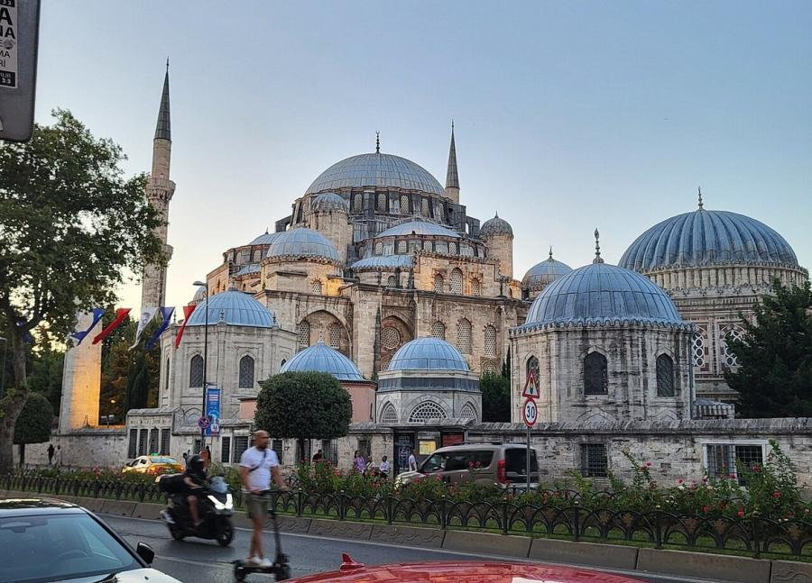
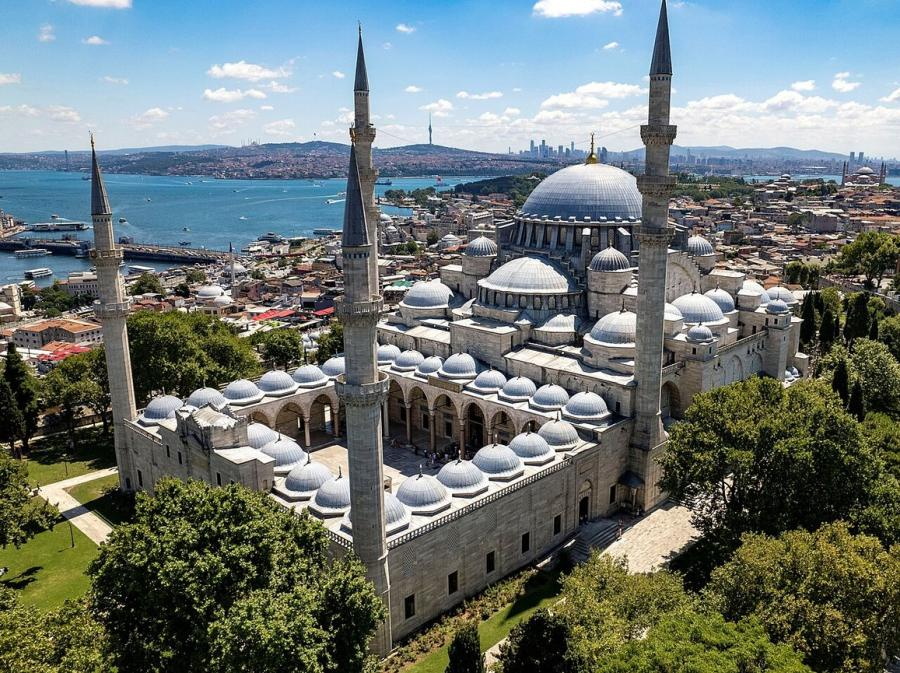
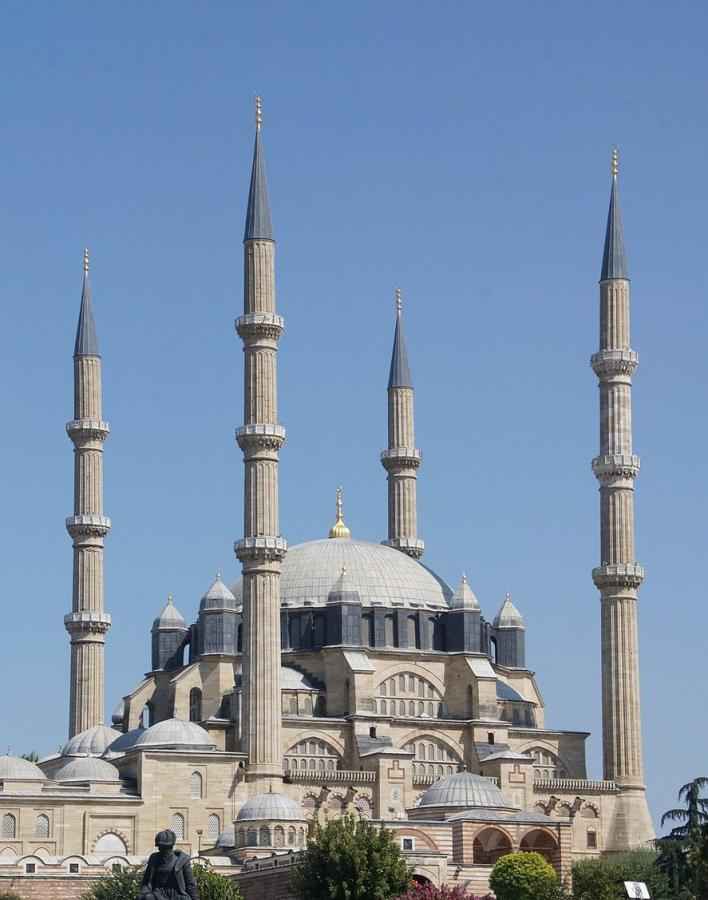
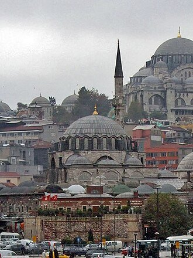
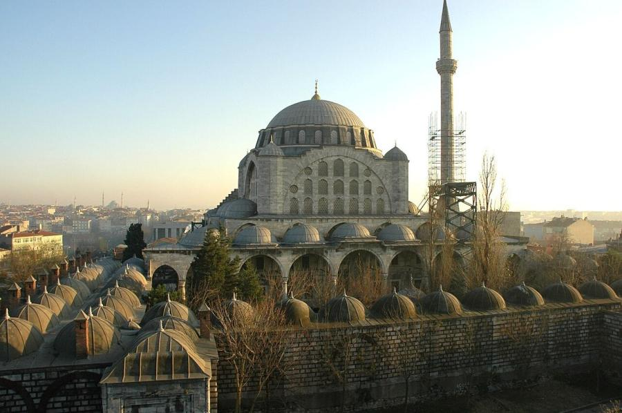

# Mimar Sinan (c. 1489–1588)

> Chief royal architect to three Ottoman sultans, whose hundreds of mosques, bridges and hospitals across the empire brought Ottoman architecture to its classical peak.

## Overview

Mimar Sinan was the greatest architect of the Ottoman Empire's classical age, serving as chief royal
architect for nearly fifty years under three sultans. In that time he is credited with several
hundred structures across the empire, from small neighbourhood mosques to entire charitable
complexes, alongside bridges, aqueducts, hospitals and public baths. His three most celebrated
mosques, in Istanbul and Edirne, form a self-described progression from apprentice to master, ending
in a dome he engineered to finally surpass Hagia Sophia, the six-century-old building that had set
the standard for domed construction in the region.

## Life

Sinan was born around 1489 or 1490 in the village of Ağırnas, near Kayseri in central Anatolia, into
a Christian family; sources disagree on whether it was Greek or Armenian. Like many boys from
Christian villages, he was conscripted through the devşirme levy into the Ottoman elite corps,
converted to Islam, and trained as a Janissary. He rose through military engineering, building
bridges and fortifications on campaign for Suleiman the Magnificent in Persia and Europe, before
Suleiman appointed him chief royal architect in 1538, a post he held into his late nineties. He
continued designing and travelling to inspect building sites almost to the end of his life, and
died in Istanbul in 1588. He is buried in a small, self-designed tomb just outside the walls of the
Süleymaniye Mosque complex.

## Style & Technique

Sinan's central technical obsession was the dome: he wanted to build one larger and more
structurally daring than the dome of Hagia Sophia, the Byzantine cathedral converted to a mosque
after 1453. He worked out increasingly refined systems of semi-domes, buttressing piers and
pendentives to carry ever-wider domes on fewer visible supports, opening the walls beneath them to
rows of windows. He described his own career as a sequence of three lessons: Şehzade Mosque as
"apprenticeship," Süleymaniye Mosque as "journeyman work," and the Selimiye Mosque in Edirne as
his final "masterpiece," where the dome at last exceeded Hagia Sophia's span. He also built purely
functional infrastructure, aqueducts and bridges, some of which are still standing and in use.

## Legacy

Sinan trained a generation of students, several of whom carried his methods across the empire and
into later Ottoman building, and he is regarded in Turkey with the kind of reverence given to
Michelangelo or Bernini in Italy. Streets, universities and Turkey's largest architecture prize
carry his name. The Selimiye Mosque, his acknowledged masterpiece, was inscribed as a UNESCO World
Heritage Site in 2011, and his mosques remain active places of worship, still drawing architects and
engineers studying how he pushed masonry domes to their structural limits.

## Key Works

<!-- works:start -->

### 1. Şehzade Mosque (1543–1548)

*Cut stone, brick and lead-covered domes · Fatih, Istanbul, Ottoman Empire*

Built for Suleiman the Magnificent in memory of his son Şehzade Mehmed, who died young, this was Sinan's first major imperial commission after his appointment as chief architect. He later called it his "apprenticeship work," experimenting with a four-semi-dome plan around a central dome that he would refine for the rest of his career. Its twin minarets each carry two balconies.

Image: [Wikimedia Commons](https://commons.wikimedia.org/wiki/File:Sehzade_camisi.jpg) · Viceskeeni2 · [CC0](http://creativecommons.org/publicdomain/zero/1.0/deed.en)

### 2. Süleymaniye Mosque (1550–1557)

*Cut stone and brick, with a lead-covered central dome · Fatih, Istanbul, Ottoman Empire*

The centrepiece of a vast charitable complex built for Suleiman the Magnificent, with hospitals, schools, a soup kitchen, baths and a caravanserai around the mosque itself. Sinan called it his "journeyman work," a step toward surpassing the ancient dome of Hagia Sophia nearby. Sinan and Suleiman are both buried in domed mausoleums in its garden.

Image: [Wikimedia Commons](https://commons.wikimedia.org/wiki/File:S%C3%BCleymaniyeMosqueIstanbul_(cropped).jpg) · Hunanuk · [CC0](http://creativecommons.org/publicdomain/zero/1.0/deed.en)

### 3. Selimiye Mosque (1568–1574)

*Cut stone and brick, with a lead-covered dome on an octagonal drum · Edirne, Ottoman Empire*

Built for Selim II in the former Ottoman capital of Edirne, and the building Sinan himself called his masterpiece, completed at about eighty years old. Eight massive piers carry a dome whose diameter finally exceeded that of Hagia Sophia, the target he had chased his whole career, while four slender, fluted minarets frame the courtyard. It is a UNESCO World Heritage Site.

Image: [Wikimedia Commons](https://commons.wikimedia.org/wiki/File:Selimiye_Mosque_(15051985908)_(cropped).jpg) · rob Stoeltje from loenen, netherlands · [CC BY 2.0](https://creativecommons.org/licenses/by/2.0)

### 4. Rüstem Pasha Mosque (1561–1563)

*Stone construction faced inside with İznik tile · Eminönü, Istanbul, Ottoman Empire*

A small mosque for grand vizier Rüstem Pasha, raised on a shopping arcade above a busy market street, its modest footprint hides an interior sheathed almost floor to ceiling in high-quality İznik tile in the tomato-red that marks the finest production of the period, more densely tiled than any other Ottoman mosque of its size.

Image: [Wikimedia Commons](https://commons.wikimedia.org/wiki/File:Rustem_Pasha_Mosque.JPG) · User:Simm · [CC BY-SA 2.5](https://creativecommons.org/licenses/by-sa/2.5)

### 5. Mihrimah Sultan Mosque (1562–1565)

*Cut stone with an unusually large number of windows · Edirnekapı, Istanbul, Ottoman Empire*

Built at the city's highest point for Mihrimah Sultan, Suleiman the Magnificent's daughter, on a hilltop site that let Sinan surround the single dome with an exceptional number of windows, flooding the prayer hall with light. A popular, likely apocryphal legend reads the light effects at the spring and autumn equinoxes as a tribute to her name, which means "sun and moon."

Image: [Wikimedia Commons](https://commons.wikimedia.org/wiki/File:Istanbul_-_Mesquita_de_Mihrimah.JPG) · Josep Renalias · [CC BY-SA 3.0](https://creativecommons.org/licenses/by-sa/3.0)

<!-- works:end -->
## Sources

- [Mimar Sinan (Wikipedia)](https://en.wikipedia.org/wiki/Mimar_Sinan)
- [Selimiye Mosque, Edirne (Wikipedia)](https://en.wikipedia.org/wiki/Selimiye_Mosque,_Edirne)
- [Süleymaniye Mosque (Wikipedia)](https://en.wikipedia.org/wiki/S%C3%BCleymaniye_Mosque)
