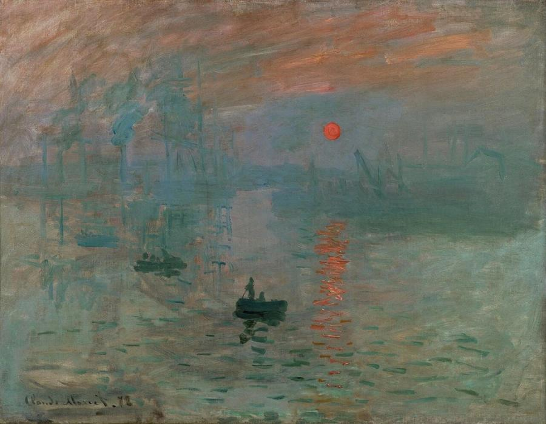
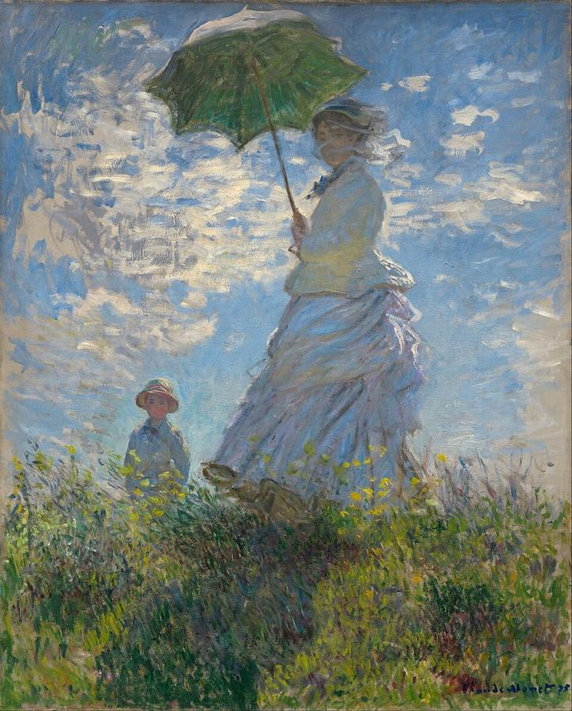
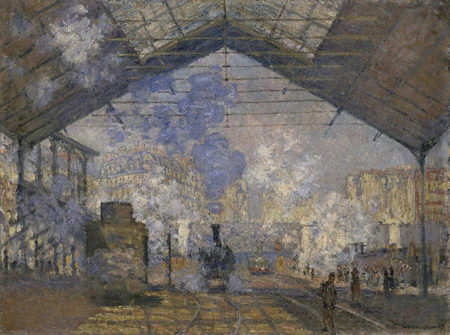
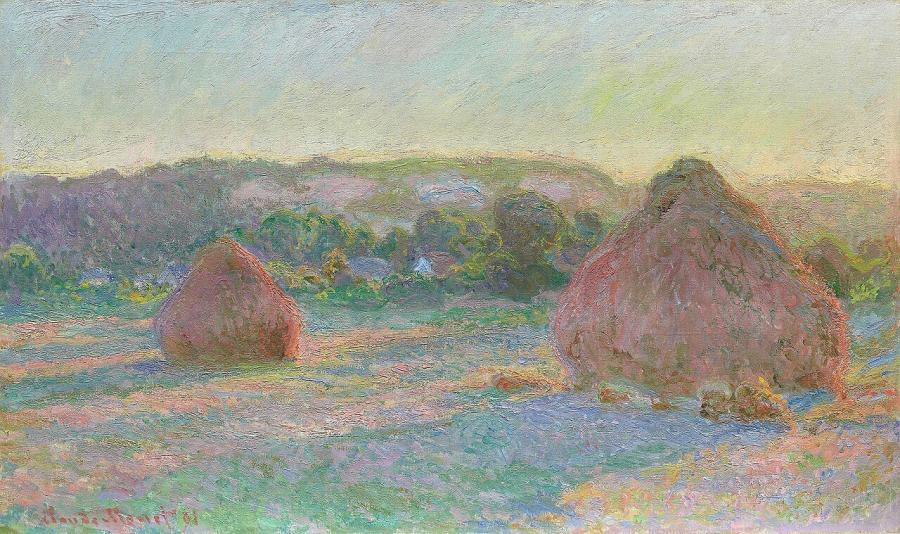
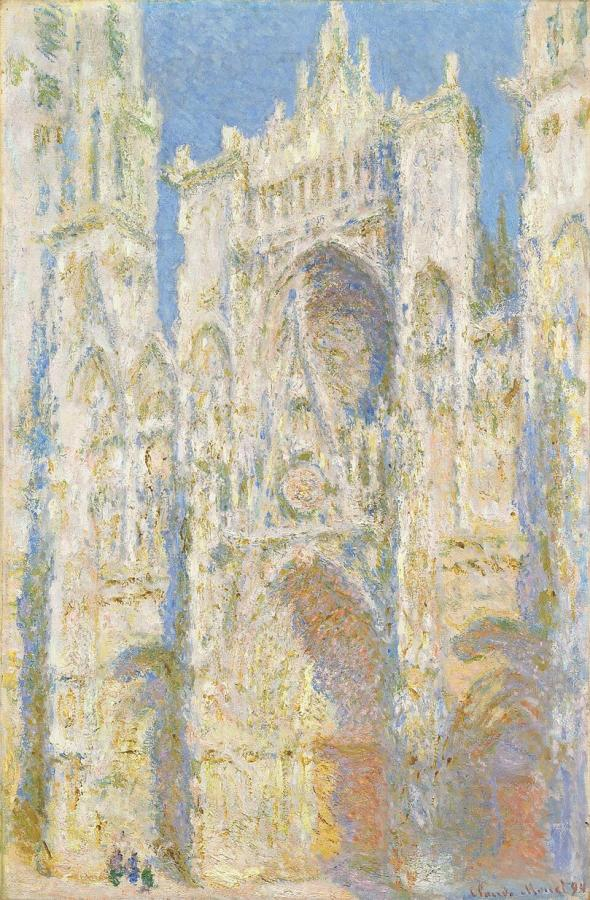
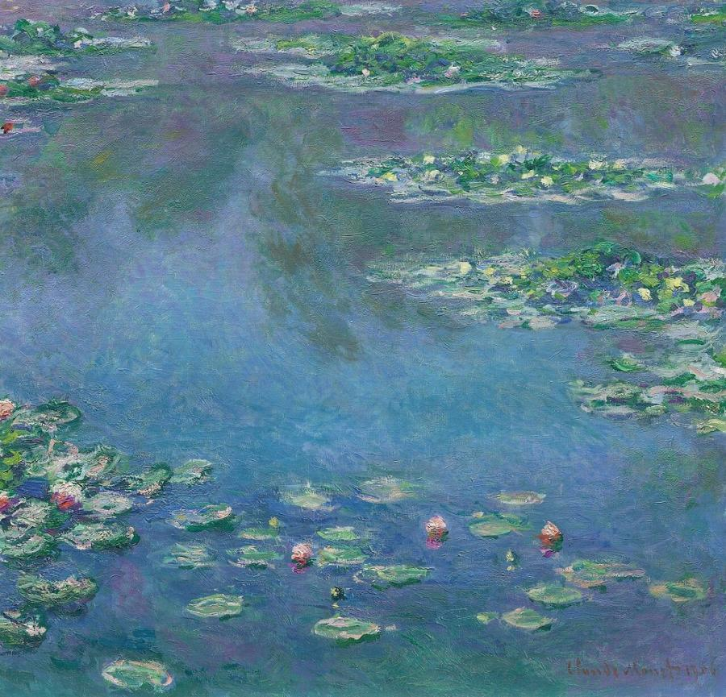

# Claude Monet (1840–1926)

> The founder of Impressionism, who spent his life painting the changing effects of light, from Paris railway stations to the water lilies of Giverny.

## Overview

Claude Monet was the leader and purest practitioner of Impressionism. His painting *Impression,
Sunrise* gave the movement its name. Working outdoors whenever he could, he tried to capture fleeting
effects of light, weather and atmosphere with rapid strokes of pure colour. In later life he painted
series of the same subject, such as haystacks, poplars, Rouen Cathedral and the Thames, in changing
conditions. He ended with the vast, almost abstract water lily paintings made in his garden at
Giverny, which later inspired abstract painters.

## Life

Monet was born in Paris on 14 November 1840 and grew up in the port of Le Havre, where as a teenager he
sold caricatures of local people. The landscape painter Eugène Boudin persuaded him to paint outdoors,
*en plein air*, a turning point in his life. In Paris he met Camille Pissarro, and in the studio of
Charles Gleyre he befriended Renoir, Sisley and Bazille.

The 1860s and 1870s were years of poverty and struggle. His model and companion Camille Doncieux bore
their son Jean in 1867, and they married in 1870. During the Franco-Prussian War he took refuge in
London, where he saw Turner's paintings and met the dealer Paul Durand-Ruel. Back in France he painted
at Argenteuil on the Seine. In 1874 he and his friends held their own exhibition, independent of the
official Salon. Critics mocked them, and the name "Impressionist" stuck.

Camille died in 1879. Monet later married Alice Hoschedé, and in 1883 the combined family settled at
Giverny, in Normandy. Success came slowly and then decisively in the 1890s. He bought the house and
created a flower garden and a water garden with a Japanese bridge, which became his main subject. In
his last decade he fought cataracts, which changed his colour vision, and worked on the giant
*Grandes Décorations*, which he gave to the French state as a monument to peace after the First World
War. He died at Giverny on 5 December 1926.

## Style & Technique

Monet applied colour in short, broken strokes, placing pure hues side by side instead of blending them.
He painted shadows in blues and purples rather than brown or black, and often abandoned careful
drawing and finish. His aim was to record what the eye actually sees in a particular moment of light:
an "impression".

His series paintings took this further. By painting the same motif again and again, he showed that
light and atmosphere transform any subject. In his late water lily canvases, some many metres long,
there is no horizon. Surface, depth and reflection merge in fields of colour and gestural brushwork.

## Legacy

Impressionism, once mocked, became the most popular movement in the history of art, and Monet its
best-loved painter. His series, and especially the late water lilies, were rediscovered in the 1950s
by the Abstract Expressionists, and critics saw them as precursors of painters such as Jackson Pollock
and Mark Rothko. His house and gardens at Giverny, restored and opened to the public in 1980, draw
hundreds of thousands of visitors each year. In 2019 one of his *Haystacks* sold for $110.7 million.

## Key Works

<!-- works:start -->

### 1. Impression, Sunrise (1872)

*Oil on canvas, 48 × 63 cm · Musée Marmottan Monet, Paris*

The port of Le Havre at dawn, sketched in a few quick strokes of blue and grey, with a small orange sun and its reflection dabbed onto the water. Shown at the first independent exhibition of 1874, it gave the critic Louis Leroy a mocking name for the whole group: the "Impressionists". The painters adopted the name themselves.

Image: [Wikimedia Commons](https://commons.wikimedia.org/wiki/File:Monet_-_Impression,_Sunrise.jpg) · Claude Monet · Public domain

### 2. Woman with a Parasol – Madame Monet and Her Son (1875)

*Oil on canvas, 100 × 81 cm · National Gallery of Art, Washington*

Monet's wife, Camille, stands on a breezy hilltop seen from below, her veil and white dress blowing, while their son Jean watches from further off. Painted quickly outdoors, it is less a portrait than a record of sunlight, wind and a passing moment, like a snapshot of a family walk.

Image: [Wikimedia Commons](https://commons.wikimedia.org/wiki/File:Claude_Monet_-_Woman_with_a_Parasol_-_Madame_Monet_and_Her_Son_-_Google_Art_Project.jpg) · Claude Monet · Public domain

### 3. La Gare Saint-Lazare (1877)

*Oil on canvas, 75 × 104 cm · Musée d'Orsay, Paris*

Monet obtained permission to set up his easel inside the Paris railway station and painted a dozen views of its trains, iron roof and billowing steam. This one captures locomotives puffing clouds of blue and white smoke under the glass canopy. It celebrates modern life and turns the station into a cathedral of light and vapour.

Image: [Wikimedia Commons](https://commons.wikimedia.org/wiki/File:Claude_Monet_-_The_Saint-Lazare_Station_-_Google_Art_Project.jpg) · Claude Monet · Public domain

### 4. Stacks of Wheat (End of Summer) (1890–1891)

*Oil on canvas, 60 × 100 cm · Art Institute of Chicago*

Two tall stacks of harvested wheat near Monet's home at Giverny, painted in warm late-summer light. It is part of a series of some 25 canvases of the same subject in different seasons, weather and times of day. Monet worked on several canvases at once, switching as the light changed. The series, shown in 1891, was a triumph.

Image: [Wikimedia Commons](https://commons.wikimedia.org/wiki/File:Claude_Monet_-_Stacks_of_Wheat_(End_of_Summer)_-_1985.1103_-_Art_Institute_of_Chicago.jpg) · Claude Monet · Public domain

### 5. Rouen Cathedral, West Façade, Sunlight (1894)

*Oil on canvas, 100 × 66 cm · National Gallery of Art, Washington*

Renting rooms opposite the Gothic cathedral of Rouen, Monet painted its façade more than 30 times at different hours. In this bright-afternoon version, the stone dissolves into crusty layers of cream, gold and blue shadow. The subject is no longer the building but the light that falls on it.

Image: [Wikimedia Commons](https://commons.wikimedia.org/wiki/File:Claude_Monet,_Rouen_Cathedral,_West_Fa%C3%A7ade,_Sunlight,_1894,_NGA_46654.jpg) · Claude Monet · Public domain

### 6. Water Lilies (1906)

*Oil on canvas, 89.9 × 94.1 cm · Art Institute of Chicago*

Looking down at the surface of the pond Monet created in his garden at Giverny, we see floating lily pads and flowers mixed with reflections of sky and trees, with no horizon or bank. Monet painted about 250 water lily pictures in his last 30 years. The largest, the *Grandes Décorations*, fill two oval rooms at the Musée de l'Orangerie in Paris.

Image: [Wikimedia Commons](https://commons.wikimedia.org/wiki/File:Claude_Monet_-_Water_Lilies_-_1906,_Ryerson.jpg) · Claude Monet · Public domain

<!-- works:end -->
## Sources

- [Claude Monet (Wikipedia)](https://en.wikipedia.org/wiki/Claude_Monet)
- [Impression, Sunrise (Wikipedia)](https://en.wikipedia.org/wiki/Impression,_Sunrise)
- [Water Lilies (Monet series) (Wikipedia)](https://en.wikipedia.org/wiki/Water_Lilies_%28Monet_series%29)
