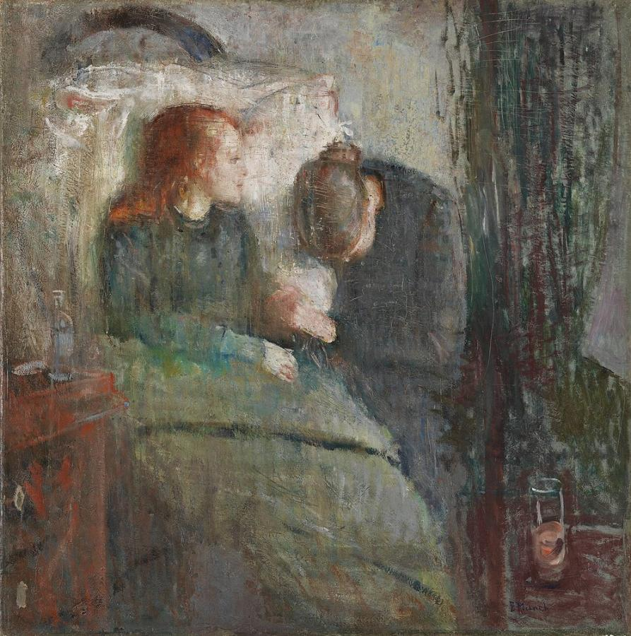
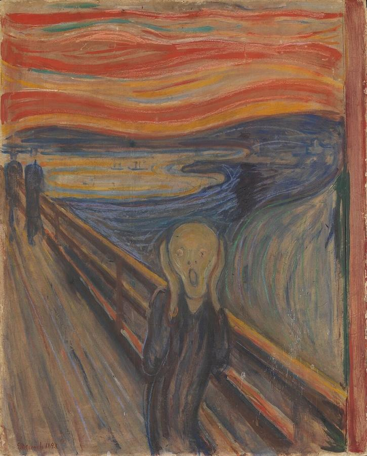
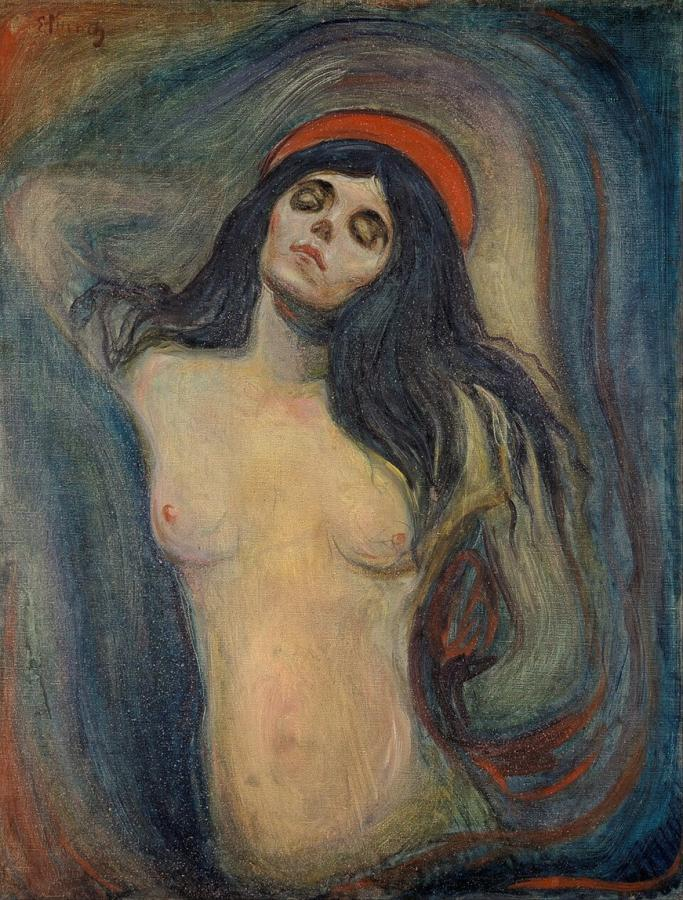
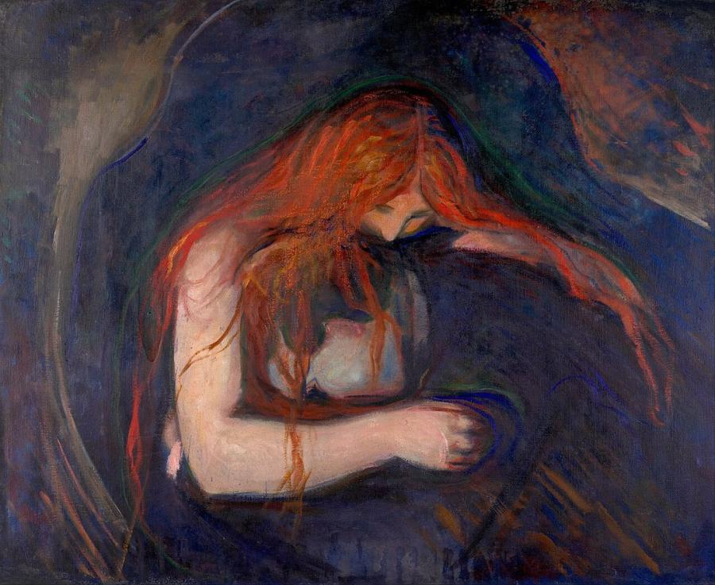
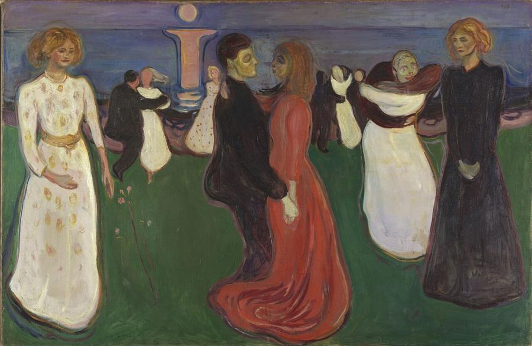
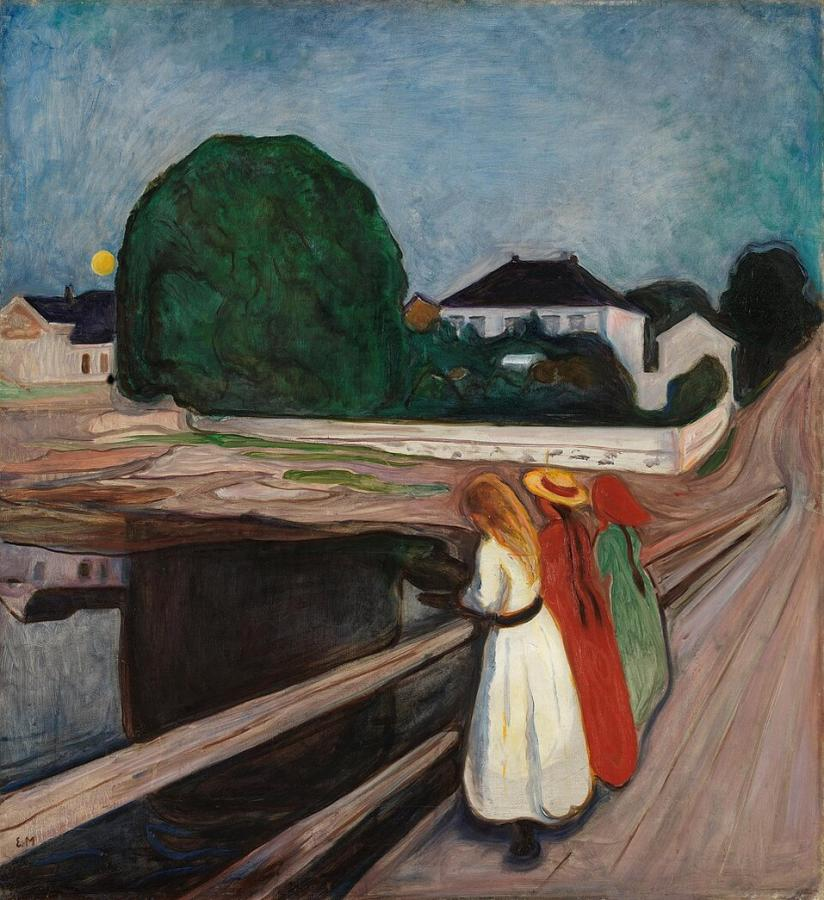

# Edvard Munch (1863–1944)

> The Norwegian painter of anxiety, love and death, whose *Scream* became the emblem of the modern psyche.

## Overview

Edvard Munch turned his own experiences of illness, grief, love and fear into images that speak to
almost everyone. Rejecting naturalism, he used strong colour, swirling lines and simplified forms to
express inner states: "I paint not what I see, but what I saw." His *Frieze of Life* cycle explored the
great themes of human existence. *The Scream* is one of the most recognised images in the world. Munch
was also a pioneering printmaker, and he became a founding figure of Expressionism.

## Life

Munch was born on 12 December 1863 in Løten, Norway, and grew up in Kristiania (now Oslo). His mother
died of tuberculosis when he was five, and his favourite sister, Sophie, died of the same disease when
he was 13. His father, a devout army doctor, was prone to religious anxiety, and another sister was
later hospitalised for mental illness. "Illness, insanity and death were the black angels that kept
watch over my cradle," Munch wrote.

He studied art in Kristiania and joined the city's bohemian circle of writers and artists, who
rejected bourgeois morality. Visits to Paris exposed him to Impressionism and Post-Impressionism. In
1892 his exhibition in Berlin was closed after a week amid scandal, which made him famous in Germany.
In the 1890s he lived mostly in Berlin and Paris, mixing with writers such as August Strindberg, and
developed the *Frieze of Life*.

After years of heavy drinking and a turbulent love affair, he suffered a breakdown in 1908 and was
treated in a clinic in Copenhagen. He returned to Norway in 1909, painted monumental murals for the
Aula of the University of Oslo, and from 1916 lived quietly at his estate, Ekely, outside Oslo. In 1937
the Nazis labelled his work "degenerate" and removed it from German museums. He died at Ekely on 23
January 1944.

## Style & Technique

Munch simplified forms into flowing outlines and flat areas of expressive colour. He was influenced by
Van Gogh, Gauguin and Symbolism. He often worked the paint thinly, scraped it back, or left canvases
exposed to the weather, a practice he called his "horse cure". He repeated his key motifs many times,
in paint and in prints.

His lithographs and woodcuts are as important as his paintings. In woodcuts he used the grain of the
wood as part of the image and sawed blocks into pieces to print different colours. The motifs recur
throughout: the lonely figure, the shoreline, the column of moonlight, the embracing couple.

## Legacy

Munch had an enormous influence on German Expressionism, especially the artists of *Die Brücke*. He
left his estate to the city of Oslo: about 1,100 paintings, 4,500 drawings and 18,000 prints. They
became the core of the Munch Museum, which moved to a new 13-storey building on the Oslo waterfront in
2021. *The Scream* has been stolen twice, from the National Gallery in 1994 and from the Munch Museum
in 2004, and recovered both times. Its image appears everywhere in popular culture, from films to
emoji.

## Key Works

<!-- works:start -->

### 1. The Sick Child (1885–1886)

*Oil on canvas, 119.5 × 118.5 cm · National Museum, Oslo*

A pale, red-haired girl propped on a pillow turns toward a grieving woman who bows her head beside the bed. The picture recalls the death of Munch's sister Sophie from tuberculosis. He scraped, scratched and repainted the canvas for a year until the surface seemed damaged. Critics mocked it as unfinished, but Munch called it a breakthrough, and he returned to the subject all his life.

Image: [Wikimedia Commons](https://commons.wikimedia.org/wiki/File:Munch_Det_Syke_Barn_1885-86.jpg) · Edvard Munch · Public domain

### 2. The Scream (1893)

*Tempera and crayon on cardboard, 91 × 73.5 cm · National Museum, Oslo*

A skull-like figure clutches its face on a bridge beneath a blood-red sky. Munch recalled walking at sunset, feeling "an infinite scream passing through nature". He made several painted, pastel and printed versions. The image has become a universal symbol of modern anxiety. A 1895 pastel version sold for $119.9 million in 2012.

Image: [Wikimedia Commons](https://commons.wikimedia.org/wiki/File:Edvard_Munch,_1893,_The_Scream,_oil,_tempera_and_pastel_on_cardboard,_91_x_73_cm,_National_Gallery_of_Norway.jpg) · Edvard Munch · Public domain

### 3. Madonna (1894)

*Oil on canvas, 91 × 70.5 cm · National Museum, Oslo*

A nude woman with long black hair and closed eyes, a red halo above her head, sways against a dark, swirling ground. Munch combined the sacred and the erotic, conception and death. In a later lithograph version he added a frame of swimming sperm and a foetus-like figure. It belongs to his *Frieze of Life* cycle about love and mortality.

Image: [Wikimedia Commons](https://commons.wikimedia.org/wiki/File:Edvard_Munch_-_Madonna_-_Google_Art_Project.jpg) · Edvard Munch · Public domain

### 4. Vampire (Love and Pain) (1895)

*Oil on canvas, 91 × 109 cm · Munch Museum, Oslo*

A woman with flaming red hair bends over a man, her mouth at his neck, her hair falling over him like streams of blood. Munch first called it *Love and Pain*. A critic named it *Vampire*, and the title stuck. The ambiguous embrace, comforting or consuming, captures Munch's view of love as both tender and destructive.

Image: [Wikimedia Commons](https://commons.wikimedia.org/wiki/File:Edvard_Munch_-_Vampire_(1895)_-_Google_Art_Project.jpg) · Edvard Munch · Public domain

### 5. The Dance of Life (1899–1900)

*Oil on canvas, 125.5 × 190.5 cm · National Museum, Oslo*

Couples dance on a shore on a midsummer night, beneath the pillar of the moon's reflection on the sea. Three women frame the scene: a young woman in white, a woman in red at the centre locked in a dance with a man, and an older woman in black. They represent innocence, passion and grief. It is one of the key paintings of Munch's *Frieze of Life*.

Image: [Wikimedia Commons](https://commons.wikimedia.org/wiki/File:Edvard_Munch_-_The_Dance_of_Life_-_NG.M.00941_-_National_Museum_of_Art,_Architecture_and_Design.jpg) · Edvard Munch · Public domain

### 6. The Girls on the Bridge (1901)

*Oil on canvas, 136 × 125 cm · National Museum, Oslo*

Three girls lean on the railing of a jetty in the small coastal town of Åsgårdstrand on a light summer night, while a great tree and its reflection loom over the water. The mood is calmer than in *The Scream*, which is set on a similar bridge, but still charged with longing and melancholy. Munch painted many versions of this popular subject.

Image: [Wikimedia Commons](https://commons.wikimedia.org/wiki/File:Edvard_Munch_-_The_Girls_on_the_Bridge_-_NG.M.00844_-_National_Museum_of_Art,_Architecture_and_Design.jpg) · Edvard Munch · Public domain

<!-- works:end -->
## Sources

- [Edvard Munch (Wikipedia)](https://en.wikipedia.org/wiki/Edvard_Munch)
- [The Scream (Wikipedia)](https://en.wikipedia.org/wiki/The_Scream)
- [MUNCH museum](https://www.munchmuseet.no/en/)
