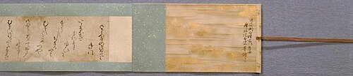
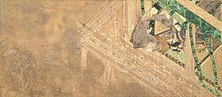
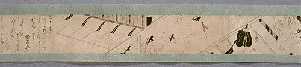
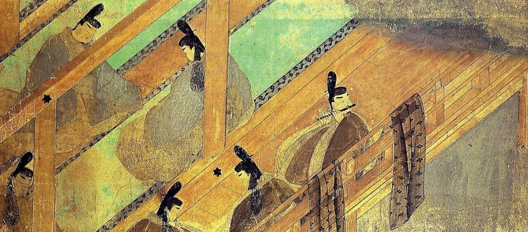
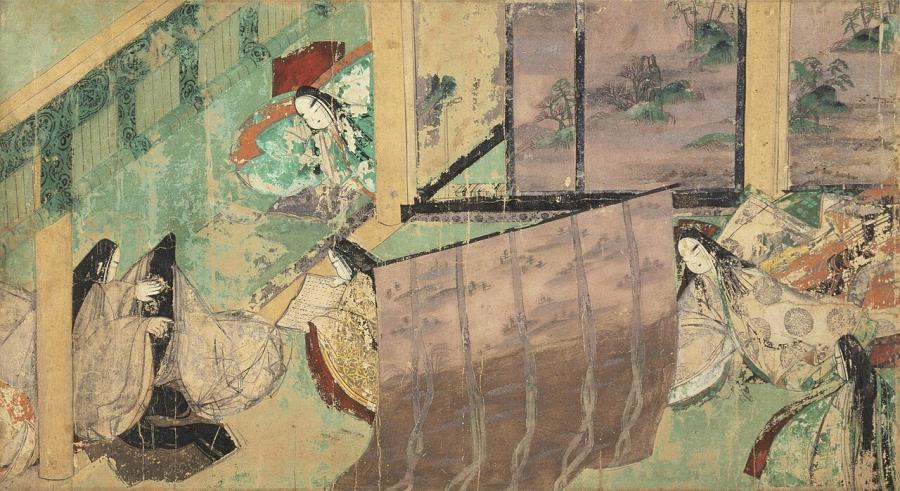

# Murasaki Shikibu (c. 973–c. 1014)

> The Heian-era court lady whose sprawling novel of court life and love, The Tale of Genji, is widely considered the world's first novel.

## Overview

Murasaki Shikibu was a lady-in-waiting at the Heian-era Japanese imperial court who wrote *The Tale
of Genji*, a 54-chapter novel following the romantic and political life of a fictional prince and, in
its later chapters, his descendants. Composed roughly a thousand years ago, it is widely regarded as
the world's first novel and remains a foundational work of Japanese literature, prized for its
psychological subtlety and its detailed portrait of Heian court life.

## Life

Little is known of Murasaki Shikibu's life beyond what can be inferred from her own diary and scraps
of court record; even her real personal name is unknown, "Murasaki Shikibu" being a later nickname
combining a character from her novel with her father's court rank. Born around 973 into a minor
branch of the powerful Fujiwara clan, she received an unusually thorough education in Chinese
classics, normally reserved for men, by absorbing lessons given to her brother. She married a much
older provincial governor around 998, was widowed within a few years, and around 1005 or 1006 entered
service at the imperial court as a lady-in-waiting to Empress Shōshi, where she likely continued
writing and revising *The Tale of Genji*, probably begun before she arrived at court. She also kept a
diary, *The Diary of Lady Murasaki*, recording court life and rivalries, including a barbed comment
about her contemporary Sei Shōnagon. She is thought to have died around 1014, though the exact date,
like most of her biography, is uncertain.

## Style & Technique

*The Tale of Genji* is built from dozens of interwoven characters and, unusually for its time, an
interest in psychological interiority, characters' private motives, regrets and self-deceptions,
rather than only their outward actions. Murasaki wrote almost entirely in hiragana, the syllabic
script associated with women's writing at the Heian court, rather than the Chinese-derived script
used for official and male scholarly writing, and embedded hundreds of waka poems into the narrative
as characters' own compositions, a convention of court fiction she pushed to new sophistication. The
novel's structure loosens across its later chapters, following the diminishing fortunes of Genji's
descendants after his death in a tone markedly more melancholy than its earlier sections.

## Legacy

*The Tale of Genji* has been continuously read, copied, illustrated and adapted in Japan for a
thousand years, and the earliest surviving illustrated version, the 12th-century Genji Monogatari
Emaki, is itself a Japanese National Treasure. The novel is widely taught as one of the founding
texts of world literature and has been translated into English several times, each translation
prompting fresh debate over how to render its indirect, allusive Heian court idiom. Murasaki Shikibu
appears on the Japanese 2000 yen banknote, and the site of her likely birthplace and burial are
still visited as literary landmarks in Kyoto.

## Key Works

<!-- works:start -->

### 1. The Tale of Genji — Hakubyō scroll fragment (c. 1005–1010)

*Illustrated hand scroll (hakubyō, monochrome ink line drawing) on paper · Private collection*

A scene from a later, monochrome ink-line ("hakubyō") illustrated copy of the novel, a distinct tradition from the coloured Tokugawa and Gotoh scrolls also shown here, and evidence of how continuously artists kept reinterpreting Murasaki's novel in new visual styles over the following centuries.

Image: [Wikimedia Commons](https://commons.wikimedia.org/wiki/File:Hakubyo_Genji_monogatari_emaki_-_scroll_1-1.jpg) · Unknown author Unknown author · Public domain

### 2. The Tale of Genji — "Yadorigi" (c. 1005–1010)

*Illustrated hand scroll (yamato-e), ink and colour on paper · Tokugawa Art Museum, Nagoya, Japan*

A later chapter, illustrated in the same early 12th-century scroll tradition, following the generation after Genji's death as his descendants navigate the same web of court rivalry, love and Buddhist renunciation that structures the novel's earlier chapters.

Image: [Wikimedia Commons](https://commons.wikimedia.org/wiki/File:Genji_emaki_Yadorigi.JPG) · Imperial court in Kyoto. The handscroll had been said to be painted by Fujiwara, Takayoshi, though it is now presumed to be painted by several groups of painters in Heian period. · Public domain

### 3. The Tale of Genji — Hakubyō scroll fragment (II) (c. 1005–1010)

*Illustrated hand scroll (hakubyō, monochrome ink line drawing) on paper · Private collection*

Another scene from the same monochrome hakubyō scroll, part of a genre of ink-line Genji illustration that favoured clarity of narrative detail over the saturated mineral colour of the earliest surviving scrolls, and was often used as a study or reference copy by later painters.

Image: [Wikimedia Commons](https://commons.wikimedia.org/wiki/File:Hakubyo_Genji_monogatari_emaki_-_scroll_1-4.jpg) · Unknown author Unknown author · Public domain

### 4. The Tale of Genji — "Suzumushi" (The Bell Cricket) (c. 1005–1010)

*Illustrated hand scroll (yamato-e), ink and colour on paper · Gotoh Museum, Tokyo, Japan*

A chapter named for the bell crickets released into a garden Genji has planted to evoke autumn, illustrated with the restrained, geometric interior perspective and stylised wind-blown-away-roof viewpoint characteristic of this earliest surviving Genji scroll tradition.

Image: [Wikimedia Commons](https://commons.wikimedia.org/wiki/File:GENJI_EMAKI_-SUZUMUSHI_GOTO_MUSEUM.jpg) · According to Japanese Copyright Law (June 1, 2018 grant) the copyright on this work has expired and is as such public domain . According to articles 51, 52, 53 and 57 of the copyright laws of Japan, under the jurisdiction of the Government of Japan works enter the public domain 50 years after the death of the creator (there being multiple creators, the creator who dies last) or 50 years after publication for anonymous or pseudonymous authors or for works whose copyright holder is an organization. Note: The enforcement of the revised Copyright Act on December 30, 2018 extended the copyright term of works whose copyright was valid on that day to 70 years. Do not use this template for works of the copyright holders who died after 1967. Use {{PD-Japan-oldphoto}} for photos published before December 31, 1956, and {{PD-Japan-film}} for films produced prior to 1953. Public domain works must be out of copyright in both the United States and in the source country of the work in order to be hosted on the Commons. The file must have an additional copyright tag indicating the copyright status in the United States. See also Copyright rules by territory . · Public domain

### 5. The Tale of Genji — "Azumaya" (The Eastern Cottage) (c. 1005–1010)

*Illustrated hand scroll (yamato-e), ink and colour on paper · Tokugawa Art Museum, Nagoya, Japan*

Part of the novel's final "Uji chapters," set a generation after Genji's death and centred on his descendants' tangled romances, illustrated with the same muted mineral-pigment palette and roofless bird's-eye compositions used throughout the scroll.

Image: [Wikimedia Commons](https://commons.wikimedia.org/wiki/File:Genji_emaki_azumaya.jpg) · Imperial court in Kyoto · Public domain

<!-- works:end -->
## Sources

- [Murasaki Shikibu (Wikipedia)](https://en.wikipedia.org/wiki/Murasaki_Shikibu)
- [The Tale of Genji (Wikipedia)](https://en.wikipedia.org/wiki/The_Tale_of_Genji)
- [Genji Monogatari Emaki (Wikipedia)](https://en.wikipedia.org/wiki/Genji_Monogatari_Emaki)
