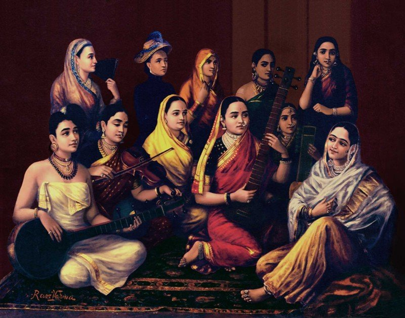
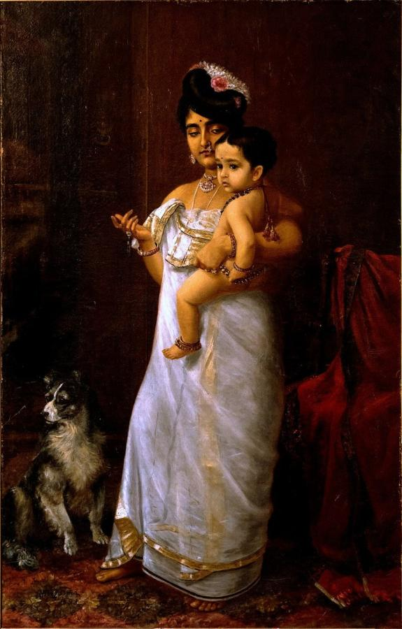
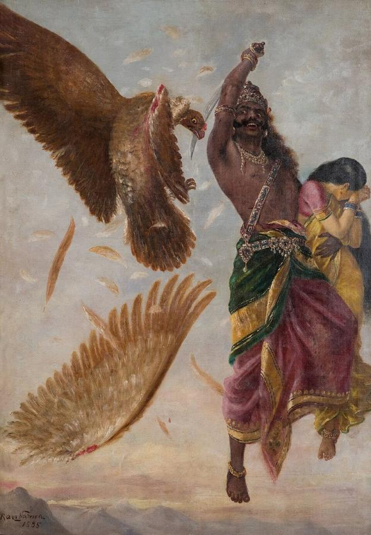
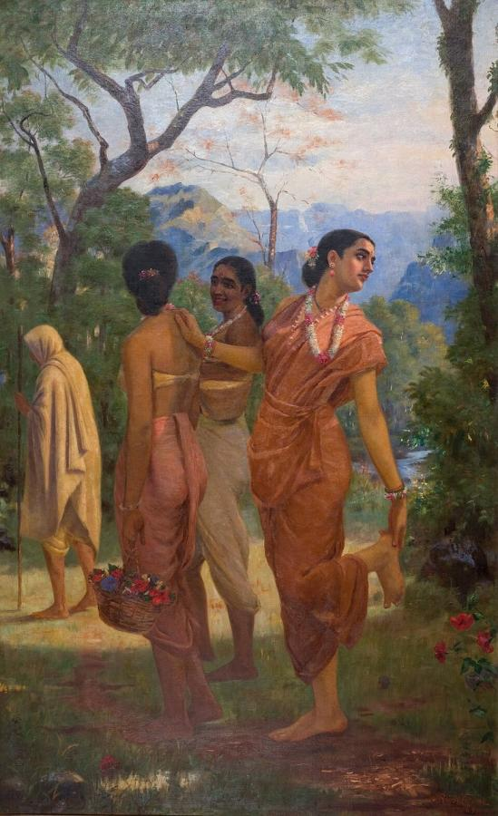
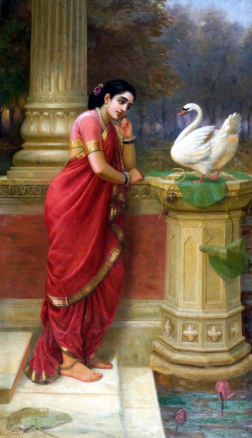
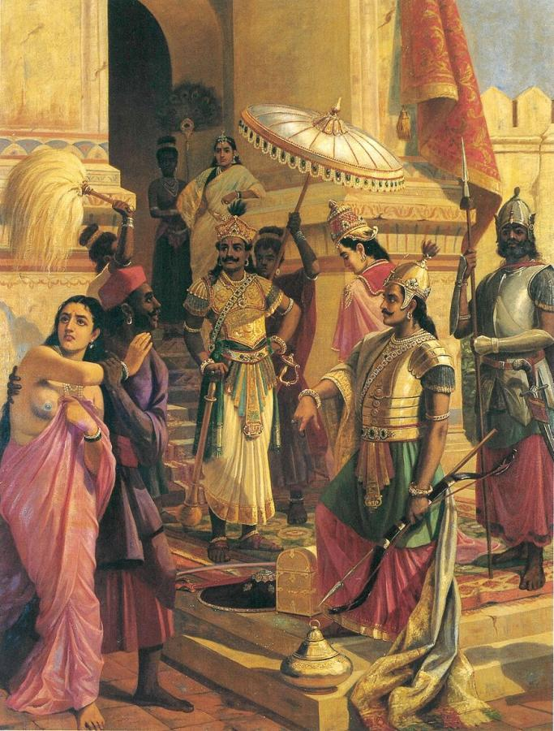

# Raja Ravi Varma (1848–1906)

> The painter-prince of Travancore who brought European oil painting to Indian myths, and whose prints put gods and heroines in homes across India.

## Overview

Raja Ravi Varma was the most famous Indian painter of the 19th century and one of the first to master
European academic oil painting. He used it to paint scenes from the Hindu epics, the *Ramayana* and
*Mahabharata*, and from classical Sanskrit literature, along with elegant portraits. He gave gods,
goddesses and heroines a realistic human form. When he set up his own printing press, cheap colour
reproductions of his paintings spread his images into homes, temples and calendars across India, and
they shaped how millions of people imagined their myths.

## Life

Ravi Varma was born on 29 April 1848 at Kilimanoor, near Thiruvananthapuram in the princely state of
Travancore, into an aristocratic family related to the ruling house. His uncle, the painter Raja Raja
Varma, noticed his talent. At 14 he was taken to the palace in Thiruvananthapuram
under the patronage of Maharaja Ayilyam Thirunal. He learned watercolour from the palace painter and
studied the technique of oil painting partly by watching the visiting European portraitist Theodore
Jensen.

His reputation grew quickly. A portrait won a prize at the 1873 Vienna exhibition, and his work was
shown at the 1893 World's Columbian Exposition in Chicago. Princely rulers across India commissioned
portraits and mythological scenes from him. For Maharaja Sayajirao Gaekwad III of Baroda he painted a
series of Puranic subjects in 1888–1890.

To make his art available to ordinary people, in 1894 he set up a lithographic press in Bombay, later
moved to Malavli near Lonavala. It produced colour prints (oleographs) of his paintings of deities
and heroines, which sold in huge numbers. Critics accused him of vulgarising sacred subjects, and
some prints were attacked as indecent, but they made him a household name. In 1904 the British
Viceroy awarded him the Kaisar-i-Hind Gold Medal. He died at Kilimanoor on 2 October 1906.

## Style & Technique

Ravi Varma combined the realism of Victorian academic painting, with its careful modelling, lighting,
perspective and rich surfaces, with Indian subjects, costumes and settings. His heroines are based on
real women, often in the Maharashtrian nine-yard sari or Kerala dress. They are set in palaces, forests
and riversides that recall European history painting and theatre.

He staged mythological scenes at their most dramatic moments, with expressive gestures and
emotional faces. His portraits of Indian aristocrats and ordinary women are tender and closely
observed. The oleographs simplified his paintings into bright, clear images suited to mass
reproduction.

## Legacy

Ravi Varma's images transformed popular religious art in India. The look of gods and goddesses in
calendar art, comics and film posters still descends from his prints. The early Indian filmmaker
Dadasaheb Phalke worked at his press before making India's first feature film in 1913. Later
nationalist artists of the Bengal School, such as Abanindranath Tagore, rejected his Western style.
Today he is celebrated as a pioneer of modern Indian art, his paintings sell for record prices, and
the Kerala government's highest award for art, the Raja Ravi Varma Puraskaram, bears his name.

## Key Works

<!-- works:start -->

### 1. Galaxy of Musicians (1889)

*Oil on canvas · Sri Jayachamarajendra Art Gallery (Jaganmohan Palace), Mysuru*

Eleven women, each dressed in the clothing of a different region or community of India, play instruments including the veena, tanpura, sitar and tabla. The painting is a celebration of the subcontinent's diversity brought together in harmony. It is sometimes read as an early image of an Indian nation.

Image: [Wikimedia Commons](https://commons.wikimedia.org/wiki/File:Raja_Ravi_Varma,_Galaxy_of_Musicians.jpg) · Raja Ravi Varma · Public domain

### 2. There Comes Papa (1893)

*Oil on canvas · Kowdiar Palace, Thiruvananthapuram*

The artist's daughter Mahaprabha stands holding her infant son and points toward the unseen father arriving at the left, while a small dog looks the same way. Painted with European realism and set in an elegant Kerala interior, it was shown at the World's Columbian Exposition in Chicago in 1893. Critics have linked its absent father to the matrilineal customs of Kerala's Nair community.

Image: [Wikimedia Commons](https://commons.wikimedia.org/wiki/File:Raja_Ravi_Varma,_There_Comes_Papa_(1893).jpg) · Raja Ravi Varma · Public domain

### 3. Jatayu Vadham (The Killing of Jatayu) (1895)

*Oil on canvas · India*

A scene from the *Ramayana*: the demon king Ravana, carrying off Sita in his flying chariot, slashes the wing of the brave vulture-king Jatayu, who tried to rescue her. Sita recoils in horror. Ravi Varma staged the myth like a Western history painting, full of movement, theatrical gesture and dramatic sky.

Image: [Wikimedia Commons](https://commons.wikimedia.org/wiki/File:Ravi_Varma-Ravana_Sita_Jathayu.jpg) · Raja Ravi Varma · Public domain

### 4. Shakuntala (1898)

*Oil on canvas · India*

Shakuntala, heroine of Kalidasa's great Sanskrit play, pretends to pull a thorn from her foot so that she can look back for a last glimpse of King Dushyanta, while her friends tease her. The twist of her body invites us into the story. Through prints this became one of the most familiar images in India.

Image: [Wikimedia Commons](https://commons.wikimedia.org/wiki/File:Raja_Ravi_Varma_-_Mahabharata_-_Shakuntala.jpg) · Raja Ravi Varma · Public domain

### 5. Hamsa Damayanti (1899)

*Oil on canvas · India*

Princess Damayanti leans against a pillar by a palace pool, listening to a golden swan that tells her of the virtues of King Nala. The story comes from the *Mahabharata*. Her pensive, graceful pose and elegant sari made this one of Ravi Varma's most popular images of ideal Indian womanhood, reproduced endlessly in calendars and prints.

Image: [Wikimedia Commons](https://commons.wikimedia.org/wiki/File:Ravi_Varma-Princess_Damayanthi_talking_with_Royal_Swan_about_Nala.jpg) · Raja Ravi Varma · Public domain

### 6. Victory of Meghanada (1905)

*Oil on canvas · India*

Another *Ramayana* scene. Ravana's son Meghanada (Indrajit), having defeated the god Indra, presents the spoils of heaven to his father's court, including captive celestial women. The large, crowded composition, painted in the artist's last years, shows his ambition to create an Indian equivalent of European grand history painting.

Image: [Wikimedia Commons](https://commons.wikimedia.org/wiki/File:Victory_of_Meghanada_by_RRV.jpg) · Raja Ravi Varma · Public domain

<!-- works:end -->
## Sources

- [Raja Ravi Varma (Wikipedia)](https://en.wikipedia.org/wiki/Raja_Ravi_Varma)
- [There Comes Papa (Wikipedia)](https://en.wikipedia.org/wiki/There_Comes_Papa)
- [Shakuntala (Raja Ravi Varma) (Wikipedia)](https://en.wikipedia.org/wiki/Shakuntala_%28Raja_Ravi_Varma%29)
