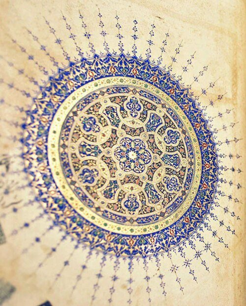
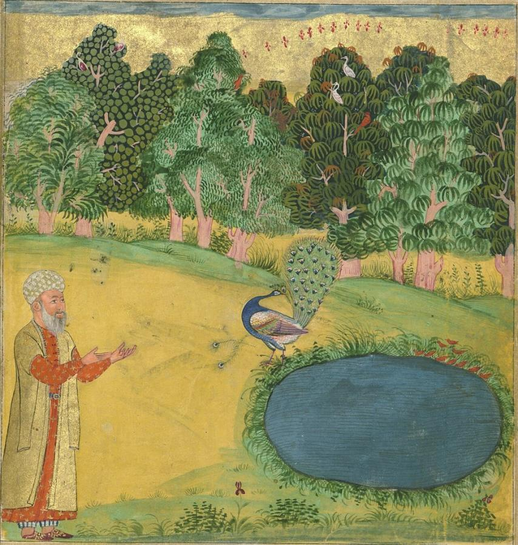
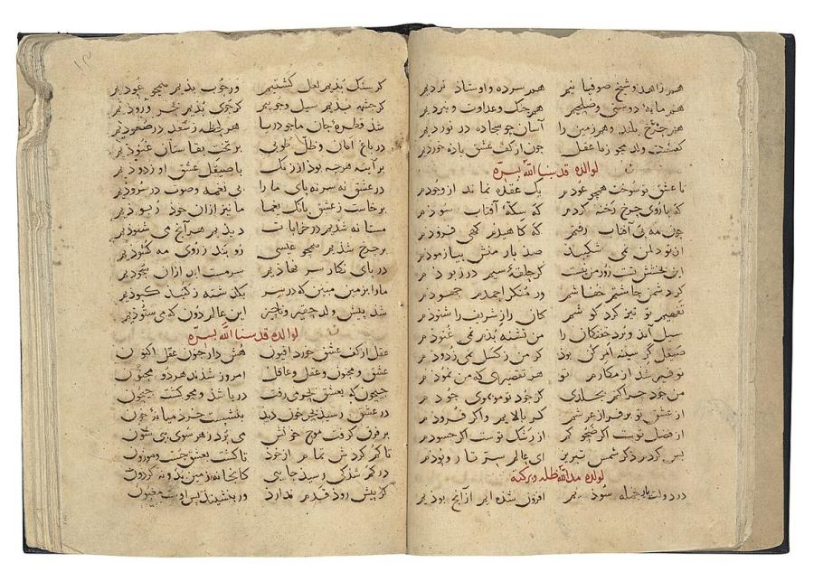
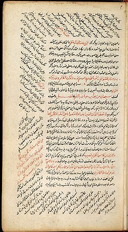
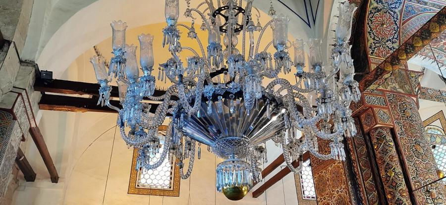

# Jalal al-Din Rumi (1207–1273)

> The Persian mystic poet whose Masnavi and ecstatic lyric verse, and the whirling ceremony his followers built around his teaching, made him one of the most widely read poets in the world.

## Overview

Jalal al-Din Rumi was a 13th-century Islamic scholar and Sufi mystic whose poetry, composed almost
entirely in the last decades of his life following a transformative friendship with the wandering
mystic Shams-e Tabrizi, became some of the most celebrated devotional literature in the Persian
language. His six-book Masnavi and his vast lyric collection, the Divan-e Shams, blend storytelling,
scriptural commentary and ecstatic mystical love poetry, and the whirling Sema ceremony associated
with the Sufi order his followers founded after his death remains a living performance tradition.

## Life

Rumi was born in 1207 in Balkh, then part of the Khwarazmian Empire in Greater Khorasan (in
present-day Afghanistan), into a family of religious scholars. Fleeing the advancing Mongol invasions
during his childhood, his family travelled west over many years, eventually settling in Konya, in
the Seljuk Sultanate of Rum in present-day Turkey, where his father became a respected religious
teacher. Rumi succeeded his father as a legal and religious scholar, a conventional and respected
career, until 1244, when he met a wandering dervish, Shams-e Tabrizi, whose intense friendship and
teaching transformed Rumi's outlook and unleashed the poetry for which he is now known. Shams
disappeared under mysterious circumstances a few years later, possibly murdered by Rumi's own jealous
disciples or family members, a loss Rumi mourned for the rest of his life and channelled into poetry
written in Shams's name rather than his own. In his final decade Rumi dictated his long didactic
poem, the Masnavi, to his disciple Husam al-Din Chalabi. He died in Konya in 1273.

## Style & Technique

Rumi's Masnavi unfolds through hundreds of short parables, animal fables, jokes and scriptural
commentary loosely strung together to illustrate Sufi teaching in memorable, often playful form,
earning it the nickname "the Quran in Persian" among some later readers for its didactic reach. His
lyric poetry in the Divan-e Shams, by contrast, is intensely personal and ecstatic, often addressed
directly to Shams-e Tabrizi as a stand-in for divine love, and became the model for later Sufi love
poetry across the Persian-speaking world. His followers' formalisation of a whirling dance, the Sema,
into a devotional discipline gave his poetry an unusual second life as embodied performance rather
than text alone.

## Legacy

The Mevlevi Sufi order founded by Rumi's followers, popularly known as the "whirling dervishes,"
continues to perform the Sema ceremony at his shrine in Konya, now a UNESCO-recognised heritage site,
and in Mevlevi communities worldwide. His poetry has been translated into dozens of languages, and
loose English adaptations from the late twentieth century onward made him, by some measures, one of
the best-selling poets in the United States, a striking afterlife for a 13th-century Persian
mystic's devotional verse.

## Key Works

<!-- works:start -->

### 1. Masnavi-ye Ma'navi (opening) (c. 1258–1273)

*Illustrated manuscript, Persian didactic poem in rhyming couplets · Bodleian Library, Oxford*

The opening page of Rumi's six-book masterwork, some 25,000 couplets composed over the last decade or so of his life at the request of his disciple Husam al-Din Chalabi, who wrote down the verses as Rumi recited them, reportedly even while walking through the streets of Konya.

Image: [Wikimedia Commons](https://commons.wikimedia.org/wiki/File:Opening_page_of_Masnavi_of_Rumi,_Shiraz,_circa_1460,_Bodleian_Library%E2%80%99s_Manuscript_Elliott_251.jpg) · 1460 artist, Shiraz · Public domain

### 2. Masnavi — The Wise Man and the Peacock (c. 1258–1273)

*Illustrated manuscript, Persian didactic poem in rhyming couplets · Walters Art Museum, Baltimore*

One of hundreds of short parables and stories Rumi wove through the Masnavi's six books to illustrate points of Sufi doctrine in accessible, often humorous form, here a peacock plucking out its own beautiful feathers to avoid the suffering its beauty attracts, a lesson on renouncing worldly vanity.

Image: [Wikimedia Commons](https://commons.wikimedia.org/wiki/File:Illuminated_Manuscript,_Collection_of_poems_(masnavi),_A_wise_man_and_a_peacock_plucking_out_its_feathers_not_to_be_attractive_to_people,_Walters_Art_Museum_Ms._W.626,_fol._220b_detail.jpg) · Walters Art Museum Illuminated Manuscripts · [CC0](http://creativecommons.org/publicdomain/zero/1.0/deed.en)

### 3. Divan-e Shams-e Tabrizi (c. 1247–1273)

*Illustrated manuscript, Persian lyric poetry (ghazals) · British Museum, London*

A vast collection of ecstatic lyric poems, tens of thousands of lines, that Rumi composed after meeting the wandering mystic Shams-e Tabrizi in 1244, an encounter that transformed him from a respected legal scholar into a poet, and which he credited by naming the entire collection after his friend and teacher rather than himself.

Image: [Wikimedia Commons](https://commons.wikimedia.org/wiki/File:A_selection_of_ghazals_from_the_Diwan-i-Shams_of_Jalal_al-Din_Rumi_(d._1273)_and_the_diwan_of_his_son_Baha_al-Din_Sultan_Walad,_Seljuk_Anatolia,_late_13th_-_early_14th_century.jpg) · Christies.com · Public domain

### 4. Fihi Ma Fihi (In It What Is In It) (c. 1250s–1270s)

*Manuscript, prose discourses in Persian · Konya, Turkey*

A collection of Rumi's informal talks and discourses to his disciples, recorded in prose rather than verse, covering everything from Quranic interpretation to everyday anecdotes, and valued by scholars as the clearest direct record of how Rumi taught and argued outside the formal structure of his poetry.

Image: [Wikimedia Commons](https://commons.wikimedia.org/wiki/File:Fihi_ma_fihi_sample.jpg) · Rumi · Public domain

### 5. The Sema (whirling ceremony) (13th century–present)

*Devotional performance: music, poetry recitation and turning dance · Mevlana Museum (Rumi's shrine), Konya, Turkey*

Not a text but a living performance tradition associated with Rumi and formalised by his followers into the Mevlevi Sufi order after his death: a turning dance performed to music and poetry, intended to induce a trance-like focus on the divine. It continues to be performed at his shrine in Konya and by Mevlevi communities worldwide.

Image: [Wikimedia Commons](https://commons.wikimedia.org/wiki/File:Mevlana_Museum,_Konya_06.jpg) · Murat Özsoy 1958 · [CC BY-SA 4.0](https://creativecommons.org/licenses/by-sa/4.0)

<!-- works:end -->
## Sources

- [Rumi (Wikipedia)](https://en.wikipedia.org/wiki/Rumi)
- [Masnavi (Wikipedia)](https://en.wikipedia.org/wiki/Masnavi)
- [Mevlevi Order (Wikipedia)](https://en.wikipedia.org/wiki/Mevlevi_Order)
