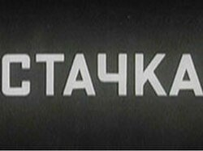
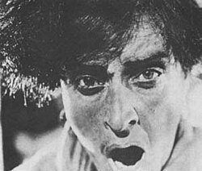
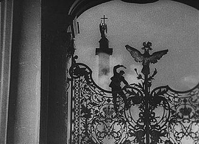
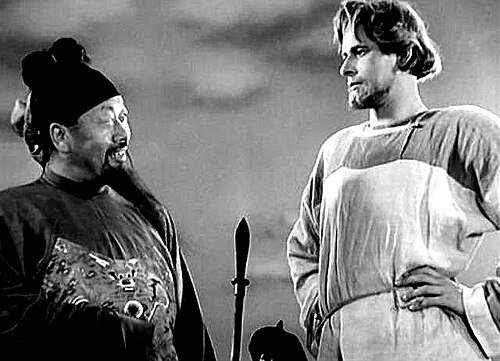
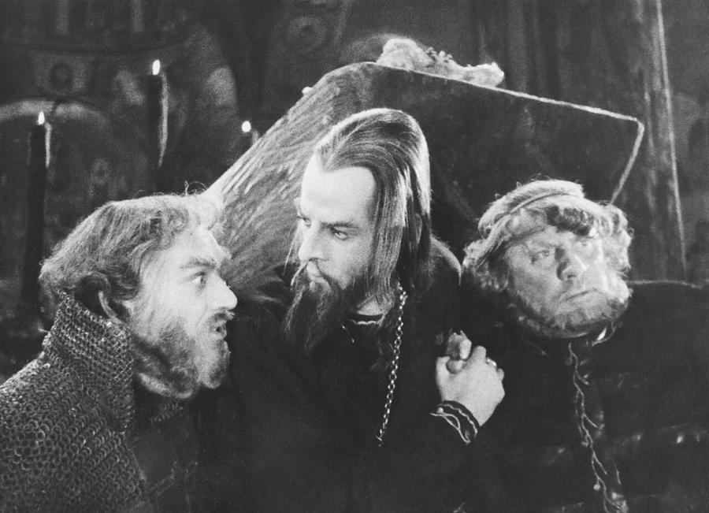

# Sergei Eisenstein (1898–1948)

> The Soviet director and theorist who turned film editing itself into an argument, most famously in the Odessa Steps sequence of *Battleship Potemkin*.

## Overview

Sergei Eisenstein was the leading figure of Soviet montage cinema and one of the most influential
film theorists of the twentieth century, arguing that the essential creative act in filmmaking was
not the individual shot but the collision between shots. His films used editing rhythm, crowds
rather than individual heroes, and startling juxtapositions to build political and emotional meaning
directly into the structure of a sequence, most famously in the Odessa Steps massacre in *Battleship
Potemkin*, still one of the most analysed passages in cinema.

## Life

Eisenstein was born in Riga, then part of the Russian Empire, in 1898, the son of a prosperous civil
engineer, and initially trained in engineering and architecture himself. The Russian Revolution and
Civil War redirected him into theatre, working on agitprop productions for the Red Army before
joining Vsevolod Meyerhold's experimental Proletkult Theatre in Moscow. He moved into film in the
early 1920s, and his second feature, *Battleship Potemkin* (1925), made for the twentieth anniversary
of the 1905 Revolution, brought him international fame. Invited to Hollywood and then Mexico in the
early 1930s, he found both his American studio project and his ambitious independent Mexican film,
left unfinished, blocked by financial and political pressures, and he returned to a Soviet Union
increasingly hostile to his experimental methods; his 1937 film *Bezhin Meadow* was suppressed and
its negative destroyed. He regained official favour with *Alexander Nevsky* (1938) and spent his
final years on the two-part *Ivan the Terrible*, whose second part Stalin personally banned. Eisenstein
died of a heart attack in Moscow in 1948, shortly after finishing that second part.

## Style & Technique

Eisenstein theorised montage not as neutral continuity editing but as a form of argument: cutting
between shots, he held, could generate ideas that existed in neither image alone, a method he called
intellectual montage, most bluntly demonstrated in *Strike*'s intercutting of a massacre with
footage of cattle being slaughtered. He cast largely non-professional actors chosen for physical
"type" rather than performance skill in his silent films, and treated crowds, rather than individual
protagonists, as his true subject. By *Alexander Nevsky* and *Ivan the Terrible*, working now with
sound and often with the composer Sergei Prokofiev, he extended the same rhythmic, conceptual editing
principles to music, choreographed mass combat, and starkly stylised performance.

## Legacy

Eisenstein's theoretical writings, collected in books such as *Film Form* and *The Film Sense*,
became foundational texts of film studies worldwide, and the Odessa Steps sequence has been directly
quoted or parodied by filmmakers from Brian De Palma to countless others. Despite, and partly because
of, his repeated conflicts with Soviet cultural authorities, he is generally regarded as one of the
most important directors and film theorists in the medium's history, and *Battleship Potemkin*
remains a fixture of nearly every list of the greatest films ever made.

## Key Works

<!-- works:start -->

### 1. Strike (1925)

*Silent film, black-and-white, 35mm, about 82 minutes · Goskino, Soviet Union*

Eisenstein's first feature, a dramatisation of a factory strike brutally crushed by police and company spies in Tsarist Russia, made with a cast largely of non-professional workers chosen for their faces and bearing rather than acting experience. Its climactic massacre, intercut with shots of cattle being slaughtered, is an early, blunt demonstration of his theory that colliding images could generate meaning neither contained alone.

Image: [Wikimedia Commons](https://commons.wikimedia.org/wiki/File:Stachka.jpg) · Sergueï Eisenstein · Public domain

### 2. Battleship Potemkin (1925)

*Silent film, black-and-white, 35mm, about 75 minutes · Goskino, Soviet Union*

Made to mark the twentieth anniversary of the failed 1905 Revolution, dramatising a real mutiny aboard a Black Sea battleship. Its centrepiece, the Odessa Steps sequence, in which Tsarist soldiers massacre civilians on a monumental staircase, a runaway pram bouncing down the steps among them, is among the most studied, quoted and parodied passages in film history.

Image: [Wikimedia Commons](https://commons.wikimedia.org/wiki/File:Potemkin-still1.jpg) · Sergei Eisenstein · Public domain

### 3. October (Ten Days That Shook the World) (1927–1928)

*Silent film, black-and-white, 35mm, about 95 minutes · Sovkino, Soviet Union*

Commissioned to mark the tenth anniversary of the October Revolution, reconstructing the storming of the Winter Palace with thousands of extras, many of whom had taken part in the actual events a decade earlier. Eisenstein used the film to push "intellectual montage" furthest, cutting to unrelated images, a mechanical peacock, religious icons, purely for ironic or conceptual effect.

Image: [Wikimedia Commons](https://commons.wikimedia.org/wiki/File:Eisenstein_Zimnii.jpg) · Sergei Eisenstein · Public domain

### 4. Alexander Nevsky (1938)

*Sound film, black-and-white, 35mm, about 112 minutes · Mosfilm, Soviet Union*

Eisenstein's return to official favour after years of suppressed and abandoned projects, a patriotic historical epic about the 13th-century prince who defeated invading Teutonic knights on a frozen lake, released as tensions with Nazi Germany were rising. Its "Battle on the Ice" sequence, scored by Sergei Prokofiev, choreographs mass combat with the same rhythmic montage Eisenstein had developed for crowds in his silent films.

Image: [Wikimedia Commons](https://commons.wikimedia.org/wiki/File:Nevski7.jpg) · Sergey Eisenstein (director) · Public domain

### 5. Ivan the Terrible (1944–1958)

*Sound film, black-and-white and colour, 35mm, two completed parts · Mosfilm, Soviet Union*

A stylised, operatic two-part biography of the 16th-century tsar, shot with sharply angled lighting and stark, mask-like performances closer to Kabuki theatre than naturalistic acting. Part I won Eisenstein a Stalin Prize, but Stalin personally banned Part II for what he read as a veiled critique of his own purges; it was not released until 1958, a decade after Eisenstein's death, and a planned Part III was never completed.

Image: [Wikimedia Commons](https://commons.wikimedia.org/wiki/File:Ivan_Grozny_Cherkasov_and_Zharov_by_Moskvin.jpg) · Главархив Москвы · [CC BY 4.0](https://creativecommons.org/licenses/by/4.0)

<!-- works:end -->
## Sources

- [Sergei Eisenstein (Wikipedia)](https://en.wikipedia.org/wiki/Sergei_Eisenstein)
- [Battleship Potemkin (Wikipedia)](https://en.wikipedia.org/wiki/Battleship_Potemkin)
- [Ivan the Terrible (1945 film) (Wikipedia)](https://en.wikipedia.org/wiki/Ivan_the_Terrible_(1945_film))
