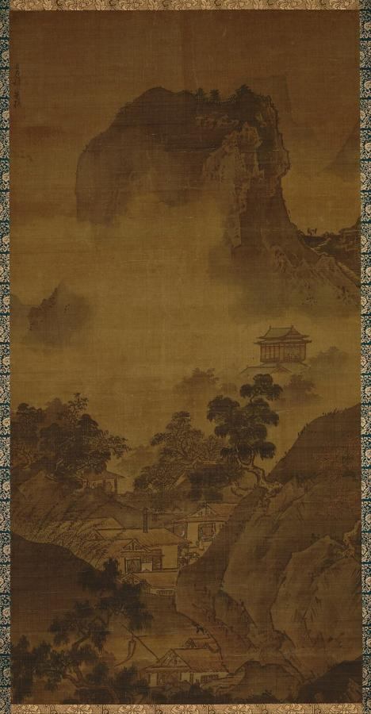
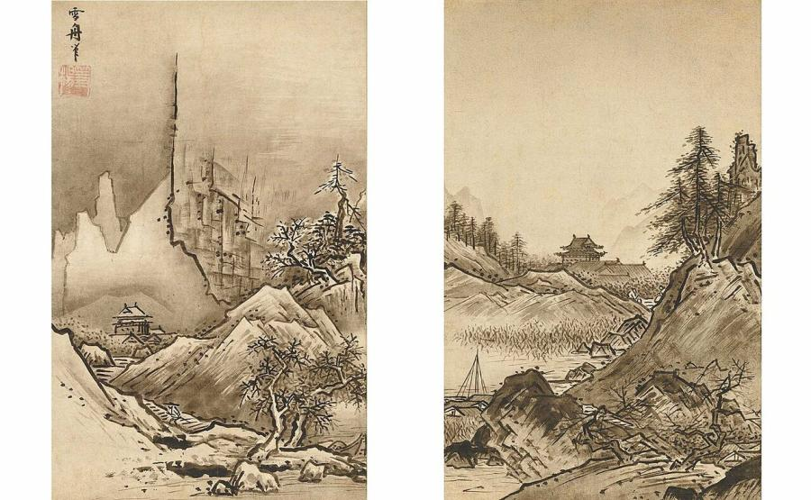
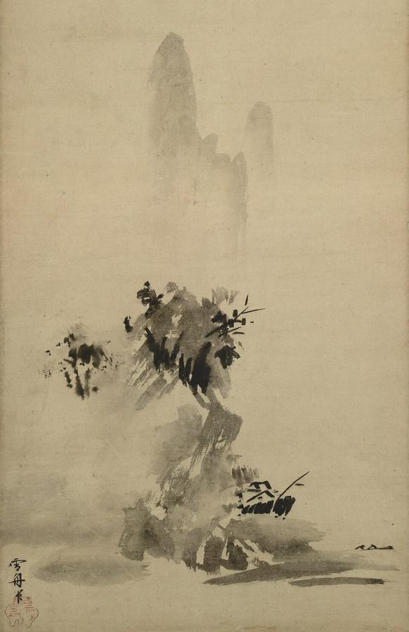
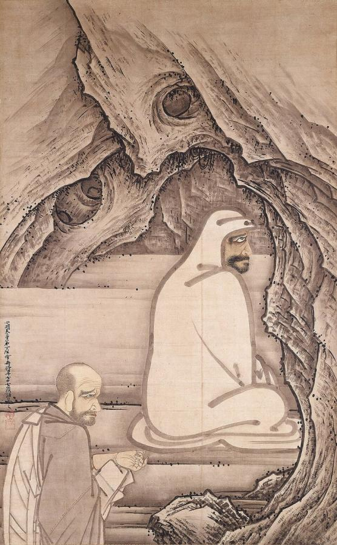
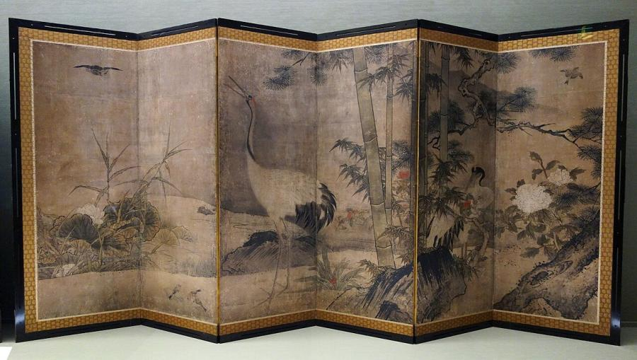
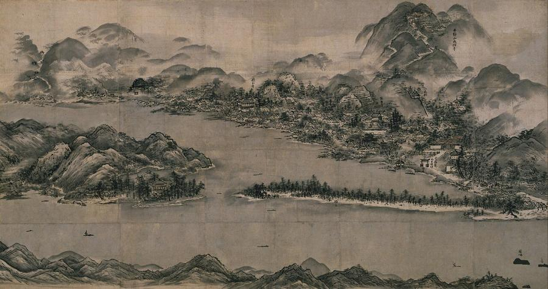

# Sesshū Tōyō (1420–1506)

> The Zen monk-painter who mastered Chinese ink painting and made it Japanese; he is regarded as the greatest master of Japanese ink painting.

## Overview

Sesshū Tōyō was a Zen Buddhist monk whose ink paintings are among the highest achievements of Japanese
art. Trained in the Chinese-inspired ink painting of the Zen monasteries, he travelled to Ming China
and studied its landscapes and painters at first hand. He came home with a bold, confident style of his
own. His strong brush lines, sharp contrasts and daring compositions gave Japanese ink painting a new
energy. Six of his works are designated National Treasures of Japan, more than any other painter.

## Life

Sesshū was born in 1420 in Bitchū Province (in present-day Okayama Prefecture) and entered a Zen
temple as a boy. A famous legend tells that, tied to a pillar as punishment for drawing instead of
studying, he drew a mouse on the floor with his tears so lifelike that it seemed to come alive. As a
young monk he moved to Shōkoku-ji in Kyoto, one of the great Zen monasteries. He studied painting
there with the monk-painter Tenshō Shūbun.

Around the 1460s he took the name Sesshū ("snow boat") and settled in Yamaguchi under the patronage of
the powerful Ōuchi family. In 1467 he joined a trade mission to Ming China. He spent about two years
there. He travelled from the coast to Beijing, saw the landscapes that Chinese painters depicted, and
received an honorary title at the famous Tiantong monastery near Ningbo.

He returned to Japan in 1469, just as the Ōnin War was tearing Kyoto apart. He avoided the capital and
worked in the provinces, mainly in Yamaguchi, where his studio, the Unkoku-an, attracted pupils. He
travelled widely, sketching Japanese landscapes. He is also credited with designing several temple
gardens. He remained active into his eighties and died in 1506.

## Style & Technique

Sesshū worked in *suibokuga*, painting in black ink and water on paper or silk, sometimes with light
washes of colour. His brushwork is strong and angular. He built rocks and mountains from hard,
chiselled contour lines, and his compositions are clear and tightly organised, with a firm sense of
structure that earlier Japanese ink paintings lacked.

He mastered many modes, from detailed Chinese-style landscapes to the loose, splashed *haboku*
("broken ink") style, in which wet washes are dropped onto the paper and shaped with a few quick
strokes. His subjects range from grand imaginary landscapes to Zen figures, birds and flowers, and
real Japanese scenery.

## Legacy

After his death, Sesshū became a legend. Later schools of painting claimed to descend from him: the
Unkoku school that continued his studio, and Hasegawa Tōhaku, who styled himself the fifth-generation
heir of Sesshū. The official Kanō school painters revered his work and copied it as a model. Gardens
attributed to him, such as that of Jōei-ji in Yamaguchi, are still visited today. In 1956 the World
Peace Council named him one of its "great cultural figures", and his image appeared on a Soviet stamp.

## Key Works

<!-- works:start -->

### 1. Landscapes of the Four Seasons – Autumn (attributed) (late 15th century)

*Hanging scroll, ink and light colour · Tokyo National Museum*

One of a set of four tall scrolls showing the seasons in the monumental style of Chinese landscape painting: towering cliffs, a temple half hidden in trees, houses in a misty valley. Works like this show how carefully Sesshū studied the Chinese masters of the Song and Ming dynasties. He did this before and during his journey to China.

Image: [Wikimedia Commons](https://commons.wikimedia.org/wiki/File:Sesshu_Toyo_-_Landscape_of_Four_Seasons-_Fall_-_Google_Art_Project.jpg) · Sesshu Toyo 1420-1506? Details on Google Art Project · Public domain

### 2. Autumn and Winter Landscapes (late 15th century)

*Pair of hanging scrolls, ink on paper, each 46.4 × 29.4 cm · Tokyo National Museum (National Treasure)*

Two small scrolls that are among the most admired works of Japanese ink painting. In *Winter*, a single jagged black line plunges down through the sky beside a cliff. It is not really a mountain edge, and it slices the composition in two with startling abstract force. A lone traveller climbs toward a temple through the snow, suggested only by blank paper.

Image: [Wikimedia Commons](https://commons.wikimedia.org/wiki/File:Autumn_and_Winter_Landscape.jpg) · Sesshū Tōyō · Public domain

### 3. Haboku Landscape (Splashed-Ink Landscape) (1495)

*Hanging scroll, ink on paper, 148.6 × 32.7 cm (whole scroll) · Tokyo National Museum (National Treasure)*

Painted for his disciple Josui Sōen as a certificate of his training, this landscape is made almost entirely of wet, splashed washes of ink. A few quick dark strokes turn the blots into a wine-shop flag, a roof, a boat and two tiny figures. Above it Sesshū wrote a long inscription about his teachers and his trip to China. It is a celebrated example of the spontaneous "broken ink" style.

Image: [Wikimedia Commons](https://commons.wikimedia.org/wiki/File:Sesshu_-_Haboku-Sansui.jpg) · Sesshū Tōyō · Public domain

### 4. Huike Offering His Arm to Bodhidharma (1496)

*Hanging scroll, ink and light colour on paper, 199.9 × 113.6 cm · Sainen-ji, Aichi Prefecture (National Treasure)*

Painted when Sesshū was 76, it shows a Zen legend. The monk Huike, refused as a disciple by Bodhidharma, cuts off his own arm to prove his sincerity. Bodhidharma sits meditating before a cave wall, drawn with a heavy, unbroken outline, unmoved. Huike stands beside him, holding his severed arm. The bold contrast of the simple figure and the swirling rock makes it one of the great images of Zen art.

Image: [Wikimedia Commons](https://commons.wikimedia.org/wiki/File:Bodhidharma.and.Huike-Sesshu.Toyo.jpg) · Sesshū Tōyō · Public domain

### 5. Flowers and Birds of the Four Seasons (attributed) (15th century)

*Folding screens, ink and colour on paper · Tokyo National Museum*

Pines, plum trees, water and birds stretch across large folding screens, moving through the year from spring to winter. Screens like these, painted in Sesshū's manner, helped make bird-and-flower painting a staple of Japanese interior decoration. It prepared the way for the grand screens of the Kanō school.

Image: [Wikimedia Commons](https://commons.wikimedia.org/wiki/File:Flowers_and_Birds_of_the_Four_Seasons,_attributed_to_Sesshu_Toyo_(1420-1506),_Muromachi_period,_15th_century,_color_on_paper,_view_3_-_Tokyo_National_Museum_-_DSC05854.JPG) · Daderot · [CC0](http://creativecommons.org/publicdomain/zero/1.0/deed.en)

### 6. View of Ama-no-Hashidate (c. 1501–1506)

*Hanging scroll, ink and light colour on paper, 89.4 × 169.5 cm · Kyoto National Museum (National Treasure)*

One of Sesshū's last works and one of the earliest large views of a real Japanese place. The famous pine-covered sandbar of Ama-no-Hashidate stretches across the bay, surrounded by temples, shrines and villages, many labelled with their names. Painted in his eighties, it shows him turning from Chinese models to the scenery of his own country.

Image: [Wikimedia Commons](https://commons.wikimedia.org/wiki/File:Sesshu_-_View_of_Ama-no-Hashidate.jpg) · Sesshū Tōyō · Public domain

<!-- works:end -->
## Sources

- [Sesshū Tōyō (Wikipedia)](https://en.wikipedia.org/wiki/Sessh%C5%AB_T%C5%8Dy%C5%8D)
- [Ink wash painting (Wikipedia)](https://en.wikipedia.org/wiki/Ink_wash_painting)
- Yoshiaki Shimizu and Carolyn Wheelwright (eds.), *Japanese Ink Paintings from American Collections: The Muromachi Period* (1976)
