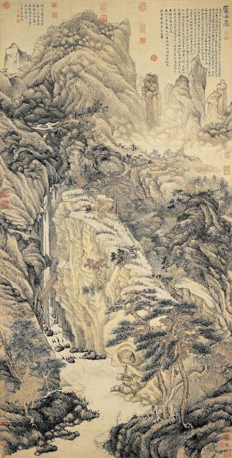
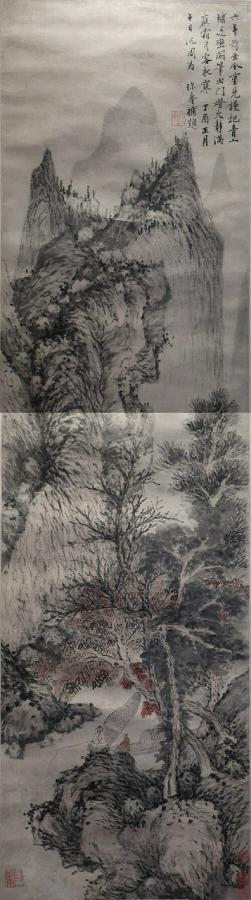
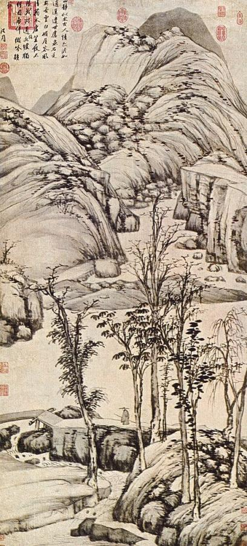
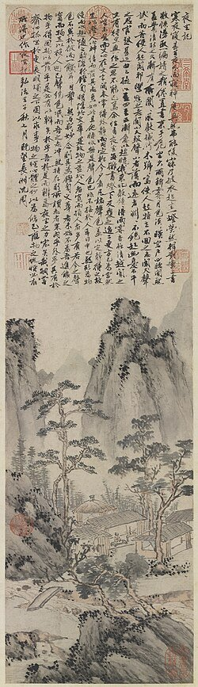
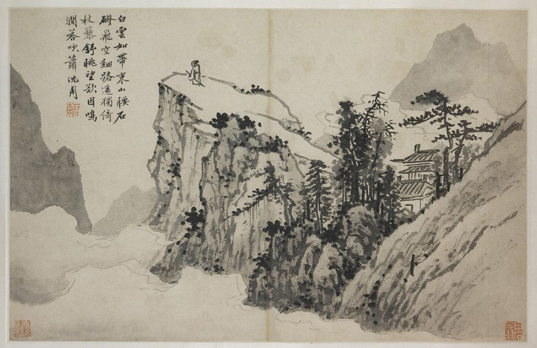
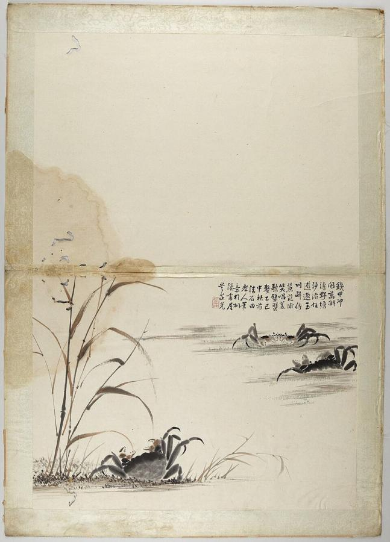

# Shen Zhou (1427–1509)

> The founder of the Wu School in Suzhou, a scholar-painter who turned landscape into a record of friendship, poetry and quiet life.

## Overview

Shen Zhou was the leading figure of Ming-dynasty *literati* painting and the founder of the Wu School,
named after the Suzhou region. He never held office. Instead he spent his long life at his family
estate outside Suzhou, painting, writing poetry, collecting art and entertaining friends. His
landscapes, flowers, animals and figures combine painting with poetry and calligraphy. They revived
the styles of the great Yuan-dynasty masters with a warmth and directness of his own. With his pupil
Wen Zhengming, Tang Yin and Qiu Ying, he is counted among the "Four Masters of the Ming Dynasty".

## Life

Shen Zhou was born in 1427 near Suzhou, in the prosperous Jiangnan region of eastern China, into a
wealthy family of scholars, poets and art collectors. His grandfather and father were painters, and
the family deliberately avoided government service. Shen Zhou was taught by leading local scholars,
including Chen Kuan and Liu Jue. He studied the old masterpieces in his family's collection.

He never sat the civil service examinations that led to an official career. When local officials
recommended him for office, he declined, saying that he needed to care for his widowed mother. She
lived to almost 100. His home became a meeting place for Suzhou's intellectual elite, and many of his
paintings were made as gifts for friends, to mark birthdays, farewells or shared outings.

Shen Zhou was famous for his generosity. According to one story, when forgers sold fake Shen Zhou
paintings, he sometimes signed them to help the poor forgers earn a living. He trained the younger
painter Wen Zhengming, who carried on the Wu School. He died in 1509 at the age of 82.

## Style & Technique

As a literati painter, Shen Zhou valued personal expression over technical display. He painted
mainly in ink on paper, sometimes with light washes of colour. His brushwork was strong, rounded and
deliberate. He studied the four great Yuan masters, Huang Gongwang, Wu Zhen, Ni Zan and Wang Meng. He
painted "in the manner of" each of them, not as copies but as conversations with the past.

His compositions are often simple and solid, with large forms and clear spaces. He was one of the
first Chinese painters to make albums of real local places around Suzhou. He also painted plants,
animals and everyday objects with humour and affection. Almost every painting carries his own poem in
his vigorous calligraphy, so that word and image complete each other.

## Legacy

Shen Zhou's example defined the ideal of the scholar-painter for the rest of the Ming and Qing
dynasties. Through Wen Zhengming and his followers, the Wu School dominated Chinese painting in the
16th century. Later theorists such as Dong Qichang placed Shen Zhou in the "Southern School" of
literati painters, whom they considered superior to professional court artists. His works are prized
in collections across China, Taiwan and the United States, and the National Palace Museum in Taipei
and the Palace Museum in Beijing hold especially important groups of them.

## Key Works

<!-- works:start -->

### 1. Lofty Mount Lu (1467)

*Hanging scroll, ink and light colour on paper, 193.8 × 98.1 cm · National Palace Museum, Taipei*

A towering mountain of stacked peaks, waterfalls and pines, with a tiny scholar standing at its foot. Shen Zhou painted it as a 70th-birthday gift for his teacher Chen Kuan. The mountain's grandeur is a tribute to the old man's character. He had never visited Mount Lu. He painted it in the dense, textured manner of the Yuan master Wang Meng, and it is one of his largest and most ambitious works.

Image: [Wikimedia Commons](https://commons.wikimedia.org/wiki/File:Lofty_Mt.Lu_by_Shen_Zhou.jpg) · Shen Zhou · Public domain

### 2. Boating on an Autumn River (1471)

*Hanging scroll, ink and colour on paper · Honolulu Museum of Art*

A small boat drifts on a quiet river beneath autumn trees and distant hills, composed in a tall, narrow format that leads the eye upward through the landscape. Scenes of boating, visiting friends and retreat were favourite themes of the Suzhou literati, who valued leisure and friendship above official careers.

Image: [Wikimedia Commons](https://commons.wikimedia.org/wiki/File:Boating_on_an_Autumn_River_by_Shen_Zhou,_1471,_Honolulu_Museum_of_Art.jpg) · Shen Zhou · Public domain

### 3. Walking with a Staff (late 15th century)

*Hanging scroll, ink on paper, 159.1 × 72.2 cm · National Palace Museum, Taipei*

A small scholar with a walking stick pauses among tall, slender trees near a stream and a thatched pavilion, beneath towering, rounded mountains. The dry ink and clean contours follow the Yuan painter Ni Zan, whose austere style Shen Zhou admired but found hard to imitate. Here he makes it fuller and bolder. The figure is often read as a self-portrait of the artist.

Image: [Wikimedia Commons](https://commons.wikimedia.org/wiki/File:Shen_Zhou._Walking_with_a_Staff._National_Palace_Museum,_Taipei.jpg) · Shen Zhou · Public domain

### 4. Night Vigil (1492)

*Hanging scroll, ink and light colour on paper, 84.8 × 21.8 cm · National Palace Museum, Taipei*

Shen Zhou sits awake in a small house among mountains late at night. Above the painting he wrote a long essay describing how, in the silence, he listened to the sounds of the night: wind, dogs, a distant drum. The experience cleared his mind. Text and image together make this a rare, intimate record of a Chinese painter's inner life.

Image: [Wikimedia Commons](https://commons.wikimedia.org/wiki/File:%E6%B2%88%E5%91%A8-%E5%A4%9C%E5%9D%90%E5%9C%96.jpg) · Public domain

### 5. Poet on a Mountaintop (c. 1500)

*Album leaf mounted as a handscroll, ink and light colour on paper, 38.7 × 60.3 cm · Nelson-Atkins Museum of Art, Kansas City*

A scholar stands alone on a clifftop, gazing across an empty valley veiled in mist. Shen Zhou's poem in the sky imagines the white clouds like a sash around the mountains. The vast empty space, the simple forms and the fusion of painting, poetry and calligraphy make this small album leaf one of the most loved images in Chinese art.

Image: [Wikimedia Commons](https://commons.wikimedia.org/wiki/File:Poet_on_a_Mountaintop.jpg) · Shen Zhou (沈周, 1427-1509), Ming Dynasty (1368-1644) · Public domain

### 6. Crabs (late 15th century)

*Ink and light colour on paper · Princeton University Art Museum*

Three crabs clamber among reeds at the water's edge, each drawn with a few wet, confident strokes of ink. A short poem in Shen Zhou's hand is written above them. He enjoyed painting everyday subjects such as vegetables, fruit, birds, cats and crabs, which were a favourite autumn delicacy in Suzhou. These quick, humorous sketches show the lively side of an artist better known for grand landscapes.

Image: [Wikimedia Commons](https://commons.wikimedia.org/wiki/File:Shen_Zhou_%E6%B2%88%E5%91%A8_-_Crabs_-_y1942-24_-_Princeton_University_Art_Museum.jpg) · Shen Zhou · Public domain

<!-- works:end -->
## Sources

- [Shen Zhou (Wikipedia)](https://en.wikipedia.org/wiki/Shen_Zhou)
- [Four Masters of the Ming dynasty (Wikipedia)](https://en.wikipedia.org/wiki/Four_Masters_of_the_Ming_dynasty)
- [Wu School (Wikipedia)](https://en.wikipedia.org/wiki/Wu_School)
