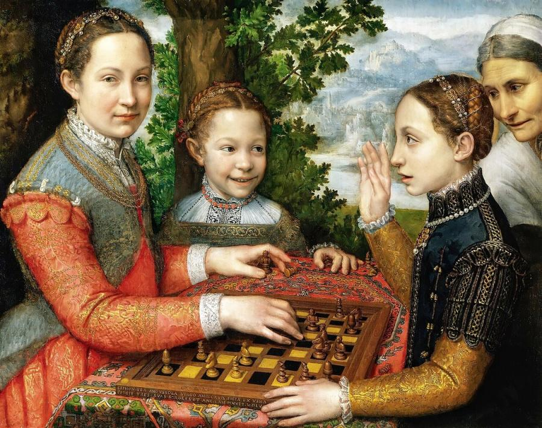
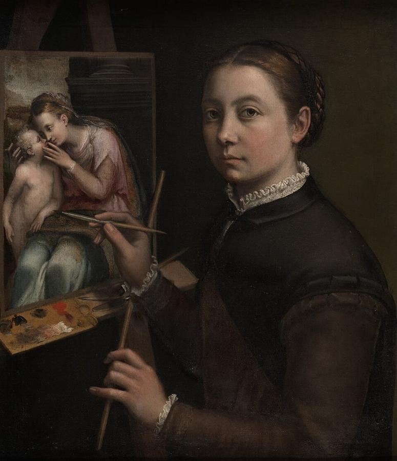
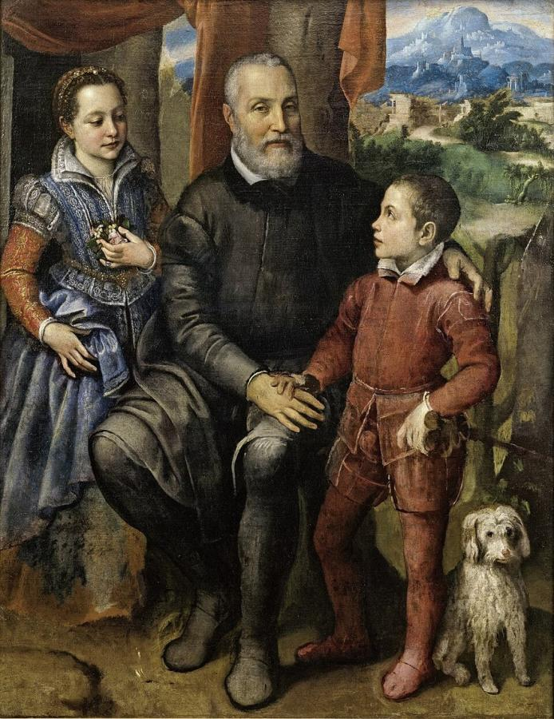
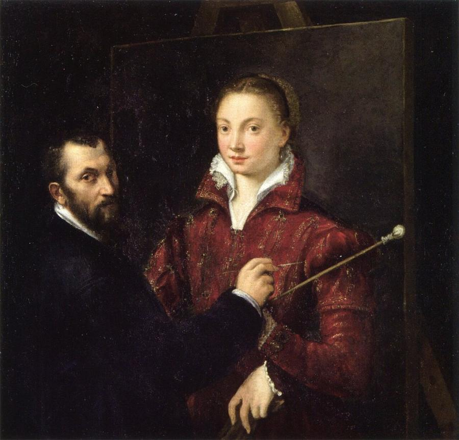
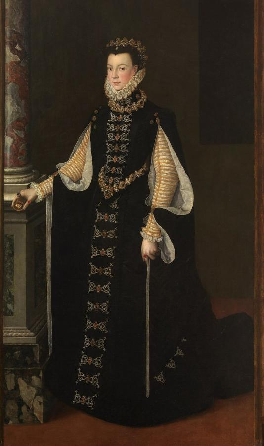
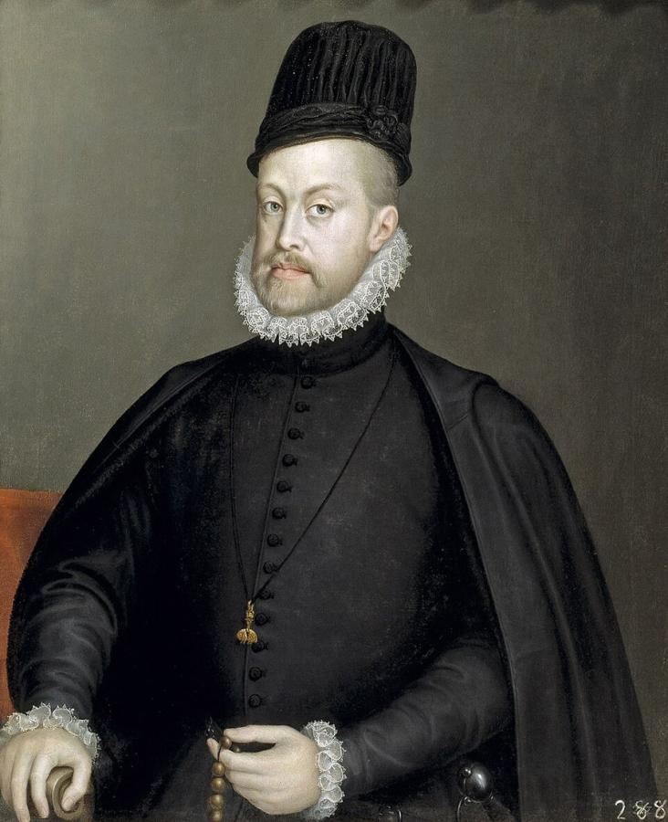

# Sofonisba Anguissola (c. 1532–1625)

> The first Renaissance woman painter to win international fame, and court painter to the King of Spain.

## Overview

Sofonisba Anguissola was one of the first women in Europe to build a career as a professional
painter. Born into a noble family, she could not study anatomy from the nude or take large public
commissions, so she made portraiture her field. She brought to it a new warmth and informality:
sisters playing chess, a laughing child, a father with his children. Michelangelo encouraged her,
Vasari praised her, and she spent 14 years at the Spanish court. Her success opened the way for
later women artists such as Lavinia Fontana and Artemisia Gentileschi.

## Life

Sofonisba was born around 1532 in Cremona, in Lombardy, the eldest of seven children of Amilcare
Anguissola, a minor nobleman. Unusually, her father gave all his daughters a humanist education, and
several of her sisters also became painters. Sofonisba studied with the local painters Bernardino Campi and
Bernardino Gatti.

Amilcare promoted her talent energetically. He sent her drawings to Michelangelo in Rome, who
reportedly challenged her to draw a crying boy rather than a smiling girl. She replied with *Boy
Bitten by a Crayfish*, a drawing that circulated widely. When Vasari visited the family in 1566 he
wrote that her pictures seemed to breathe.

In 1559 she was invited to Madrid to serve Queen Elisabeth of Valois, the teenage wife of Philip II,
as lady-in-waiting and painting teacher. She painted the royal family and court for about 14 years.
The king arranged a dowry and her marriage to a Sicilian nobleman, Fabrizio de Moncada. After his
death she married a Genoese sea captain, Orazio Lomellini, and lived in Genoa and later Palermo. In
1624 the young Anthony van Dyck visited her there. He sketched the nearly blind artist in his
notebook and recorded her advice on painting. She died in Palermo in 1625, in her early nineties.

## Style & Technique

Anguissola's early portraits are lively and intimate. She caught fleeting expressions, glances and
smiles, and showed people interacting rather than posing stiffly. She painted with delicate, precise
brushwork and a soft, even light, and she paid close attention to fabrics and jewellery.

At the Spanish court she adapted to the formal state portrait: full-length figures, sombre costumes
and restrained expressions. Here her individual touch is harder to see. Many of her court works were
later credited to male painters such as Sánchez Coello. Her many self-portraits, from small
miniatures to formal canvases, show her as a musician, a scholar and a working painter.

## Legacy

Anguissola showed that a woman could achieve international fame as a painter. Her success
encouraged families to train their daughters and inspired artists such as Lavinia Fontana. Her
genre-like family scenes may have influenced later painters, and some scholars link *Boy Bitten by a
Crayfish* to Caravaggio's *Boy Bitten by a Lizard*. After centuries of neglect and misattribution,
scholars have restored many works to her name. The Prado's 2019 exhibition with Lavinia Fontana
brought her to a wide new audience.

## Key Works

<!-- works:start -->

### 1. The Chess Game (Portrait of the Artist's Sisters Playing Chess) (1555)

*Oil on canvas, 72 × 97 cm · National Museum, Poznań*

Three of Sofonisba's sisters, Lucia, Minerva and Europa, play chess outdoors while a servant looks on. Lucia glances at us after making a winning move, Minerva raises a hand in protest, and little Europa grins. Chess was a game of intellect, so the painting quietly shows off the family's education, and it brings unusual warmth and spontaneity to a group portrait.

Image: [Wikimedia Commons](https://commons.wikimedia.org/wiki/File:The_Chess_Game_(Sofonisba_Anguissola)_1555_(4096x3236px).jpg) · Sofonisba Anguissola · Public domain

### 2. Self-Portrait at the Easel (c. 1556)

*Oil on canvas, 66 × 57 cm · Łańcut Castle, Poland*

Anguissola paints herself at work on an image of the Virgin and Child, brush in hand, looking straight at the viewer. At a time when women were rarely allowed to train as artists, the self-portrait is a statement of her professional identity. She painted more self-portraits than any other artist between Dürer and Rembrandt.

Image: [Wikimedia Commons](https://commons.wikimedia.org/wiki/File:Sofonisba_Anguissola,_Selvportr%C3%A6t_ved_staffeliet,_1556,_Museum_Castle_in_%C5%81a%C5%84cut.jpg) · Sofonisba Anguissola · Public domain

### 3. Amilcare Anguissola with His Children Minerva and Asdrubale (c. 1557–1558)

*Oil on canvas, 157 × 122 cm · Nivaagaard Collection, Denmark*

The artist's father sits with his only son, Asdrubale, and his daughter Minerva in front of a landscape. The boy clutches a small dog, and the relaxed, affectionate poses were unusual for a formal family portrait. Amilcare had championed his daughters' education and sent Sofonisba's work to Michelangelo.

Image: [Wikimedia Commons](https://commons.wikimedia.org/wiki/File:Sofonisba_Anguissola,_Portr%C3%A6tgruppe_med_kunstnerens_fader_Amilcare_Anguissola_og_hendes_s%C3%B8skende_Minerva_og_Astrubale,_ca._1559,_0001NMK,_Nivaagaards_Malerisamling.jpg) · Sofonisba Anguissola · [CC0](http://creativecommons.org/publicdomain/zero/1.0/deed.en)

### 4. Bernardino Campi Painting Sofonisba Anguissola (c. 1559)

*Oil on canvas, 111 × 110 cm · Pinacoteca Nazionale, Siena*

A double portrait with a twist. Sofonisba shows her teacher Bernardino Campi painting her portrait, but she is the one who painted the whole picture. She made her own likeness larger and brighter than his hand-made version of her. It is a witty meditation on authorship, teaching and who holds the brush.

Image: [Wikimedia Commons](https://commons.wikimedia.org/wiki/File:Self-portrait_with_Bernardino_Campi_by_Sofonisba_Anguissola.jpg) · Possibly Sofonisba Anguissola / Possibly Bernardino Campi · Public domain

### 5. Elisabeth of Valois Holding a Portrait of Philip II (c. 1561–1565)

*Oil on canvas, 206 × 123 cm · Museo del Prado, Madrid*

Anguissola's pupil and friend, the young French-born Queen of Spain, stands in a black gown embroidered with gold, holding a miniature of her husband, Philip II. The costume and jewels are rendered in minute detail, following the formal conventions of the Spanish court. The portrait also carries a personal tenderness born of the two women's years together.

Image: [Wikimedia Commons](https://commons.wikimedia.org/wiki/File:Elizabeth.of.Valois.JPG) · Sofonisba Anguissola · Public domain

### 6. Portrait of Philip II of Spain (1565)

*Oil on canvas, 88 × 72 cm · Museo del Prado, Madrid*

The king, in sober black with the Order of the Golden Fleece, holds a rosary. For centuries this portrait was credited to the court painter Alonso Sánchez Coello. Modern research returned it to Anguissola, one of several of her court works that had lost her name.

Image: [Wikimedia Commons](https://commons.wikimedia.org/wiki/File:Portrait_of_Philip_II_of_Spain_by_Sofonisba_Anguissola_-_002b.jpg) · Sofonisba Anguissola · Public domain

<!-- works:end -->
## Sources

- [Sofonisba Anguissola (Wikipedia)](https://en.wikipedia.org/wiki/Sofonisba_Anguissola)
- Museo del Prado, *A Tale of Two Women Painters: Sofonisba Anguissola and Lavinia Fontana* (exhibition, 2019–2020)
- Giorgio Vasari, *Lives of the Most Excellent Painters, Sculptors, and Architects* (2nd ed., 1568)
