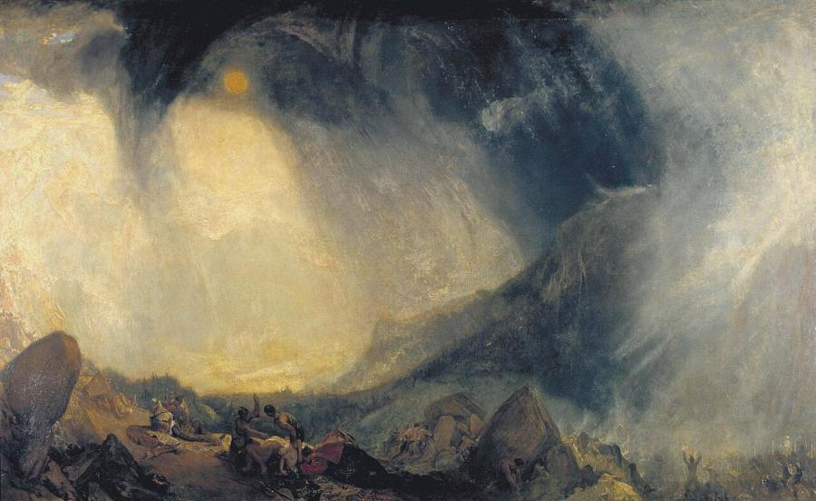
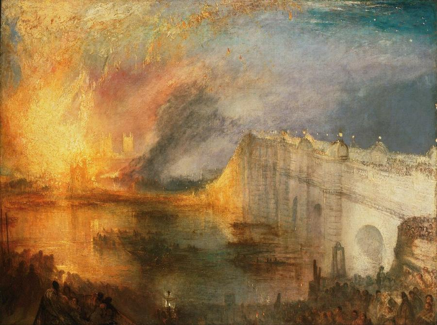
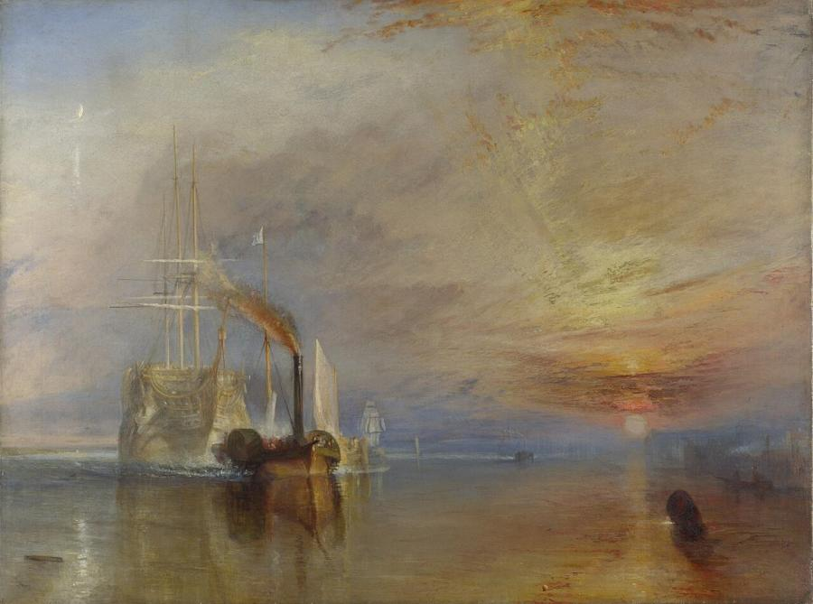
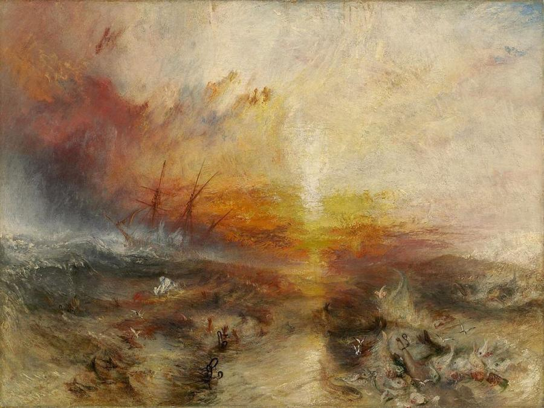
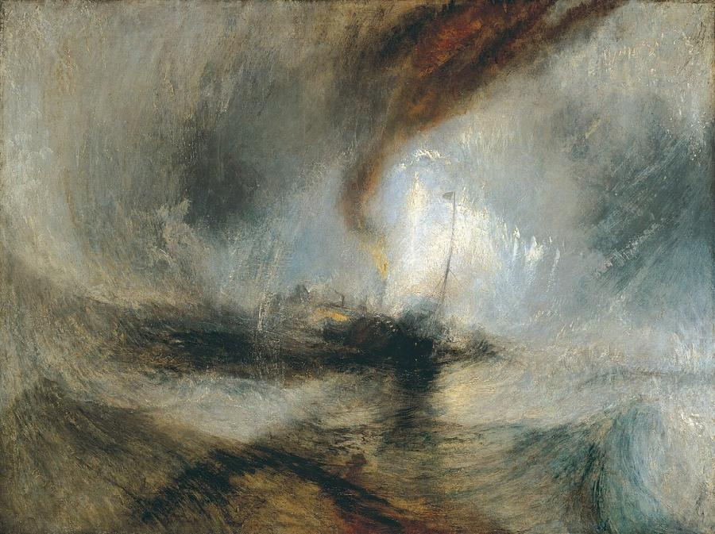
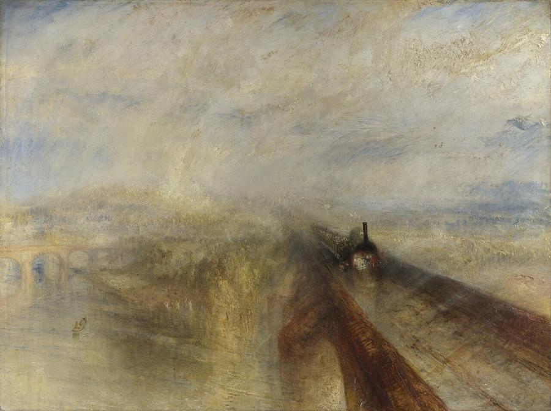

# J. M. W. Turner (1775–1851)

> The "painter of light", whose storms, sunsets and steam turned landscape into swirling visions of colour and atmosphere.

## Overview

Joseph Mallord William Turner was the greatest British landscape painter and one of the boldest
colourists in European art. Beginning as a precise topographical watercolourist, he grew ever more
daring. His late paintings dissolve ships, trains and cities into vortices of light, mist and
weather that baffled critics but look strikingly modern today. He left most of his work to the British
nation, and Britain's leading contemporary art award, the Turner Prize, is named after him.

## Life

Turner was born in Covent Garden, London, in April 1775, the son of a barber and wigmaker. His mother
suffered from mental illness and was committed to an asylum. At 14 he entered the Royal Academy
Schools, and at 15 he exhibited his first watercolour at the Academy. His father proudly displayed
his son's drawings in the barbershop window.

Turner rose fast. He was elected a full Royal Academician in 1802, at just 26, and later became the
Academy's Professor of Perspective. He travelled tirelessly, sketching in Britain, the Alps, France,
Germany and Italy, especially Venice, and filled hundreds of sketchbooks. He was famous for arriving on
"varnishing days" before exhibitions and transforming a barely begun canvas on the gallery wall.

He never married, though he had two daughters with Sarah Danby. In later life he lived secretly in
Chelsea with his companion Sophia Booth, under the name "Mr Booth". The critic John Ruskin
championed him in *Modern Painters* (1843) against those who mocked his late style. He died in Chelsea
on 19 December 1851 and was buried in St Paul's Cathedral.

## Style & Technique

Turner's early work followed the classical landscapes of Claude Lorrain and the Dutch marine painters.
His study of light led him to brighten his palette, and he often worked over white grounds with thin
washes of colour, like a watercolourist working in oil. He scraped, scratched and rubbed his canvases
and applied paint thickly with knives.

By the 1830s he was painting natural forces themselves: storms, blizzards, fire, sunlight, steam.
Composition became a swirling vortex, and solid objects melted into colour. He was fascinated by
the new industrial age and painted steamships and railways alongside Venetian lagoons and Alpine
passes.

## Legacy

Turner left around 300 oil paintings and some 30,000 sketches and watercolours to the nation. The
Turner Bequest is held mainly at Tate Britain, whose Clore Gallery opened in 1987 to display it. Monet
and Pissarro studied his work in London in 1870–1871. His late paintings are often seen as forerunners
of Impressionism and abstract art. The Turner Prize has been awarded annually since 1984, and in 2020
his self-portrait and *The Fighting Temeraire* appeared on the new £20 polymer banknote.

## Key Works

<!-- works:start -->

### 1. Snow Storm: Hannibal and His Army Crossing the Alps (1812)

*Oil on canvas, 146 × 237.5 cm · Tate Britain, London*

A vast black vortex of storm cloud swirls over Hannibal's army, and his troops are almost lost in the chaos below. Turner is said to have based the sky on a thunderstorm he watched over Yorkshire. Painted as Napoleon's armies marched on Russia, it carries a warning about the fate of empires. Its whirling composition anticipates his later work.

Image: [Wikimedia Commons](https://commons.wikimedia.org/wiki/File:Joseph_Mallord_William_Turner_081.jpg) · J. M. W. Turner · Public domain

### 2. The Burning of the Houses of Lords and Commons, 16 October 1834 (1834–1835)

*Oil on canvas, 92 × 123 cm · Philadelphia Museum of Art*

Turner watched the fire that destroyed the old Palace of Westminster from a boat on the Thames, sketching furiously. In this version, flames and smoke pour upward into the night sky and reflect in the river, while crowds watch from Westminster Bridge. Fire and water, light and darkness, became his great subjects.

Image: [Wikimedia Commons](https://commons.wikimedia.org/wiki/File:Joseph_Mallord_William_Turner,_English_-_The_Burning_of_the_Houses_of_Lords_and_Commons,_October_16,_1834_-_Google_Art_Project.jpg) · J. M. W. Turner · Public domain

### 3. The Fighting Temeraire (1839)

*Oil on canvas, 90.7 × 121.6 cm · National Gallery, London*

The *Temeraire*, a veteran warship from the Battle of Trafalgar, is towed up the Thames by a small, smoke-belching steam tug to be broken up for scrap. The pale, ghostly sailing ship glides against a blazing sunset. It is an elegy for the age of sail giving way to steam. Turner called it his "darling" and refused to sell it. In 2005 it was voted Britain's greatest painting, and it appears on the Bank of England's £20 note.

Image: [Wikimedia Commons](https://commons.wikimedia.org/wiki/File:The_Fighting_Temeraire,_JMW_Turner,_National_Gallery.jpg) · J. M. W. Turner · Public domain

### 4. The Slave Ship (Slavers Throwing Overboard the Dead and Dying, Typhoon Coming On) (1840)

*Oil on canvas, 90.8 × 122.6 cm · Museum of Fine Arts, Boston*

A ship sails into a blood-red storm while shackled bodies sink into the churning sea, attacked by fish and gulls. Turner was inspired by the *Zong* massacre of 1781, when enslaved Africans were thrown overboard so the owners could claim insurance. He showed it during the 1840 campaign to end slavery worldwide. John Ruskin owned it and called it the noblest sea Turner ever painted.

Image: [Wikimedia Commons](https://commons.wikimedia.org/wiki/File:Slave-ship.jpg) · J. M. W. Turner · Public domain

### 5. Snow Storm – Steam-Boat off a Harbour's Mouth (1842)

*Oil on canvas, 91.4 × 121.9 cm · Tate Britain, London*

A steamboat is barely visible at the centre of a vortex of snow, spray and smoke. Turner claimed he had himself tied to a ship's mast for four hours during the storm in order to experience it. The story is probably invented, but the painting's dizzying energy seems to make it believable. One critic dismissed it as "soapsuds and whitewash".

Image: [Wikimedia Commons](https://commons.wikimedia.org/wiki/File:Joseph_Mallord_William_Turner_-_Snow_Storm_-_Steam-Boat_off_a_Harbour%27s_Mouth_-_WGA23178.jpg) · J. M. W. Turner · Public domain

### 6. Rain, Steam and Speed – The Great Western Railway (1844)

*Oil on canvas, 91 × 121.8 cm · National Gallery, London*

A steam train charges toward us across Maidenhead Railway Bridge over the Thames, its black funnel emerging from a golden haze of rain and light. A tiny hare races ahead of it on the tracks. It is one of the first great paintings of modern technology, and one of Turner's most daring dissolutions of form into atmosphere.

Image: [Wikimedia Commons](https://commons.wikimedia.org/wiki/File:Turner_-_Rain,_Steam_and_Speed_-_National_Gallery_file.jpg) · J. M. W. Turner · Public domain

<!-- works:end -->
## Sources

- [J. M. W. Turner (Wikipedia)](https://en.wikipedia.org/wiki/J._M._W._Turner)
- [The Fighting Temeraire (Wikipedia)](https://en.wikipedia.org/wiki/The_Fighting_Temeraire)
- [Tate: J. M. W. Turner](https://www.tate.org.uk/art/artists/joseph-mallord-william-turner-558)
