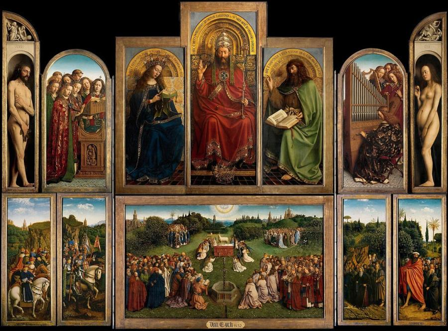
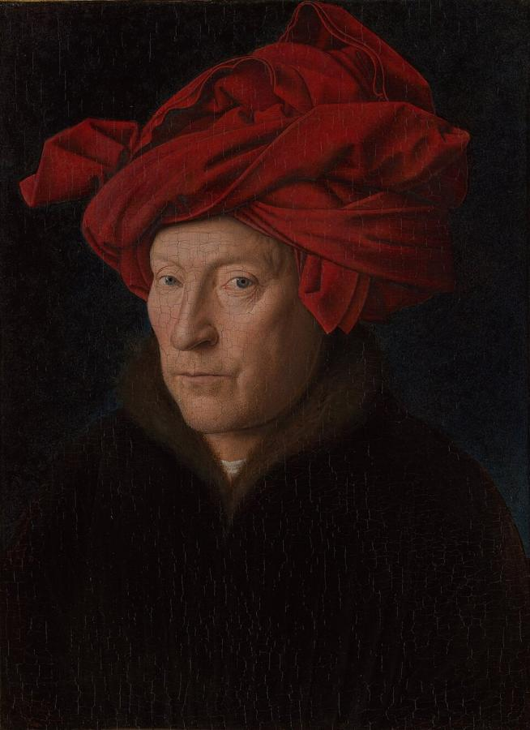
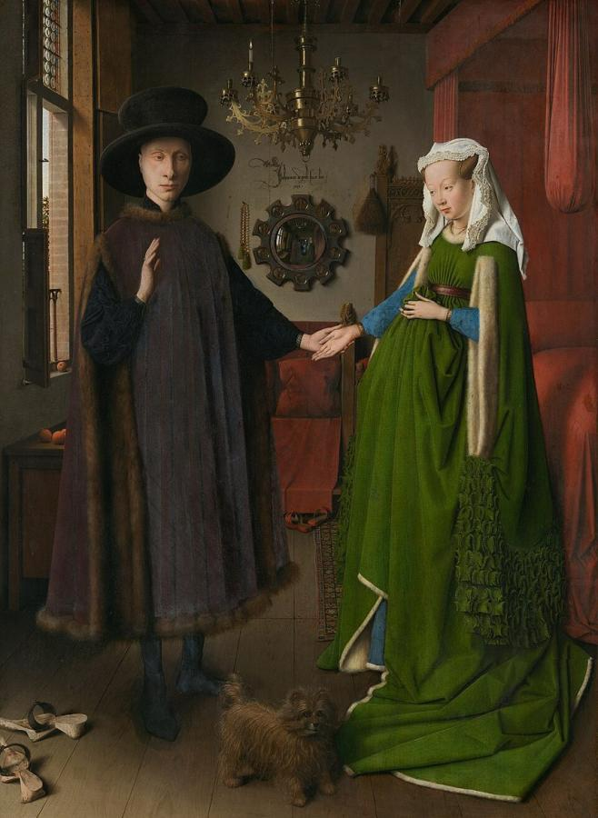
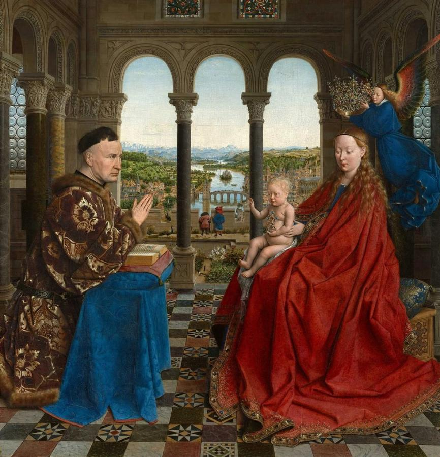
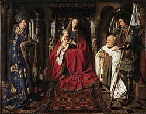
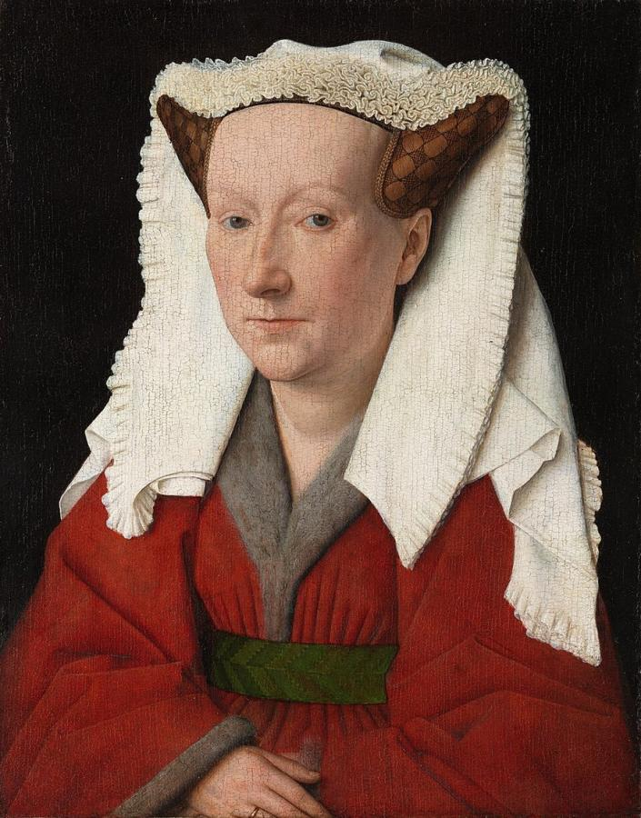

# Jan van Eyck (c. 1390–1441)

> The Flemish master who showed what oil paint could do, painting the visible world with a clarity and detail never seen before.

## Overview

Jan van Eyck was the leading painter of the Burgundian Netherlands and one of the founders of Early
Netherlandish painting. He did not invent oil paint, as later legend claimed. What he did was develop
a way of building up thin, translucent layers of oil colour that let him paint light glinting on
metal, the weave of cloth and the wrinkles of skin with startling realism. His *Ghent Altarpiece* and
*Arnolfini Portrait* are among the most studied paintings in the world.

## Life

Van Eyck was probably born around 1390 in or near Maaseik, in what is now Belgian Limburg. Nothing is
known of his training. He first appears in records around 1422 at The Hague, working for John of
Bavaria, Count of Holland. From 1425 he served Philip the Good, Duke of Burgundy, as court painter
and *valet de chambre*, a trusted household post. The duke paid him a generous salary and sent him on
confidential missions. In 1428–1429 he travelled to Portugal to paint Princess Isabella, whom Philip
later married.

Around 1430 van Eyck settled in Bruges, a wealthy trading city full of Italian bankers and merchants.
He bought a house, married a woman named Margaret, and had children. He completed the *Ghent
Altarpiece*, begun by his brother Hubert, in 1432. The years that followed were his most productive:
portraits of merchants and clergy and devotional pictures for rich patrons. Unusually for the time,
he often signed and dated his work, sometimes adding his punning motto *Als ich can* ("As I can").
He died in Bruges in July 1441.

## Style & Technique

Van Eyck's method built up oil colours in many thin, transparent glazes over a light ground. Light
passes through the layers and bounces back, which gives his colours a jewel-like depth. The slow
drying time of oil let him blend and refine for weeks. He worked at tiny scale with fine brushes, and
he could paint a distant city and the reflection on a single pearl in the same picture.

He did not use the mathematical perspective that Italian artists were developing. Instead he built
space through careful observation of light, and through atmosphere that turns distant hills blue.
His pictures are full of symbols, such as candles, fruit and mirrors, that link everyday objects to
religious meaning. His portraits are plain and closely observed, and look straight at their sitters.

## Legacy

Van Eyck set the course for Netherlandish painting for a century. Rogier van der Weyden, Petrus
Christus and Hans Memling all followed his lead. Italian collectors prized his work, and his
technique helped spread oil painting south of the Alps. Painters such as Antonello da Messina
adopted it. Vasari's claim that van Eyck invented oil painting was wrong, but it shows how
revolutionary his results seemed. The *Ghent Altarpiece* has survived iconoclasm, fire and
Napoleon's looters. It was seized by the Nazis and later recovered from an Austrian salt mine by the
Monuments Men. A restoration begun in 2012 has removed centuries of overpaint. In 2020 it revealed
the Lamb's startlingly human face.

## Key Works

<!-- works:start -->

### 1. The Ghent Altarpiece (Adoration of the Mystic Lamb) (completed 1432)

*Oil on oak panels, 12 panels (open), 350 × 470 cm · St Bavo's Cathedral, Ghent*

A huge folding altarpiece. When open, it shows God enthroned between Mary and John the Baptist, Adam and Eve at the far edges, and below them crowds of saints, prophets and pilgrims streaming across a flowering meadow to worship the Lamb of God. An inscription credits Jan's brother Hubert with beginning it and Jan with finishing it in 1432. It may be the most frequently stolen artwork in history. One panel, the *Just Judges*, taken in 1934, has never been found.

Image: [Wikimedia Commons](https://commons.wikimedia.org/wiki/File:Ghent_Altarpiece_Google_Art_Project.jpg) · Jan van Eyck / Presumably Hubert van Eyck · Public domain

### 2. Portrait of a Man in a Red Turban (1433)

*Oil on oak panel, 26 × 19 cm · National Gallery, London*

A sharply lit face turns out of a black background, framed by a red headdress folded in astonishing detail. The original frame carries van Eyck's motto *Als ich can* ("As I can") and the date 21 October 1433. The steady sideways gaze has led many to believe this is a self-portrait, perhaps painted with the help of a mirror.

Image: [Wikimedia Commons](https://commons.wikimedia.org/wiki/File:Jan_van_Eyck_-_Portrait_of_a_Man_(Self_Portrait%3F)_1433.jpg) · Jan van Eyck · Public domain

### 3. The Arnolfini Portrait (1434)

*Oil on oak panel, 82 × 60 cm · National Gallery, London*

An Italian merchant, probably Giovanni di Nicolao Arnolfini, stands hand in hand with a woman in a green gown in a room in Bruges. On the back wall, a convex mirror reflects the couple from behind along with two more figures in the doorway. Above it, van Eyck signed in elegant script: "Jan van Eyck was here 1434". Every object is painted with microscopic care: the brass chandelier, the oranges on the windowsill, the little dog. The picture has invited endless theories about marriage, memory and symbolism.

Image: [Wikimedia Commons](https://commons.wikimedia.org/wiki/File:The_Arnolfini_portrait_(1434).jpg) · Jan van Eyck · Public domain

### 4. The Madonna of Chancellor Rolin (c. 1435)

*Oil on panel, 66 × 62 cm · Musée du Louvre, Paris*

Nicolas Rolin, the powerful chancellor of Burgundy, kneels in prayer across from the Virgin and Child, as an angel lowers a crown onto Mary's head. Behind them, three arches open onto a river valley painted in miniature: a bridge, a city, boats and tiny people, fading into blue distance. That landscape shows van Eyck's mastery of detail at every scale.

Image: [Wikimedia Commons](https://commons.wikimedia.org/wiki/File:The_Virgin_with_Chancellor_Rolin_by_Jan_van_Eyck_(Louvre).webp) · Jan van Eyck · Public domain

### 5. The Madonna with Canon van der Paele (1434–1436)

*Oil on panel, 122 × 157 cm · Groeningemuseum, Bruges*

The elderly canon Joris van der Paele, spectacles in hand, is presented to the Virgin by St George, while St Donatian stands at the left. Van Eyck painted the old man's wrinkled skin, the shining armour and a richly patterned oriental carpet with such precision that they seem almost real enough to touch. The painting is a showcase of what oil paint could do.

Image: [Wikimedia Commons](https://commons.wikimedia.org/wiki/File:Jan_van_Eyck_069.jpg) · Jan van Eyck · Public domain

### 6. Portrait of Margaret van Eyck (1439)

*Oil on panel, 41 × 34 cm · Groeningemuseum, Bruges*

The artist's wife, then 33, looks directly out at us. This is among the earliest European portraits of an artist's spouse. Its original frame records that "my husband Johannes completed me" on 17 June 1439. The painting is plain and unflattering, but warm: it is a record of a real person rather than an ideal.

Image: [Wikimedia Commons](https://commons.wikimedia.org/wiki/File:Jan_van_Eyck_-_Portrait_of_Margaret_van_Eyck_(1439).jpg) · Jan van Eyck · Public domain

<!-- works:end -->
## Sources

- [Jan van Eyck (Wikipedia)](https://en.wikipedia.org/wiki/Jan_van_Eyck)
- [Ghent Altarpiece (Wikipedia)](https://en.wikipedia.org/wiki/Ghent_Altarpiece)
- [Arnolfini Portrait (Wikipedia)](https://en.wikipedia.org/wiki/Arnolfini_Portrait)
- [National Gallery, London: Jan van Eyck](https://www.nationalgallery.org.uk/artists/jan-van-eyck)
