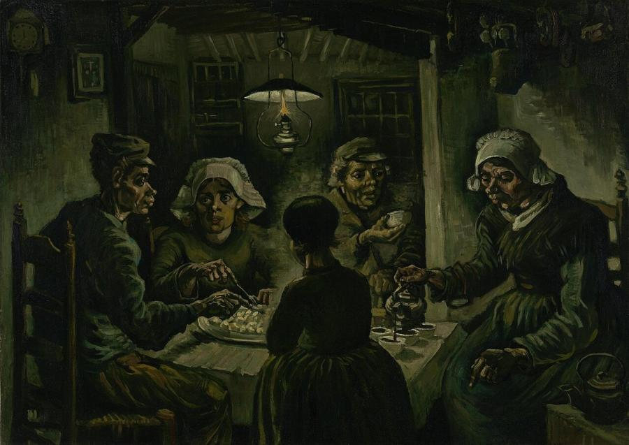
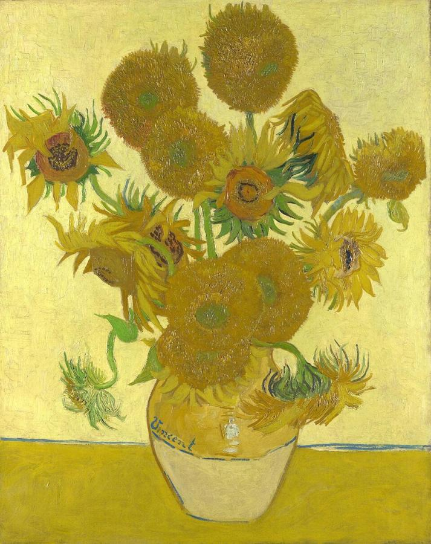
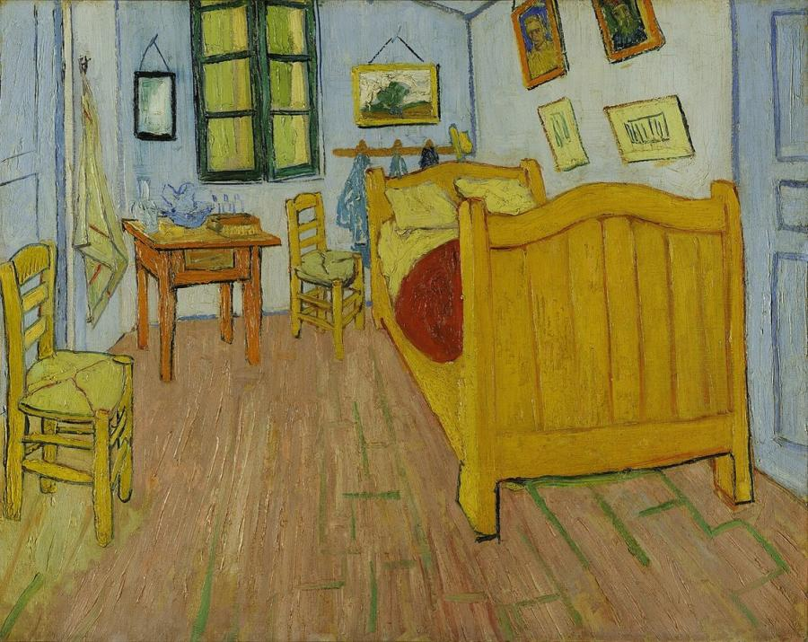
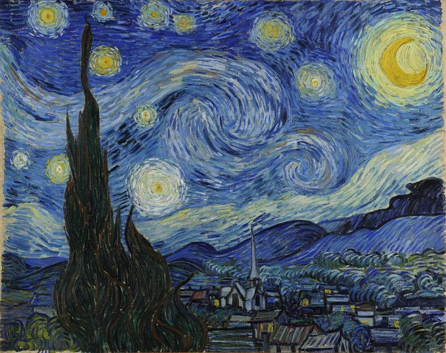
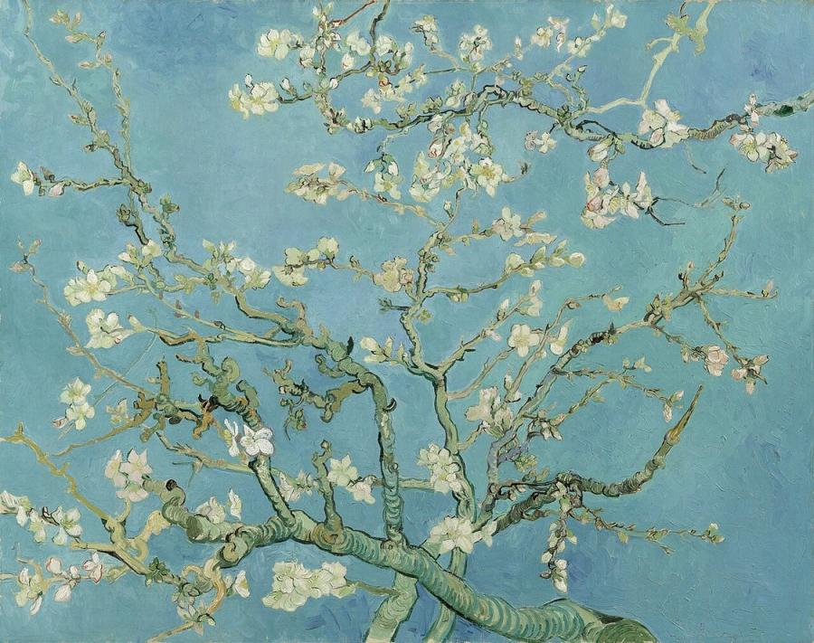
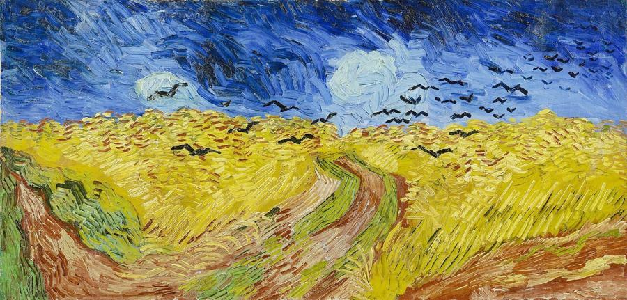

# Vincent van Gogh (1853–1890)

> The Dutch painter whose vivid colour and expressive brushwork, created in a mere decade, made him the most famous artist of modern times.

## Overview

Vincent van Gogh painted for only about ten years, and most of his best-known works come from the last
two. In that time he produced around 2,100 works, including some 860 oil paintings, and he sold almost
nothing. His thick, swirling brushstrokes and intense, non-naturalistic colours turned the lessons of
Impressionism and Japanese prints into a personal language of emotion. His letters, mainly to his
brother Theo, are among the most moving documents of any artist's life. Today his paintings sell for
record prices and draw millions of visitors.

## Life

Van Gogh was born on 30 March 1853 in Zundert, in the southern Netherlands, the son of a Protestant
minister. At 16 he joined the art dealers Goupil & Cie, working in The Hague, London and Paris, but was
dismissed in 1876. He tried teaching and then preaching, living among coal miners in the Borinage in
Belgium. In 1880, at 27, he decided to become an artist. His younger brother Theo, an art dealer, would
support him for the rest of his life.

He taught himself largely through drawing, working in the Netherlands and painting dark peasant scenes
such as *The Potato Eaters* (1885). In 1886 he moved to Paris to live with Theo. There he met Pissarro,
Toulouse-Lautrec, Émile Bernard and Gauguin, and discovered Impressionist colour and Japanese prints.
His palette brightened dramatically.

In February 1888 he moved to Arles in the south of France, dreaming of an artists' colony. Gauguin
joined him in October, but the partnership collapsed in December. After a violent argument Van Gogh cut
off part of his own ear. Repeated mental crises followed, and in May 1889 he voluntarily entered the
asylum at Saint-Rémy-de-Provence, where he painted *The Starry Night*. In May 1890 he moved to
Auvers-sur-Oise near Paris, under the care of Dr Paul Gachet. There he painted at a furious pace, about
one canvas a day. On 27 July 1890 he shot himself in a field, and he died two days later, aged 37.

## Style & Technique

Van Gogh built his paintings from bold, directional brushstrokes of thick paint (*impasto*), which give
his skies, fields and cypresses a sense of movement and energy. He used colour for emotional
expression rather than accuracy. He set complementary colours against each other, such as blue and
orange or red and green, to make them vibrate.

From Japanese prints he took flat areas of colour, strong outlines and unusual viewpoints. He often
painted outdoors, directly from the subject, and wrote detailed explanations of his aims to Theo. Even
in his most intense works, his compositions are carefully planned, and he made many drawings and
repeated versions.

## Legacy

Theo died six months after Vincent. Theo's widow, Johanna van Gogh-Bonger, devoted her life to
promoting Vincent's work and published his letters in 1914. By the early 20th century his influence on
Fauvism and German Expressionism was enormous. His life story, retold in Irving Stone's novel *Lust for
Life* (1934) and its film, created the popular myth of the tortured genius. The Van Gogh Museum in
Amsterdam opened in 1973, and paintings such as *Portrait of Dr Gachet* have set auction records.

## Key Works

<!-- works:start -->

### 1. The Potato Eaters (1885)

*Oil on canvas, 82 × 114 cm · Van Gogh Museum, Amsterdam*

A peasant family in the Dutch village of Nuenen shares a meal of potatoes by the light of an oil lamp. Van Gogh deliberately painted their faces and hands coarse, the colour "of a dusty potato", to show people who had "tilled the earth themselves with these very hands". It was his first ambitious figure painting. It is dark, earthy and deeply sympathetic.

Image: [Wikimedia Commons](https://commons.wikimedia.org/wiki/File:De_aardappeleters_-_s0005V1962_-_Van_Gogh_Museum.jpg) · Vincent van Gogh · Public domain

### 2. Sunflowers (1888)

*Oil on canvas, 92.1 × 73 cm · National Gallery, London*

Fifteen sunflowers, some bright and fresh, some wilting and going to seed, in a yellow vase on a yellow table against a yellow wall. Van Gogh painted it in Arles to decorate the room of his friend Paul Gauguin. He made several versions, and the series became his signature: an exploration of how far one colour could go, and a symbol of gratitude and friendship.

Image: [Wikimedia Commons](https://commons.wikimedia.org/wiki/File:Vincent_Willem_van_Gogh_127.jpg) · Vincent van Gogh · Public domain

### 3. The Bedroom (1888)

*Oil on canvas, 72.4 × 91.3 cm · Van Gogh Museum, Amsterdam*

Van Gogh's own room in the Yellow House in Arles, painted with flat, bright colours and a steeply tilted floor. He wrote that it should express "absolute restfulness" and suggest sleep. The simple furniture and paired objects hint at his hope that Gauguin would come to share his life. He painted three versions.

Image: [Wikimedia Commons](https://commons.wikimedia.org/wiki/File:Vincent_van_Gogh_-_De_slaapkamer_-_Google_Art_Project.jpg) · Public domain

### 4. The Starry Night (1889)

*Oil on canvas, 73.7 × 92.1 cm · Museum of Modern Art, New York*

The view from Van Gogh's window at the asylum in Saint-Rémy, just before sunrise, transformed by memory and imagination. The sky swirls with spiralling wind, eleven blazing stars and a crescent moon, over a quiet village with an invented church spire and a flame-like cypress. He himself was unsure of it, but it has become one of the most recognised paintings in the world.

Image: [Wikimedia Commons](https://commons.wikimedia.org/wiki/File:Van_Gogh_-_Starry_Night_-_Google_Art_Project.jpg) · Vincent van Gogh · Public domain

### 5. Almond Blossom (1890)

*Oil on canvas, 73.3 × 92.4 cm · Van Gogh Museum, Amsterdam*

Branches of white almond blossom against a clear blue sky, a symbol of new life. Van Gogh painted it in February 1890 to celebrate the birth of his nephew, Theo's son, who was named Vincent Willem after him. The bold outlines and flat background owe much to Japanese prints. The baby later helped found the Van Gogh Museum.

Image: [Wikimedia Commons](https://commons.wikimedia.org/wiki/File:Vincent_van_Gogh_-_Almond_blossom_-_Google_Art_Project.jpg) · Vincent van Gogh · Public domain

### 6. Wheatfield with Crows (1890)

*Oil on canvas, 50.5 × 103 cm · Van Gogh Museum, Amsterdam*

A wide field of wheat under a dark, stormy blue sky, with black crows flying low and three paths leading nowhere. Painted at Auvers-sur-Oise in July 1890, weeks before his death, it is often wrongly called his last painting. Van Gogh wrote of such fields as expressing "sadness, extreme loneliness", but also the healthy, strengthening power of the countryside.

Image: [Wikimedia Commons](https://commons.wikimedia.org/wiki/File:Korenveld_met_kraaien_-_s0149V1962_-_Van_Gogh_Museum.jpg) · Vincent van Gogh · Public domain

<!-- works:end -->
## Sources

- [Vincent van Gogh (Wikipedia)](https://en.wikipedia.org/wiki/Vincent_van_Gogh)
- [Van Gogh Museum](https://www.vangoghmuseum.nl/en)
- [Vincent van Gogh: The Letters](https://www.vangoghletters.org/)
