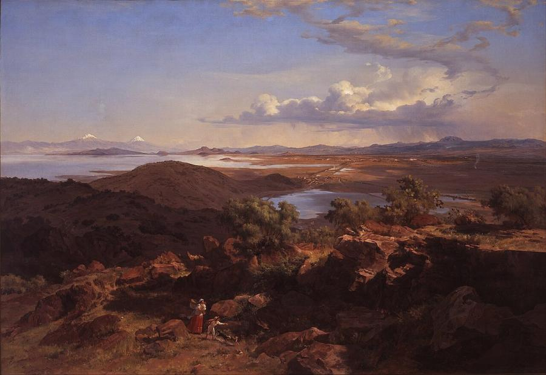
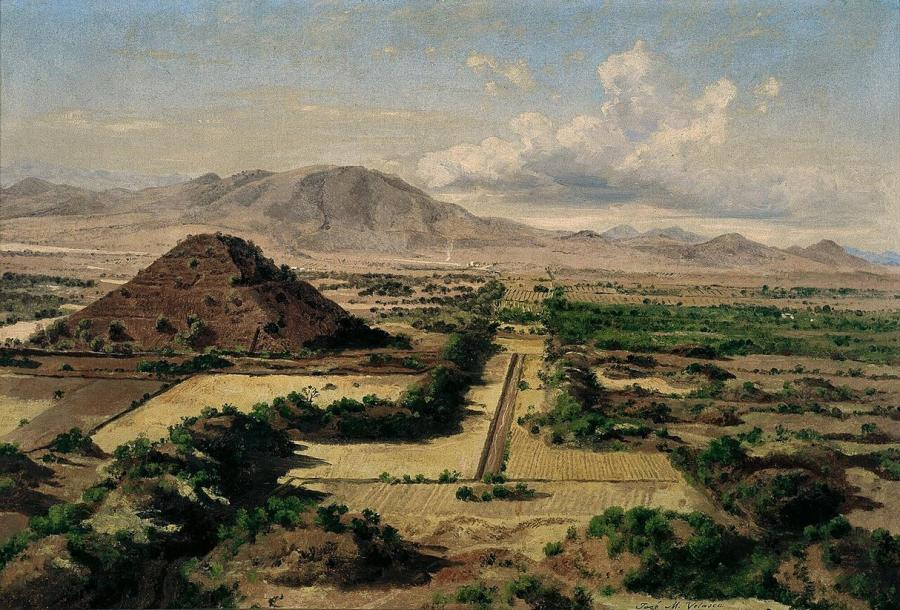
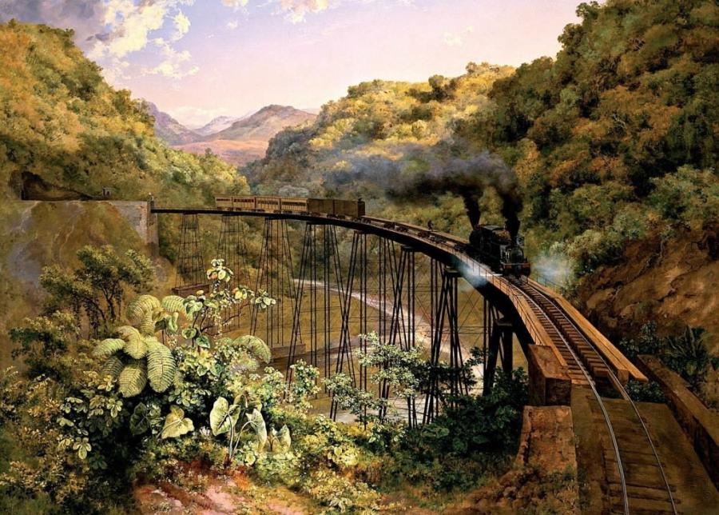
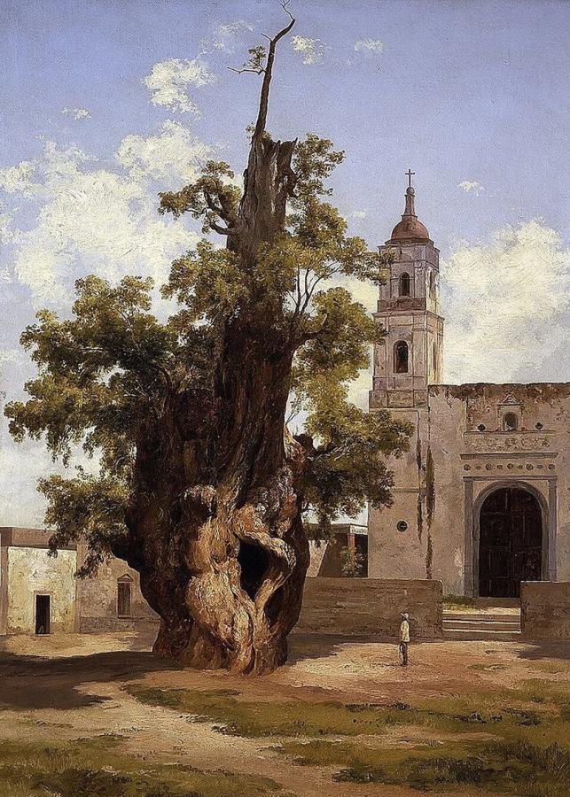
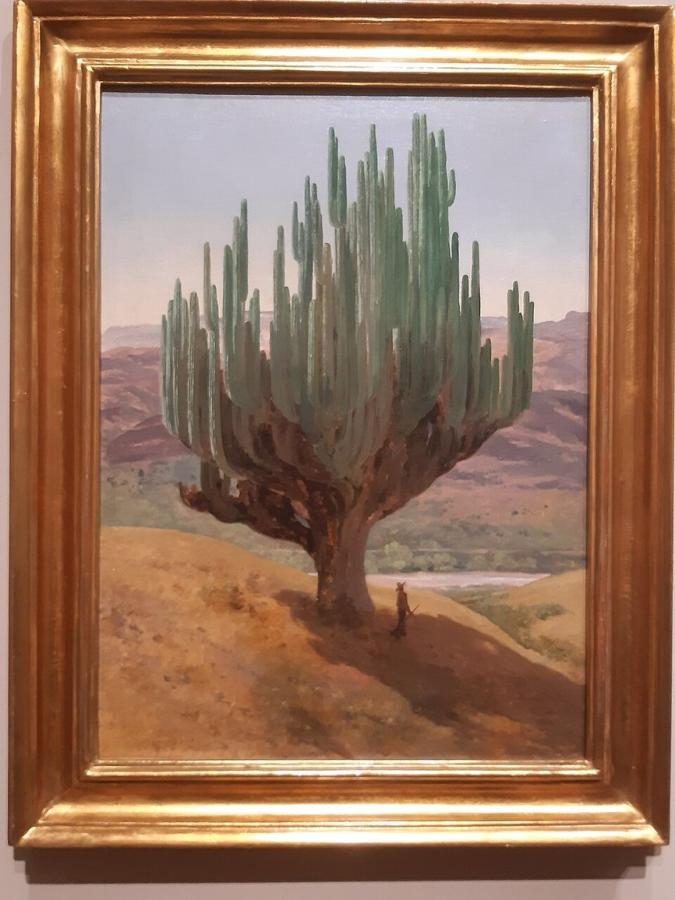
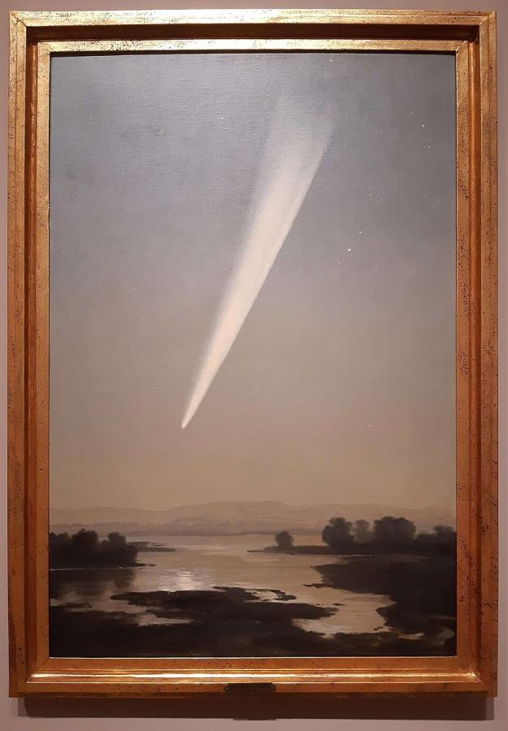

# José María Velasco (1840–1912)

> Mexico's great landscape painter, who captured the Valley of Mexico with the eye of both an artist and a scientist.

## Overview

José María Velasco is the most important Mexican painter of the 19th century. He is best known for his
panoramic views of the Valley of Mexico. In these he recorded the plants, rocks, lakes, volcanoes and
light of central Mexico with extraordinary precision, while giving them a sense of grandeur and
national pride. Velasco was also a trained naturalist who illustrated scientific publications on
botany, zoology and geology. His landscapes gave Mexico a visual identity after independence and
influenced later painters, including the muralist Diego Rivera.

## Life

Velasco was born on 6 July 1840 in Temascalcingo, in the State of Mexico. His family moved to Mexico
City in 1849. In 1858 he entered the Academy of San Carlos, where he studied landscape with the Italian
painter Eugenio Landesio, who taught his students to observe nature closely and to paint outdoors. He
also studied botany, zoology, anatomy, physics and mathematics, interests that ran through his whole
career.

He won his first prizes in the 1860s and succeeded Landesio as professor of landscape painting at the
Academy in 1877. Among his students was the young Diego Rivera. He worked as a scientific illustrator
for the National Museum and on expeditions, and he painted archaeological sites such as Teotihuacan.

Velasco represented Mexico at international exhibitions, including the Paris Universal Exposition of
1889, where he won a medal, and the 1893 Chicago World's Columbian Exposition. One of his views of the
Valley of Mexico was given to Pope Leo XIII and is now in the Vatican Museums. He died in Mexico City on 26 August 1912, during the early years of the Mexican
Revolution.

## Style & Technique

Velasco combined academic precision with scientific observation. He studied the geology of rocks,
the structure of plants and the effects of atmosphere and distance, and he worked from outdoor
sketches and studies to create large studio compositions. His panoramas often place a detailed
foreground of cacti, rocks and scrub against an immense, luminous distance of plain, lake and
volcano.

His palette is clear and bright, capturing the sharp light of the Mexican high plateau. He included
signs of the modern world, such as railways, bridges and haciendas, alongside nature and ancient ruins,
and he presented them in a calm, balanced harmony.

## Legacy

Velasco created the classic image of the Mexican landscape. His views of the Valley of Mexico are
national icons, reproduced in schoolbooks and on stamps, and they record a landscape of lakes and
open plains that has since been swallowed by Mexico City. Diego Rivera acknowledged him as a master. The
Museo José María Velasco in Toluca opened in 1992, and in 2025 the National Gallery in London held
*José María Velasco: A View of Mexico*, his first exhibition in the United Kingdom.

## Key Works

<!-- works:start -->

### 1. The Valley of Mexico from the Santa Isabel Mountain Range (1875)

*Oil on canvas · Museo Nacional de Arte (MUNAL), Mexico City*

Velasco's most celebrated subject. From a hillside of scrub and cactus, the vast basin of the Valley of Mexico stretches out under an immense sky, with Lake Texcoco, the distant city and the snowy volcanoes on the horizon. Every plant and rock in the foreground is botanically and geologically accurate, yet the panorama feels epic. It became an image of the Mexican nation itself.

Image: [Wikimedia Commons](https://commons.wikimedia.org/wiki/File:Jos%C3%A9_Mar%C3%ADa_Velasco_-_The_Valley_of_Mexico_from_the_Santa_Isabel_Mountain_Range_-_Google_Art_Project.jpg) · José María Velasco (1840 - 1912) – painter (Mexican) Born in State of Mexico. Details on Google Art Project · Public domain

### 2. The Pyramid of the Sun at Teotihuacan (1878)

*Oil on canvas · Museo Nacional de Arte (MUNAL), Mexico City*

The great pre-Hispanic pyramid of Teotihuacan, then still overgrown and only partly excavated, rises above the plain under a luminous sky. Velasco took part in scientific and archaeological expeditions, and paintings like this linked Mexico's ancient past to its modern national identity.

Image: [Wikimedia Commons](https://commons.wikimedia.org/wiki/File:La_Pir%C3%A1mide_del_Sol_en_Teotihuac%C3%A1n_-_1878_-_Jos%C3%A9_Mar%C3%ADa_Velasco_-_MUNAL.jpg) · José María Velasco Gómez Obregón · Public domain

### 3. The Curved Bridge over the Metlac Ravine (1881)

*Oil on canvas · Museo Nacional de Arte (MUNAL), Mexico City*

A steam train crosses a spectacular curved railway bridge over a deep tropical ravine on the line between Mexico City and Veracruz. The painting celebrates modern engineering within an overwhelming natural landscape. It is Velasco's answer to Turner's *Rain, Steam and Speed*, and a record of Mexico's rapid modernisation under Porfirio Díaz.

Image: [Wikimedia Commons](https://commons.wikimedia.org/wiki/File:El_puente_curvo_de_la_barranca_de_Metlac_-_1881_-_Jos%C3%A9_Mar%C3%ADa_Velasco_G%C3%B3mez_Obreg%C3%B3n.jpg) · José María Velasco Gómez y Obregón · Public domain

### 4. The Ahuehuete of the Noche Triste (1885)

*Oil on canvas · Mexico City*

A portrait of a famous ancient cypress tree in Mexico City. By tradition, the Spanish conquistador Hernán Cortés wept beneath it after his defeat by the Aztecs on the *Noche Triste* ("Sad Night") of 1520. Velasco treats the gnarled tree as a living monument to Mexican history.

Image: [Wikimedia Commons](https://commons.wikimedia.org/wiki/File:Ahuehuete-noche-triste.jpg) · Painting by mexican painter José María Velasco. · Public domain

### 5. Cardón Cactus, State of Oaxaca (1887)

*Oil on canvas · Museo Nacional de Arte (MUNAL), Mexico City*

A giant columnar cactus towers over a dry, rocky landscape in southern Mexico, painted with the precision of a botanical illustration. Velasco trained in botany and zoology, and here he makes a native plant into the heroic protagonist of the picture, a symbol of Mexican nature.

Image: [Wikimedia Commons](https://commons.wikimedia.org/wiki/File:Cardon_cactus_by_Velasco_1887.jpg) · Chiswick Chap · [CC BY-SA 4.0](https://creativecommons.org/licenses/by-sa/4.0)

### 6. The Great Comet of 1882 (1910)

*Oil on canvas · Museo Nacional de Arte (MUNAL), Mexico City*

A brilliant comet streaks across the pre-dawn sky above the dark Valley of Mexico. In 1910, the year Halley's Comet returned, Velasco painted this memory of the spectacular Great Comet he had seen in 1882. The painting reflects his lifelong interest in science and the night sky.

Image: [Wikimedia Commons](https://commons.wikimedia.org/wiki/File:The_Great_Comet_of_1882_by_Velasco_1910.jpg) · Chiswick Chap · [CC BY-SA 4.0](https://creativecommons.org/licenses/by-sa/4.0)

<!-- works:end -->
## Sources

- [José María Velasco Gómez (Wikipedia)](https://en.wikipedia.org/wiki/Jos%C3%A9_Mar%C3%ADa_Velasco_G%C3%B3mez)
- [Academy of San Carlos (Wikipedia)](https://en.wikipedia.org/wiki/Academy_of_San_Carlos)
- Fausto Ramírez and Elena Altamirano Piolle, *National Homage: José María Velasco, 1840–1912* (MUNAL, 1993)
